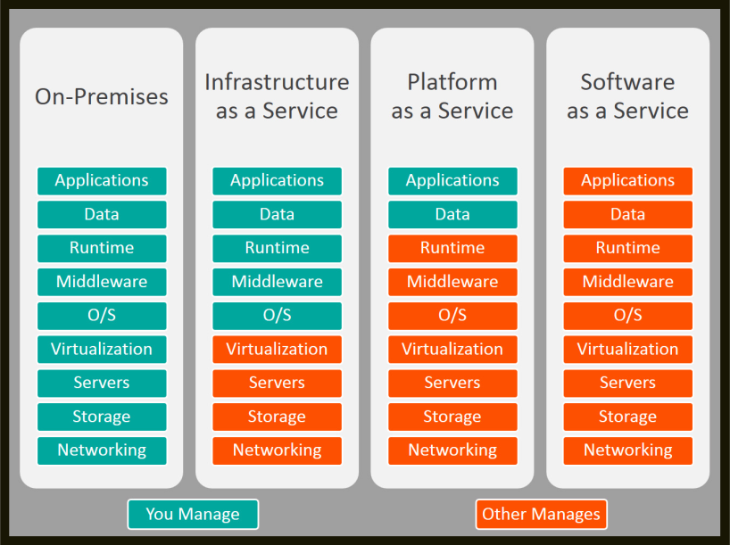
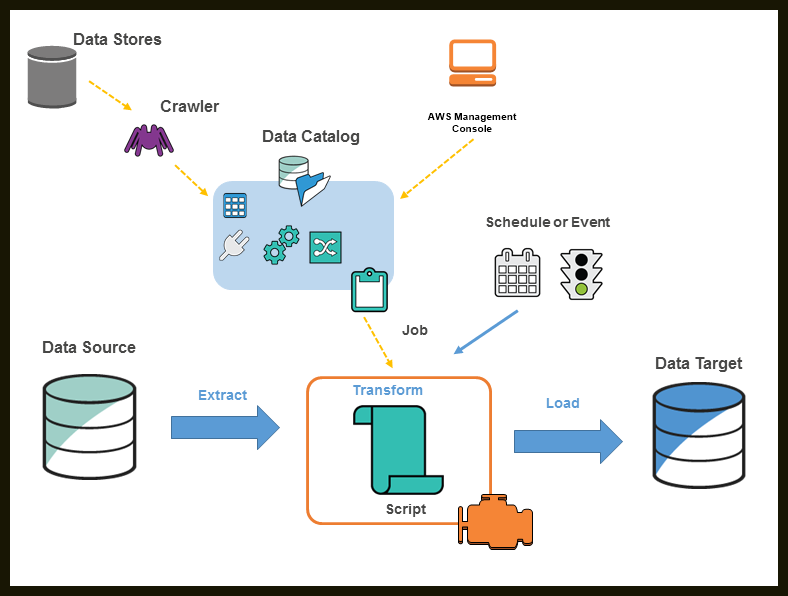

# AWS

## **Cloud computing**

It is defined as services accessed through the internet that are provided by someone else.
!!! Example
    Google Drive is a perfect example. Users store files on it and access them via the internet, but the service and infrastructure are managed by Google.

> --- **Why Cloud?**

Traditional IT Challenges: Before cloud, companies had to establish their own data centers. This required renting buildings, buying servers and networking equipment, and hiring 24/7 manpower.

The Cost/Risk Problem: If a company took on a 6-month project, they would spend a massive amount on infrastructure that would become useless once the contract ended.

The Cloud Solution: Cloud providers have already established data centers. Users simply purchase what they need and pay only for what they use. Services can be deleted once they are no longer needed, significantly reducing costs.

> --- **Types of Cloud**

There are three primary deployment models:

- Public Cloud: Accessible to everyone through the internet.
- Private Cloud: Accessible only within a specific organization. It is generally more secure than the public cloud.
- Hybrid Cloud: A combination of both public and private clouds.

There are three types of services on cloud:

Software as a Service (SaaS):
    The provider maintains everything (front end, back end, infrastructure).
    The user simply uses the service and pays for it.
    Eg: Gmail, Dropbox.
    Cost: This is the most costly model because the provider handles all management.

Platform as a Service (PaaS):
    The user provides their own code.
    The cloud provider provides the platform to execute it, including the runtime, operating system, and hosting infrastructure.

Infrastructure as a Service (IaaS):
   The user manages the code and the platform but asks the cloud provider for the underlying infrastructure.
   This includes servers, storage, networking, and virtualization.
   The user manages more components here than in the other two models.

## **S3**

AWS S3 stands for Simple Storage Service. 

It is considered one of the most critical topics for an AWS Data Engineer and is widely used by organizations due to its popularity and ease of use.

S3 solves the major organizational challenge of storing huge amounts of data generated daily by providing a solution that is highly scalable, secure, and supports encryption.

> --- **Overcoming Traditional Storage Limitations**

Physical Storage (Hard Disks): In traditional setups, storing large amounts of data required purchasing physical hard disks, which was costly. Additionally, data retrieval was slow because it required physical access to the system where the disk was plugged in.

General Cloud Storage (e.g., Google Drive): While cloud storage like Google Drive offers fast internet-based retrieval, it often uses fixed tiers (e.g., having to pay for 100GB even if you only need 20GB).

The S3 Advantage: AWS S3 allows you to store any amount of data and follow a pay-as-you-go model. If you store 20GB, you only pay for 20GB; if you scale to 40GB, you pay only for that amount, solving the "typical IT" problem of over-provisioning.

> --- **Key Features of Amazon S3**

Scalability: Users can store an unlimited amount of data without restrictions.

Availability: It is designed for 99.99% availability. AWS achieves this by replicating data across multiple data centers; if one hardware failure occurs, the data remains accessible from another center.

Data Protection: S3 provides features for data encryption and high security to protect stored information.

Versioning: This feature allows users to keep a backup of previous versions of a file even after it has been modified.

Object Lock: This prevents a specific file or "object" from being modified or deleted, which is vital for data integrity.

Multipart Upload: For huge datasets, S3 allows you to break the data into parts, upload them individually, and then combine them in the cloud.

> --- **Primary Use Cases**

Data Backup and Archiving: Organizations use S3 to back up multiple databases. It offers multiple tier operations, allowing users to pay lower rates for data they do not intend to access frequently.

Application Data Storage: It is used for storing application logs and data from IoT services, where massive amounts of log files are generated.

Disaster Recovery: Because data is replicated across multiple centers, S3 ensures data remains secure and recoverable even in the event of a disaster.

> --- **Key Terminology**

Bucket: This is a container for your data. 

Object: In AWS S3, all files and folders are referred to as "objects".

Global Service: S3 is a global service, meaning you can upload a file and access it from anywhere in the world.

> --- **Creating an S3 Bucket**
   
Region Selection: While S3 is global, you must select a specific AWS Region for low latency and faster performance. Selecting a region near you ensures faster operations.

Naming Convention: Every bucket name must be globally unique.

Public Access Settings: By default, "Block all public access" is enabled to ensure security.

Default Encryption: S3 provides server-side encryption by default.

> --- **Bucket Versioning**

Definition: Versioning acts as a backup or a copy of your files, similar to how GitHub functions.

Functionality: If you modify and re-upload a file with the same name, S3 will keep the previous version instead of replacing it. 

Usage: It must be manually enabled in the bucket properties. This allows users to retrieve older versions of a file if needed.

> --- **Data Access Scenarios**

Organizations typically deal with two main data scenarios that determine which storage class to use:

Frequently Accessed Data: Data used regularly for analysis and development.

Infrequently Accessed Data: Typically backup data stored for disaster recovery and not accessed on a frequent basis.

> --- **Frequent Access Storage Classes**

These classes are designed for data that needs to be retrieved quickly and often.

- S3 Standard: 
    Used for general-purpose storage of frequently accessed data.
    Offers low latency (retrieval in milliseconds).
    Data is replicated across more than three Availability Zones (AZs), ensuring high availability and durability (99.9%).
    This is the most costly general option due to its performance and high availability.
- S3 Express One Zone:
   Used for frequently accessed data where cost is a higher priority than redundancy.
   Unlike S3 Standard, data is stored in only one Availability Zone, making it less expensive.

> --- **Infrequent Access (IA) Storage Classes**

These are intended for data that is not accessed often but must be available immediately when needed.

- S3 Standard-IA: 
    Designed for infrequent access.
    Still provides millisecond latency for retrievals.
    Data is replicated across more than three Availability Zones.
- S3 One Zone-IA:
    Similar to Standard-IA but stores data in only one Availability Zone.
    It is cheaper than S3 Standard-IA.

> --- **S3 Glacier (Archival Storage)**

Glacier is the preferred choice for long-term backups and archiving where immediate access is not always required.

S3 Glacier Instant Retrieval: Offers low latency similar to Standard classes but requires a minimum storage duration of 90 days.

S3 Glacier Flexible Retrieval: Highly durable but retrieval can take minutes or hours; it is cheaper than Instant Retrieval.

S3 Glacier Deep Archive: The lowest-cost storage option. Retrieval is slow and may take several hours.

> --- **S3 Intelligent-Tiering**

This class automates cost savings for data with unknown or changing access patterns.

How it works: AWS automatically moves your data between tiers (Standard, Infrequent Access, and Glacier) based on how often it is accessed.

Automation: If data isn't accessed for 60-90 days, it moves to IA; if not accessed for years, it moves to Glacier.

Cost: Because AWS provides active monitoring and automation, there is a monitoring charge, which can make it more expensive than 

S3 Standard if the automation benefits aren't fully utilized.

When choosing a class, consider the following trade-offs:

- Cost: S3 Standard is the most expensive, followed by IA, with Glacier being the cheapest.
- Latency: Standard and IA offer millisecond retrieval, while some Glacier tiers take minutes or hours.
- Redundancy: "One Zone" options are cheaper but offer less protection against data center failures compared to multi-AZ options.

> --- **Why select a region for a global service?**

To ensure low latency and faster performance by storing data in a data center closer to the user.

Total Storage Limit: You can store an unlimited amount of data in S3.

Individual File Size Limit: The maximum size for a single file is 5 TB. If you have more than 5 TB of data, it must be divided into multiple files.

Bucket Limits: By default, you can create up to 100 buckets per AWS account, though this limit can be extended by raising a ticket with AWS.

## **IAM**

AWS IAM stands for Identity and Access Management. It is the primary service used to manage access to AWS resources and services.

Role Responsibilities: In a professional environment, an AWS account is typically maintained by DevOps engineers. When a new user (such as a data analyst or engineer) joins an organization, they must request specific access for the services they need to use, such as Tableau, Databricks, S3, or EC2.

Best Practice (Least Privilege): A critical practice in IAM is providing only the minimum access required for a user to perform their job. Providing full access is risky; for example, an unauthorized or accidental deletion of a database could compromise the entire organization.

> --- **The Four Pillars of IAM**

1.  Users: Individuals who join an organization and need to authenticate into the AWS account. DevOps engineers create these users and provide them with login credentials.

2.  Policies: Documents that define specific permissions. If a user only needs to read data from S3, a specific S3 read access policy is attached to them.

3.  Groups: Collections of users who share similar roles (e.g., Developers, QA, or Data Engineers). Instead of assigning policies to 500 individual users, policies are attached to a Group, and users are added to that group to automatically inherit those permissions.

4.  Roles: These are used when services need to communicate with other services. For example, if an S3 bucket needs to trigger or access a Lambda function, an IAM Role is utilized.

> --- **Importance of IAM Roles**
   
What is an IAM Role? An IAM Role is a critical topic for data engineering that allows multiple services within an AWS account to communicate with each other.

Primary Use Case: Unlike IAM Users (which represent people), Roles are generally used when you have two or more services that need to interact. For example, if Amazon S3 needs to communicate with an EC2 instance, an IAM Role must be created and assigned to allow that interaction.

> --- **IAM Roles in Data Pipelines**

Roles are essential when building complex data pipelines where multiple services are linked together.

- Example Pipeline Scenario:

    Source: Data is stored in Amazon S3.
    
    Processing: AWS Glue is used to copy this data.
    
    Destination: The data is moved into an RDS database instance.
    
    Trigger: A Lambda function is used to trigger the AWS Glue activity.

The Role's Function: In this scenario, S3 must communicate with Glue, and Glue must communicate with Lambda. An IAM Role is required to grant these services the necessary permissions to "talk" to one another and perform their tasks.

## **Lambda**

Serverless Computation Engine: AWS Lambda is a service that allows you to run code without provisioning or managing servers.

Core Philosophy: Users should only focus on their code while AWS handles all the underlying infrastructure, including maintenance and auto-scaling.

Triggers: Lambda is highly versatile and can be triggered by over 200 different AWS services.

> --- **AWS Lambda vs. Amazon EC2**

Infrastructure Management: With EC2, you must manually create instances (Windows or Linux), select RAM, CPU cores, and manage auto-scaling. With Lambda, you don't worry about any of these server details.

- Pricing Model: 
    
    EC2: You pay for the entire time the instance is running, even if it is idle.
    
    Lambda (Pay-as-you-go): You are only charged for the exact duration your code executes. For example, if your code runs for only 2 minutes, you only pay for those 2 minutes, even if the function exists in your account all day.

> --- **Key Use Cases**

Lambda is used for various tasks in professional environments:

Cost Optimization: You can write code to monitor all running AWS services and send notifications if services are running but not being used, helping to avoid unnecessary costs.

Data Pipeline Monitoring: It can monitor ETL activities (like those in AWS Glue) or data pipelines. If a pipeline fails or is running inefficiently, Lambda can trigger an event or notification to alert the relevant person.

Service Triggering: Lambda is often used to start other services. For example, it can be programmed to trigger an AWS Glue job.

- File Processing and Transfers: 
  
    A common example is an image-resizing website. When a user uploads a photo to an S3 bucket, it triggers a Lambda function.

    The function resizes the image and stores the new version in a separate S3 bucket to be displayed on the website.

> --- **Summary of Benefits**

No Server Management: No need to patch or maintain OS.

Automatic Scaling: Scales automatically based on the number of incoming requests.

Cost Efficiency: Significant savings due to the pay-per-execution model.

Performance Optimization: Helps in optimizing the overall performance of cloud services through automated monitoring and alerts.

> --- **Creating a Lambda Function**

To begin, navigate to the AWS console and search for Lambda. From the dashboard, select "Create function". There are three primary options for creation:

Author from scratch: Used if you want to write your own custom code.

Use a blueprint: Provides pre-written code for common tasks, such as retrieving an object from Amazon S3.

Container image: Used if you have a pre-existing container image to deploy.

> --- **Monitoring via CloudWatch**

Every time a Lambda function executes, it generates logs.

Monitor Tab: Users can navigate to the "Monitor" tab within the Lambda console to access CloudWatch logs.

Log Details: These logs provide a detailed record of when the function started, what it printed, any errors that occurred, and the final response.

## **EC2**

Definition:   AWS EC2 (Elastic Compute Cloud)  provides secure,  resizable computation capacity  in the cloud.
  
Data Engineering Context:  Data engineers often deal with  large amounts of data  that require significant processing power. EC2 is vital because it allows engineers to  scale computation capacity up or down  based on the size of the dataset.

Overcoming Hardware Limits: In traditional setups, users are limited by the  RAM and CPU  of their physical laptops (e.g., 8GB RAM). Upgrading physical hardware is  costly  and inefficient for temporary projects; EC2 solves this by allowing users to select high-power specs (like 4 CPUs and 8GB RAM) only when needed.

> --- **EC2 Instance Families and Categories**

Instance types are divided into categories based on their performance characteristics:

General Purpose:   
    Provides a   balance   of compute, memory, and networking resources.
    Use Case:   Ideal for applications like   web servers  .
    Naming Example:   The   T family   (e.g., T2) is a general-purpose category. In "T2 micro,"   T   is the family,   2   is the version, and   micro   is the size.

Compute Optimized:   
    Designed for tasks requiring high processing power.
    Use Case:   Common in   machine learning   applications.
    Category:   Identified by the   C family  .

Memory Optimized:   
    Built to process   large datasets   directly in the memory.
    Use Case:   Frequently used in   Big Data systems  .

Storage Optimized:
    Focused on workloads that require   high sequential read and write   operations.
    Category:   Includes families like   I3   and   D2  .

HPC Optimized (High Performance Computing):   
    An advanced version of compute-optimized instances.
    Use Case:   Used for   deep learning   and applications requiring extreme optimization.

## **Glue**

AWS Glue is a cloud-optimized, serverless ETL (Extract, Transform, Load) service. 

ETL Explained: It extracts data from various sources (like SQL Server, Postgre SQL, or CSV files), cleans or aggregates the data, and loads it into a destination so data scientists or analysts can perform reporting and predictions.

Serverless Nature: The primary advantage is that users do not need to maintain any servers or infrastructure. AWS handles all auto-scaling and management, allowing engineers to focus solely on their data pipelines and business needs.

> --- **Key Advantages and Benefits **

Schema Inference: AWS Glue can automatically detect the schema of your data.

Auto-generated ETL Scripts: The service can automatically generate scripts for your workflows, reducing the need to write them manually.

Cost-Effective: Because it is serverless, you only pay for the resources you use during execution.

Low Hassle: It connects easily with multiple AWS services, including Amazon S3, RDS, and Redshift.

> --- **Key Terminology**

Data Store: The source where your raw data resides (e.g., Amazon S3).

Crawler: A program that connects to a data store, scans the data to detect its schema, and extracts metadata.

Data Catalog: A central repository that stores all metadata information, including table and job definitions.

Classifier: A component that helps the crawler detect specific data formats, such as CSV or JSON.

Job: The business logic or ETL script that performs the actual data transformation.

Trigger: A mechanism used to start ETL jobs, either manually or on a schedule.

> --- **AWS Glue Architecture & Workflow**

1.Scanning:A Crawler goes to the Data Store (S3) to scan the raw CSV data.

2.Cataloging: The crawler detects the metadata (e.g., Column names like ID, Name, Salary) and stores these definitions in the Data Catalog.

3.Transformation: An ETL Job is created. Here, a script is written (or auto-generated) to perform transformations, such as selecting only 20 relevant columns out of an original 50.

4.Loading: The job processes the data and dumps the final, cleaned result into the destination (e.g., a final table or another S3 bucket in JSON format).

> --- **Best Practices and Pricing**

Pricing: AWS charges for the crawler, data catalog requests, and the execution of ETL jobs.

Cost Management: A critical recommendation for students is to terminate or shut down crawlers and jobs immediately after practicing to avoid unnecessary or high charges.

> --- **AWS Crawler**

It is a component of AWS Glue designed to automatically discover data sources and extract metadata information.

Primary Function: It scans data sources (such as Amazon S3), identifies the data format, detects the schema (column names and data types), and stores this information in the AWS Glue Data Catalog.

Handling Diverse Data: A single crawler can scan an entire S3 bucket containing multiple files with different schemas (e.g., employee, department, and worker files) and create corresponding metadata for each.

> --- **Key Advantages**

Automatic Schema Detection: It automatically identifies whether a column is a string, integer, or other data type and creates a table for it in the catalog.

Schema Evolution: If a new column is added to a data source after the initial scan, re-running the crawler will automatically detect the change and update the schema, ensuring that data pipelines do not break.

Efficiency: It eliminates the need to manually define tables and schemas for large or changing datasets.

## **Athena**

AWS Athena is a serverless, interactive query service offered by Amazon Web Services (AWS) that allows users to analyze data in Amazon Simple Storage Service (S3) using standard SQL. Athena is designed to provide fast querying capabilities without the need for infrastructure setup and management. 

> --- **Key features**

- Serverless: There is no infrastructure to manage, and you don't need to start or stop services. You simply write queries and get results.
- Pay-per-query: With Athena, you pay only for the queries you run. You are charged based on the amount of data scanned during the query execution, not for the storage of the data.
- SQL-compatible: Athena uses a version of Presto, a distributed SQL query engine, with added support for AWS's data catalog and other AWS-specific optimizations. As a result, those familiar with SQL can easily use Athena to analyze their datasets.
- Integrated with AWS Glue: AWS Glue is a managed extract, transform, load (ETL) and data catalog service. Athena integrates with the AWS Glue Data Catalog, allowing you to create a centralized metadata repository across various services, crawl data sources to discover schemas, and populate your catalog with new and modified table and partition definitions.
- Performance: Athena is optimized for fast performance with Amazon S3. It can handle large datasets and uses a distributed query system to parallelize queries, speeding up execution.
- JDBC/ODBC Support: Athena provides a JDBC and an ODBC driver, allowing you to integrate with various business intelligence (BI) tools and other applications.
- Schema-on-Read: Unlike traditional databases where you have to define a schema when writing data, Athena uses a schema-on-read approach. This means you define the schema when you are ready to query the data. This approach offers more flexibility, especially for use cases like data lakes.
- Supports a variety of data formats: Athena can query data in various formats, including CSV, JSON, Parquet, ORC, Avro, and more.

> --- **Choice between Athena vs Spark**

Using Athena or Spark depends on the specific requirements and constraints of your project. Each tool has its own advantages and trade-offs. 

- No Infrastructure Management: Athena is serverless, meaning there's no need to set up, manage, or scale any infrastructure. You don't have to worry about cluster provisioning, configuration, or tuning. With Spark, you often use a managed cluster service like Amazon EMR or manage your own clusters, which can introduce overhead in terms of setup, management, and cost.
- Cost Model: With Athena, you pay per query based on the amount of data scanned. For ad-hoc querying or sporadic use, this can be more cost-effective than maintaining a Spark cluster that might sit idle at times.
- Simplicity: For users who just want to run SQL queries on their data without dealing with the complexities of distributed data processing, Athena offers a simpler interface. There's no need to write Spark code or understand the Spark API.
- Integration with AWS Services: Athena is tightly integrated with other AWS services like AWS Glue (for data cataloging) and QuickSight (for visualization). If you are heavily invested in the AWS ecosystem, using Athena might offer smoother integration and management.
- Performance: For certain query types and data sizes, Athena might offer faster results, especially if the data is stored in columnar formats like Parquet or ORC which Athena can optimize for.
- Concurrent Queries: With Athena, you can run multiple queries concurrently without worrying about resource contention, as each query's resources are managed by the service.
- Advanced Data Processing: Spark offers a wide range of libraries and APIs for batch processing, stream processing, machine learning, and graph processing. If your use case goes beyond SQL querying, Spark provides more flexibility.
- Cost for Large Scale or Continuous Processing: If you're running continuous large-scale data processing jobs, maintaining a dedicated Spark cluster might be more cost-effective than per-query costs with Athena, especially if you optimize your Spark jobs well.
- Customizability and Control: Spark allows you to customize its behavior, optimize performance, and integrate with a broader ecosystem of tools and libraries.
- Data Transformation: While Athena is designed primarily for querying, Spark excels at complex data transformation and ETL tasks.

> --- **Pricing Model**

Athena follows a per-query billing structure.

Data Scanned: You are charged based on the number of bytes scanned by each query.

Billing Specifics: Charges are rounded to the nearest megabyte, with a minimum charge per query. For example, scanning 12 MB may be billed at a 10 MB rate, while scanning 18 MB might be billed at a 20 MB rate.

## **Kinesis**

Amazon Kinesis is an AWS service used to collect and process large amounts of streaming data in real-time. 

It is the go-to solution in the AWS ecosystem whenever a requirement involves handling real-time data processing.

> --- **Three Types of AWS Kinesis Services**

Kinesis Data Stream:
    Primary use case is to collect and process data in true real-time.

Kinesis Firehose:
    Used for near real-time data processing.
    It is considered "near real-time" because it typically includes a 60-second or 1-minute buffer before processing.
    A key feature is its ability to store data directly into various destinations like Amazon S3 or Amazon Redshift.

Kinesis Analytics:
    Used specifically for data analytics.
    It allows users to run queries and perform analytics directly on top of the real-time data as it arrives.

## **SNS**

Amazon Simple Notification Service (Amazon SNS) is a fully managed messaging service provided by AWS. It is designed for distributing notifications to a wide range of recipients. With SNS, you can send messages to individual recipients or to large numbers of recipients.

> --- **Key Features**

- Pub/Sub Messaging: SNS follows the publish/subscribe (pub/sub) messaging paradigm, allowing users to create "topics" and then have subscribers that receive messages or notifications on those topics.

- Multiple Protocols: SNS supports multiple protocols, meaning you can deliver messages to:
   HTTP/HTTPS endpoints
   Email/Email-JSON
   Short Message Service (SMS)
   Application (for sending messages to other AWS services or to applications)
   AWS Lambda
   Simple Queue Service (SQS)
   Application Endpoints (for mobile devices)
- Flexibility: You can send a message to an SNS topic, and then that single message can be delivered to many recipients across various supported protocols.
- Durability: SNS messages are stored redundantly across multiple servers and data centers, providing high availability and durability.
- Content Filtering: With SNS, you can filter the messages delivered to each subscription, ensuring subscribers only receive the messages of interest to them.
- Access Control: Integration with AWS Identity and Access Management (IAM) allows granular access control to the SNS topics. You can specify who can publish or subscribe to a topic.
- Large Message Size: For messages that exceed the normal size limit (256 KB), SNS can store the large message in an Amazon S3 bucket and send a pointer to the message in the notification.
- Monitoring: Integrated with Amazon CloudWatch, allowing users to monitor metrics related to the SNS service.
- Encryption: Supports encryption in transit (using HTTPS endpoints) and at rest (using AWS Key Management Service).
- Cost: Users pay for what they use. This includes the number of requests, number of messages delivered, and data transfer. 

> --- **Why Use SNS?**

Critical Pipeline Monitoring: In professional environments, production data pipelines are critical. If a pipeline fails, it can result in a huge cost for the business.

Quick Action: SNS allows engineers to monitor these pipelines and receive instant notifications (via Email, SMS, etc.) so they can respond and resolve failures quickly.

> --- **The Publisher-Subscriber Model**

SNS operates on a "Pub/Sub" architecture, which involves three main components:

Publisher: The entity that triggers the notification (e.g., an S3 bucket where a file is uploaded).

Topic: A central "hub" or communication channel. The publisher sends a message to the SNS Topic.

Subscriber: The entity that receives the message from the topic. This could be a support team or another application.

Note: Only those who have explicitly subscribed to a topic will receive notifications from it.

## **AWS SQS**

Amazon Simple Queue Service (Amazon SQS) is a fully managed message queuing service that enables the decoupling of microservices, distributed systems, and serverless applications. It is designed to send, store, and receive messages between software components at any volume, without losing messages or requiring other services to be available.

> --- **Key Features**

- Fully Managed: No need to manage and operate message-oriented middleware systems or any other infrastructure.
- Durability: SQS stores messages redundantly across multiple servers and data centers to ensure that a message is delivered at least once.
- Two Queue Types:
	Standard Queue: Offers maximum throughput, best-effort ordering, and at-least-once delivery.
	FIFO (First-In-First-Out) Queue: Ensures messages are processed only once, in the exact order they are sent.
- Message Attributes: Messages can contain metadata (as key-value pairs) so that the receiver can handle the message appropriately.
- Long Polling: Reduces unnecessary network traffic with empty responses by waiting until a message is available in the queue before sending a response.
- Batch Operations: Supports sending, receiving, or deleting messages in batches, helping to improve the efficiency of both your producer and consumer applications.
- Dead Letter Queues: If a message cannot be processed successfully, it's moved to a dead letter queue. This is useful for debugging and ensuring that problematic messages don't get stuck and aren't retried indefinitely.
- Visibility Timeout: After a message is retrieved by a consumer, it remains hidden from other consumers for a specified period. If the message isn't processed within that time, it becomes visible again.
- Message Lifecycle: You can set a retention period for messages, up to a maximum of 14 days.
- Integration with other AWS Services: SQS can be integrated with services like AWS Lambda, Amazon S3, and Amazon Redshift, among others.
- Scalability: SQS can handle high volumes of messages without any throughput limitations.
- Server-Side Encryption (SSE): Uses AWS Key Management Service (AWS KMS) to encrypt SQS messages.

> --- **AWS SQS and Kafka are same?**

Amazon SQS and Apache Kafka address different messaging patterns and use cases, so it's not accurate to say SQS is a direct replacement for Kafka in AWS. However, they do overlap in some functionalities.

- Messaging Patterns

	SQS: Primarily a message queue service designed for decoupling point-to-point communication between producers and consumers.
	
    Kafka: A distributed streaming platform that can handle high-velocity data streams and allows for publish-subscribe and record storage.

- Throughput
	
    SQS: Suitable for a wide range of workloads, including those that require high throughput.
	
    Kafka: Built for extremely high throughput and low latency, making it suitable for real-time analytics and monitoring.

- Consumers
	
    SQS: Each message is processed by a single consumer.
	
    Kafka: Multiple consumers can read the same message from a topic without affecting other consumers.

- Retention
	
    SQS: Messages can be retained for a limited period (up to 14 days).
	
    Kafka: Messages can be retained indefinitely or for a configured duration.

- Ordering
	
    SQS: Standard queues offer at-most-once delivery and best-effort ordering. FIFO queues offer exactly-once processing and guaranteed ordering.
	
    Kafka: Provides strict ordering within a partition of a topic.

- Scalability
	
    SQS: Managed by AWS and scales automatically.
	
    Kafka: Requires manual cluster scaling and configuration.

- Ecosystem
	
    SQS: Integrated tightly within the AWS ecosystem.
	
    Kafka: Has a vast ecosystem with Kafka Streams, Kafka Connect, and more. It's more than just a messaging system; it's a whole streaming platform.

If you're looking for a managed Kafka-like service in AWS, consider Amazon Managed Streaming for Apache Kafka (Amazon MSK). It's a fully managed service that makes it easy to build and run applications that use Apache Kafka to process streaming data. With Amazon MSK, you get the combined capabilities and benefits of Apache Kafka along with the scalability and reliability of AWS.

