## **Challenges in a Normal Data Platform**

>--- **Too Many Tools and Integration Issues**

Organizations often use a multitude of separate tools for different tasks, such as data warehousing, ETL (Extract, Transform, Load), running Spark jobs, saving data to data lakes, orchestration, AI/ML solutions, and BI (Business Intelligence) reporting.

Each of these tools needs to integrate properly with one another to function effectively. For instance, if a BI dashboard doesn't integrate with a data warehousing solution, proper results cannot be obtained.

Furthermore, governance (handling security, lineage, and metadata) must work across all these tools; otherwise, data leaks and security issues can arise.
The complexity and challenges increase significantly when dealing with numerous individual tools.

>--- **Proprietary Solutions or Vendor Lock-in**

Many data warehousing solutions are proprietary, meaning they require data to be stored in their specific, encoded format.
This creates a vendor lock-in, preventing direct communication with or extraction of data without using the vendor's data engine.
If the vendor's solution is not used, accessing and reading the data becomes impossible.

Databricks addresses this by providing open-source solutions. Data can reside in an organization's data cloud platform in open-source formats like Parquet, CSV, or Avro.

On top of this, Databricks uses an open-source data engine called Delta Lake, which communicates with the data. This allows users the freedom to switch vendors if desired, as their data remains accessible in an open format within their data lake, ensuring no vendor lock-in.

>--- **Data Silos**

Traditional platforms often have separate data lakes (used for AI/ML solutions and ETL jobs) and data warehousing solutions (used by BI tools).
This leads to duplicate copies of data. Data is often moved from the data lake to populate a separate data warehouse, resulting in the same data existing in different places, possibly with different owners.

Maintaining multiple copies by different owners is a significant challenge. Databricks tackles this by merging the data lake and data warehouse into a Data Lakehouse

## **The Data Lakehouse**

A datalakehouse is new, open data management architecture that combines the flexibity, cost efficiency and scale of datalakes with data management and ACID transactions of Data Warehouses, enabling business intelligence and machine learning on all data.

>--- **Medallion Architecture beneftis**

- Data Lineage & Traceability
- Data Governance & Compliance
- Support for Incremental Processing
- Enhanced Performance & Scalability
- Data Security

>--- **Databricks Data Intelligence Platform**

The Databricks Data Intelligence Platform is defined as Data Lakehouse plus Generative AI.
Generative AI provides the platform with its power for natural language and allows enterprises to gain insights from their enterprise data.
Therefore, Databricks is called a data intelligence platform because it combines the benefits of a Data Lakehouse with Generative AI capabilities.

>--- ***Delta Lakehouse features***

1. Handles All Types of Data
2. Cheap Cloud Object Storage
3. Uses Open File Format
4. Support for All Workloads
5. Direct BI Integration
6. ACID Support & Version History
7. Improved Performance
8. Simple Architecture


>--- ***Disadvantages for datawarehouse***

1. Increased Data Volume & Variety
2. Longer Time to Ingest New Data
3. Proprietary Data Formats /Vendor Lock-in
4. Scalability Issues
5. High Storage Costs
6. Limited Support for Advanced Analytics


>--- ***Disadvantages for datalake***

1. No Support for ACID Transactions(Atomicity, Consistency, Isolation, and Durability)
2. Partial Data Loads
3. Inconsistent Reads
4. GDPR Challenges(general data protection regulation)
5. Complicated Data Corrections
6. No Rollback Capability
7. Poor BI Performance and Support
8. Complex to set-up
9. No Data Versioning
10. Streaming vs. Batch Processing


## **Lakehouse Architecture**


The high-level architecture of Databricks consists of two main parts:

>--- ***Control Plane***

The control plane is managed by Databricks and resides within the Databricks cloud account. Its primary purpose is to manage Databricks' backend services. It also handles information like notebook configurations, cluster configurations, job information, and logs required to manage the data plane. The main purpose of the control plane is to orchestrate and provide configurations necessary to run jobs, clusters, and code.

>--- ***Data/Compute Plane(Serverless)***

The data plane resides within the customer's cloud account.
Client data always resides in the customer's cloud account within the data plane, never at the control plane.
Clusters created to process this data are also created and run within the customer's cloud account (data plane). These clusters are managed by configurations from the control plane.

Processed data is saved back to the client's cloud account only. There is no data movement to the control plane; configurations and access are managed by the control plane, but data remains in the data plane. If a cluster needs to connect to external data sources (e.g., MySQL, a different data lake), it will connect and process that data within the data plane.


## **Workspace Components**

Databricks is composed of several main components that work together to provide a comprehensive data analytics and AI platform.

>--- ***Apache Spark***

At its core, Databricks is built on Apache Spark, a powerful open-source, distributed computing
system that provides fast data processing and analytics capabilities. Databricks enhances Spark with optimized
performance and additional features.


>--- ***Databricks Workspace***

This is a collaborative environment where data scientists, data engineers, and analysts
can work together. It includes interactive notebooks (supporting languages like Python, Scala, SQL, and R),
dashboards, and APIs for collaborative development and data exploration.


>--- ***Databricks Runtime***

A performance-optimized version of Apache Spark with enhancements for reliability and
performance, including optimizations for cloud environments and additional data sources.


>--- ***Delta Lake***

An open-source storage layer that brings reliability to Data Lakes. Delta Lake provides ACID
transactions, scalable metadata handling, and unifies streaming and batch data processing.


>--- ***Workflow***

Databricks Workflows simplify job orchestration, allowing you to create, schedule, and manage data
pipelines using a no-code or low-code interface. They support tasks like ETL, machine learning, and batch or
streaming workflows, ensuring seamless integration with Databricks Jobs and other tools.


>--- ***Databricks SQL***

A feature for running SQL queries on your data lakes. It provides a simple way for analysts and
data scientists to query big data using SQL, visualize results, and share insights.


>--- ***SQL Warehouses***

Databricks SQL Warehouse is a scalable, cloud-native data warehouse that supports
high-performance SQL queries on your data lake. It enables analytics and BI reporting with integrated tools like
Power BI and Tableau, ensuring fast, cost-efficient query execution with fully managed infrastructure.

>--- ***Catalog***

Databricks Catalog provides centralized governance, organizing your data and metadata.

>--- ***Data Integration Tools***

These allow for easy integration with various data sources, enabling users to import data
from different storage systems.


>--- ***Databricks compute configuration***

1. Severless

    reduce cluster start time, increase productivity ,expected lower cost due to reduced ideal time and autoscaling, maintainaing cluster for administration.

2. Classical compute (self managed)

	all purpose cluster -> created manually,persistent,suitable for interactive analytical workloads,shared among many users, expensive to run

	job cluster -> created by jobs, terminated at end of job, suitable for automated workloads, isolated just for the job, cheaper to run

Standard Access Mode clusters do not support Scala UDFs

>--- ***Databricks Cluster configuration***

1. Node type 

    Single node - not suitable for large scale workloads, incompatible with shared usage

    Multi node - shared compute is needed
2. Access mode  

    dedicated/single user - only single user access

    standard/shared - multiple user access (used for production)

    no isolation shared - multiple user access

3. Datbricks runtime  

    databricks runtime - photon(vectorized query enginer which accelerates apache spark workloads)

    databricks runtime ML

4. Auto termination

    Terminates the cluster after X minutes of inactivity

    Default value for Single Node and Standard clusters is 120 minutes

    Users can specify a value between 10 and 43200 mins as the duration

5. Autoscaling

    User specifies the min and max worker nodes

    Auto scales between min and max based on the workload

    Users can opt for spot instances(unused VM or spare capacity in the cloud) for the work

6. Cluster vm type/size

    Memory Optimized - suitable for memory intensive like ML

    Storage Optimized - high disk throuput IO

    Compute Optimized - ideal for structured streaming where peak time processing are criticial and distributed analytics

    General Purpose - enterprised grade application for analytical workloads in memory caching

    GPU Accelerated - deep learning models

7. Cluster policy

    restricted

    unrestricted

## **Unity Catalog**

Unity Catalog is a unified governance solution for managing and securing your data assets in Databricks.

>--- ***Key features of Unity Catalog***

Databricks Catalog provides centralized governance, organizing your data and metadata.

Unity Catalog’s security model is based on standard ANSI SQL and allows administrators to grant permissions in their existing data lake using familiar syntax, at the level of catalogs, schemas (also called databases), tables, and views.

Unity Catalog automatically captures user-level audit logs that record access to your data. Unity Catalog also captures lineage data that tracks how data assets are created and used across all languages.

Unity Catalog lets you easily access and query your account’s operational data, including audit logs, billable usage, and lineage

>--- ***The Unity Catalog object model***

>--- **Benefits**

- Ensures data quality
- Strengthens security
- Ensures compliance
- Optimizes decision-making
- Reduces costs & risks


>--- **Daata Governance in Databricks**

- Unity Catalog
- Delta Lake
- Delta Sharing
- Cluster & Workspace Logging

In Unity Catalog, all metadata is registered in a metastore. The hierarchy of database objects in any Unity Catalog metastore is divided into three levels, represented as a three-level namespace (catalog.schema.table-etc) when you reference tables, views, volumes, models, and functions.

Metastores: The metastore is the top-level container for metadata in Unity Catalog. It registers metadata about data
and AI assets and the permissions that govern access to them. For a workspace to use Unity Catalog, it must have a
Unity Catalog metastore attached.

DBRuntime requires  - 11.3 onwards to work with unity catalog

No isolation shared doesnt support unity catalog

Object hierarchy in the metastore: In a Unity Catalog metastore, the three-level database object hierarchy consists of
catalogs that contain schemas, which in turn contain data and AI objects, like tables and models.

1. Level one

    Catalogs are used to organize your data assets and are typically used as the top level in your data isolation scheme. Catalogs often mirror organizational units or software development lifecycle scopes.

    Non-data securable objects, such as storage credentials and external locations, are used to manage your data governance model in Unity Catalog. These also live directly under the metastore.

2. Level two

    Schemas (also known as databases) contain tables, views, volumes, AI models, and functions. Schemas organize data and AI assets into logical categories that are more granular than catalogs. Typically a schema represents a single use case, project, or team sandbox.

3. Level three

    Volumes is essentially a mapping between a cloud storage directory and Databricks’ Unity Catalog. It allows you to securely manage and access data stored in cloud object storage directly within Databricks. Tables are collections of data organized by rows and columns. Views are saved queries against one or more tables. Functions are units of saved logic that return a scalar value or set of rows. Models are AI models packaged with MLflow and registered in Unity Catalog as functions.

## **Stream Processing**

Data is processed continuously as it arrives, enabling real-time and near real-time analytics

- Real time fraud detection
- Live monitoring
- Instant product recommendation

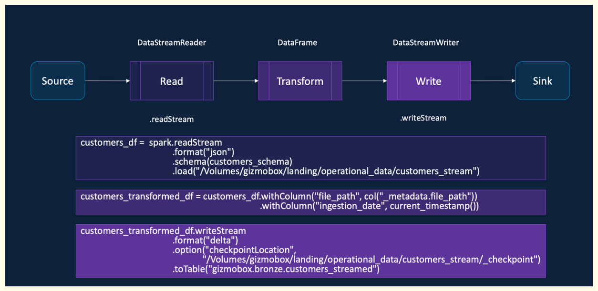

| Trigger Type                  | Trigger Syntax                     | Description                                                          |
| --------------------------------- | -------------------------------------- | ------------------------------------------------------------------------ |
| Default (No Trigger)          | No trigger specified                   | Runs micro-batches at a default interval (~500 milliseconds)             |
| Fixed Interval                | `.trigger(processingTime="2 minutes")` | Runs micro-batches at a user-defined interval                            |
| Triggered Once (Deprecated) | `.trigger(once=True)`                  | Processes all available data in a single micro-batch and then stops      |
| Available Now                 | `.trigger(availableNow=True)`          | Processes all available data in multiple micro-batches and then stops    |
| Continuous (Experimental)   | `.trigger(continuous="2 seconds")`     | Processes data continuously with checkpointing at the specified interval |


| Output Mode      | Description                                                   |
| -------------------- | ----------------------------------------------------------------- |
| Append (Default) | Writes only the new rows that arrived since the last micro-batch  |
| Complete         | Writes the entire result table to the sink in every micro-batch   |
| Update           | Writes only the rows that have changed since the last micro-batch |

>--- **Checkpointing**

Checkpointing is a fault-tolerance mechanism that allows a query to recover from failures and resume processing from where it left off without data loss or duplication.

- Stores Metadata about streaming query, execution plan
- Tracks processed offsets and committed results
- Write-Ahead Logs (WAL) and Checkpointing helps provide Fault Tolerance
- Idempotent Sinks enables exactly once guarantees

## **Compute Selection**

| **VM Category**       | **Workload Type / Use Cases**                                                                                                            |
| --------------------- | ---------------------------------------------------------------------------------------------------------------------------------------- |
| **Memory Optimized**  | - Machine Learning (ML) workloads<br>- Workloads with heavy shuffle and disk spills<br>- When Spark caching is required                  |
| **Compute Optimized** | - Structured Streaming jobs<br>- ELT workloads with full data scans and no reuse<br>- Running Delta commands like `OPTIMIZE` and Z-order |
| **Storage Optimized** | - Leveraging Delta caching<br>- ML and Deep Learning (DL) workloads with data caching<br>- Ad hoc and interactive data analysis          |
| **GPU Optimized**     | - ML and DL workloads with exceptionally high memory requirements                                                                        |
| **General Purpose**   | - Default choice when no specific requirement exists<br>- Running Delta command like `VACUUM`                                            |


## **Auto Loader**

>--- **Traditional streaming issues**

- Inefficient File Listing
- Scalability Issues
- Schema Evolution Problems

A new structured streaming source designed for large-scale, efficient data ingestion. Incrementally and efficiently processes new data files as they arrive in the cloud storage

Supports Azure Data Lake Storage, Amazon S3, Google Cloud Storage, Databricks File System. Supports JSON, CSV, XML, PARQUET, AVRO, ORC, TEXT, and BINARYFILE file formats

>--- ***Auto Loader features***

1. Efficient File Detection using Cloud Services
2. Scalability Improvements
3. Schema Evolution & Resiliency
4. Recommended in Lakeflow Declarative Pipelines

```python
customers_df = spark.readStream
 .format(”cloudFiles")
 .option("cloudFiles.format", "json")
 .option("cloudFiles.useNotifications", "true")
 .option("cloudFiles.schemaLocation",
 “/Volumes/gizmobox/landing/operational_data/customers_stream/_schema”)
 .option("cloudFiles.inferColumnTypes", "true")
.option("cloudFiles.schemaEvolutionMode", "addNewColumns")
 .load("/Volumes/gizmobox/landing/operational_data/customers_stream")
```

Auto Loader detects the addition of new columns as it processes your data. When Auto Loader detects a new column, the stream stops with an UnknownFieldException. Before your stream throws this error, Auto Loader performs schema inference on the latest micro-batch of data and updates the schema location with the latest schema by merging new columns to the end of the schema. The data types of existing columns remain unchanged.

Databricks recommends configuring Auto Loader streams with Lakeflow Jobs to restart automatically after such schema changes.

Auto Loader supports the following modes for schema evolution, which you set in the cloudFiles.schemaEvolutionMode option:

| **Mode**                          | **Behavior on Reading New Columns**                                                                                                                                     |
| --------------------------------- | ----------------------------------------------------------------------------------------------------------------------------------------------------------------------- |
| **addNewColumns (default)**       | Stream fails. New columns are added to the schema. Existing columns do not evolve data types.                                                                           |
| **rescue**                        | Schema is not evolved and the stream does not fail. All new columns are captured in the *rescued data* column.                                                          |
| **failOnNewColumns**              | Stream fails and does not restart unless you update the schema or remove the problematic data file.                                                                     |
| **none**                          | Schema is not evolved. New columns are ignored. Data is not rescued unless `rescuedDataColumn` is set. Stream does not fail.                                            |
| **addNewColumnsWithTypeWidening** | Stream fails. New columns are added, and supported data type changes are widened. Unsupported changes (e.g., `int` → `string`) are captured in the rescued data column. |


>--- **What is the rescued data column?**

When Auto Loader infers the schema, Auto Loader automatically adds a rescued data column to your schema as _rescued_data. You can rename the column or include it when you provide a schema by setting the rescuedDataColumn option.

The rescued data column ensures that Auto Loader rescues columns that don't match the schema instead of dropping them. The rescued data column contains any data that isn't parsed for the following reasons:

The column is missing from the schema.

- Type mismatches.
- Case mismatches.

The rescued data column contains a JSON blob with the rescued columns and the source file path of the record.

## **Databricks Git Folders/repos**

Git Folders is a visual Git client made available in the Databricks workspace to enable collaborative development amongst developers.

>--- **Limitations of notebook version history**

- Limited to Single Notebook
- Basic Tracking Only / No Branching
- Lack of integration with CI/CD pipelines

>--- **Git Benefits**

- Holistic Version Control
- Team Collaboration
- Automated CI/CD Pipelines

## **Databricks Asset Bundles**

Databricks Asset Bundles are a tool to facilitate the adoption of software engineering best practices, including source control, code review, testing, and continuous integration and delivery (CI/CD), for your data and AI projects.

Collection of:
    Code (notebooks, Python, SQL)
    Environment settings (dev, test, prod)
    Configurations for Databricks resources (jobs, pipelines, clusters, MLflow, etc.)

Represented in YAML

Deployed through CI/CD tools like GitHub Actions, Azure DevOps

Provides a standard, repeatable way to deliver Databricks projects

---

> --- ***Structure of bundle***

1. bundle → project name & metadata
2. resources → jobs, pipelines, clusters, MLflow, etc.
3. targets → environment specific settings (dev, test, prod)
4. variables → define reusable values (like parameters)
5. include → pull in configs from other files (for modular bundles)
6. run_as → specify the identity (user or service principal) to run jobs
7. artifacts → reference libraries, wheels, or other external assets
8. sync → control what gets synced between local and workspace

---

> --- ***Sample YAML***

```
# Databricks Asset Bundle for dab_demo_project
bundle:
  name: dab_demo_project

resources:
  jobs:
    dab_demo_project_job:
      name: dab_demo_project_job
      tasks:
        - task_key: dab_demo_notebook
          notebook_task:
            notebook_path: src/dab_demo_notebook.ipynb
          job_cluster_key: job_cluster

      job_clusters:
        - job_cluster_key: job_cluster
          new_cluster:
            spark_version: 15.4.x-scala2.12
            node_type_id: Standard_D3_v2
            data_security_mode: SINGLE_USER
            num_workers: 1

targets:
  dev:
    default: true
    mode: development
    workspace:
      host: https://adb-12345.14.azuredatabricks.net

  prod:
    workspace:
      host: https://adb-67890.14.azuredatabricks.net

```

---

> --- ***Databricks CLI commands***

1. databricks bundle init
Initializes a new Databricks bundle project in your working directory.

databricks bundle init
Prompts you for a template (Python, SQL, MLflow, etc.).

Creates a starter databricks.yml file and project folder structure.

2. databricks bundle validate
Validates the configuration of your bundle before deployment.

databricks bundle validate
Ensures your databricks.yml file is correctly structured.

Catches missing or invalid fields early.

Always a good practice to run before deploying.

3. databricks bundle deploy
Deploys your bundle to the Databricks workspace.

databricks bundle deploy -t dev
-t specifies the target environment (e.g. dev, test, prod).

Uploads source code and provisions jobs, clusters, pipelines, etc.

Creates a hidden .bundle folder in the workspace with your files.

4. databricks bundle run
Runs a defined workflow (job) from your bundle.

databricks bundle run my_job
Executes a specific job defined in the bundle.

Useful for testing deployments.

5. databricks bundle destroy
Removes all deployed resources from the specified target environment.

databricks bundle destroy -t dev
Cleans up jobs, clusters, and other resources created by the bundle.

Helpful when resetting environments or avoiding conflicts in shared workspaces.


## **Delta Lake**

>--- **Data Lake Problems and the Delta Lake Solution**

Data lakes offered flexible data storage, allowing ingestion of structured, semi-structured, and unstructured data like audio, video, images, or logs, and storing this high volume data cheaply and scalably on services like S3 or ADLS.

However, data lakes presented severe challenges that Delta Lake was designed to solve, including a lack of ACID support, lack of support for update, merge, and delete operations, and issues related to data reliability and quality due to the absence of schema enforcement.

Traditional updates or deletes required reading all the data into memory, applying the changes, and writing it back; if the system failed during this process, it resulted in inconsistent or corrupt data. Delta Lake addresses these issues and provides additional features such as time travel, unified batch and streaming capabilities, schema evolution and enforcement, and audit history

>--- **Delta Log Internals and Scaling**

The Delta Log acts as the transaction layer on top of Parquet files, recording transactions atomically in JSON files (e.g., 0.json, 1.json). The current state of the table is calculated by "summing" all transaction logs, applying additions and removals to determine the set of active Parquet files.

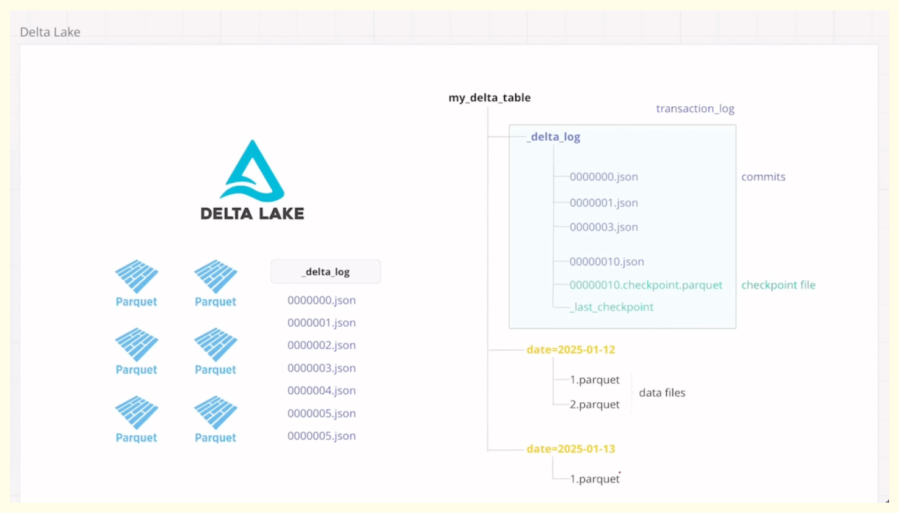

Delta Lake computes the latest state of a table by reading the Delta Log and performing a summation of all recorded transactions. This approach ensures data consistency and provides features like time travel.

>--- ***Core Components of a Delta Table***

A Delta Lake table is composed of two main elements

 1. Data Files (Parquet): The actual data is stored in immutable Parquet files.
 2. Transaction Layer (Delta Log): A transaction layer, called the Delta Log, resides on top of the data files. This log records every operation performed on the table.

>--- **The Delta Log and Transaction Recording**

Deltalog jason file containes - {commitinfo,metadata,protocol,operationperformed}

Each transaction or operation (such as an insert, update, or delete) on a Delta table is treated as an atomic unit of work.

Recording Transactions: Transactions are recorded as sequential JSON files (e.g., 0.json, 1.json, 2.json) within the hidden _delta_log folder.

Operation Details: Each JSON file contains details about the operation performed (e.g., create or replace table, write, update, delete) and tracks which Parquet files were added or logically removed. A transaction groups one or more operations together. The commit info section contains details about the operation and the user who performed it. The add section notes a new Parquet file that was added to the table state. The remove section logically marks a Parquet file as no longer part of the current table state (a soft delete).

>--- **Computing the Latest State via Summation**


When a user executes a query (e.g., SELECT * FROM table), Delta Lake processes the Delta Log to construct the latest valid view of the data:

1. Applying Transactions in Order: Delta Lake starts from the beginning of the transaction history and sequentially applies each transaction record (JSON file).

2. Summation Principle: The system performs a "summation" of the transactions. It tracks all file additions (+) and removals (-). Files that are added and subsequently removed in later transactions cancel each other out.

3. Handling Updates and Deletes: When an update or delete occurs, the original Parquet file containing the modified data is logically marked as REMOVE, and a new file (or files) containing the revised records is ADDed. For small changes, especially when deletion vectors are enabled, Delta Lake records the changes in the deletion vector file instead of rewriting the entire Parquet file immediately (Merge on Read approach). However, the log still records the necessary file additions and removals to reflect the logical state change.

4. Final State Construction: The final, latest state of the table is computed by reading only the Parquet files that remain after all logical removals have been processed in the summation.

>--- **Scaling the Delta Log (Compacted JSONs and Checkpoints)**

For tables with millions of transactions, reading every JSON file in the Delta Log to compute the latest state would be computationally expensive and slow. 

To optimize this, Delta Lake uses two key scaling mechanisms:

1. Compacted JSONs: Compacted JSON files are used to reduce the overhead associated with reading many small JSON transaction files. Delta Lake periodically creates a compacted JSON file (e.g., a .compacted.json file). This compacted file picks up and dumps all the information (transactions and details) contained within a set of smaller JSON log files into one larger file, avoiding the need to open and close many individual files. If a transaction is committed, Delta can read the already compacted file plus any subsequent uncompacted files to compute the latest state. It avoids having to read all the historical individual JSON files.

2. Checkpoint Parquet Files: Checkpoint files provide a mechanism to drastically reduce the number of files Delta must scan to determine the latest state of a table, offering a "tremendous amount of optimization". After a predetermined number of JSON files are created (e.g., 36 files in the Databricks environment used in the example), a checkpoint.parquet file is generated. This checkpoint file condenses all the information from the very first transaction (version zero) up to the point of the checkpoint.

To compute the latest state of the table, Delta only needs to find and read the latest checkpoint.parquet file and then apply any subsequent JSON files (or compacted JSONs) that have been created since that checkpoint. This allows Delta to skip reading potentially hundreds or thousands of older historical JSON log files. The gap at which a checkpoint file is created varies; it is 36 transactions in the Databricks version shown, but often 10 in the open-source version. This difference is due to Databricks implementing performance optimizations to relax this gap.

>--- **Pessimistic concurrency control** 

- Core Assumption

PCC gets its name because the DBMS operates under the assumption that conflicts are bound to happen and are likely to occur. A conflict occurs when two or more transactions attempt to modify the same data simultaneously, resulting in an invalid state.
It is a strategy used by database management systems (DBMS) to ensure that transactions maintain the correctness and consistency of the database.

- Mechanism: Exclusive Locking

To prevent these conflicts, PCC uses a locking mechanism:

• When a transaction attempts to make a change to a database, an exclusive lock is placed on that data.

• This lock ensures that no other transaction can come in and make changes while the first transaction is running.

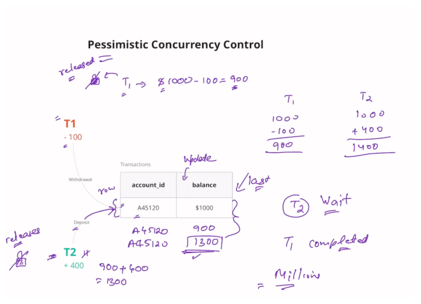

- Example Walkthrough (T1 and T2)

Consider an account with a starting balance of $1,000, and two simultaneous transactions: T1 (withdraw $100) and T2 (deposit $400).

1. T1 Starts: Transaction T1 begins first.
2. Lock Acquired: The moment T1 starts, it acquires an exclusive lock on the relevant row (the account balance).
3. T2 Waits: Because T1 holds the lock, T2 cannot proceed and must wait until T1 completes.
4. T1 Processing: T1 reads the balance ($1,000), subtracts $100, and computes the new balance as $900.
5. T1 Updates and Releases: T1 updates the account balance to $900 and then releases the exclusive lock.
6. T2 Starts: T2 now gets a chance and places its own exclusive lock on the row.
7. T2 Processing: T2 reads the latest balance ($900), adds $400, computes the final balance as $1,300, and updates the account.
8. Consistency Achieved: T2 then releases its lock, and the database is left in the correct state.

- Major Drawback

While PCC achieves consistency, its major downside is performance when dealing with high concurrency:

• Waiting: T2 had to wait until T1 was completed.

• Scalability Issue: If a system handles millions of transactions, the waiting involved means the entire system is going to "come to a halt" because transactions wait endlessly for locks to be released, making the system slow and inefficient.
This performance issue is why Delta Lake primarily achieves isolation using Optimistic Concurrency Control (OCC), which assumes conflicts are rare and avoids explicit locks

>--- **Optimistic concurrency control** 

- Core Assumption (Optimism)

The name "Optimistic" comes from its fundamental assumption: conflicts are very unlikely to occur. Conflicts, where two or more transactions try to modify the same data and lead to an invalid state, are assumed to be rare. This assumption allows the system to prioritize speed and concurrency over preemptive conflict avoidance.

- Mechanism: Avoiding Locks

With OCC, transactions do not obtain locks when they read or write data. This is the "beautiful part" of OCC. Because no locks are used, multiple transactions can read the same row simultaneously.

When transactions (like T1 and T2) begin, they read the account balance, and crucially, they also read the associated version number and time frame of the data. This version number tracks changes within the table.

- Conflict Resolution and Validation

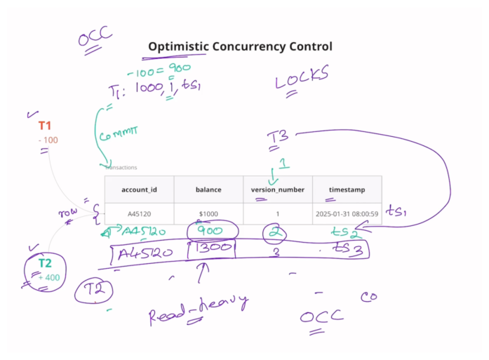

When transactions are finished processing and attempt to commit their changes, a validation procedure occurs:

1. Concurrent Execution: T1 and T2 perform their calculations independently (e.g., T1 computes $900, T2 computes $1,400).
2. First Commit Wins (T1): T1 attempts to commit first. It checks the current version number (let's say V1) against the version number it read (also V1). Since they match, T1 knows no one made changes while it was working. T1 succeeds, updates the balance (to $900), and updates the version number (to V2).
3. Second Commit Fails (T2): T2 attempts to commit next. It checks the current version number (now V2) against the version it originally read (V1). Because V2=V1, T2 immediately understands that a person came before it and made changes to the table. T2 was working on stale data.
4. The Retry: The conflicting transaction (T2) does not block; instead, it is designed to fail. It must then retry the transaction. It reads the latest state of the table (V2), re-applies its operation (adding $400 to 900),computesthecorrectfinalbalance(1,300), and attempts to commit again.
5. Successful Second Attempt: T2 checks the version again (V2 = V2), finds it is working on the latest data, and updates the table (to $1,300) and the version number (to V3).

- High Concurrency Benefits

This approach has significant advantages for modern data systems:

• No Interference: Multiple simultaneous transactions can proceed "without interfering with each other". Each transaction operates as if it is the only one running. Intermediate or uncommitted changes are not visible to other transactions.

• High Concurrency: This mechanism allows for a very high level of concurrency, as transactions avoid endless waiting caused by locks.

• Suitability for Read-Heavy Systems: OCC works best in systems where writes (and therefore conflicts) happen very rarely.
This efficient conflict resolution is why OCC, and the versioning ledger it relies on, is central to Delta Lake’s architecture.

>--- **Time Travel & Versioning** 

- Versioning

It is the mechanism that helps Delta Lake track the different states of a table over time.

• Tracking Changes: Every operation performed on a Delta table (such as a create, delete, update, or insert) results in the creation of a new version of the table.

• Zero-Indexed: The first operation performed (like a CREATE OR REPLACE TABLE AS SELECT) creates version zero of the table. Subsequent operations increment this version number. For example, after version zero, a delete operation might create version one, an update might create version two, and a write (insert) might create version three.

• Audit History: This version history allows users to see an audit trail of operations performed, including the timestamp, the user who performed the operation, and the operation details.

- Time Travel (Accessing Past States)

Time travel is the ability to query or restore a Delta table to any of its previous versions. This is a core feature for data reliability, testing, and compliance.

• Accessing Specific Versions: Users can select data from a specific historical version using either the version number or the timestamp of that version.

!!! note

    **Using Version Number**: You can use the syntax VERSION AS OF [version_number] 

    In a SELECT query (e.g., SELECT * FROM table VERSION AS OF 0).

    **Using Timestamp**: You can use the syntax TIMESTAMP AS OF [timestamp] in a SELECT query. The timestamp must be a time at which a version existed.

• Handling Non-Exact Timestamps: If a user specifies a timestamp that doesn't exactly match a version's commit time, Delta Lake finds the latest version that existed before that specified time. For instance, if versions existed at 9:31 and 9:57, querying for 9:35 will return the state of version 9:31.

• Restoring the Table: Beyond querying, a user can permanently roll the table back to a specific version using the RESTORE TABLE command (e.g., RESTORE TABLE [table_name] TO VERSION AS OF 0). This restoration itself is recorded as a new version in the table's history.

- Impact of Vacuum on Time Travel

It is crucial to understand that the VACUUM command limits time travel capability.

• File Deletion: When you run VACUUM, especially with a retention duration of zero, Delta Lake permanently deletes the physical data files that are no longer referenced by the current version (i.e., files that have been "tombstoned" or marked for soft delete by update/delete operations).

• Version Incompleteness: If a file required to construct an older version is removed by a VACUUM operation, time travel back to that specific version will fail because the data required to fully reconstruct that historical state is incomplete or missing.

For instance, in a demonstration, attempting to access version one of a table after a vacuum failed because the file written in version one was deleted, but accessing version zero worked because its necessary file was still present


>--- **Schema Validation** 


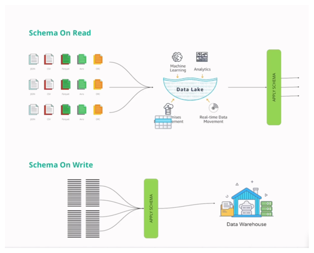

- Schema-on-Read (Traditional Data Lakes)

The traditional approach used in standard data lakes is schema-on-read.

Data is dumped into the lake in any format (structured, semi-structured, unstructured) and resides there. The application of the schema happens later, *after* the data has been stored, typically when a user runs a query to read the files.

This flexibility leads to inconsistency. If different files are ingested with varying formats or column structures, writing a query becomes difficult, requiring complex logic to handle different fields and schemas.

- Schema-on-Write (Delta Lake Validation)

Delta Lake uses a schema-on-write approach, which is essential for ensuring that every transaction brings the database from one valid state to another.

Incoming data records are checked to validate their schema against the target Delta table's existing schema before ingestion occurs. This is done to prevent "garbage data" from corrupting the table.


| Scenario | Description | INSERT Behavior | MERGE Behavior |
| :--- | :--- | :--- | :--- |
| 1. Column Order | The source data columns are reordered relative to the target table. | Matches columns by position. If data types are compatible, data corruption occurs as values are mapped incorrectly. | Matches columns by name. It correctly identifies columns even if the physical order is changed. |
| 2. Data Type | Incoming data types do not match the target schema's definitions. | Attempts to cast (convert) the incoming value to the table's data type (e.g., string '99499' to an integer). Fails if the string value cannot be cast (e.g., 'ABC' to integer), preventing data garbage. | Similar automatic casting attempts are made. |
| 3. Column Name | Source data column names differ from the target table column names. | Ignores name differences, as it matches columns by position. The write succeeds if positions align. | Is strictly based on matching column names. If names are mismatched, the operation fails because it cannot resolve the column. |
| 4. Nullability/Constraints| The incoming data violates constraints (e.g., `NOT NULL` for a primary key).| Fails if a `NOT NULL` constraint is violated by inserting a `NULL`. Applies to other rules like ensuring `price` is greater than zero. | Fails if constraints are violated. |
| 5. Extra Columns | The source data contains more columns than the target table schema. | Fails with a "schema mishmash detected" error. | Is robust; it successfully inserts the data by focusing only on the columns defined in the target schema, ignoring the extra columns. |

Since schema validation is critical for ensuring consistency and preventing corruption, the choice between `INSERT` and `MERGE` is often determined by how robustly you need to handle potential schema changes.


>--- **Schema Evolution** 

Schema evolution is Delta Lake's capability to handle changes to a table's schema, such as adding, reordering, or modifying columns, without having to completely rewrite the underlying table or data. This functionality is crucial for maintaining flexibility in data pipelines.

The ability to evolve a schema accommodates several common changes:

1. Adding new columns.
2. Upgrading a data type to a larger, more accommodating type (type widening).
3. Handling changes within nested structures.
4. Changing the physical position of columns.


- Adding New Columns (Scenario 1)

New columns can be added using two main approaches:

   Manual Approach (`ALTER TABLE ADD COLUMN`): The user explicitly runs the `ALTER TABLE ADD COLUMN` statement to update the table's schema. Subsequent `INSERT` or `WRITE` operations that include this new column will succeed. Rows that existed before the new column was added will contain `NULL` values for that column.

   Automatic Schema Evolution: This approach is enabled by setting a specific table property to `true`. If the incoming data contains a new column that does not exist in the target Delta table, the system automatically accommodates it without requiring a manual `ALTER` statement.

- Type Widening (Scenario 2)

Type widening refers to the ability to upgrade a data type to a "bigger type" to handle larger values, such as converting an `INT` to a `BIGINT` or a `FLOAT` to a `DOUBLE`.

   Enforcement: This capability was introduced in Delta version 3.2 (which corresponds to Databricks Runtime 15.4 used in the demonstration).
   
   Manual Change Required: Even with automatic schema evolution enabled, type widening often does not happen automatically. If an incoming value exceeds the capacity of the current column type (e.g., a huge number for an `INT` column), the system fails with an error. The user must manually run an `ALTER COLUMN` statement to change the type (e.g., `ALTER COLUMN customer ID TYPE BIGINT`) before the write will succeed.

- Nested Structure Evolution (Scenario 3)

Delta Lake supports schema changes within nested `STRUCT` data types.

   Adding Attributes: You can add a new attribute to an existing `STRUCT` column using `ALTER TABLE ADD COLUMN` with the dot notation (e.g., `ALTER TABLE... ADD COLUMN purchase_details.store_location STRING`).
   
   Changing Nested Types: You can also manually change the data type of an attribute inside a `STRUCT` (e.g., changing `mall_pin_code` from `INT` to `BIGINT`) using `ALTER COLUMN purchase_details.mall_pin_code TYPE BIGINT`.
   
   Automatic Nested Evolution: To automatically add a new attribute to a nested `STRUCT` during an insert, the user must utilize a named struct. This is necessary because if a simple positional insert is used, the system won't know the key of the new attribute, leading to inconsistencies.

- Column Position Changes (Scenario 4)

Delta Lake provides methods to control the physical placement of columns:

   Manual Positioning: When manually adding a column, you can specify its exact location using `FIRST` (to place it as the first column) or `AFTER [column_name]` (to place it after a specific column).

   Automatic Behavior: When automatic schema evolution is enabled (especially with a `MERGE` operation), if a new column is encountered in the source, Delta Lake generally appends that column as the last column in the table, even if the user intended a different position.

>--- **Parquet to delta** 

Converting an existing Parquet file (or a folder containing Parquet files) into a Delta Lake table format is necessary to enable features like ACID transactions, time travel, and schema enforcement.

The fundamental difference between a standard Parquet file and a Delta table is the presence of the transaction layer, or the Delta Log. When a directory contains Parquet data but no Delta Log folder, it is not yet a Delta table.

The conversion process essentially creates this transactional layer and registers the existing data. There are two primary methods detailed in the video for converting Parquet to Delta:

- Using SQL / Shell Command

The first method involves using the `CONVERT TO DELTA` command directly on the path of the Parquet data.

This approach is straightforward and typically executed using Spark SQL or a shell command that interacts with the Delta Lake framework.When executed, this command instructs Delta Lake to perform the conversion.

- Using the Delta Table API

The second method utilizes the Delta Lake API, typically within a Python or Scala environment, using the `DeltaTable` class.

This requires importing the necessary library (e.g., `from delta.tables import DeltaTable`). The function used is `convertToDelta`. For example: `DeltaTable.convertToDelta(path, format='parquet')`.

- The Core Conversion Mechanism

Regardless of the method used, the underlying process to transform the Parquet files into a Delta table is the same:

1.  Delta Log Creation: A new folder named `_delta_log` is created in the directory containing the Parquet files.
2.  Transaction Registration: The Delta Log is populated with its first transaction file, a JSON file (version `0.json`), which records the initial operation.
3.  Data Registration (The `ADD` Operation): This initial JSON file contains an ADD operation, which explicitly registers the existing Parquet file(s) as the contents of the newly created Delta table. This transaction registers the data.

Once this transaction is recorded, the folder structure officially functions as a Delta Lake table.


>--- **Copy on Write**

Copy on Write is defined by the underlying architecture of data storage in Delta Lake: Parquet files.

Immutable Files: Parquet files are immutable, meaning they cannot be modified directly once they are written to disk.


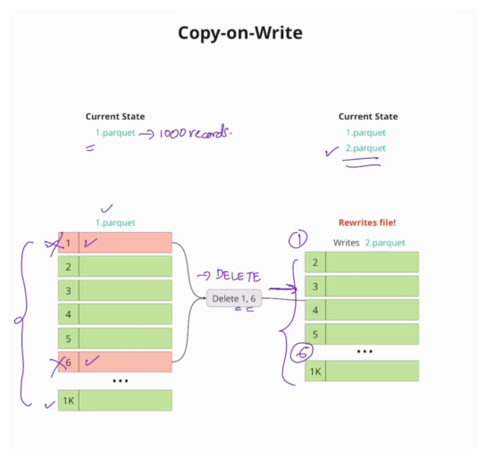

- The Copy on Write Mechanism

Since files cannot be changed directly, any operation that modifies the data must result in new files being created. Delta Lake follows the Copy on Write approach when deletion vectors are disabled.

The mechanism involves three steps for any change (update, delete, or merge):

1.  Read: The system must read the entire existing Parquet file that contains the record(s) intended for modification.
2.  Apply Operation: The necessary changes (delete or update) are applied in memory.
3.  Rewrite: The entire file is then rewritten back to storage as a completely new file, either omitting the deleted records or including the updated records.

For instance, to delete rows 1 and 6 from a file named `1.parquet`, Copy on Write rewrites the whole file into a new file (e.g., `2.parquet`) which omits those two rows. This new file (`2.parquet`) is then the one referenced for the latest version of the data.

- Computational Expense (The Drawback)

The Copy on Write approach has a significant drawback: it is "tremendously computationally expensive".

Costly Rewriting: The read and rewrite process is very costly. If a Parquet file contains 10 million rows and you only need to delete a "few couple of rows," you still must read the whole file and rewrite the whole file back.

- Optimal Use Case

Because Copy on Write involves expensive rewrites for frequent changes, it is not ideal for high-write scenarios.

Read-Heavy Focus: CoW works best for use cases that are read heavy and where the frequency of writes (updates, deletes) is very low. If rights are high, the system will read and rewrite the whole file repeatedly, making the system slow.

Copy on Write's performance limitations during frequent writes is the reason Delta Lake later introduced Deletion Vectors to enable the Merge on Read paradigm, which avoids these costly full file rewrites.

>--- **Merge on Read**

Merge on Read (MoR) is a critical concurrency paradigm in Delta Lake that is enabled when deletion vectors are turned on. It provides a high-performance alternative to the traditional Copy on Write approach.

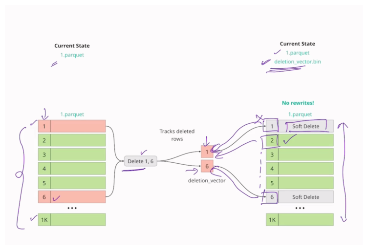


 1. The Core Problem Solved by MoR

The fundamental challenge in data systems using immutable files (like Parquet, which Delta Lake uses under the hood) is how to handle updates and deletes efficiently. In the Copy on Write approach, any change requires reading the entire affected file, applying the change, and then rewriting the entire file back to storage. This rewrite process is "tremendously computationally expensive," even if only a "few couple of rows" are modified in a file containing millions of records.

 2. The Mechanism: Deletion Vectors

Merge on Read resolves this expensive rewrite problem by keeping the original Parquet files untouched.

   Recording Changes: Instead of modifying the data file, any changes (such as deletions) are recorded in a separate, much smaller file known as a deletion vector (DV).
   DV Content: The deletion vector records the row number or index of the records that are intended for deletion.
   Updates as Two Operations: An update operation is logically treated as a "delete plus insert". The old row is marked for deletion in the DV, and the newly updated row is written as a small, new Parquet file.

 3. The Read Process (The "Merge" Step)

When a user runs a query to read the latest state of the table, the system uses the Merge on Read approach to combine the data:

1.  Read Files: The system reads the underlying Parquet file(s).
2.  Check DV: For each row read from the Parquet file, the system checks the deletion vector.
3.  Soft Delete: If the row's index is present in the DV, that row is treated as a soft delete and is skipped from the final output. If the row is not present in the DV, it is displayed.
4.  Final State: The result is the latest state of the table, which is constructed from the original file combined with the information in the small DV bitmap file.

 4. Benefits and Optimal Use

Deletion vectors, and thus Merge on Read, bring significant performance advantages:

   Increased Write Performance: MoR avoids the costly process of rewriting the entire Parquet file for small changes. This dramatically reduces write latency.
   Efficiency: It increases the performance of deletes, updates, and merge operations.
   Best Use Case: MoR works best for use cases where data is updated frequently.


>--- **Deletion Vectors** 


- The Problem Deletion Vectors Solve

Underlying Delta Lake, data is stored in Parquet files, which are immutable.

In the traditional approach, known as Copy on Write: if you want to update or delete just one record in a Parquet file containing millions of rows, the system must:

1.  Read the entire Parquet file.
2.  Apply the update or delete operation.
3.  Rewrite the entire file back, omitting the deleted row or including the updated row.

This read-and-rewrite process is computationally expensive and is the bottleneck that deletion vectors aim to resolve.

- The Solution: Merge on Read and Deletion Vectors

Deletion vectors enable Delta Lake to use the Merge on Read approach when they are enabled.

Mechanism: Instead of rewriting the massive Parquet file, the original file remains untouched. The changes (deletions or updates) are recorded in a separate, small file called the deletion vector (DV).

Content: The deletion vector acts as a bitmap, recording the row number or index of the records that are supposed to be removed or soft-deleted.

- Operation with Deletion Vectors

When a transaction occurs, the transaction log is updated, often including the deletion vector:

   Delete Operation: A delete operation simply records the row numbers of the deleted records in the deletion vector file. For example, deleting row 1 and row 6 results in those numbers being recorded in the DV.
   Update Operation: An update is treated as a "delete plus insert". When updating a row, the old version of the row is marked for deletion in the deletion vector, and the newly updated row is written as a new, small Parquet file.

 4. Reading the Data

When a user reads the latest state of the table, the system checks both the Parquet data and the deletion vector:

   The system reads the Parquet file.
   For each row read, it checks the deletion vector.
   If the row's index is present in the DV, it is treated as a soft delete and is skipped from the final output, ensuring the file doesn't have to be rewritten for every minor change.

 5. Benefits and Tradeoffs

Deletion vectors provide significant advantages:

   Performance: They reduce write latency by avoiding the rewriting of the whole file for small changes.
   Efficiency: They bring Merge on Read capability to Delta Lake, increasing the performance of deletes, updates, and merge operations.

However, the Merge on Read approach (with DVs enabled) works best for use cases where data is updated frequently. Conversely, the Copy on Write approach (DVs disabled) is generally better for read-heavy use cases.


>--- **Shallow v/s Deep Clone**


Cloning is a functionality in Delta Lake that allows you to create a snapshot of your Delta tables at a specific point in time [i, 148]. There are two main approaches or "flavors" to cloning: shallow clone and deep clone.

 Shallow Clone

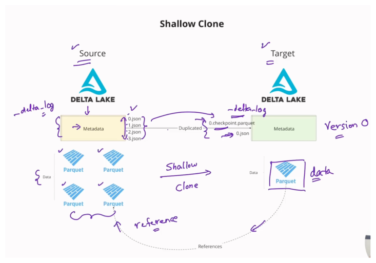

A shallow clone involves taking a snapshot primarily of the table's metadata at a specific point in time.

Mechanism and Data Storage:
   When a table is shallow cloned, Delta Lake does not copy the underlying data files (such as Parquet files).
   Instead, the shallow clone table simply references the underlying data files of the source table.
   The target shallow clone table will start with a fresh history, beginning at version zero.
   The metadata itself is duplicated, but not via a one-to-one copy of the source JSON transaction files. All information in the source table's delta log is condensed into a `0.checkpoint.parquet` file, and the latest state of the source table is computed and recorded in `0.json` in the target table's delta log.

Performance and Cost:
   The shallow clone operation is super fast and computationally cheap.
   It does not use a lot of storage because the data files are only referenced, not copied.

Independence and Limitations:
   Once a shallow clone is created, it maintains its own history and set of operations.
   Any changes, updates, or modifications made to the shallow clone table will not affect the source table, and similarly, changes to the source table will not affect the shallow clone table.
   You can clone a table using a specific timestamp or version number from the source table, using `VERSION AS OF` or `TIMESTAMP AS OF`.
   Since the shallow clone starts with a fresh version zero representing the latest state of the source, you cannot access the full history of the source table (e.g., versions 1 or 2) through the shallow clone table.
   If a `VACUUM` operation is run on the source table after a shallow clone has been created, any underlying data files that are still being referenced by the shallow clone will not be removed from the source storage until those references are deleted in the shallow clone(s) as well.

 Deep Clone (or Copy)

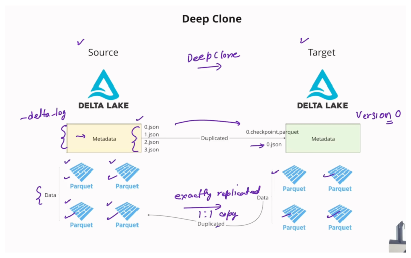
A deep clone, or deep copy, creates a completely independent copy of both the metadata and the data files.

Mechanism and Data Storage:
   A deep clone performs an exact replication of the underlying Parquet files from the source to the target location.
   The target deep clone table is self-contained and independent.
   Similar to shallow clones, the metadata starts at version zero in the target table, with the source transaction history being condensed into a checkpoint file (`0.checkpoint.parquet`) and the latest state computed and placed in `0.json`.

Performance and Cost:
   This operation takes a little bit longer and uses more storage compared to a shallow clone, because it copies the data files instead of referencing them.

Independence and Advantages:
   The deep clone is fully independent: changes in the deep clone table will not affect the source table, and changes in the source table will not affect the deep cloned table.
   Deep clone operations are incremental. If you perform a subsequent deep clone (e.g., for disaster recovery synchronization), it does not copy the entire source table again. Instead, it only copies or syncs the incremental changes (such as updates or deletes) that have occurred since the last clone, making the operation robust and performant.
   Deep cloning is considered a more robust way to clone than using a `CREATE TABLE AS SELECT (CTAS)` statement. A CTAS statement only uses the resulting rows to create a new table, often losing table properties, constraints, and partitioning details. A deep clone, however, also clones the metadata and properties of the table.

| Feature | Shallow Clone | Deep Clone |
| :--- | :--- | :--- |
| Data Files | Referenced (not copied) | Independent copy (copied one-to-one) |
| Metadata | Copied/Replicated | Copied/Replicated |
| Speed | Super fast | Takes a little bit longer |
| Storage Use | Computationally cheap, low storage | Uses more storage |
| Independence | Independent history/changes post-clone | Completely self-contained and independent |


>--- **CTAS vs Deep Clone**

The distinction between creating a table using a CTAS (CREATE TABLE AS SELECT) statement and performing a Deep Clone lies primarily in how the metadata, properties, and incremental changes are handled.

 Output Similarity

Initially, if you were to look at the resulting tables at the output level (for example, by running a `SELECT ` query), the table generated using CTAS and the table generated using a deep clone would look exactly identical. They both contain the same underlying rows of data.

 Key Differences (Metadata and Properties)

The crucial difference is what information is carried over from the source table to the new table:

1.  Handling of Properties: A CTAS statement creates a table just using the output of a select query. It takes the resulting set of rows and uses those rows to create the new table. Consequently, all of the properties are lost when using CTAS. These lost properties can include partitioning configurations and constraints.
2.  Robustness of Deep Clone: Deep clone, conversely, is described as a robust way to clone the metadata, the data, and the properties of the table. When you perform a deep clone, you do not need to respecify things like partitioning properties and constraints, because they are automatically cloned along with the data.

 Incremental Feature (Deep Clone Advantage)

Another significant advantage of deep clone over CTAS is its ability to operate incrementally:

   Incremental Synchronization: Deep cloning is designed to work in an incremental manner. This capability is useful for scenarios like disaster recovery, where you need to maintain a synchronous replica of a source table.
   Performance on Resync: If you perform a deep clone to create a replica initially, and then later run the deep clone again to bring the tables back in sync (after updates or deletes occurred on the source), Delta Lake does not copy the whole source table again. Instead, it only copies or syncs the incremental changes that have occurred since the last clone. This ensures that the operation is performant and robust because only the necessary operations (updates or deletes) are applied to the replica.

In summary, while CTAS is good for creating a simple, static snapshot of the rows, Deep Clone is a more sophisticated mechanism that ensures the integrity of the table structure and settings (metadata and properties) is maintained, and it allows for efficient, incremental synchronization.


>--- **Small File Problem**

The small file problem is a phenomenon that silently kills your Spark performance. It occurs when data intended to be part of a large dataset is scattered over thousands of smaller files.

 What is the Small File Problem?

The small file problem arises because, although the total volume of data might be reasonable, the large number of small files introduces immense overhead for the processing engine.

The source uses the analogy of a 300-page novel: instead of being a single 300-page PDF, someone saves each of the 300 pages as a separate PDF. To read the novel, the system would have to perform thousands of time-consuming operations:

1.  Find/Look up the file.
2.  Open the file.
3.  Read the file.
4.  Close the file.

When reading a table scattered across thousands of smaller files, the thousands of open, close, and metadata lookup operations lead to wasted compute and poor I/O.

 Root Causes of the Small File Problem

The video identifies three primary root causes that lead to the creation of excessive small files:

1.  Repartitioning to a very large number: If you have a file that is 10 GB in size and you use `.repartition(10000)`, you will end up with 10,000 resulting files, each only about 1 megabyte in size. These undersized files cause the small file problem.
2.  Partitioning on a high cardinality column: When partitioning data (using `partitionBy`) on a column that has a large number of distinct values (high cardinality, e.g., thousands of distinct values in a category column), you create many separate folders, each containing very small amounts of data.
3.  Frequently updated data sets: Data streams that receive continuous updates, perhaps every 5 minutes, write small updates in small chunks. These small chunks manifest as small files, leading to the small file problem.

 Solution: The `OPTIMIZE` Command

Delta Lake provides a built-in operation called `OPTIMIZE` to solve the small file problem.

The `OPTIMIZE` command works by compacting all of these small files into larger, more appropriately sized ones.

 Bin Packing Algorithm

The compaction relies on an algorithm known as bin packing. This algorithm works as follows:

1.  It collects all file sizes and sorts them from high to low.
2.  It then places each file into a "bin," where each bin represents a new, large consolidated file.
3.  The goal is to fill the bins up to a default target file size of 1 GB. This 1 GB target size is considered robust and should not be changed unless there is a compelling reason to do so.

 Post-Optimization Cleanup

When `OPTIMIZE` is run, it creates the new, larger files but does not immediately remove the original small files.

   The small files that were compacted are tombstoned (marked for soft delete).
   To physically remove the tombstoned files and recover storage space, you must run the `VACUUM` command.

 Incremental Compaction Approaches

Beyond manual optimization, Delta Lake offers two automatic approaches to address small files generated during writes:

1.  Optimize Write: This feature combines all small writes intended for a partition into a single write command. It shuffles all the data and executes a single write command, which produces appropriately sized files for every partition. While effective for creating appropriate file sizes, it incurs a shuffle, which can be costly in terms of data transfer and right latency.
2.  Auto Compaction: This runs a compaction operation (similar to `OPTIMIZE`) automatically after a write finishes, if the number of small files exceeds a minimum threshold (the default minimum number of files to trigger auto compaction is 50, though this can be configured). This approach combines the small files into appropriately sized files.


>--- **Optimize Write**


The feature Optimize Write is an automatic optimization technique used in Delta Lake, specifically designed to address one of the root causes of the small file problem.

Here is a detailed explanation of how Optimize Write works and its implications, as described in the video:

 The Problem it Solves (Traditional Write)

In a traditional write scenario, multiple processes or executors (e.g., Executor 1, 2, and 3) often try to write data concurrently to the same partition (for example, a date partition like `date=2025-05-01`). Since these writes happen simultaneously in small chunks, they result in the creation of many small Parquet files (e.g., `1.pk`, `2.pk`, `3.pk`) within that single partition folder. This proliferation of tiny files leads directly to the small file problem, which silently reduces Spark performance due to excessive file opening, closing, and metadata lookups.

 Mechanism of Optimize Write

Optimize Write operates by transforming multiple intended small writes into a single, cohesive write operation.

1.  Data Shuffle: When Optimize Write is enabled, all data coming from different processes (Executor 1, 2, and 3) is first shuffled.
2.  Single Write Command: After the shuffle, the entire dataset intended for the partition is executed as a single write command.

This process combines all the data together before it is physically written to the storage location.

 Outcome and Benefits

The key benefit of using Optimize Write is that it produces appropriately sized files for every partition. By consolidating the output, it ensures that instead of scattering data across numerous small files, the data is packaged efficiently into large files (up to the target size, typically 1 GB), effectively avoiding the small file problem right at the source.

 Trade-offs and Costs

While highly effective at preventing small files, Optimize Write introduces a notable trade-off:

   Shuffle Cost: The operation necessarily incurs a shuffle. Shuffles are costly because they involve data transfer across the network.
   Write Latency: If your primary concern is optimizing for write latency (the time it takes for data to be written and become available), Optimize Write might not be the best solution because the involved shuffle will add time to the overall writing process.

Therefore, Optimize Write is generally viewed as a very good solution for optimizing for the small file problem, but users must consider the added shuffle overhead. The source demonstrated this, showing that a query operation ran much quicker (1.82 seconds) on a table created with Optimize Write compared to a table created using traditional, small-file-generating methods (6.97 seconds).


Always run OPTIMIZE command on a separate job cluster and not as part of the job itself; otherwise, it might impact the corresponding job’s SLA

Compute-optimized instance family is recommended for the OPTIMIZE command as it’s a compute-intensive operation

## **Vacuum**

The `VACUUM` command in Delta Lake is a crucial optimization technique used for managing the physical storage of data files associated with a Delta table.

Used to remove old, unused files from the Delta Lake to free up storage. Permanently deletes files that are no longer referenced in the transaction log and older than retention threshold (default 7 days)

>--- Benefits

- Reduces cloud storage costs
- Improves query performance
- Helps comply with privacy regulations

>--- Primary Purpose and Mechanism

The core function of `VACUUM` is to physically remove files from cloud storage or disk. Delta Lake employs a soft delete mechanism for data that is no longer part of the current table state:

1.  Soft Deletion: Whenever records are deleted, updated, or merged in a Delta table, the older, irrelevant underlying records or files are tombstoned or marked for soft deletion. This is done to maintain time travel and ACID properties without immediate costly file rewriting or removal.

2.  Physical Deletion: These tombstoned files are not physically deleted from storage until the `VACUUM` command is explicitly run. Running `VACUUM` removes all such files that are no longer referenced in the transaction log and have exceeded the retention duration.

3.  Storage Savings: The key benefit of running `VACUUM` is that it helps save on storage cost by permanently removing unnecessary files.

>--- Key Considerations

- Query Performance:

      A popular misconception is that running `VACUUM` makes queries run faster. This is not the case. Query performance is determined by file filtering and pruning handled by the Delta Log, which directs the engine to scan only the necessary active files. `VACUUM` only cleans up the retired physical files, and the data being scanned remains the same.

- Retention Duration and Safety Checks

      `VACUUM` respects a retention duration setting to ensure that time travel capabilities are not compromised prematurely.

      Default Duration: The default retention duration is 168 hours (7 days). Files created within this period are generally not deleted.
      
      Overriding Retention: To remove files that have been marked for soft delete even if they fall within the default retention period (e.g., immediately after an `OPTIMIZE` operation), you must specify a shorter duration, such as `RETAIN 0 HOURS`.
      
      Safety Warning: Delta Lake usually issues a warning when a user attempts to run `VACUUM` with a low retention duration (e.g., zero hours). To proceed with low retention, a configuration check must be disabled: `set spark.databicks.delta.retentiondurationcheck.enable = false`.

- Limitation on Time Travel:

      Running `VACUUM` limits your ability to time travel. If a file associated with a previous version is physically deleted by the `VACUUM` operation, attempting to access that specific old version (`VERSION AS OF` or `TIMESTAMP AS OF`) will fail because the required underlying file data is missing.

>--- Interaction with Other Operations

   `OPTIMIZE` Compaction: When the `OPTIMIZE` command is run to compact small files into one large file, the original small files are tombstoned. These small files remain physically present until `VACUUM` is run to remove them and recover the storage space.
   Shallow Clones: `VACUUM` operations on a source table are constrained by active references from shallow clones. If a file in the source table is deemed obsolete (orphaned) but is still being referenced by a shallow clone, running `VACUUM` on the source table will not delete that file. The file will only be deleted after all references, including those in all shallow clones, are removed (e.g., by running a delete operation on the relevant data in the shallow clone tables) and then `VACUUM` is re-run on the source.
   Deep Clones: `VACUUM` runs independently on deep clone tables. Since a deep clone is a self-contained and independent copy of the source data with no references linking back, running `VACUUM` on the source table will not affect the deep clone, and vice versa.

The `VACUUM` command is necessary housekeeping in Delta Lake, ensuring that while the transaction log maintains a consistent view of the data, the storage layer only retains necessary files, similar to how recycling services remove old, unnecessary containers to free up space.


## **Z-ordering**

The concept of Z-Ordering is one of the optimization techniques provided by Delta Lake, designed primarily to enhance query performance by maximizing data skipping and minimizing costly data transfers.

 The Problem Z-Ordering Solves (Costly Data Transfer)

Before Z-ordering is applied, Delta Lake tables, like standard Parquet tables, store statistics (such as minimum and maximum values) for columns within the Delta Log.

When a user submits a query with a filter (e.g., `WHERE age >= 5 AND age <= 10`), the query engine uses these statistics to determine which underlying data files need to be scanned and transferred into the memory of the compute cluster.

   If the required filter range overlaps with the minimum and maximum values recorded for a column in a specific Parquet file, that entire file must be transferred over the wire.
   In poorly organized data, the statistics in different files often overlap significantly. This means that a filtered query may result in the necessary transfer and reading of all underlying data files, even if only a few records within those files actually match the criteria. Transferring all these files is a costly operation that consumes compute resources and leads to poor I/O performance.

 Mechanism of Z-Ordering

Z-Ordering fundamentally optimizes the physical layout of data to minimize these file overlaps. It achieves this through a process often described as a sort and repartition.

 1. Collocating Similar Data

The central idea is to collocate similar data points into the same physical data files. By grouping data together, the statistical ranges (min/max) of the resulting files become much tighter, meaning they are less likely to overlap.

When a query is run after Z-ordering, the tight statistical ranges allow the engine to prune (filter out or skip) files that clearly do not contain the relevant data, avoiding their transfer over the network.

 2. Multi-Dimensional Mapping and Locality

Z-Ordering is particularly powerful because it can apply this sorting principle across multiple columns simultaneously (multi-dimensional filtering).

   It works by taking the values from the selected columns and mapping this multi-dimensional space into a single dimension.
   This mapping is done using a mathematical technique called a space-filling curve.
   The curve ensures that data points which are close to each other in the original multi-dimensional space remain close to each other after being mapped to the single dimension (this concept is called preserving locality).

This single, optimized dimension is then used to physically sort and arrange the data within the files, ensuring similar data points are grouped together.

 Using Z-Order with `OPTIMIZE`

The `ZORDER BY` command is not run in isolation; it must be executed together with the `OPTIMIZE` command.

The two operations work hand in hand:

1.  `OPTIMIZE` Compaction: The `OPTIMIZE` command’s role is to solve the small file problem by merging many small files into fewer, larger files (called "bins"), typically targeting a size of 1 GB.
2.  Z-Ordering Collocation: While `OPTIMIZE` is consolidating the small files, Z-Order simultaneously performs the necessary collocation (sorting and rearranging) of the data into the new, larger files.

Running `OPTIMIZE ZORDER BY [columns]` leads to significant performance improvements, often seeing query runtimes decrease substantially because the number of files scanned is drastically reduced.

 Z-Ordering with Partitions

Z-Ordering can be applied incrementally and selectively, particularly when dealing with Hive-style partitions (e.g., partitioning by date). If a table is partitioned (e.g., by `invoice date`), you can use a predicate or `WHERE` condition to apply Z-Ordering only to specific, recently updated partitions (e.g., `OPTIMIZE ... WHERE category = 'fruit'`). This means the expensive Z-Ordering operation is only performed on the small subset of new data, rather than the entire table.

Z-Ordering is like organizing a massive library collection not just by author (which is like partitioning) but also simultaneously by subject, genre, and length, so that when a reader asks for "short sci-fi books from 2020," the librarian (the query engine) only needs to walk to one aisle and look at two shelves, instead of checking every aisle and every shelf just in case a relevant book overlapped into that section.

## **Liquid Clustering**

Liquid Clustering is an advanced optimization technique in Delta Lake designed to provide flexibility and robust query performance by dynamically managing the physical data layout.

It solves the primary problem of inflexibility inherent in traditional Hive-style partitioning and Z-Ordering.

>--- Limitations of Traditional Methods Solved by Liquid Clustering

- Hard to design right partitioning & z-ordering strategy
- Leads to data skew and concurrency conflicts
- Performance drops as data grows and workloads change
- Re-partitioning required rewriting the entire data

Hive-style partitioning and Z-Ordering require the user to decide the columns upfront when defining the table.

   If your query filter pattern changes over time (e.g., switching from filtering by `country` to filtering by `category`), the original data layout becomes unhelpful.
   To address the new filter pattern, you would typically need to rewrite the entire dataset according to the new schema or layout.

Liquid Clustering solves this by allowing you to change the clustering columns anytime, making the approach very flexible. It is also incremental, meaning that when you change clustering columns later on, the data layout changes going ahead to reflect the new desired pattern.

>--- Mechanism and Core Principles

The liquid clustering algorithm is designed to maintain a balanced layout in the data files. It ensures several key outcomes simultaneously:

1.  Uniform File Size: It ensures that files are of uniform or appropriate file size. It avoids creating large files that skew processing or very small files that harm performance.
2.  Appropriate Number of Files: It manages the data layout to ensure an appropriate number of files, thereby helping to avoid the small file problem.
3.  Data Collocation: Similar data is collocated (placed close together) within the same physical files, which maximizes data skipping during query execution.

>--- How Liquid Clustering Addresses Small Files and Data Skew


Liquid Clustering directly addresses two significant performance inhibitors: the small file problem and data skew.

- Avoiding the Small File Problem

      By ensuring uniform and appropriate file sizes, LC avoids the small file problem. It achieves this by:

      Merging Small Files: It combines many small files into appropriately sized files.
   
      Breaking Down Large Files: Conversely, it can also break down bigger files that are too large (which might otherwise cause data skew) into appropriately sized chunks.

- Avoiding Data Skew

      Data skew occurs when some partitions contain a disproportionately large amount of data compared to others, creating bottlenecks and leaving compute resources idle.

      In a real-world scenario where partitions (e.g., partitioned by year) might vary drastically in size, the tasks processing the largest partitions must complete before the job finishes (these are on the "critical path").
      Liquid Clustering works by dividing the larger chunks into smaller buckets. This ensures that all processing tasks or cores receive a uniform amount of data to process, avoiding the skew problem and resulting in higher resource utilization and faster completion times.

>--- Relationship with Optimization Techniques

Liquid clustering cannot be used together with Z-Ordering or Hive-style partitioning; it serves as the independent, primary mechanism for organizing the data layout.

>--- Benefits

- Faster Queries
- Automatic Optimization
- Adaptive Data Layout
- Lower maintenance cost
- Simpler Operations

>--- When choosing clustering columns, best practices suggest
  
   Select the columns most frequently used in your query filters.
  
   If transitioning from a table that used both Hive partitioning and Z-Ordering, use both the partition column and the Z-Order column as the new clustering key.
  
   If certain columns are highly correlated (meaning choosing one implies the value of the other), only include the primary one as the clustering key.

Liquid clustering provides the flexibility to change clustering columns down the line, avoiding the need to fix partitioning or Z-Order upfront, which protects against changing query patterns.

Liquid clustering functions like a smart warehouse management system that doesn't just sort inventory based on a single, fixed attribute (like traditional partitioning/Z-Ordering). Instead, it continuously and dynamically rearranges the goods into uniformly sized boxes, grouping similar items together, and automatically breaking down massive shipments into manageable loads, ensuring that no worker is overwhelmed by one oversized box and that retrieval remains efficient even if customer demand shifts to a different set of categories.

## **Workflows/Jobs**

Databricks Workflows is a managed orchestration service, fully integrated with the Databricks Data Intelligence Platform.

Workflows lets you easily define, manage and monitor multitask workflows for ETL, analytics and machine learning pipelines.

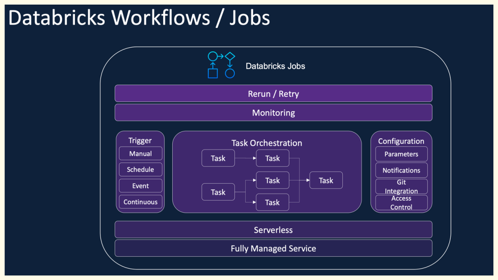

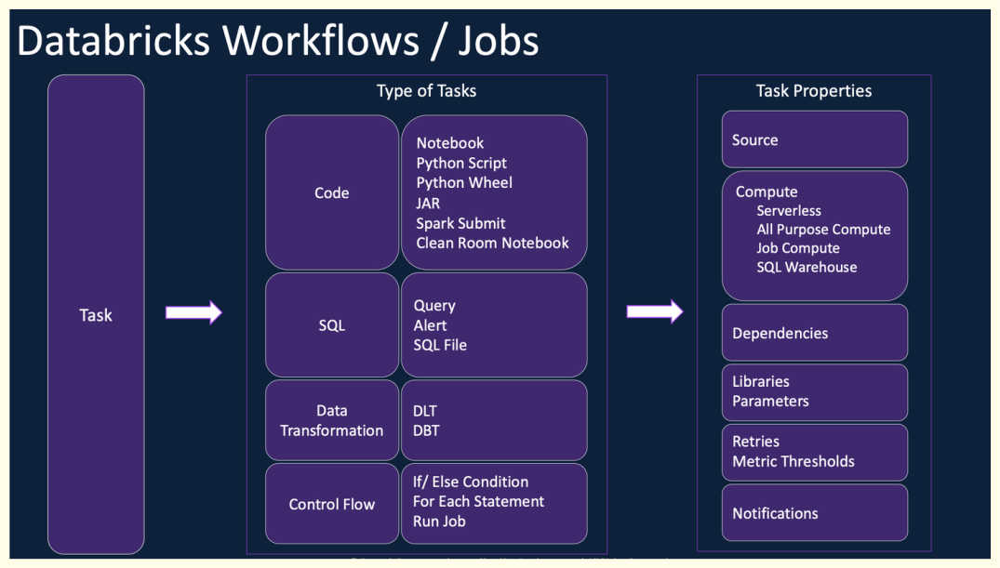


## **Delta Live Tables**

Delta Live Tables is a declarative ETL framework for building reliable, maintainable, and testable data processing pipelines.

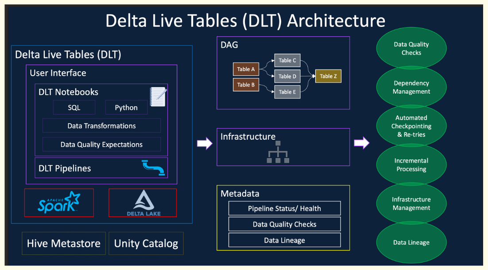

You define the transformations to perform on your data and Delta Live. Tables manages task orchestration, cluster management, monitoring,data quality, and error handling.

It handles both streaming and batch workloads with minimal manual intervention.

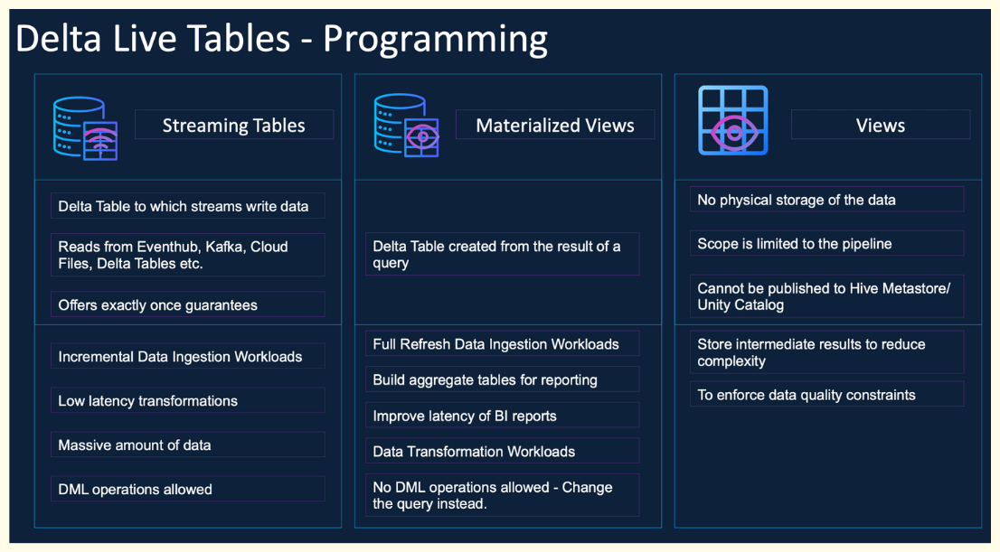

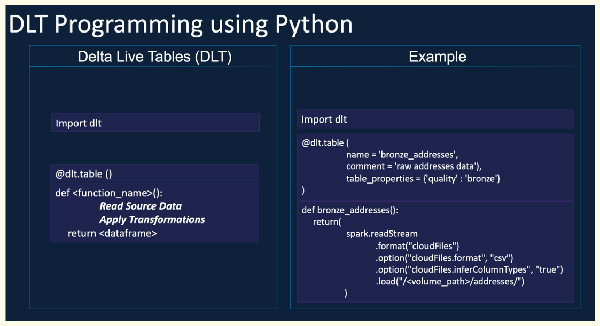

>--- **Benefits**

- Automatic orchestration
- Handle checkpoints, retires, and optimization
- Easy to implement CDC, SCD Type 2, and data quality control

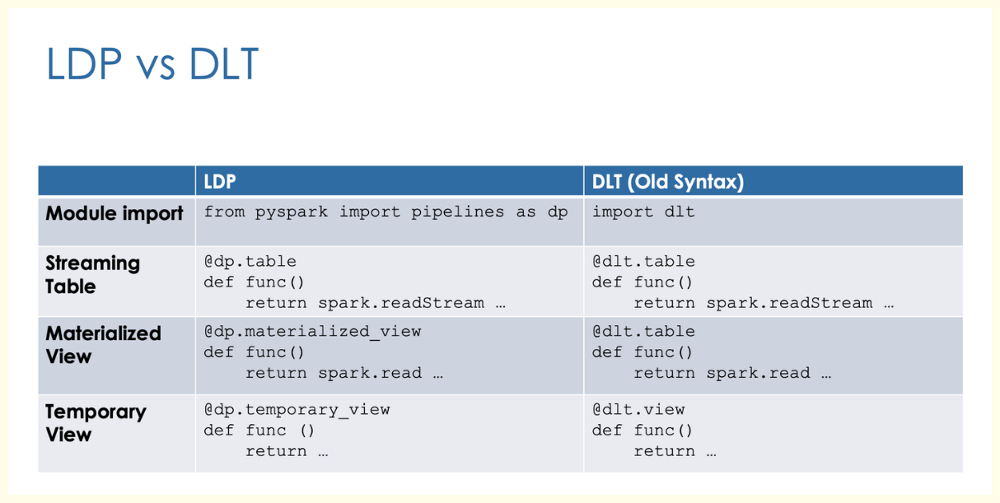

By default, records violating constraints will be kept.

| **Action**         | **SQL Syntax**                        | **Python Syntax**   | **Result**                                                                                                                                                 |
| ------------------ | ------------------------------------- | ------------------- | ---------------------------------------------------------------------------------------------------------------------------------------------------------- |
| **warn (default)** | `EXPECT`                              | `dp.expect`         | Invalid records are written to the target.                                                                                                                 |
| **drop**           | `EXPECT ... ON VIOLATION DROP ROW`    | `dp.expect_or_drop` | Invalid records are dropped before being written. The number of dropped records is logged with dataset metrics.                                            |
| **fail**           | `EXPECT ... ON VIOLATION FAIL UPDATE` | `dp.expect_or_fail` | Invalid records cause the update to fail. Manual intervention is required before reprocessing. This only fails the specific flow, not the entire pipeline. |


| Object Type        | Type  | Key Characteristics                                                                                                | Use Cases                                                                                  |
| ---------------------- | --------- | ---------------------------------------------------------------------------------------------------------------------- | ---------------------------------------------------------------------------------------------- |
| Streaming Tables   | Permanent | • Supports incremental refresh <br> • Handles append-only streaming data <br> • Uses `spark.readStream` or `STREAM()`  | • Real-time / near real-time data ingestion <br> • Kafka, event streams, log pipelines         |
| Temporary Views    | Temporary | • Exists only during session/job <br> • Stores intermediate processed data                                             | • Data transformations <br> • Data quality checks <br> • Breaking complex pipelines into steps |
| Materialized Views | Permanent | • Supports full or incremental refresh (Serverless only) <br> • Uses batch (`spark.read`) <br> • Not for low-latency | • Precomputing BI queries <br> • Batch ingestion <br> • Reporting and analytics workloads      |

Here’s a clean, structured version of your content:

>--- **Triggered vs Continuous Pipelines**

| **Key Question**                   | **Triggered**                                            | **Continuous**                                                           |
| ---------------------------------- | -------------------------------------------------------- | ------------------------------------------------------------------------ |
| **When does the update stop?**     | Automatically stops once processing is complete.         | Runs continuously until manually stopped.                                |
| **What data is processed?**        | Data available at the time the update starts.            | All incoming data as it arrives at configured sources.                   |
| **Best for data freshness needs?** | Suitable for updates every 10 minutes, hourly, or daily. | Suitable for near real-time updates (every 10 seconds to a few minutes). |

>--- **Key Considerations**

* **Triggered pipelines**

  * More cost-efficient since clusters run only when needed
  * May introduce latency, as new data is processed only when triggered

* **Continuous pipelines**

  * Requires an always-running cluster (higher cost)
  * Provides lower latency and near real-time data processing

---

If you want, I can turn all your notes into a single polished cheat sheet or a one-page PDF-style summary.


## **Delta Sharing**

Delta Sharing is an open data sharing protocol that enables secure sharing of data across business units, customers, suppliers and partners.

- Native integration with Databricks Platform allows sharing of Notebooks, Dashboards, AI Models, Volumes etc.
- Available as Fully managed inside the Databricks platform in workspaces enabled with Unity Catalog.
- Native integration with Unity Catalog for Governance and Security


>--- **Sharing protocol**

- D2D: The Databricks-to-Databricks sharing protocol
 
 Share data between Databricks clients
 
 Collection of tables, views, volumes, and notebooks
 
 Leverages built-in authentication with no token exchange

- D2O: The Databricks open sharing protocol

 Share data with users on any computing platform

 Share tables only

 Requires authentication via bearer tokens or OpenID Connect (OIDC) Federation

>--- **Databricks-to-Databricks Delta Sharing with History**

- Enabling History Sharing

To allow recipients to use time travel queries, change data feed (CDF), and streaming reads on a shared table, enable history sharing:

```sql
ALTER SHARE <share_name>
ADD TABLE <table_name> WITH HISTORY;
```

What `WITH HISTORY` Enables

| Feature                | Description                                                        |
| ---------------------- | ------------------------------------------------------------------ |
| Time Travel Queries    | Recipients can query older versions of the shared Delta table      |
| Change Data Feed (CDF) | Recipients can read inserted, updated, and deleted rows over time  |
| Streaming Reads        | Recipients can consume changes incrementally from the shared table |

When using `WITH HISTORY`, Databricks improves performance by giving recipients temporary cloud storage credentials scoped only to the root directory of the shared table.

This provides performance close to directly reading the source table.

However, this optimization does not apply to partitioned tables 

>--- **Delta Sharing and Data Replication**

Delta Sharing does not copy or replicate the data.

| Scenario                                           | Egress Cost                      |
| -------------------------------------------------- | -------------------------------- |
| Same cloud region                                  | No data egress cost              |
| Different cloud region or different cloud provider | Cloud vendor charges egress fees |

To reduce cross-region or cross-cloud costs, common approaches are:

 Clone the shared data into the recipient’s local region
 Share data through Cloudflare R2

>--- **Current Limitations**

| Limitation           | Description                                                            |
| -------------------- | ---------------------------------------------------------------------- |
| Read-Only Access     | Recipients can only read shared data; they cannot modify it            |
| Format Restriction   | Only Delta tables can be shared                                        |
| No Non-Delta Support | Formats like Parquet, CSV, JSON, or Iceberg are not supported directly |

## **Lakehouse Federation**

Lakehouse Federation is a capability in Databricks that allows you to access and govern data stored outside of the Lakehouse without physically moving or copying it into the Lakehouse.

- Maintain live access to external systems.
- Ad hoc reporting or proof-of-concept access to operational data
stored in external databases.
- Complex queries don’t benefit from the power of Databricks

| Feature            | Query Federation                                                             | Catalog Federation                                              |
| ---------------------- | -------------------------------------------------------------------------------- | ------------------------------------------------------------------- |
| Connection Type    | Direct JDBC connection to external databases (e.g., MySQL, SQL Server, Redshift) | Connects to external catalogs (AWS Glue, Hive Metastore, Snowflake) |
| Query Execution    | Query executed on the external database                                          | Query executed on Databricks compute                                |
| Performance & Cost | Depends on the source system                                                     | More optimized and cost-effective                                   |
| Join Capability    | Can join with Lakehouse data                                                     | Can join with Lakehouse data                                        |
| Best Use Case      | Ad-hoc queries, Proof of Concept (PoC)                                           | Migration, hybrid architecture, centralized governance              |


>--- **Implementation**


- Query Federation

| Step | Description                                        |
| -------- | ------------------------------------------------------ |
| 1        | Enable Unity Catalog                                   |
| 2        | Create connection (JDBC + credentials)                 |
| 3        | Create foreign catalog                                 |
| 4        | Grant privileges                                       |
| 5        | Run queries → Executed on external database (pushdown) |


- Catalog Federation

| Step | Description                                                        |
| -------- | ---------------------------------------------------------------------- |
| 1        | Enable Unity Catalog                                                   |
| 2        | Create connection to external catalog (e.g., AWS Glue, Hive Metastore) |
| 3        | Create storage credential + external location                          |
| 4        | Create foreign catalog                                                 |
| 5        | Grant privileges                                                       |
| 6        | Run queries → Executed on Databricks (reads from object storage)       |
