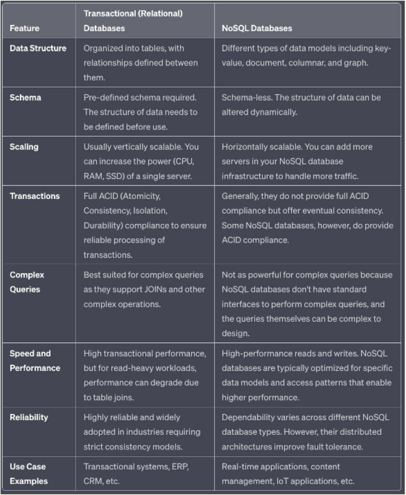
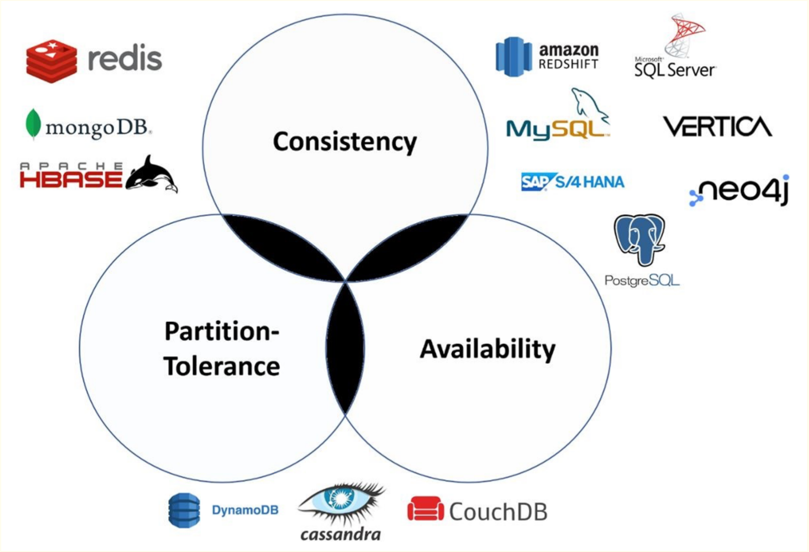
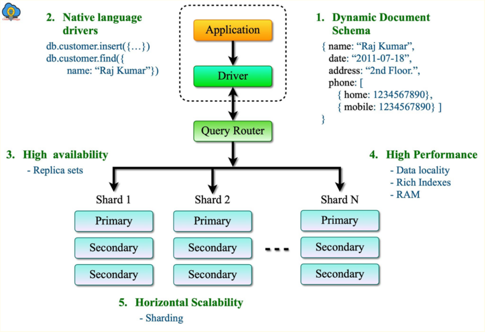

### What is NoSQL Database?
NoSQL databases, also known as "non-SQL" or "not only SQL", are databases that provide a mechanism to store and retrieve data modeled in ways other than the tabular format used in relational databases. They are typically used in large-scale or real-time web applications where the ability to scale quickly and handle large, diverse types of data is critical.

Here are some key characteristics and features of NoSQL databases:

1.	Schema-less: NoSQL databases do not require a fixed schema, which gives you the flexibility to store different types of data entities together.
2.	Scalability: NoSQL databases are designed to expand easily to handle more traffic. They are horizontally scalable, meaning you can add more servers to handle larger amounts of data and higher loads.
3.	Diverse Data Models: NoSQL databases support a variety of data models including key-value pairs, wide-column, graph, or document. This flexibility allows them to handle diverse types of data and complex data structures.
4.	Distributed Architecture: Many NoSQL databases are designed with a distributed architecture, which can improve fault tolerance and data availability.
5.	Performance: Without the need for data relationships and joins as in relational databases, NoSQL databases can offer high-performance reads and writes.

### Types of NoSQL Databases
NoSQL databases are categorized into four basic types based on the way they organize data. Let's go through each type and provide examples:

1. Document Databases: These store data in documents similar to JSON (JavaScript Object Notation) objects. Each document contains pairs of fields and values, and the values can typically be a variety of types including strings, numbers, booleans, arrays, or objects. Each document is unique and can contain different data from other documents in the collection. This structure makes document databases flexible and adaptable to various data models.
    Example: MongoDB, CouchDB.
2. Key-Value Databases: These are the simplest type of NoSQL databases. Every single item in the database is stored as 
an attribute name (or 'key') and its value. The main advantage of a key-value store is the ability to read and write operations using a simple key. This type of NoSQL database is typically used for caching and session management.
    Example: Redis, Amazon DynamoDB
3. Wide-Column Stores: These databases store data in tables, rows, and dynamic columns. Wide-column stores offer high performance and a highly scalable architecture. They're ideal for analyzing large datasets and are capable of storing vast amounts of data (Big Data).
    Example: Apache Cassandra, Google BigTable.
4. Graph Databases: These are used to store data whose relations are best represented as a graph. Each node of the graph represents an entity, and the relationship between nodes is stored directly, which allows the data to be retrieved in one operation. They're ideal for storing data with complex relationships, like social networks or a network of IoT devices.
    Example: Neo4j, Amazon Neptune

### Difference between Transactional & NoSQL Database

### NoSQL Databases are Good fit for Analytical Queries?
While NoSQL databases can handle certain analytical tasks, their primary purpose is not for heavy analytical queries. Traditional relational databases and data warehousing solutions, such as Hive, Redshift, Snowflake or BigQuery, are often better suited for complex analytical queries due to their ability to handle operations like joins and aggregations more efficiently

### NoSQL Databases in BigData Ecosystem
The strength of NoSQL databases lies in their flexibility, scalability, and speed for certain types of workloads, making them ideal for specific use-cases in the Big Data ecosystem:

1.	Handling Large Volumes of Data at Speed: NoSQL databases are designed to scale horizontally across many servers, which enables them to handle large volumes of data at high speed. This is particularly useful for applications that need real-time read/write operations on Big Data.
2.	Variety of Data Formats: NoSQL databases can handle a wide variety of data types (structured, semi-structured, unstructured), making them ideal for Big Data scenarios where data formats are diverse and evolving.
3.	Fault Tolerance and Geographic Distribution: NoSQL databases have a distributed architecture that provides high availability and fault tolerance, critical for applications operating on Big Data.
4.	Real-time Applications: Many Big Data applications require real-time or near-real-time functionality. NoSQL databases, with their high-speed read/write capabilities and ability to handle high volumes of data, are often used for real-time analytics, IoT data, and other similar scenarios.
That said, the choice between SQL, NoSQL, or other database technologies should be based on the specific needs of the use-case at hand.

### CAP Theorem
The CAP theorem is a concept that a distributed computing system is unable to simultaneously provide all three of the following guarantees:

1.	Consistency (C): Every read from the system receives the most recent write or an error. This implies that all nodes see the same data at the same time. It's the idea that you're always reading fresh data.
2.	Availability (A): Every request receives a (non-error) response, without the guarantee that it contains the most recent write. It's the idea that you can always read or write data, even if it's not the most current data.
3.	Partition Tolerance (P): The system continues to operate despite an arbitrary number of network or message failures (dropped, delayed, scrambled messages). It's the idea that the system continues to function even when network failures occur between nodes.
Now, the key aspect of the CAP theorem, proposed by computer scientist Eric Brewer, is that a distributed system can satisfy any two of these three guarantees at the same time, but not all three. Hence the term "CAP" - Consistency, Availability, and Partition tolerance.

Here's how the three dichotomies look like:

1. CA (Consistent and Available) systems prioritize data consistency and system availability but cannot tolerate network partitions. In such a system, if there is a partition between nodes, the system won't work as it doesn't support partition tolerance.
2. CP (Consistent and Partition-tolerant) systems prioritize data consistency and partition tolerance. If a network partition occurs, the system sacrifices availability to ensure data consistency across all nodes.
3. AP (Available and Partition-tolerant) systems prioritize system availability and partition tolerance. If a network partition occurs, all nodes may not immediately reflect the same data, but the system remains available.
Remember, real-world systems must tolerate network partitions (P), so the practical choice is between consistency (C) and availability (A) when partitions occur.

1. NoSQL Database: MongoDB is a NoSQL database, meaning it does not use traditional table-based relational database structures. It's designed for large scale data storage and for handling diverse data types.
2. Document-Oriented: It stores data in JSON-like documents (BSON format), which allows for varied, dynamic schemas. This is in contrast to SQL databases which use a fixed table schema.
3. Schema-less: MongoDB is schema-less, meaning that the documents in the same collection (equivalent to tables in SQL) do not need to have the same set of fields or structure, and the common field in different documents can hold different types of data.
4. Scalability: It offers high scalability through sharding, which distributes data across multiple machines.
5. Replication: MongoDB provides high availability with replica sets. A replica set consists of two or more copies of the data. Each replica set member may act in the role of primary or secondary replica at any time. The primary replica performs all write operations, while secondary replicas maintain a copy of the data of the primary using built-in replication.
6. Querying: Supports a rich set of querying capabilities, including document-based queries, range queries, regular expression searches, and more.
7. Indexing: Any field in a MongoDB document can be indexed, which improves the performance of search operations.

### MongoDB Architecture

1. Document Model:
BSON Format: MongoDB stores data in BSON (Binary JSON) documents, which are JSON-like structures. This format supports a rich variety and complexity of data types. Unlike relational databases, MongoDB does not require a predefined schema. The structure of documents can change over time.

2. Collections:
Similar to Tables: Collections in MongoDB are analogous to tables in relational databases. They hold sets of documents.
Schema-less: Each document in a collection can have a completely different structure.

3. Database:
Multiple Collections: A MongoDB instance can host multiple databases, each containing their own collections.
 
4. Sharding:
a shard typically refers to a group of multiple nodes (machines), especially in production environments. 
Each shard is often a replica set, which is a group of mongod instances that hold the same data set. In this setup, each shard consists of multiple machines - one primary and multiple secondaries.

    Shard Key: The distribution of data across shards is determined by a shard key. MongoDB partitions data in the collection based on this 
    key, and different partitions (or chunks of data) are stored on different shards.

    Primary Node: Within each shard (replica set), there is one primary node that handles all write operations. All data changes are first written to the primary.

    Secondary Nodes: The secondary nodes replicate data from the primary node, providing redundancy and increasing data availability. They can also serve read operations to distribute the read load.

5. Query Router
Role in Sharded Clusters:The Query Router is typically a mongos instance in MongoDB. It acts as an intermediary between client applications and the MongoDB sharded cluster.

    Query Distribution: The Query Router receives queries from client applications and determines the appropriate shard(s) that hold the relevant data. It routes the query to the correct shard(s) based on the shard key and the cluster’s current configuration.

    Aggregation of Results: After receiving responses from the shards, the Query Router aggregates these results and returns them to the client application. This process is transparent to the client, which interacts with the Query Router as if it were a single MongoDB server.

    Load Balancing: Query Routers can help distribute read and write loads across the shards, enhancing the overall performance of the database system.In larger deployments, multiple Query Routers can be used to balance the load and provide redundancy.

    Shard Management: The Query Router communicates with the cluster’s config servers to keep track of the metadata about the cluster's current state, including the distribution of data across shards.

    Simplifies Client Interaction: By abstracting the complexity of the sharded cluster, Query Routers simplify how clients interact with the database. Clients do not need to know the details of data distribution across shards.

    Write Operations: For write operations, the Query Router forwards the request to the primary replica set member of the appropriate shard.

    Caching: Query Routers cache the cluster’s metadata to quickly route queries without needing to frequently access config servers.

### MongoDB Indexes
Indexing in MongoDB is a critical feature that improves the performance of database operations, particularly in querying and sorting data. 

Purpose: Indexes in MongoDB are used to efficiently fetch data from a database. Without indexes, MongoDB must perform a full scan of a collection to select those documents that match the query statement.
    Default Index: Every MongoDB collection has an automatic index created on the _id field. The _id index is the primary key and ensures the uniqueness of each document in the collection.
    Index Types: MongoDB supports various types of indexes, catering to different types of data and queries.

Types of Indexes

1. Single Field Index: Indexes a single field of a document in either ascending or descending order. Besides the default _id index, you can create custom single field indexes.
2. Compound Index: Indexes multiple fields within a document. The order of fields listed in a compound index is significant. It determines the sort order and query capability of the index.
3. Multikey Index: Created automatically for fields that hold an array. If you index a field that contains an array, MongoDB creates separate index entries for each element of the array.
4. Text Index: Used for searching text strings. A text index stores the content of a field tokenized as words, optimized for text search operations.
5. Hashed Index: Stores the hash of the value of a field. These are primarily used in sharding scenarios to evenly distribute data across shards.
6. Partial Index: Indexes only the documents in a collection that meet a specified filter expression. This can be more efficient and consume less space than indexing all documents.
7. TTL (Time-To-Live) Index: Automatically deletes documents from a collection after a certain amount of time. This is useful for data that needs to expire, like sessions or logs.

### Use cases of MongoDB

1. Content Management Systems:
	Flexible schema accommodates various content types and changing data structures.
	Efficiently stores and retrieves diverse and complex data sets.

2. Mobile Apps:
	Scales easily with user growth.
	Offers real-time data synchronization and integration capabilities.

3. Internet of Things (IoT):
	Handles high volumes of time-series data from sensors and devices. Supports geospatial queries and real-time analytics.

4. E-commerce Applications:
	Manages diverse and evolving product catalogs.
	Offers personalized customer experiences through robust data handling.

5. Gaming Industry:
	Provides high performance for real-time analytics.
	Scales dynamically to handle fluctuating user loads.

6. Real-Time Analytics:
	Facilitates real-time data processing and aggregation. Offers quick insights from live data.

7. Catalogs and Inventory Management:
	Easily manages complex and varied product data.
	Supports fast queries for efficient inventory tracking.

8. Log Data Storage and Analysis:
	Stores large volumes of log data for analysis.
	Offers time-to-live (TTL) indexes for expiring old logs.

9. Document and Asset Management:
	Ideal for storing, retrieving, and managing document-based information. Supports rich document structures and metadata.

10. Social Networks:
	Manages dynamic and large-scale user-generated data.
	Handles complex friend networks and social graph data efficiently.

