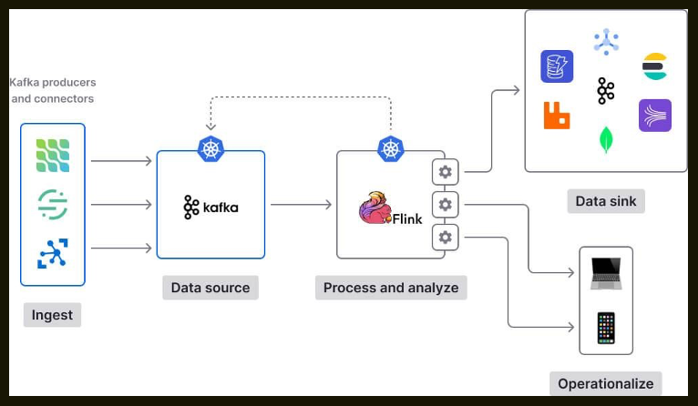
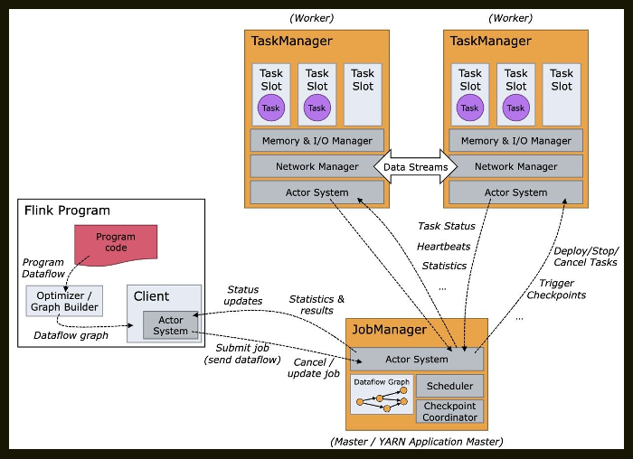
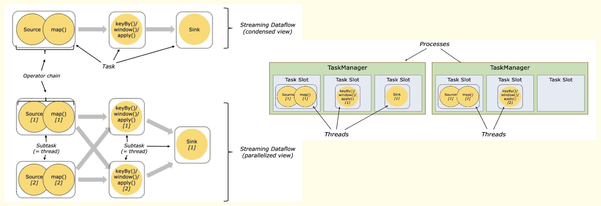
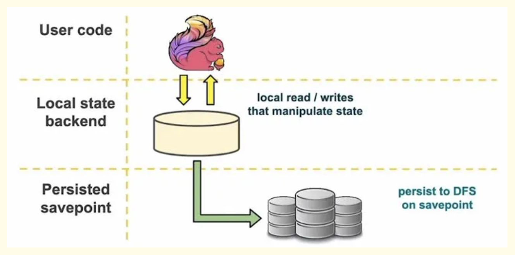

## **Overview of Stream Processing**

Stream processing is a paradigm for processing data as a continuous flow, rather than in batches. This approach is ideal for
applications that require real-time insights and low latency. Unlike traditional batch processing, which involves collecting data into
batches before processing, stream processing handles data as it arrives, offering immediate results.

>-- **Key characteristics of stream processing**

- Continuous data flow: Data is processed as it arrives, without the need for batching.
- Low latency: Results are generated quickly, often within milliseconds.
- High throughput: Can handle large volumes of data efficiently.
- Scalability: Can handle increasing data volumes by adding more resources.

## **Flink**

Apache Flink is an open-source platform for distributed stream processing. It’s designed to execute applications in a distributed
manner, providing low latency and high throughput. Flink can process both bounded and unbounded data streams, making it
versatile for various applications.



>--- **Key Features of Apache Flink**

- Event-Time Processing : Supports out-of-order data with watermarks for accurate time-based operations.
- Stateful Stream Processing:
 Provides state management for advanced use cases like fraud detection or sessionization.
 Offers exactly-once semantics for state consistency.
- Fault Tolerance : Uses checkpointing and distributed snapshots for automatic recovery.
- Flexible Deployment:
 Supports on-premise, cloud, and Kubernetes environments.
 Integrates with YARN, Kubernetes, Mesos, or standalone clusters.
- API Richness:
 High-level APIs (DataStream, Table API, SQL).
 Supports multiple languages: Java, Scala, Python.
- Seamless Integration : Works well with Apache Kafka, HDFS, Cassandra, Elasticsearch, and other modern tools.

## **FlinkAPIs**

Flink offers different levels of APIs for developing streaming/batch applications.

>--- **DataStream API (Core API)** 

The DataStream API is the core API for working with streams. It’s used to define transformations on streams, offering flexibility without going into low-level details. Provides access to stream transformations like filter, map, flatMap, etc.

```python
from pyflink.datastream import StreamExecutionEnvironment
from pyflink.datastream.connectors.kafka import FlinkKafkaConsumer, FlinkKafkaProducer from pyflink.datastream.formats.json import JsonRowDeserializationSchema, JsonRowSerializationSchema
from pyflink.common import Types
def datastream_api_with_kafka():
# Initialize the Flink environment
env = StreamExecutionEnvironment.get_execution_environment() env.set_parallelism(1)
# Kafka Source
source_type_info = Types.ROW([Types.INT(), Types.STRING(), Types.DOUBLE()]) deserialization_schema = JsonRowDeserializationSchema.builder() \
.type_info(source_type_info) \ .build()
kafka_consumer = FlinkKafkaConsumer( topics="source_topic", deserialization_schema=deserialization_schema, properties={
"bootstrap.servers": "localhost:9092",
"group.id": "flink-group" }
)
kafka_consumer.set_start_from_earliest()
# Kafka Sink
sink_type_info = Types.ROW([Types.INT(), Types.STRING(), Types.DOUBLE()]) serialization_schema = JsonRowSerializationSchema.builder() \
.with_type_info(sink_type_info) \ .build()
kafka_producer = FlinkKafkaProducer(
topic="sink_topic", serialization_schema=serialization_schema, producer_config={"bootstrap.servers": "localhost:9092"}
)
# Data Pipeline
input_stream = env.add_source(kafka_consumer)
# Transform the data: filter records with `total_price > 100` and capitalize the `order_status` processed_stream = input_stream \
.filter(lambda row: row[2] > 100) \
.map(lambda row: (row[0], row[1].upper(), row[2] * 1.2),
output_type=sink_type_info)
# Sink the processed data back to Kafka processed_stream.add_sink(kafka_producer)
# Execute the Flink job env.execute("DataStream API with Kafka")
if __name__ == "__main__": datastream_api_with_kafka()
```

>--- **Table API (Declarative DSL)**

The Table API provides a higher-level abstraction compared to the DataStream API. It’s a programmatic, SQL-like DSL for working with structured data in tables. Allows relational-style operations like select, filter, and group_by. Integrated with the SQL API for seamless querying.

```python
from pyflink.table import EnvironmentSettings, TableEnvironment from pyflink.table.expressions import col
env_settings = EnvironmentSettings.new_instance().in_streaming_mode().build() table_env = TableEnvironment.create(env_settings)
# Define Kafka source table table_env.execute_sql("""
CREATE TABLE source_table ( order_id INT,
order_status STRING, total_price DOUBLE
) WITH (
'connector' = 'kafka',
'topic' = 'source-topic', 'properties.bootstrap.servers' = 'localhost:9092', 'format' = 'json'
) """)
# Transformation
source_table = table_env.from_path("source_table") transformed_table = source_table.filter(col("total_price") > 100) \
.select(
col("order_id"), col("order_status").upper_case(), (col("total_price") * 1.2).alias("total_price")
) 
transformed_table.execute().print()
```

>--- **SQL API (High-Level Language)** 

The SQL API allows developers to define transformations using SQL queries. It’s perfect for use cases where business analysts or engineers prefer working with SQL. Ideal for static queries.

```python
from pyflink.table import EnvironmentSettings, TableEnvironment
env_settings = EnvironmentSettings.new_instance().in_streaming_mode().build() table_env = TableEnvironment.create(env_settings)
table_env.execute_sql(""" CREATE TABLE source_table (
order_id INT, order_status STRING, total_price DOUBLE
) WITH (
'connector' = 'kafka', 'topic' = 'source-topic', 'properties.bootstrap.servers' = 'localhost:9092', 'format' = 'json'
) """)
table_env.execute_sql(""" CREATE TABLE sink_table (
order_id INT, order_status STRING, total_price DOUBLE
) WITH (
'connector' = 'kafka', 'topic' = 'sink-topic', 'properties.bootstrap.servers' = 'localhost:9092', 'format' = 'json'
) """)
# SQL query to transform and insert data table_env.execute_sql("""
INSERT INTO sink_table
SELECT order_id, UPPER(order_status), total_price * 1.2 FROM source_table WHERE total_price > 100
""")
```

>--- **Programs and Dataflows in Apache Flink**

A Flink program typically consists of the following components:

- Source: Where the data comes from (e.g., Kafka, files, or custom sources)

- Transformations: Operations applied to the data

- Sink: Where the results are sent (e.g., databases, files, or message queues)
 When a Flink program is executed, it is translated into a dataflow graph. This graph consists of:

- Streams: Represent datasets in motion

- Operators: Represent transformations on streams

## **Flink Architecture**

Flink is a distributed system and requires effective allocation and management of compute resources in order to execute streaming applications. It integrates with all common cluster resource managers such as Hadoop YARN and Kubernetes, but can also be set up to run as a standalone cluster or even as a library.



The Flink runtime consists of two types of processes: a JobManager and one or more TaskManagers.
The Client is not part of the runtime and program execution, but is used to prepare and send a dataflow to the JobManager. After that, the client can disconnect (detached mode), or stay connected to receive progress reports (attached mode). The client runs either as part of the Java/Scala program that triggers the execution, or in the command line process ./bin/flink run ....


>--- **Job Manager**

The Job Manager is the central coordinator of a Flink cluster. Its primary responsibilities include:

- Scheduling tasks
- Coordinating checkpoints
- Coordinating failure recovery
- Managing the control flow of the job

The Job Manager consists of several components:

- ResourceManager: Responsible for resource de-/allocation and provisioning in a Flink cluster.
- Dispatcher: Provides a REST interface to submit applications and starts a new JobMaster for each submitted job.
- JobMaster: Coordinates the execution of a single job. Multiple JobMasters can run in a cluster, each responsible for a
different job.

>--- **Task Managers**

The Task Managers (also called workers) execute the tasks of a dataflow, and buffer and exchange the data streams.
There must always be at least one Task Manager. The smallest unit of resource scheduling in a Task Manager is a task slot. The number of task slots in a Task Manager indicates the number of concurrent processing tasks. Note that multiple operators may execute in a task slot.


>--- **Operators** 

An operator in Apache Flink is a basic building block that performs specific processing tasks, such as map, filter, join,
or sink. These are the core components of a Flink pipeline.
stream = env.from_source(kafka_source)
mapped_stream = stream.map(lambda x: x.upper()) filtered_stream = mapped_stream.filter(lambda x: "ERROR" in x) filtered_stream.sink_to(kafka_sink)

Operators here:

- Source: Reads from Kafka (from_source).
- Map: Converts data to uppercase (map).
- Filter: Filters only messages containing "ERROR" (filter). -  Sink: Writes back to Kafka (sink_to).

>--- **Tasks**

A task is the runtime representation of an operator. Each operator instance runs as a task on a Task Manager. If an operator has a parallelism of 4, there will be 4 tasks for that operator.

Key Points:

- A task is bound to a single parallel instance of an operator.
- The number of tasks is determined by the parallelism.

!!! Example
    If parallelism = 2, the map operator will have 2 tasks, and the same applies to the filter and sink.


>--- **Parallelism**

Parallelism determines how many instances (tasks) of an operator run concurrently.

Key Points:

-  Parallelism is set at the job, operator, or environment level.
-  Total number of tasks = parallelism × number of operators.

!!!Example
    -  If parallelism = 3 for all operators in a pipeline with 3 operators (source, map, sink):
    -  Total tasks = 3 * 3 = 9 .

>--- **Operator Chaining** 

Operator chaining is an optimization in Flink where multiple operators are combined into a single task to reduce network overhead and improve efficiency. Operators are chained if they share the same parallelism.
stream = env.from_source(kafka_source).map(lambda x: x.upper()).filter(lambda x: "ERROR" in x) stream.sink_to(kafka_sink)

Here, map and filter operators are chained into one task because:

-  They share the same parallelism.
-  They don’t require data shuffling between them.

If parallelism = 4:

-  There will be 4 tasks for the chained map and filter operators.
-  If not chained, there would be 4 tasks for the map and 4 tasks for the filter, leading to 8 total tasks.

>--- **Task Slots**

A task slot is the smallest unit of resource allocation (CPU, Memory, Network bandwidth) in a Task Manager. Each
task slot can host one or more tasks.

Key Points:

- The total number of slots in a cluster = number of Task Managers × slots per Task Manager.
- Multiple tasks can run in a single slot if operator chaining is enabled.



Total Tasks on a Cluster

Cluster Example:

- Assume:
 2 Task Managers.
 Each Task Manager has 4 slots.
 Total slots in the cluster =

- Pipeline:
 Source (parallelism = 2).
 Map (parallelism = 4).
 Sink (parallelism = 4).

- Tasks:
 Source: 2 tasks.
 2 * 4 = 8 .
 Map: 4 tasks.
 Sink: 4 tasks.
 Total tasks = 2 + 4 + 4 = 10 .

- Slot Usage:
 Each slot can handle multiple tasks due to operator chaining.

>--- **Task Manager and Slots** 

A Task Manager is a worker process that manages resources (CPU, memory) and executes tasks
assigned to it. Each Task Manager is divided into slots.

- Key Points:
 The number of tasks a Task Manager can execute depends on the number of slots it has.  Slots are shared among multiple tasks only when chaining is enabled.
 
 Example - If a Task Manager has 4 slots and the pipeline has 10 tasks:
 
 Tasks are distributed across slots in a round-robin fashion.
 Tasks may be chained to reduce the total number of active tasks.

## **State Management**

In Apache Flink, state refers to data that is maintained across processing events in streaming or batch jobs. State allows Flink to keep track of information required to:

• Aggregate values (e.g., sum, average).
• Process events in a specific order.
• Enable fault tolerance by saving snapshots of state.



State can be classified into:

- Keyed State: Maintains state for specific keys (e.g., order ID, user ID).
- Operator State: Shared across operator instances (e.g., Kafka offsets in a source operator).

## **State Backend** 

A state backend in Apache Flink is responsible for determining how and where the state of a Flink job is stored
and managed. The choice of a state backend has significant implications for performance, scalability, and fault tolerance.

>--- **HashMapStateBackend** 

The HashMapStateBackend stores state directly in the JVM heap memory of the TaskManager. It is a simple and lightweight backend best suited for small-scale use cases and testing.

- Key Features:

 In-Memory Storage: State is stored in the JVM’s heap memory, making access and updates fast.

 Checkpoint Storage: State snapshots are stored in an external distributed storage system, such as

 HDFS, S3, or any other compatible filesystem.

 Use Case: Best suited for applications where the state is relatively small (e.g., key-value stores for counters or aggregates) and for local development and testing.   Faster read/write operations due to in-memory storage.

- Advantages: Simpler to set up and configure.

- Limitations:

 Limited scalability because it relies on the TaskManager’s JVM heap size. Large states can cause OutOfMemoryErrors.

 Full checkpoints are created during fault tolerance, which may become costly for larger states.

>--- **How to configure HashMapStateBackend?**

=====> Configure in code
```python
from pyflink.common.state_backend 
import HashMapStateBackend 
env.set_state_backend(HashMapStateBackend()) # Configure HashMapStateBackend
```

=====> Configure in flink-conf.yaml

state.backend: hashmap 

state.checkpoints.dir: s3://my-checkpoints/ 

state.savepoints.dir: s3://my-savepoints/

>--- **RocksDBStateBackend** 

The RocksDBStateBackend stores state using RocksDB, a high-performance embedded key-value store that persists data to disk. Unlike the HashMapStateBackend, it is designed for handling large-scale applications and large states that exceed the JVM heap size.

- Key Features:

  Disk-Based Storage: State is stored on local disks, allowing the system to handle much larger states than the
available JVM memory.

  Incremental Checkpoints: Only changes (deltas) since the last checkpoint are stored, significantly reducing
the size of checkpoints for large states.

  Use Case: Ideal for production environments, high-volume streaming applications, and jobs requiring fault
tolerance for large stateful computations.

- Advantages:

  Scalability: Handles state sizes much larger than the TaskManager’s heap memory.

  Better fault tolerance with incremental checkpointing, which minimizes checkpoint size and improves recovery
time.

- Limitations:

  Disk I/O may make access and updates slower compared to in-memory backends.

  Requires proper configuration of RocksDB to optimize performance.

>--- **How to configure RocksDBStateBackend?**

=====> Configure in code

```python
from pyflink.common.state_backend 
import EmbeddedRocksDBStateBackend 
env.set_state_backend(EmbeddedRocksDBStateBackend()) # Configure RocksDBStateBackend
```

=====> Configure in flink-conf.yaml

state.backend: rocksdb 
state.backend.rocksdb.localdir: /mnt/rocksdb 
state.checkpoints.dir: s3://my-checkpoints/ 
state.savepoints.dir: s3://my-savepoints/

## **Checkpointing**

Checkpointing is a mechanism for fault tolerance in Apache Flink. It enables Flink to recover from failures and resume execution while ensuring data consistency. By periodically capturing the state of a streaming application, Flink can restart the job from the last checkpoint in case of failure, avoiding data loss or duplicate processing.

>--- **Why is Checkpointing Needed?**

- Fault Tolerance - Checkpointing ensures that applications can recover and resume processing after a failure, such as TaskManager crashes or cluster restarts.
- Exactly-Once Processing - Flink ensures exactly-once state consistency by restoring state and replaying records from the checkpointed state, even during recovery.
- Durability - By persisting the state to external storage (e.g., HDFS, S3), Flink guarantees that the system can recover without relying on volatile memory.
- Recovery of Stateful Applications - Applications with state (e.g., aggregations, windows, keyed operators) require checkpointing to recover intermediate results and maintain correctness.

>-- **How Does Checkpointing Work?**

- Triggering - A checkpoint is triggered periodically (based on the configured interval) by the JobManager.
- Operator Snapshot - Each operator in the job takes a snapshot of its state and sends it to a checkpoint coordinator.
- Persistence - The checkpoint data is written to a distributed storage system (e.g., HDFS, S3) for durability.
- Acknowledgment - After all tasks complete their snapshots, the checkpoint is acknowledged as successful.
- Recovery - Upon failure, Flink retrieves the latest checkpoint to restore the state and reprocess data from the saved
offsets.

>--- **Types of Checkpointing**

- Full Checkpointing:
 
 Captures the entire state of the application during every checkpoint.
 Used in HashMapStateBackend.
 Suitable for smaller states but can be expensive for large states.

- Incremental Checkpointing:

 Only the delta (changes) since the last checkpoint is stored.
 Used in RocksDBStateBackend.
 More efficient for large states because it minimizes the size of checkpoints.

Checkpointing mode defines the level of consistency Flink ensures during checkpointing. 

>--- **Flink offers two checkpointing modes:**

- EXACTLY_ONCE (Default)

    Guarantees that each record is processed exactly once, even in the case of failures.
  Flink ensures state consistency by replaying records starting from the last successful checkpoint during recovery.
  Ideal for scenarios requiring strict accuracy, such as financial or transaction processing systems.
  
    How It Works:
  Records that were in-flight during checkpointing are reprocessed after recovery to ensure all data is accounted for.
  Works well with stateful transformations and connectors supporting exactly-once semantics (e.g., Kafka transactional writes).

    Use Case:
  Financial systems, fraud detection, and other critical applications requiring precision.

- AT_LEAST_ONCE

    Guarantees that every record is processed at least once, but there might be duplicates during failure recovery.
    Faster and less resource-intensive compared to EXACTLY_ONCE because it skips some additional guarantees like buffering in-flight records.
  
    How It Works:
    Records in the buffer or in transit might be replayed after recovery, leading to potential duplicates.
    Suitable for use cases where occasional duplicates can be tolerated and eliminated downstream.
  
    Use Case:
  Log aggregation, monitoring, or analytics where duplicates are acceptable or post-processing is available to handle them.


>--- **How to configure checkpointing in the code?**

```python
from pyflink.datastream import StreamExecutionEnvironment
from pyflink.datastream.checkpoint_config import CheckpointingMode
# Create Stream Execution Environment
env = StreamExecutionEnvironment.get_execution_environment()
# Enable Checkpointing
env.enable_checkpointing(10000) # Checkpoint every 10 seconds
# Set Checkpointing Mode env.get_checkpoint_config().set_checkpointing_mode(CheckpointingMode.EXACTLY_ONCE)
# Configure Checkpoint Timeout env.get_checkpoint_config().set_checkpoint_timeout(60000) # 1 minute
# Configure Minimum Pause Between Checkpoints env.get_checkpoint_config().set_min_pause_between_checkpoints(5000) # 5 seconds
# Externalized Checkpoint Storage (e.g., S3 or HDFS) env.get_checkpoint_config().set_checkpoint_storage("hdfs://namenode:8020/flink-checkpoints")
```

>--- **How to configure checkpointing in the config?**

```python
state.backend: rocksdb # State backend to use
state.backend.incremental: true # Enable incremental checkpointing (for RocksDB) state.checkpoints.dir: s3://my-bucket/checkpoints/ # Storage location for checkpoints
execution.checkpointing.interval: 10s
execution.checkpointing.timeout: 60s
execution.checkpointing.min-pause: 5s
execution.checkpointing.tolerable-failed-checkpoints: 3 # Tolerate 3 consecutive checkpoint failures
```

## **Savepoint**

A savepoint is a consistent snapshot of the state of a Flink application that you can use to stop, upgrade, or migrate your job. Unlike checkpoints, savepoints are manually triggered and designed for operational use cases, such as job upgrades or state migration between different Flink versions.

>--- **Savepoints differ from checkpoints in the following ways:**

 Manually Triggered: Savepoints are explicitly triggered by the user.
 
 Durable: Savepoints are always stored in a persistent and user-defined location.
 
 Version Compatibility: Savepoints allow you to upgrade your Flink job (e.g., deploy new versions of your application or
update Flink’s version). 

>--- **Why is Savepointing Needed?**

 Job Upgrades: Upgrade your Flink application while retaining the current state.
 
 Migration: Move the application to a different cluster or Flink version.
 
 Graceful Stopping: Stop a job while ensuring no state is lost.
 
 Debugging: Analyze the state of the job for debugging purposes.

>--- **Savepoint Lifecycle**

 Trigger a Savepoint: Manually create a savepoint to snapshot the state of the job.
 
 Stop the Job (if needed): Optionally stop the job after taking the savepoint.
 
 Resume from Savepoint: Start the application from the savepoint when needed.

>--- **Savepointing in Flink**

- Stop and Savepoint - To stop the job and take a savepoint in a single step: flink stop --savepointPath file:///flink/savepoints <jobId>

- Resume Job from Savepoint - Use the run command to restart the job from the savepoint: flink run -s file:///flink/savepoints/savepoint-12345 ./my-job.jar

## **Backpressure**

>--- **What is Backpressure in Flink?**

Backpressure occurs in Apache Flink when downstream operators cannot process data as quickly as upstream operators produce it. This creates a bottleneck in the data flow, as unprocessed data builds up in internal buffers, which can eventually lead to resource exhaustion.

>--- **How Backpressure Occurs ?**

 High Data Volume - If a source operator ingests data at a rate higher than downstream operators can process, backpressure occurs.

 Inefficient Processing - A slow transformation or join operator may delay processing.

 Limited Resources - Insufficient CPU, memory, or I/O bandwidth for downstream tasks.

 Output Bottleneck - If a sink operator writes to a slow storage system or network, it may throttle the data flow.

>--- **How Backpressure Works in Flink?**

 Blocking Behavior - Flink’s backpressure mechanism blocks upstream operators to prevent data overflow in buffers.

 Automatic Throttling - The upstream operator reduces its production rate to match the downstream operator’s consumption rate.

 Metrics Monitoring - Flink provides metrics like “buffer pool usage” and “task latency” to monitor backpressure.

Checkpointing in Flink ensures fault tolerance by periodically saving the state of operators.

>--- **backpressure significantly affects checkpointing:**

 Delayed State Snapshot - Checkpoints capture the state of all tasks in the pipeline. If one task is experiencing backpressure, it slows down the entire checkpointing process.
 
 Increased Checkpoint Duration - Backpressure increases the time required to create consistent snapshots, as upstream tasks are blocked.
 
 Checkpoint Failures - If a task cannot acknowledge a checkpoint within the specified timeout due to backpressure, the checkpoint fails.
 
 Out-of-Memory Risks - Backpressure can lead to buffer overflows, which consume memory. If memory is exhausted during checkpointing, it can cause application failures.

>--- **How to Tackle Backpressure in Apache Flink?**

 Optimize Parallelism - Increase the parallelism of operators to distribute the workload more effectively across available task slots.

 Rate Limiting at Source - Throttle the data ingestion rate at the source to prevent overwhelming downstream operators.

 Increase Buffer Size - Adjust the network buffer size to allow operators to handle temporary spikes in data volume.

 Configure buffer memory in flink-conf.yaml:

    taskmanager.network.memory.fraction: 0.2 # Allocate 20% of memory to network buffers 
    taskmanager.network.memory.min: 128mb
    taskmanager.network.memory.max: 2gb

 Monitor and Adjust Resources Dynamically - Use Flink’s metrics to identify bottlenecks and dynamically adjust resources (e.g., CPU, memory, task slots). Monitor the “Backpressure Ratio” in the Flink Web UI and scale resources accordingly.

 Optimize Checkpointing - Minimize the impact of checkpointing on performance by configuring it effectively. Increase checkpoint intervals and timeouts:

## **FLINK_IQ**

!!!- info "Briefly introduce Flink?"
    Apache Flink is an open-source stream processing and batch processing framework designed for big data processing and analytics. It provides fault tolerance, high throughput, and low-latency processing of large-scale data streams

!!!- info "What are the differences between Flink and Spark Streaming?"
    1. The design ideas are different. Flink considers batch to be a kind of streaming, and spark considers a streaming batch.
    2. The architecture model is different. Spark has Driver, Master, Worker, and Executor. Flink has the concepts of TaskManager, JobManager, Task, SubTask, and Slot
    3. Flink's streaming data processing is much stronger than spark, for example, time supports three kinds of time
    There are more windows than spark
    4. In the case of out-of-order data, Flink is stronger than spark, because flink has watermark. In fact, the calculation method when running is the time of the last data-if watermaker is greater than the end of the window, execute
    5. For fault tolerance, flink is also better than spark. For example, flink supports two-stage transactions to ensure that data after program crashes will not be re-consumed. Spark also has checkpoints, but it only ensures that data is not lost, and it cannot be repeated. consumption.

!!!- info "What are the roles of Flink cluster? What are the functions?"
    Flink programs mainly have three roles: TaskManager, JobManager, and Client when they are running.

    JobManager In the role of a manager in the cluster, it is the coordinator of the entire cluster. It is responsible for receiving the execution of Flink Job, coordinating checkpoints, recovering from failures, and managing Task Manager.

    TaskManager It is responsible for the resource information on the node where the manager is located, such as memory, disk, and network. It will report the resource to the JobManager when it is started.

    Client It is the client submitted by the Flink program. When a user submits a Flink program, a Client is first created. Then the program submitted by the user will be preprocessed and submitted to the cluster for processing.

!!!- info "What is TaskSlot?"
    In Flink's architecture, TaskManager is the working node that is actually used to execute our program. TaskManager is a JVM process. In fact, in order to achieve the concept of resource isolation and parallel execution, the concept of TaskSlot was proposed at this time, which is actually In order to control how many Tasks the TaskManager can receive, the TaskManager is controlled by taskslot, that is, if we have a source that specifies three parallelism, then he will use three slots, and the other one needs to be mainly parallel as an operator When the degree is the same, and there is no change in the degree of parallelism, or there is no shuffle, they will be together at this time. This is an optimized concept.

!!!- info "What are the commonly used operators in Flink?"
    Map operator

    Filter operator

    KeyBy operator

    Window window

!!!- info "What is the parallelism of Flink and What is the parallelism setting of Flink?"
    The parallelism of Flink is well understood. For example, kafkaSource, its parallelism is the number of partitions by default. The degree of parallelism is this operator, and how many taskslot are needed, we should know that is the advantage of parallel computing. Generally, the degree of parallelism is set according to the amount of data. It is best to keep the source and map operators without shuffle, because the pressure on the source and map operators is not very large, but when our data table is widened, It is better to set it larger.

!!!- info "What is the relationship between Flink's Slot and parallelism?"
    slot is a concept in TaskManager. Parallelism is a concept in the program, that is, the concept of execution level. In fact, slot specifies how many slots this TaskManager has and how much parallelism can be supported, but the parallelism developed by the program uses slots That is slot, that is, TaskManager is the provider and the program is the user

!!!- info "What if Flink encounters an abnormal restart of the program?"
    Flink has some restart strategies, and as long as the checkpoint is done, it can be done at least once. Of course, it may not be accurate once, but some components can be done. The restart strategy generally set is a fixed delay restart strategy. The restart does not delete the checkpoint. Generally, the number of restarts set by our company is 4 times. If it stops, we will send a nail warning and start from the checkpoint when it starts.

!!!- info "Flink's distributed cache"
    The distributed cache implemented by Flink is similar to Hadoop. The purpose is to read the file locally and put it in the taskmanager node to prevent the task from repeatedly pulling data and reduce performance.

!!!- info "Broadcast variables in Flink"
    We know that Flink is parallel, and the calculation process may not be performed in a Slot. Then there is a situation: when we need to access the same data. Then the broadcast variable in Flink is to solve this situation. We can understand the broadcast variable as a public shared variable. We can broadcast a dataset, and then different tasks can be obtained on the node. There will only be one copy of this data on each node.

!!!- info "Do you know what windows in Flink are?"
    Flink supports two ways to divide windows, according to time and count. session is also a kind of time

    Tumbing Count Window： Perform calculation when reaching a certain number, no folding

    Sliding Time Window： When a certain period of time is reached, roll over, there can be overlap, generally used to calculate the recent demand, such as nearly 5 minutes.

    Tubing time Window： When a certain period of time is reached, the slide is carried out, which can be thought of as the Nokia slide phone used before. This is actually a micro batch

    Sliding Count Window： Slide when it reaches a certain number

    Session Window: The window data has no fixed size, it is divided according to the parameters passed in by the user, and the window data does not overlap. It is similar to calculating the user's previous actions when the user logs out.

!!!- info "Flink's state storage?"
    Flink often needs to store intermediate states during calculations to avoid data loss and recover from abnormal states. Choosing a different state storage strategy will affect the state interaction between JobManager and Subtask, that is, JobManager will interact with State to store state.

    Flink provides three state storage:
    MemoryStateBackend

    FsSateBackend

    RocksDBStateBackend

!!!- info "What kind of time are there in Flink?"
    Event time: the time when the event actually occurred

    Intake time: time to enter flink

    Processing time: the time to enter the flink operator

!!!- info "What is Watermark in Flink?"
    Watermark is an operation used by Flink to deal with out-of-order time. In fact, in Flink, if we use event time and take kafka's source, then the window execution time at this time is the smallest among the partitions Partitions are used for triggering, and each partition must be triggered to perform calculations. Why is this? In fact, it is because the partitions of Kafka are disordered. Orderly in the zone. The execution time is the maximum time minus the watermark>window end time, and the calculation will be executed at this time.
    Watermarks are used in Apache Flink to track the progress of event time. They represent a threshold for event times and indicate that no events with timestamps earlier than the watermark should arrive any longer. They help define when window computations should be considered complete.

!!!- info "What is Unbounded streams in Apache Flink?"
    Any type of data is produced as a stream of events. Data can be processed as unbounded or bounded streams.
    Unbounded streams have a beginning but no end. They do not end and continue to provide data as it is produced. Unbounded streams should be processed continuously, i.e., events should be handled as soon as they are consumed. Since the input is unbounded and will not be complete at any point in time, it is not possible to wait for all of the data to arrive.
    Processing unbounded data sometimes requires that events are consuming in a specific order, such as the order in which events arrives, to be able to reason about result completeness.

!!!- info "What is Bounded streams in Apache Flink?"
    Bounded streams have a beginning and an end point. Bounded streams could be processed by consuming all data before doing any computations. Ordered ingestion is not needed to process bounded streams since a bounded data set could always be sorted. Processing of bounded streams is also called as batch processing.

!!!- info "What is Dataset API in Apache Flink?"
    The Apache Flink Dataset API is used to do batch operations on data over time. This API is available in Java, Scala, and Python. It may perform various transformations on datasets such as filtering, mapping, aggregating, joining, and grouping.

    DataSet API helps us in enabling the client to actualize activities like a guide, channel, gathering and so on.It is utilized for appropriated preparing, it is an uncommon instance of stream preparing where we have a limited information source.They are regular programs that implement transformation on data sets like filtering, mapping, etc.

    Data sets are created from sources like reading files, local collections, etc.All the results are returned through sinks, the execution can happen in a local JVM or on clusters of many machines.

    DataSet<Tuple2<String, Integer>> wordCounts = text
    .flatMap(new LineSplitter())
    .groupBy(0)
    .sum(1);

!!!- info "What is DataStream API in Apache Flink?"
    The Apache Flink DataStream API is used to handle data in a continuous stream. On the stream data, you can perform operations such as filtering, routing, windowing, and aggregation. On this data stream, there are different sources such as message queues, files, and socket streams, and the resulting data can be written to different sinks such as command line terminals. This API is supported by the Java and Scala programming languages.

    DataStream<Tuple2<String, Integer>> dataStream = env
    .socketTextStream("localhost", 9091)
    .flatMap(new Splitter())
    .keyBy(0)
    .timeWindow(Time.seconds(7))
    .sum(1);

!!!- info "What is Apache Flink Table API?"
    Table API is a relational API with an expression language similar to SQL. This API is capable of batch and stream processing. It is compatible with the Java and Scala Dataset and Datastream APIs. Tables can be generated from internal Datasets and Datastreams as well as from external data sources. You can use this relational API to perform operations such as join, select, aggregate, and filter. The semantics of the query are the same if the input is batch or stream.
    val tableEnvironment = TableEnvironment.getTableEnvironment(env)
    // register a Table
    tableEnvironment.registerTable("TestTable1", ...);
    // create a new Table from a Table API query
    val newTable2 = tableEnvironment.scan(TestTable1).select(...);

!!!- info "What is Apache Flink FlinkML?"
    FlinkML is the Flink Machine Learning (ML) library. It is a new initiative in the Flink community, with an expanding list of algorithms and contributors. FlinkML aims to include scalable ML algorithms, an easy-to-use API, and tools to help reduce glue code in end-to-end ML systems. Note: Flink Community has planned to delete/deprecate the legacy flink-libraries/flink-ml package in Flink1.9, and replace it with the new flink-ml interface proposed in FLIP39 and FLINK-12470.


!!!- info "Explain the Apache Flink Job Execution Architecture?"
    Program: It is a piece of code that is executed on the Flink Cluster.

    Client: It is in charge of taking code from the given programm and creating a job dataflow graph, which is then passed to JobManager. It also retrieves the Job data.

    JobManager: It is responsible for generating the execution graph after obtaining the Job Dataflow Graph from the Client. It assigns the job to TaskManagers in the cluster and monitors its execution.

    TaskManager:It is in charge of executing all of the tasks assigned to it by JobManager. Both TaskManagers execute the tasks in their respective slots in the specified parallelism. It is in charge of informing JobManager about the status of the tasks.

!!!- info "What are the features of Apache Flink?"
    One of the key features of Apache Flink is its ability to process data in real-time with low-latency and high throughput. It supports event time processing, which means it can handle out-of-order events and provide correct results based on event timestamps. Flink also provides extensive windowing operations for aggregating data within time intervals, such as tumbling windows, sliding windows, and session windows.

    Another important feature of Flink is its support for fault-tolerance. It achieves fault-tolerance through a mechanism called "exactly-once" processing, which guarantees that each event is processed exactly once, even in the presence of failures. This is crucial for applications where data correctness is paramount.

    Apache Flink can process all data in the form of streams at any point in time.
    Apache Flink does not give a burden on users' shoulders for tunning or managing the physical execution concepts.
    The memory management is done by the Apache Flink itself and not by the user.
    Apache Flink optimizer chooses the best plan to execute the user's program hence very little intervention is required in terms of tunning.
    Apache Flink can be deployed on various cluster frameworks.
    It is capable to support various types of the file system.
    Apache Flink can be integrated with Hadoop YARN in a very good way.


!!!- info "What are the Apache Flink domain-specific libraries?"
    The following is the list of Apache Flink domain-specific libraries.
    FlinkML: It is used for machine learning.
    Table: It is used to perform the relational operation.
    Gelly: It is used to perform the Graph operation.
    CEP: It is used for complex event processing.

!!!- info "What is the programing model of Apache Flink?"
    The Apache Flink Datastream and the Dataset work as a programming model of flink and its other layers of architecture. The Datastream programming model is useful in real-time stream processing whereas the Dataset programming model is useful in batch processing.


!!!- info "What are the use cases of Apache Flink?"
    Many real-world industries are using Apache Flink and their use cases are as mentioned below.

    Financial Services
    Financial industries are using Flink to perform fraud detection in real-time and send mobile notifications.

    Healthcare
    The hospitals are using Apache Flink to collect data from devices such as MRI, IVs for real-time issue detection and analysis.

    Ad Tech
    Ads companies are using Flink to find out the real-time customer preference.

    Oil Gas
    The Oil and Gas industries are using Flink for real-time monitoring of pumping and issue detection.

    Telecommunications
    The telecom companies are using Apache Flink to provide the best services to the users such as real-time view of billing and payment, the optimization of antenna per-user location, mobile offers, and so on.

!!!- info "What is bounded and unbounded data in Apache Flink?"
    Apache Flink processes data in the form of bounded and unbounded streams. The bounded data will have a start point and an endpoint and the computation starts once all data has arrived. It is also called batch processing. The unbounded data will have a start point but no endpoint because it is streaming of data. The processing of unbounded data is continous and doesn't wait for complete data. As soon the data is generated the processing will start.

!!!- info "How Apache Flink handles the fault-tolerance?"
    Apache Flink manages the fault-tolerance of stream applications by capturing the snapshot of the streaming dataflow state so in case of failure those snapshots will be used for recovery. For batch processing, Flink uses the program's sequence of transformations for recovery.

    To achieve fault tolerance, Apache Flink employs a combination of techniques such as data replication, checkpointing, and exactly-once processing semantics. The framework allows users to define fault-tolerant data streams, which are resilient to failures and can effectively recover from possible errors.

    1. Checkpointing: Apache Flink periodically captures the state of executing jobs by taking checkpoints. Checkpoints consist of the in-memory state of all operators and the metadata necessary for restoring the state, such as the offset of each stream source. Users can configure the frequency of checkpoints to strike a balance between reliability and performance

    2. State Backends: Apache Flink supports different state backends (e.g., in-memory, RocksDB) to persist checkpointed state. The chosen backend determines how and where the state is stored, allowing for fault tolerance and efficient recovery.

    3. Exactly-once Processing: Flink's checkpointing, along with its transactional processing capabilities, enables exactly-once processing semantics. It ensures that each record is processed exactly once, even in the presence of failures or system restarts. This guarantees consistency and correctness in data processing.

    4. Failure Handling: In case of failures, Flink automatically reverts the system to the latest successful checkpoint. It replays the data from that point onwards, resuming processing from a consistent state.


!!!- info "What is the responsibility of JobManager in Apache Flink Cluster?"
    The Job Manager is responsible for managing and coordinating with distributed processing of a program. It assigns the task to node managers, handles the failures for recovery, and performs the checkpointing. It has three components namely ResourceManager, Dispatcher, and JobMaster.

!!!- info "What is the responsibility of TaskManager in Apache Flink Cluster?"
    The Task Manager is responsible for executing the dataflow task and return the result to JobManager. It executes the task in the form of a slot hence the number of slots shows the number of process execution.


!!!- info "What is the difference between stream processing and batch processing?"
    In Batch processing, the data is a bounded set of the stream that has a start point and the endpoint, so once the entire data is ingested then only processing starts in batch processing mode. In-stream processing the nature of data is unbounded which means the processing will continue as the data will be received.

    Flink How to ensure accurate one-time consumption
    Flink There are two ways to ensure accurate one-time consumption Flink Mechanism
    1、Checkpoint Mechanism
    2、 Two stage submission mechanism

    Checkpoint Mechanism:Mainly when Flink Turn on Checkpoint When , Will turn out for the Source Insert a barrir, And then this barrir As the data flows all the time , When it comes to an operator , This operator starts to make checkpoint, It's made from barrir The state of the current operator when it comes to the previous time , Write the state to the state backend . And then barrir Flow down , When it flows to keyby perhaps shuffle Operator time , For example, when the data of an operator , Depending on multiple streams , There will be barrir alignment , That is, when all barrir All come to this operator to make checkpoint, Flow in turn , When it flows to sink Operator time , also sink The operator is also finished checkpoint Will send to jobmanager The report checkpoint n Production complete .

    Two stage submission mechanism: Flink Provides CheckpointedFunction And CheckpointListener These two interfaces ,CheckpointedFunction There is snapshotState Method , Every time checkpoint Trigger execution method , The cache data is usually put into the State , You can think of it as one hook, This method can be used to achieve pre submission ,CheckpointListyener There is notifyCheckpointComplete Method ,checkpoint Notification method after completion , There are some extra operations that can be done here . for example FLinkKafkaConumerBase Use this to do Kafka offset Submission of , In this method, you can implement the submit operation . stay 2PC If the corresponding process, such as a checkpoint Failure words , that checkpoint It will roll back , No impact on data consistency , So if you're informing checkpoint Success followed by failure , Then it will be in initalizeSate Method to complete the transaction commit , This ensures data consistency . It's mainly based on checkpoint The state file to judge .

    flink and spark difference: flink It's a similar spark Of " Open source technology stack ", Because it also provides batch processing , Flow computation , Figure calculation , Interactive query , Machine learning, etc .flink It's also memory computing , similar spark, But the difference is ,spark The calculation model of is based on RDD, Consider streaming as a special batch process , His DStream In fact, or RDD. and flink Consider batch processing as a special stream computing , But there are two engines in the layer of batch processing and streaming computing , Abstract the DataSet and DataStream.flink It's also very good in performance , Streaming delay ratio spark Less , Can do real flow computing , and spark It can only be a quasi flow calculation . And in batch processing , When the number of iterations gets more ,flink Faster than spark faster , So if flink Come out earlier , Maybe more than what we have now Spark More fire .


!!!- info "Flink watermark Transmission mechanism."
    Flink Medium watermark Mechanism is used to deal with disorder ,flink It has to be event time , A simple example is , If the window is 5 second ,watermark yes 2 second , that All in all 7 second , When will calculation be triggered at this time , Suppose the initial time of the data is 1000, Then wait until 6999 It will trigger 5999 The calculation of windows , So the next one is 13999 Is triggered when 10999 The window of
    In fact, this is watermark The mechanism of , In multi parallelism , For example, in kafka The window will not be triggered until all partitions are reached

!!!- info "Flink window join:"
    1、window join, That is, according to the specified fields and scrolling sliding window and session window inner join

    2、 yes coGoup In fact, that is left join and right join,

    3、interval join That is to say In the window join There are some problems , Because some of the data really came after the meeting , It's still a long time , Then there will be interval join But it has to be the time of the event , And also specify watermark And water level and getting event timestamps . And set it up Offset interval , because join I can't wait all the time .


!!!- info "keyedProcessFunction How it works"
    keyedProcessFunction There is one ontime Operation of the , If so event In time that The time to call is to look at ,event Of watermark Is it greater than trigger time Time for , If it is greater than, calculate it , No, just wait , If it is kafka Words , Then the default is to trigger the partition key in the shortest time .

!!!- info "How to deal with offline data such as the association with offline data?"
    1、async io
    2、broadcast
    3、async io + cache
    4、open Method , Then the thread is refreshed at a fixed time , Cache updates are deleted first , Then write another one, and then write to the cache

!!!- info "What if there is a data skew?"
    Flink How to view data skew ：
    stay flink Of web ui You can see the data skew in , It's every one subtask The amount of data processed varies greatly , For example, some have only one M yes , we have 100M This is a serious data skew .
    KafkaSource Data skew at the end
    For example, upstream kafka It was specified when it was sent key There are data hotspots , So just after the access , Do a load balancing （ The premise is not keyby）.
    Aggregation class operator data skew
    Pre aggregation plus global aggregation

!!!- info "FlinkTopN And offline TopN The difference between?"
    topn It is a common function in both offline and real-time computing , It's different from... In offline computing topn, Real time data is continuous , This will give topn It's very difficult to calculate , Because it's going to keep a... In memory topn Data structure of , When new data comes , Update this data structure

!!!- info "Sparkstreaming and flink in checkpoint?"
    sparkstreaming Of checkpoint It will lead to repeated consumption of data
    however flink Of checkpoint Sure Make sure it's accurate one time , At the same time, it can be incremental , fast checkpoint Of , There are three states ,memery、rocksdb、hdfs

!!!- info "A brief introduction cep State programming:"
    Complex Event Processing（CEP）：
    FLink Cep Is in FLink Complex time processing library implemented in ,CEP Allows event patterns to be detected in an endless stream of time , Give us a chance to grasp the important parts of the data , One or more time streams composed of simple events are matched by certain rules , Then output the data the user wants , That is, complex events that satisfy the rules .

    Flink Data aggregation in , How to aggregate without windows
    valueState Used to save a single value
    ListState Used to hold list Elements
    MapState Used to save a set of key value pairs
    ReducingState Provided with ListState Same method , Return to one ReducingFunction The aggregated value .
    AggregatingState and ReducingState similar , Return to one AggregatingState The value after internal aggregation

!!!- info "How to deal with abnormal data in Flink."
    Abnormal data in our scenario , It is generally divided into missing fields and outlier data .
    outliers ： For example, data on the age of the baby , For example, for the maternal and infant industry , The age of a baby is a crucial data , It's the most important , Because the baby is bigger than 3 At the age of 20, you hardly buy things from mothers and babies . There are days like ours 、 Unknown 、 And for a long time . This is an exception field , We will show the data to store managers and regional managers , Let them know how many ages are not allowed . If we have to deal with it , It can be corrected in real time according to the time of purchase , For example, maternity clothing 、 The rank of milk powder 、 The size of a diaper , As well as pacifiers, some can distinguish the age group to carry on the processing . We don't process the data in real time , We're going to have a low-level strategy task, night dimension, to run , Run once a week .
    Missing field ： For example, some fields are really missing , If you can fix it, you can fix it . Give up if you can't fix it , It's like the news recommendation filter in the last company .

!!!- info "Is there any possibility of data loss in Flink?"
    Flink There are three kinds of data consumption semantics ：
    At Most Once One consumption at most In case of failure, it may be lost
    At Least Once At least once If there is a fault, it may be repeated
    Exactly-Once Exactly once If something goes wrong , It can also ensure that the data will not be lost or repeated .
    flink The new version is no longer available At-Most-Once semantics .

    Flink interval join Can you write it simply
    DataStream<T> keyed1 = ds1.keyBy(o -> o.getString("key"))
    DataStream<T> keyed2 = ds2.keyBy(o -> o.getString("key"))
    // Time stamp on the right -5s<= Stream timestamp on the left <= Time stamp on the right -1s
    keyed1.intervalJoin(keyed2).between(Time.milliseconds(-5), Time.milliseconds(5))


!!!- info "How to maintain Checkpoint?"
    By default , If set Checkpoint Options ,Flink Only the most recently generated 1 individual Checkpoint. When Flink When the program fails , From the nearest one Checkpoint To recover . however , If we want to keep more than one Checkpoint, And can choose one of them to recover according to the actual needs , It's more flexible .Flink Support to keep multiple Checkpoint, Need to be in Flink Configuration file for conf/flink-conf.yaml in , Add the following configuration to specify that at most Checkpoint The number of .
    For small files, please refer to The death of Daedalus - Solutions to the problem of small files in the field of big data .

!!!- info "What's the difference at Spark and Flink Serialization?"
    Spark The default is Java Serialization mechanism , At the same time, there is an optimization mechanism , That is to say kryo
    Flink It's a self implemented serialization mechanism , That is to say TypeInformation

!!!- info "How to deal with late data?"
    In Flink, late data refers to events that arrive after the watermark has progressed past their event time. This typically happens due to network delays, out-of-order arrival, or slow event sources.

    To handle late data, Flink provides the following mechanisms:

    Allowed Lateness
    You can configure how long Flink should wait for late events using the allowedLateness() method.

    java
    Copy
    Edit
    .window(TumblingEventTimeWindows.of(Time.minutes(5)))
    .allowedLateness(Time.minutes(2))
    This keeps the window open for 2 extra minutes to accept late events.

    Late elements within this period will update the window and trigger re-evaluation.

    Side Output for Late Data
    Events that arrive after the allowed lateness can be redirected to a side output for separate handling.

    java
    Copy
    Edit
    OutputTag<Event> lateOutputTag = new OutputTag<Event>("late-data"){};
    windowedStream
        .sideOutputLateData(lateOutputTag);
    You can process or store this late data elsewhere for analysis or alerting.

    Watermarks Configuration

    Watermarks indicate the progress of event time. You can use bounded out-of-orderness watermarks to tolerate out-of-order events.

    java
    Copy
    Edit
    env.assignTimestampsAndWatermarks(
        WatermarkStrategy.<Event>forBoundedOutOfOrderness(Duration.ofMinutes(2))
    );

   
!!!- info "When to use aggregate perhaps process:"
    aggregate： Incremental aggregation
    process： Total polymerization
    When calculating the accumulation operation, you can use aggregate operation .
    When calculating the full amount of data in the window, use process, For example, sorting and other operations.

!!!- info "How does Flink handle stateful computations efficiently:"
    Flink is designed to handle stateful computations efficiently by using a distributed and fault-tolerant mechanism called StateBackend. It provides several options for managing state, including in-memory state and state that can be stored on disk or in an external system like Apache Hadoop or Amazon S3.

    Flink's StateBackend allows users to choose between three options: MemoryStateBackend, FsStateBackend, and RocksDBStateBackend. These options differ in terms of their trade-offs between performance and fault tolerance. For example, the MemoryStateBackend provides high performance and low latency but does not recover state after a failure, while the FsStateBackend provides fault tolerance by storing state on a distributed file system.

!!!- info "What are the important factors to consider when tuning the performance of Apache Flink applications:"
    When tuning the performance of Apache Flink applications, several important factors need to be considered. These factors range from resource allocation to algorithm design and configuration settings. Here are some key aspects to focus on:

    1. Resource Allocation: Efficiently allocating resources is crucial for optimal performance. This includes tuning the number of Task Managers and slots, Memory, and CPU resources. Understanding the data and workload patterns can help determine the right resource allocation strategy.

    2. Data Serialization and Deserialization: Choosing the appropriate serialization format can greatly impact performance. Flink provides multiple serialization formats, such as Avro, JSON, and Protobuf. Assessing the size and complexity of data structures can help decide the most suitable serialization method.

    3. Memory Management: Flink employs managed memory which consists of both heap and off-heap memory. Configuring the sizes of managed memory components, such as network buffers and managed memory fractions, can significantly impact performance

    4. Parallelism: Parallelism influences the throughput and resource utilization of Flink applications. Setting an appropriate degree of parallelism, considering the available resources and input characteristics, is important.

    5. Operators' Chaining and State Size: Operator chaining can optimize performance by reducing serialization and deserialization costs. Additionally, Flink provides various state backends, such as MemoryStateBackend and RocksDBStateBackend, that allow selecting different state storage options based on the state size and access patterns.

!!!- info "How does Flink handle exactly-once semantics and end-to-end consistency in data processing?:"
    Apache Flink provides built-in mechanisms to handle exactly-once semantics and ensure end-to-end consistency in data processing pipelines. This is essential in scenarios where duplicate or lost data cannot be tolerated, such as financial transactions, data pipelines, or event-driven applications.

    Flink achieves exactly-once semantics through a combination of checkpointing, state management, and transactional sinks. Checkpointing is a mechanism that periodically takes a snapshot of the application's state, including the operator's internal state and the position in the input streams. By storing these checkpoints persistently, Flink can recover the state and precisely revert to a previous consistent state when failures occur. The state managed by operators includes both user-defined operator state and Flink's internal bookkeeping state.

    To enable exactly-once semantics, it is important to ensure that the output of the pipeline is also processed atomically and deterministically. Flink achieves this through transactional sinks, which are responsible for writing the output of a stream into an external system (e.g., a database). When a failure occurs, these sinks coordinate with Flink's checkpointing to guarantee that the data is only committed if the checkpoint is successful. This ensures that the output of the pipeline is consistent and non-duplicative

!!!- info "How does Flink handle windowing in stream processing?:"
    Flink supports various windowing operations, such as tumbling windows, sliding windows, and session windows. Windowing in Flink allows you to group and process events based on time or count constraints. It provides flexibility in defining window sizes and slide intervals.

!!!- info "If everything is a stream, why are there a DataStream and a DataSet API in Flink?:"
    Bounded streams are often more efficient to process than unbounded streams. Processing unbounded streams of events in (near) real-time requires the system to be able to immediately act on events and to produce intermediate results (often with low latency). Processing bounded streams usually does not require producing low latency results, because the data is a while old anyway (in relative terms). That allows Flink to process the data in a simple and more efficient way.

    The DataStream API captures the continuous processing of unbounded and bounded streams, with a model that supports low latency results and flexible reaction to events and time (including event time).
    The DataSet API has techniques that often speed up the processing of bounded data streams. In the future, the community plans to combine these optimizations with the techniques in the DataStream API.

!!!- info "What are windowing strategies in Flink?"
    Windowing assigns unbounded streams into finite-sized windows for aggregation. Common strategies include: Time windows (fixed or sliding), Count windows (fixed number of events), and Session windows (gaps between events define windows).

!!!- info "What are the different types of operators in Flink?:"
     Flink operators include *map*, *flatmap*, *filter*, *keyBy*, *window*, *reduce*, *aggregate*, *join*, etc., offering a rich set of transformations for data processing.

!!!- info "What is the difference between a keyed and non-keyed stream in Flink?:"
    Keyed streams partition data based on a key, enabling operations like windowing and stateful aggregations on specific keys. Non-keyed streams process data without partitioning.

!!!- info "Explain the role of the process function in Flink."
    Process functions are low-level operators that provide fine-grained control over event processing and state management. They offer advanced features like timers and custom state management logic.

!!!- info "What are the different windowing techniques in Apache Flink?:"
    Apache Flink supports a variety of windowing techniques, including:

    Tumbling windows: These windows are fixed in size and slide across the stream.

    Sliding windows: These windows are variable in size and slide across the stream.

    Session windows: These windows are based on the arrival time of events.

    Count windows: These windows are based on the number of events that arrive within a given time interval.


!!!- info "What is the difference between bounded and unbounded streams?:"
    Bounded streams are datasets that have a defined start and end.
    Unbounded streams are datasets that have a defined start but no defined end.
    Bounded streams can be processed by ingesting the complete data and them preforming any computations.
    Unbounded streams have to be processed continuously as new data comes in.
    In most cases, unbounded streams have to be process in the order in which messages are received.
    Bounded messages can be processed in any order since the messages can be sorted as needed.

!!!- info "What features does flink framework provide to handle state?"
    Flink framework provides the following features to handle state.
    Data structure specific state primitives - Flink framework provides specific state primitives for different data structures such as lists and maps.
    Pluggable state storages - Flink supports multiple pluggable state storage systems that store state in-memory or on disc.
    Exactly-once state consistency - Flink framework has checkpoint and recovery algorithms, which guarantee the consistency of state in case of failures.
    Store large state data - Flink has the ability to store very large application state data, of several terabytes, due to its asynchronous and incremental checkpoint algorithm.
    Scalable Applications - Flink applications are highly scalable since the application state data can be distributed across containers.

!!!- info "What features does flink framework provide to handle time?:"
    Flink framework provides the following features to handle time.
    Event-time mode - Flink framework supports applications that process steams based on event-time mode, i.e. applications that process streams based on timestamp of events.
    Processing-time mode - Flink framework also supports applications that process streams based on processing-time mode, i.e. applications that process streams based on the clock time of the processing machine.
    Watermark support Flink framework provides watermark support in the processing of streams based on event-time mode.
    Late data processing Flink framework supports the processing of events that arrive late, after a related computation has already been performed.

