## **Challenges with traditional data lake storages**

Data lakes, while revolutionary, brought several challenges in practice:

- Lack of Schema Enforcement

    Traditional data lakes often store raw data in formats like CSV, JSON, or Parquet without enforcing a schema.
    This leads to data quality issues, schema inconsistencies, and difficulties in integrating data.

- Data Update Challenges

    Data lakes are inherently append-only systems. Updating or deleting data (e.g., GDPR compliance) is cumbersome and requires complex workflows.
    Managing Slowly Changing Dimensions (SCDs) in traditional lakes is inefficient. 

- Lack of ACID Transactions
    
    Traditional data lakes lack atomicity, consistency, isolation, and durability (ACID properties).
    Concurrent reads/writes lead to dirty reads, partial updates, or data corruption. 

- Query Performance Issues
    
    Large datasets require full scans for most queries, leading to slow performance.
    Lack of data indexing further deteriorates query speed.

- Data Management Complexity
    
    Managing metadata and tracking file locations manually or through third-party tools increases operational overhead.
    Fragmented files (small file problem) lead to inefficient storage and degraded performance.

>--- **What is open table format?**

An open table format is a set of standards and technologies designed to manage large-scale datasets in data lakes by organizing and tracking files and their metadata as a logical “table.” These formats build on open file formats like Parquet, ORC, or Avro, adding transactional capabilities, metadata management, and data versioning.

Examples of open table formats include:
• Apache Iceberg
• Apache Hudi
• Delta Lake

These formats transform data lakes into transactional data platforms, enabling features like schema evolution, time travel, and incremental updates.


>--- **Challenges solved by open table formats?**

• Implements ACID transactions, ensuring reliable concurrent operations without data corruption.

• Enables consistent reads and writes, even in multi-user or distributed environments.

• Enables row-level updates and deletes without rewriting the entire dataset.

• Uses merge-on-read or copy-on-write mechanisms for efficient data modifications.

• Maintain rich metadata layers that track data files, versions, and partitions directly within the system.

• Improve query performance by minimizing file scans through metadata indexing.

• Support schema evolution, allowing changes like adding/removing fields without breaking queries.

• Enforce schema validation to ensure data quality and compatibility.

• Use partition pruning, file pruning, and metadata caching to avoid unnecessary scans.

• Optimize storage by compacting small files and leveraging indexing.

• Enable time travel, allowing users to query data at specific points in time.

• Maintain data versioning, making it easy to recover from errors or audit historical changes.

• Support incremental processing, so only changed or new data is read and processed.

• Provide upsert and merge operations for efficient data workflows.

>--- **What is small file problem?**

The small file problem arises when a data lake contains a large number of small files instead of fewer large, well-organized files. This issue is common in systems that ingest data incrementally or in real-time, leading to fragmented and inefficient storage.

- Inefficient Query Performance:
 Query engines like Spark, Hive, or Presto must scan a large number of small files, increasing I/O
operations and query runtime.
 Metadata overhead increases as each file has associated metadata (e.g., file paths, schema).

- High Storage Overhead:
 Each file, no matter how small, incurs additional storage metadata, leading to inefficient storage utilization.

- Resource Wastage:
 Distributed processing frameworks like Spark schedule tasks per file. Too many small files result in
numerous tasks, leading to executor inefficiencies and increased resource usage. 

- Data Fragmentation:
 Managing fragmented files across partitions or directories becomes cumbersome, especially in systems relying on consistent partition structures.

>--- **How open table formats solved small file problem?**

- File Compaction
Automatically merge small files into larger files during write operations or scheduled compaction jobs.

    Types of Compaction:

     Delta Lake: Background optimize commands for merging files.
     
     Hudi: Offers merge-on-read for combining files during reads.
     
     Iceberg: Supports rewrite data files to compact small files.

- Metadata Management
Maintain metadata layers that track file locations and sizes, reducing the need for full directory scans.
Efficient metadata querying enables file pruning, so only relevant files are accessed during queries.

- Partition Optimization
Dynamically reorganize partitions to ensure balanced file sizes across partitions.
    
    Iceberg: Supports partition evolution, enabling adjustments to partitioning schemes without rewriting the
entire table.
    
    Hudi: Allows partition pruning for better management of file sizes in directories.

- Data Skipping
Use statistics-based filtering (e.g., min/max values, bloom filters) to avoid scanning unnecessary files.
Reduces the performance impact of small files by ensuring only relevant files are processed

- Automatic File Management
Automatically detect and consolidate fragmented files during ingestion or query execution.
Periodic maintenance jobs (e.g., optimize in Delta Lake or compaction jobs in Hudi) keep file sizes under control.

- Query Optimization
Enable file pruning and lazy loading to process only required files instead of scanning all small files.
Improves query performance by bypassing irrelevant files.

- Incremental Processing
Write only incremental changes, reducing the creation of unnecessary files.
 Hudi: Supports incremental writes using merge-on-read, minimizing small file creation.

- ACID Transactions
Ensure atomic writes to avoid creating partial files during concurrent operations.
Allows retries or rollbacks without leaving behind orphaned small files.

- Efficient Data Writing
Use advanced algorithms to determine optimal file sizes during write operations:
 Iceberg: Writes data in large, contiguous files with support for customizable file size thresholds.
 Delta Lake: Allows configurations for the desired file size during compaction.

## **Iceberg**

Apache Iceberg is an open-source table format designed to bring reliability, performance, and scalability to large-scale datasets in data lakes. It was developed by Netflix to address challenges in traditional data lake systems, such as lack of ACID transactions, inefficient metadata handling, and schema evolution issues.

Iceberg organizes data into a logical table abstraction while maintaining underlying files in open formats like Parquet, ORC, or Avro. It is optimized for analytics workloads and integrates seamlessly with modern data processing engines like Apache Spark, Trino, Hive, Flink, and more.

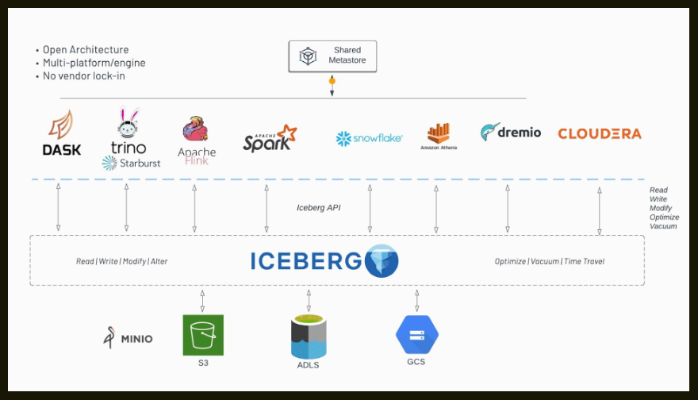

## **Architecture**

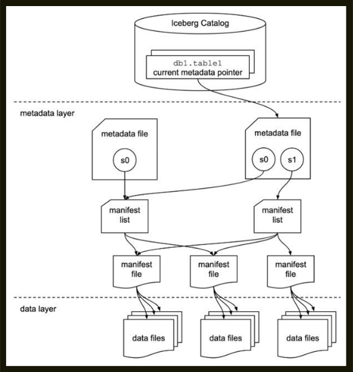

There are 3 layers in the architecture of an Iceberg table:

- The Iceberg catalog
- The metadata layer - which contains metadata files, manifest lists, and manifest files
- The data layer

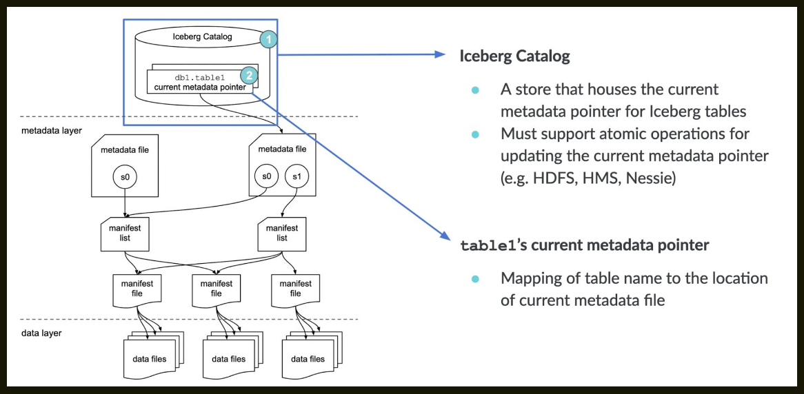

> --- **Iceberg catalog**  

Anyone reading from a table (let alone 10s, 100s, or 1,000s) needs to know where to go first — somewhere they can go to find out where to read/write data for a given table. The first step for anyone looking to read the table is to find the location of the current metadata pointer (note the term “current metadata pointer” is not an official term, but rather a descriptive term because there is no official term at this point and there hasn’t been push-back in the community on it).

This central place where you go to find the current location of the current metadata pointer is the Iceberg catalog.

The primary requirement for an Iceberg catalog is that it must support atomic operations for updating the current metadata pointer (e.g., HDFS, Hive Metastore, Nessie). This is what allows transactions on Iceberg tables to be atomic and provide correctness guarantees.

Within the catalog, there is a reference or pointer for each table to that table’s current metadata file. For example, in the diagram shown, there are 2 metadata files. The value for the table’s current metadata pointer in the catalog is the location of the metadata file on the right.

!!! Note
    What this data looks like is dependent on what Iceberg catalog is being used. Here is the example:
    - With Hive metastore as the catalog, the table entry in the metastore has a table property which stores the location of the current metadata file.

So, when a SELECT query is reading an Iceberg table, the query engine first goes to the Iceberg catalog, then retrieves the entry of the location of the current metadata file for the table it’s looking to read, then opens that file.


>--- **Metadata File** 

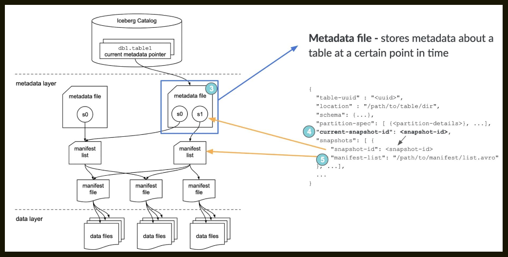

As the name implies, metadata files store metadata about a table. This includes information about the table’s schema, partition information, snapshots, and which snapshot is the current one.

When a SELECT query is reading an Iceberg table and has its current metadata file open after getting its location from the table’s entry in the catalog, the query engine then reads the value of current-snapshot-id. It then uses this value to find that snapshot’s entry in the snapshots array, then retrieves the value of that snapshot’s manifest-list entry, and opens the manifest list that location points to.

>--- **Manifest List** 

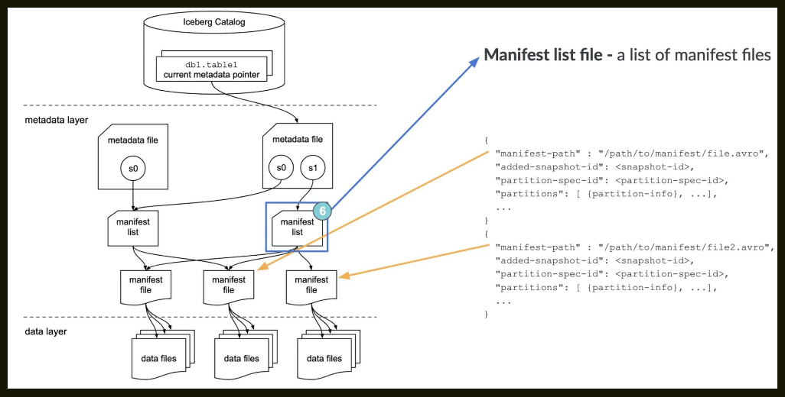

Another aptly named file, the manifest list is a list of manifest files. The manifest list has information about each manifest file that makes up that snapshot, such as the location of the manifest file, what snapshot it was added as part of, and information about the partitions it belongs to and the lower and upper bounds for partition columns for the data files it tracks.

When a SELECT query is reading an Iceberg table and has the manifest list open for the snapshot after getting its location from the metadata file, the query engine then reads the value of the manifest-path entries, and opens the manifest files. It could also do some optimizations at this stage like using row counts or filtering of data using the partition information.

>--- **Manifest File** 

Manifest files track data files as well as additional details and statistics about each file. As mentioned earlier, the primary difference that allows Iceberg to address the problems of the Hive table format is tracking data at the file level — manifest files are the boots on the ground that do that.

Each manifest file keeps track of a subset of the data files for parallelism and reuse efficiency at scale. They contain a lot of useful information that is used to improve efficiency and performance while reading the data from these data files, such as details about partition membership, record count, and lower and upper bounds of columns. These statistics are written for each manifest’s subset of data files during write operation, and are therefore more likely to exist, be accurate, and be up to date than statistics in Hive.

As to not throw the baby out with the bathwater, Iceberg is file-format agnostic, so the manifest files also specify the file format of the data file, such as Parquet, ORC, or Avro.

When a SELECT query is reading an Iceberg table and has a manifest file open after getting its location from the manifest list, the query engine then reads the value of the file-path entries for each data-file object, and opens the data files. It could also do some optimizations at this stage like using row counts or filtering of data using the partition or column statistic information.

>--- **Data Layer** 

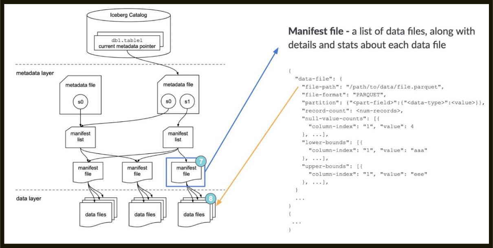

Each file in the data layer represents a leaf node in the Iceberg table’s tree structure, providing scalable and low-cost storage by utilizing distributed filesystems like Hadoop Distributed File System (HDFS) or cloud object storage solutions such as Amazon S3, Azure Data Lake Storage (ADLS), and Google Cloud Storage (GCS).

Datafiles in Iceberg can use various file formats, such as Apache Parquet, Apache ORC, and Apache Avro. Iceberg’s format-agnostic nature provides flexibility, allowing organizations to choose the format that best fits their specific workloads. Parquet, with its columnar structure, is commonly used for its performance benefits in analytical workloads. Parquet files allow engines to read columns and even row groups independently, improving parallelism, compression, and query efficiency by leveraging statistics like minimum and maximum values for each column.

>--- **CREATE TABLE** 

First, let’s create a table in our environment.

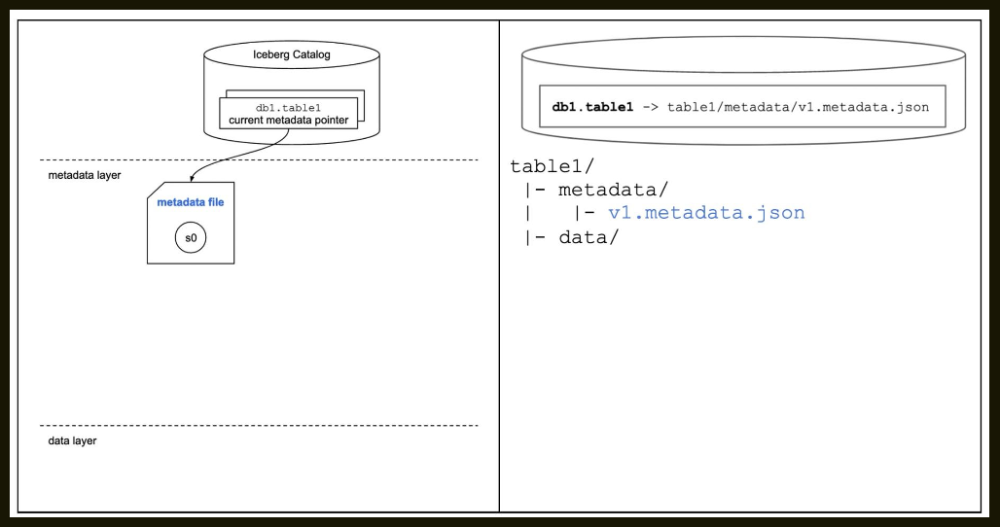


```sql
    CREATE TABLE table1 (
    order_id BIGINT,
    customer_id BIGINT, order_amount DECIMAL(10, 2), order_ts TIMESTAMP
    )
    USING iceberg
    PARTITIONED BY ( HOUR(order_ts) );
```

>--- **INSERT** 

Now, let’s add some data to the table (albeit, literal values).

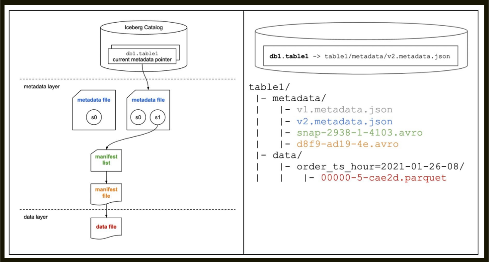

```sql
    INSERT INTO table1 VALUES ( 123,
    456,
    36.17,
    '2021-01-26 08:10:23'
    );
```

>--- **MERGE INTO / UPSERT** 

Now, let’s step through a MERGE INTO / UPSERT operation.

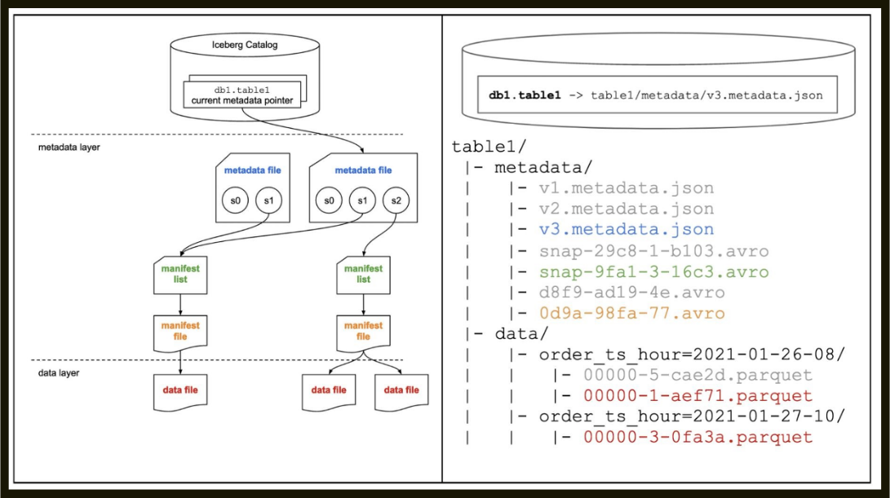


Let’s assume we’ve landed some data into a staging table we created in the background. In this simple example, information is logged each time there’s a change to the order, and we want to keep this table showing the most recent details of each order, so we update the order amount if the order ID is already in the table. If we don’t have a record of that order yet, we want to insert a record for this new order.

In this example, the stage table includes an update for the order that’s already in the table (order_id=123) and a new order that isn’t in the table yet, which occurred on January 27, 2021 at 10:21:46.

```sql
    MERGE INTO table1
    USING ( SELECT * FROM table1_stage ) s
    ON table1.order_id = s.order_id WHEN MATCHED THEN
    UPDATE table1.order_amount = s.order_amount WHEN NOT MATCHED THEN
    INSERT *
```


## **Copy-On-Write (CoW) and Merge-On-Read (MoR)**

In Copy-On-Write approach, if even a single row in a data file is updated or deleted, the associated data file is rewritten with the updated or deleted records.

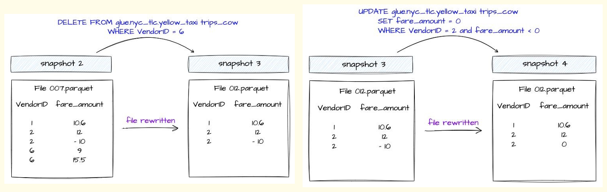

The new snapshot of the table created because of these operations will point to this newer version of the data file. This is the default approach.

Before we dive into MOR, it's important to understand the Delete Files and what information these files have.

>--- **Delete Files**

Delete files track which records in the dataset have been logically deleted and need to be ignored when a query engine tries to read the data from an Iceberg Table.

Delete files are created within each partition depending on the data file from where the record is logically deleted or updated. There are 2 types of delete files based on how these delete files store delete records information.


>--- **Positional Delete Files** 

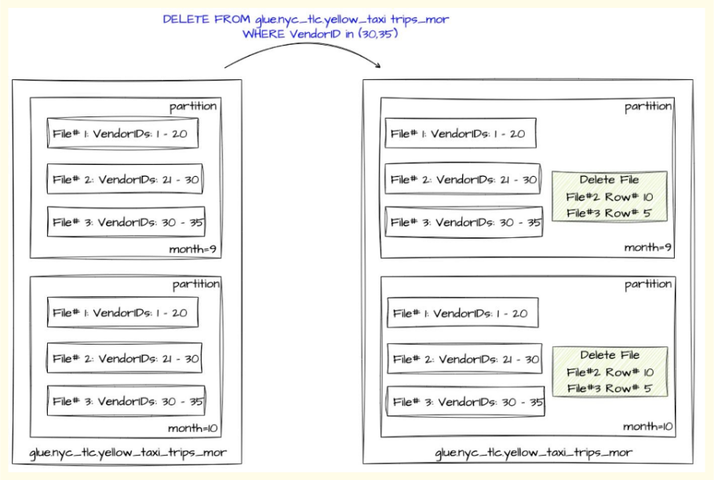

Positional Delete files store the exact position of the deleted records in the dataset. It keeps track of the file path of the data file along with the position of the deleted records in that file.

>--- **Equality Delete Files** 

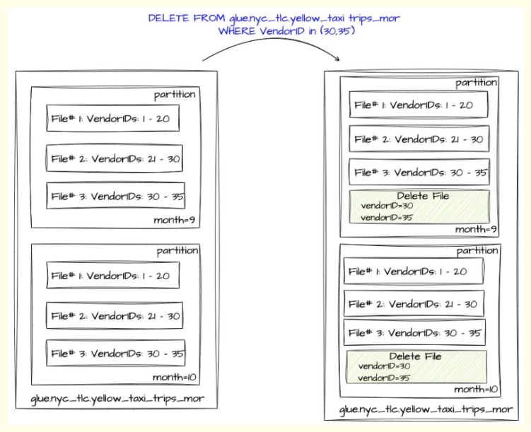

Equality Delete Files stores the value of one or more columns of the deleted records. These column values are stored based on the condition used while deleting these records.

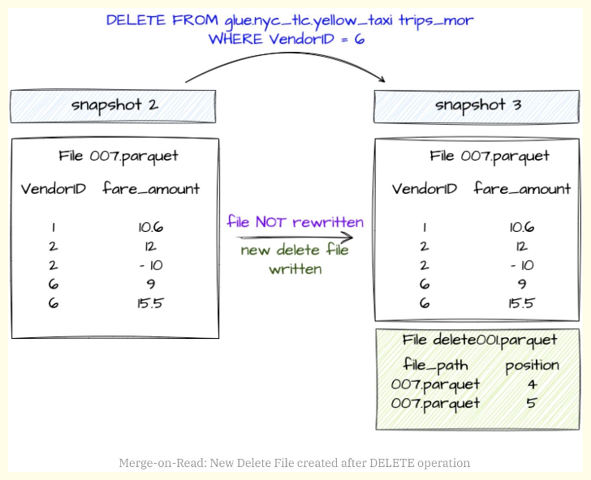

In Merge-on-Read approach, update or delete operations on the Iceberg Table, the existing data files are not rewritten. Instead, a delete file is generated that keeps track of which records need to be ignored.
In case of deleting records, the record entries are listed in a Delete File.

In case of updating records:

 The records to be updated are listed in a delete file.

 A new data file is created that contains only the updated records.

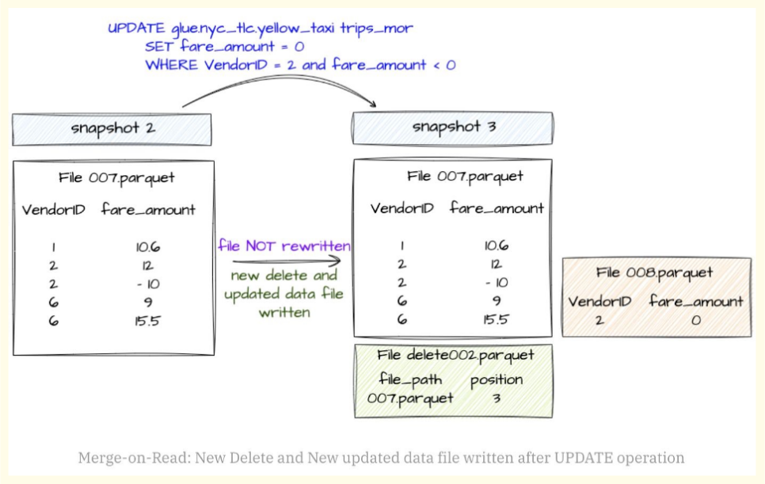

>--- **How to choose between COW and MOR?**


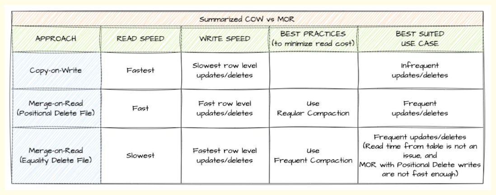

- COW:
 
 In case of row-level deletes/updates, it rewrites the entire file even if there is a single record is impacted.
 
 More data needs to be written that causes slower row-level Updates/Deletes.
 
 Data is read without reconciling. It writes any deleted or updated files, resulting in faster reads.

- MOR:

 In case of row-level deletes/updates, it avoids rewriting the entire data file.
 
 It writes only the Delete File along with the updated data file in case of Updates i.e. basically writing less data and hence faster writes.
 
 Data is read along with reconciling any deleted or updated files, resulting in slower reads.


## **A Look Under the Covers When CRUDing**

>--- **SELECT**

Let’s review the SELECT path again, but this time on the Iceberg table we’ve been working on. SELECT * FROM db1.table1

When this SELECT statement is executed, the following process happens:

- The query engine goes to the Iceberg catalog
- It then retrieves the current metadata file location entry for db1.table1
- It then opens this metadata file and retrieves the entry for the manifest list location for the current snapshot, s2
- It then opens this manifest list, retrieving the location of the only manifest file
- It then opens this manifest file, retrieving the location of the two data files
- It then reads these data files, and since it’s a SELECT *, returns the data back to the client

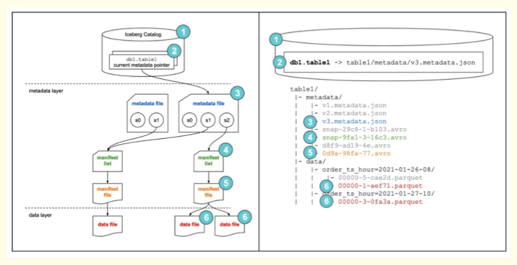

>--- **Create Table**

```sql
CREATE TABLE ecommerce.transactions (
transaction_id BIGINT COMMENT 'Unique identifier for the transaction', customer_id BIGINT COMMENT 'Unique identifier for the customeproduct_id BIGINT COMMENT 'Unique identifier for the product',
quantity INT COMMENT 'Quantity of the product purchased',
total_amount DECIMAL(10, 2) COMMENT 'Total amount for the transaction', transaction_date TIMESTAMP COMMENT 'Timestamp of the transaction',
)
USING iceberg PARTITIONED BY (country, transaction_date) WITH TBLPROPERTIES (
-- General Table Properties
'format-version' = '2', -- Use Iceberg format version 2 'write.format.default' = 'parquet', -- Default file format is Parq'write.target-file-size-bytes' = '536870912', -- Target file size of 512 MB
'write.upsert.enabled' = 'true', 'write.update.mode' = 'merge-on-read', 'write.delete.mode'='copy-on-writ'write.merge.mode'='merge-on-read', 'write.distribution-mode' = 'hash',
-- Enable upserts for the table
-- Use merge-on-read for delete operations
-- Use hash-based distribution for writes
-- Snapshot and Metadata Management
'commit.manifest.min-count-to-merge' = '5', -- Minimum number of manifests to trigger a merge 'commit.manifest.target-size-bytes'104857600', -- Target size for each manifest (100 MB) 'snapshot-id-inheritance.enabled' = 'true', -- Optimize snapshot managem'metadata.delete-after-commit.enabled' = 'true', -- Clean up old metadata files after commits
-- Data Compaction and Optimization
'write.merge.small-files' = 'true', -- Merge small files automatically 'write.merge.file-size-threshold' = '134217728', -- Threshold merging small files (128 MB) 'write.compaction.file-count-threshold' = '50', -- Trigger compaction when there are > 50 small files
-- Query Optimization
'read.split.target-size' = '268435456', -- Split size for parallel reads (256 MB)
-- Garbage Collection
'gc.enabled' = 'true', -- Enable garbage collection for orphaned files 'gc.file-threshold' = '10485760', -- Minimum size of orphan fifor GC (10 MB)
-- Performance Settings
'parquet.row-group-size-bytes' = '134217728' -- Parquet row group size (128 MB) );
```

>--- **Insert command**

– Normal insert where data will be placed automatically inside partitions

```sql
INSERT INTO ecommerce.transactions VALUES
(1001, 12345, 56789, 2, 49.99, 99.98, '2025-01-13 12:30:45', 'United States', 'Credit Card', 'Completed'),
(1002, 12346, 56780, 1, 19.99, 19.99, '2025-01-13 13:15:20', 'Canada', 'PayPal', 'Completed');
```

– Static overwrite of partitions

```sql
INSERT OVERWRITE ecommerce.transactions
PARTITION (country = 'United States', transaction_date = '2025-01-13') VALUES
(1003, 12347, 56781, 3, 29.99, 89.97, '2025-01-13 14:00:00', 'United States', 'Debit Card', 'Pending'), (1004, 12348, 56782, 5, 9.99, 49.95, '2025-01-13 15:20:10', 'United States', 'Credit Card', 'Completed');
```

– Dynamic overwrite of partitions

```sql
INSERT OVERWRITE ecommerce.transactions VALUES
(1003, 12347, 56781, 3, 29.99, 89.97, '2025-01-13 14:00:00', 'United States', 'Debit Card', 'Pending'), (1004, 12348, 56782, 5, 9.99, 49.95, '2025-01-13 15:20:10', 'United States', 'Credit Card', 'Completed'), (1005, 12349, 56783, 1, 99.99, 99.99, '2025-01-14 09:00:00', 'Canada', 'Credit Card', 'Completed');
```

>--- **Delete command**

```sql
DELETE FROM ecommerce.transactions WHERE transaction_date = '2025-01-13';
UPDATE ecommerce.transactions SET status = 'Completed' WHERE transaction_id = 1003;
```

>--- **Alter Command**

```sql
ALTER TABLE catalog.db.sample_table SET TBLPROPERTIES ( 'write.delete.mode'='merge-on-read', 'write.update.mode'='copy-on-write', 'write.merge.mode'='copy-on-write'
);
```

>--- **Merge Query**

```sql
MERGE INTO ecommerce.transactions AS target
USING incoming_updates AS source
ON target.transaction_id = source.transaction_id
WHEN MATCHED AND source.status = 'Cancelled' THEN DELETE WHEN MATCHED THEN UPDATE SET
target.quantity = source.quantity, target.total_amount = source.total_amount, target.status = source.status
WHEN NOT MATCHED THEN INSERT (
transaction_id, customer_id, product_id, quantity, price, total_amount, transaction_date, country,
payment_method, status ) VALUES (
source.transaction_id, source.customer_id, source.product_id, source.quantity, source.price, source.total_amount, source.transaction_date, source.country, source.payment_method, source.status );
```

>--- **TimeTravel**

-- To list down all snapshots of a Iceberg table 

```sql
SELECT * FROM ecommerce.transactions.snapshots;
```

-- Read from timestamp

```sql
SELECT * FROM ecommerce.transactions FOR TIMESTAMP AS OF TIMESTAMP '2025-01-01 00:00:00';
```

-- Read from snapshot

```sql
SELECT * FROM ecommerce.transactions FOR SNAPSHOT 1234567890123456789;
```

>--- **Compaction**


Compaction is a technique and a recommended ( yet, mandatory ) maintenance that needs to happen on Iceberg table periodically. It will help in combining smaller files into fewer larger files.

```sql
CALL iceberg.system.rewrite_data_files( table => 'database_name.table_name',
options => map(
'target-file-size-bytes', '524288000', -- Target size of each compacted file (500MB) 'split-size', '268435456', -- Size of each data split (256MB) for parallel processing 'max-file-size', '1073741824' -- Maximum allowable size of a single file (1GB)
) );

CALL iceberg.system.rewrite_manifests( table => 'database_name.table_name', options => map(
'max-manifest-file-size', '104857600', -- Maximum size of each manifest file (100MB) 'min-manifest-file-size', '5242880', -- Minimum size to consider for compaction (5MB) 'manifest-target-count', '10' -- Target number of compacted manifests
) );
```

- make old new 

```sql
CALL lake.system.rollback_to_snapshot(
    'raw',
    'ref_txn_details',
    123456789
);
```

```python
spark.sql("CALL lake.system.remove_orphan_files(table => 'lake.raw.trinologs')")
spark.sql("CALL lake.system.rewrite_manifests('lake.raw.trinologs')")
spark.sql("CALL lake.system.rewrite_data_files(table => 'lake.raw.trinologs',options => map('min-input-files','2','target-file-size-bytes','524288000'))")
spark.sql("CALL lake.system.expire_snapshots('lake.raw.trinologs', TIMESTAMP '"+refreshDate+"', 5)")
```

## **ICEBERG_IQ**

!!!- info "1. What is a data lakehouse?"
    A data lakehouse is an architectural pattern where most workloads often associated with a data warehouse run on the data lake. That reduces duplication of data and pipeline complexity for better regulatory compliance, consistency of data, and self-service delivery.

!!!- info "2. What is a data lakehouse table format?"
    A table format lets tools look at files in data lake storage and treat groups of those files as a single table so you can query and transform data performantly on the lake—enabling warehouse-like workloads (and more) on the lake (the lakehouse idea).

    Table formats are not new or specific to data lakes; they go back to early relational systems. A lakehouse table format differs because multiple engines must interact with the same table safely and consistently.

    Reference: [Apache Iceberg — an architectural look under the covers](https://www.dremio.com/resources/guides/apache-iceberg-an-architectural-look-under-the-covers/)

!!!- info "3. What are metadata files in Iceberg?"
    Whenever a table is created or data is inserted, updated, or deleted, Iceberg can produce new metadata. Metadata files capture the high-level definition of the table: current and past snapshots, schemas, partition specs, and related state.

    Reference: [Hands-on look at Iceberg table structure — metadata file](https://www.dremio.com/blog/a-hands-on-look-at-the-structure-of-an-apache-iceberg-table/#metadatafile)

!!!- info "4. What are manifest lists?"
    Each table snapshot is tracked in a manifest list file. It records which manifest files belong to that snapshot and carries metadata about those manifests so engines can prune work (for example via partition pruning) without scanning everything.

    Reference: [Hands-on look at Iceberg table structure — manifest list](https://www.dremio.com/blog/a-hands-on-look-at-the-structure-of-an-apache-iceberg-table/#manifestlist)

!!!- info "5. What are delete files?"
    Delete files record rows that were deleted and should be ignored when reading certain data files. They matter when row-level operations (update, delete, merge) use Merge-on-Read (MOR). Styles include position deletes (file + position of removed rows) and equality deletes (match by column values).

    Reference: [Copy-on-write vs merge-on-read in Apache Iceberg](https://www.dremio.com/blog/row-level-changes-on-the-lakehouse-copy-on-write-vs-merge-on-read-in-apache-iceberg/)

!!!- info "6. What is partition evolution?"
    In many formats, changing partitioning forces a full table rewrite, which is expensive at scale. Iceberg supports partition evolution: you can change how new data is partitioned without rewriting all existing data that used the old spec.

    Reference: [Future-proof partitioning and fewer table rewrites](https://www.dremio.com/blog/future-proof-partitioning-and-fewer-table-rewrites-with-apache-iceberg/)

!!!- info "7. What is hidden partitioning?"
    Iceberg tracks partitions using a column plus a transform, not only raw partition columns. That enables hidden partitioning: consumers can benefit from pruning without manually mirroring partition columns in every filter, unlike many Hive-style layouts.

    Reference: [Hidden partitioning in Apache Iceberg](https://www.dremio.com/blog/fewer-accidental-full-table-scans-brought-to-you-by-apache-icebergs-hidden-partitioning/)

!!!- info "8. What is time travel in Iceberg?"
    Because metadata tracks snapshots, you can query the table as it was at a point in time—time travel. Useful for reproducible ML evaluation, audits, and historical analytics.

    Reference: [Time travel with Dremio and Apache Iceberg](https://www.dremio.com/blog/time-travel-with-dremio-and-apache-iceberg/)

!!!- info "9. What is schema evolution in Iceberg?"
    Schema evolution is changing the table schema without necessarily rewriting all data. Iceberg supports adding columns, evolving types where allowed, renaming, and dropping columns through metadata and read-time projection, avoiding full rewrites in many cases.

    Reference: [Iceberg docs — schema evolution](https://iceberg.apache.org/docs/latest/evolution/#schema-evolution)

!!!- info "10. How does Iceberg handle multiple concurrent writes?"
    Iceberg uses optimistic concurrency for transactional commits. Writers plan the next snapshot (often including a unique metadata path or identifier), then commit atomically. If another writer committed first, the writer refreshes metadata and retries (until success or retry limits). Coordinating on immutable metadata files avoids in-place corruption.

    References: [Concurrent write operations](https://iceberg.apache.org/docs/latest/reliability/#concurrent-write-operations), [Iceberg spec — file-system tables](https://iceberg.apache.org/spec/#file-system-tables)

!!!- info "11. What are Copy-on-Write (CoW) and Merge-on-Read (MoR), and when would you choose each?"
    Both address row-level changes (update, delete, merge). CoW rewrites data files that contain changed rows—better read performance, heavier writes. MoR keeps data files and adds delete (and related) files merged at read time—faster writes, more read-time work.

    Reference: [CoW vs MoR in Apache Iceberg](https://www.dremio.com/blog/row-level-changes-on-the-lakehouse-copy-on-write-vs-merge-on-read-in-apache-iceberg/)

!!!- info "12. How do you hard-delete records for compliance (for example GDPR)?"
    Data files disappear when no snapshot references them anymore (after snapshot expiration and garbage collection of orphans, per your tooling and policies).

    With CoW, changed data is rewritten; expiring snapshots from before the delete can remove files that held the deleted rows.

    With MoR, old files may still be referenced across snapshots, so you typically compact, then expire snapshots before the compaction so files containing deleted rows can be dropped.

    Reference: [Iceberg and the right to be forgotten](https://www.dremio.com/blog/apache-iceberg-and-the-right-to-be-forgotten/)

!!!- info "13. What is compaction, and how do you run it?"
    Compaction rewrites many small files into fewer, larger files to cut metadata overhead and improve scan efficiency. In Spark, the common entry point is the `rewrite_data_files` procedure (or equivalent in other engines).

    Reference: [Spark procedures — rewrite_data_files](https://iceberg.apache.org/docs/latest/spark-procedures/#rewrite_data_files)

!!!- info "14. What rewrite or clustering strategies exist for compacting data files?"
    The `rewrite_data_files` procedure supports strategies such as bin-pack (default) and sort-based rewrites to cluster on one or more columns; z-order clustering is also supported for multi-column locality.

    References: [Compaction in Iceberg](https://www.dremio.com/blog/compaction-in-apache-iceberg-fine-tuning-your-iceberg-tables-data-files/), [Z-ordering in Iceberg](https://www.dremio.com/blog/how-z-ordering-in-apache-iceberg-helps-improve-performance/)

!!!- info "15. Do you need to retain every metadata file forever?"
    No. A new metadata file can be created on DDL/DML, so files accumulate. You can cap how many previous metadata files are kept and expire older ones as part of maintenance.

    Reference: [Maintenance — remove old metadata files](https://iceberg.apache.org/docs/latest/maintenance/#remove-old-metadata-files)

!!!- info "16. How do you automatically clean up old metadata files?"
    Set table properties such as `write.metadata.delete-after-commit.enabled=true` so that after each commit, older metadata files are pruned according to `write.metadata.previous-versions-max` (and related settings).

!!!- info "17. Explain Iceberg’s core metadata layout and how it enables atomic commits and snapshot isolation."
    Iceberg keeps a clear split between table metadata and data files. The current table state is reached through a metadata tree: metadata JSON points at a snapshot; snapshots reference manifest lists; manifest lists point to manifests; manifests list data files with metrics (partition values, bounds, counts, etc.).

    Commits are atomic because writers add new metadata files and swap the table pointer (for example via atomic rename) instead of editing files in place. Readers always resolve from the current metadata pointer, so they see a full old snapshot or a full new one—snapshot isolation. Time travel is reading an older snapshot via the same metadata chain.

!!!- info "18. How does Iceberg support schema and partition evolution without rewriting all existing data files?"
    Schema changes are recorded in metadata history. Readers project columns present in each file, fill new columns with null/default as needed, and ignore dropped columns where appropriate—so Parquet/ORC files need not all be rewritten for many evolutions.

    Partition evolution updates the partition spec in metadata with a new spec id. Existing files keep the partition values recorded for the spec that wrote them; planners use the correct spec per file. Hidden partitioning follows the same idea (transform + source column). Full physical reorganization is optional and done via explicit rewrite jobs.

!!!- info "19. How does Iceberg use file-level statistics for partition pruning and predicate pushdown?"
    Manifest entries store per-file partition values and column metrics (min/max, null counts, row counts, etc.). Planning typically does manifest-level pruning first (drop files by partition overlap), then metrics-based pruning (skip files whose stats contradict the predicate). That reduces I/O versus opening every data file.

!!!- info "20. What isolation and concurrency guarantees does Iceberg provide, and how are write conflicts resolved?"
    Readers get snapshot isolation: they see a consistent snapshot. Writers use optimistic concurrency: read base snapshot, write new manifests and metadata, attempt atomic commit; on conflict, refresh from the latest metadata, rebase/recompute, and retry. That yields ordered commits without coarse-grained locks, while avoiding torn reads.


!!!- info "What is snapshot isolation?"

    Each write creates a new snapshot, and readers always see a consistent snapshot.

    Readers → no locks
    Writers → optimistic concurrency

    👉 Example:

    Job A writes → snapshot 101
    Job B writes → snapshot 102
    Reader still sees snapshot 100 unless refreshed

!!!- info "Difference"

    | Feature          | Iceberg        | Delta           | Hudi        |
    | ---------------- | -------------- | --------------- | ----------- |
    | Metadata         | Manifest-based | Transaction log | Timeline    |
    | Partitioning     | Hidden         | Explicit        | Explicit    |
    | Streaming        | Moderate       | Strong          | Strong      |
    | Engine support   | Multi-engine   | Spark-heavy     | Spark-heavy |
    | Schema evolution | Strong         | Moderate        | Complex     |


!!!- info"What happens during MERGE internally?"

    Matching files identified
    Files rewritten (copy-on-write)
    New snapshot created

