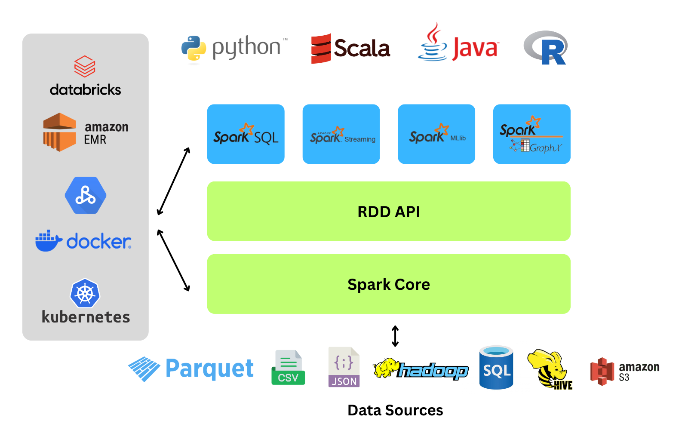
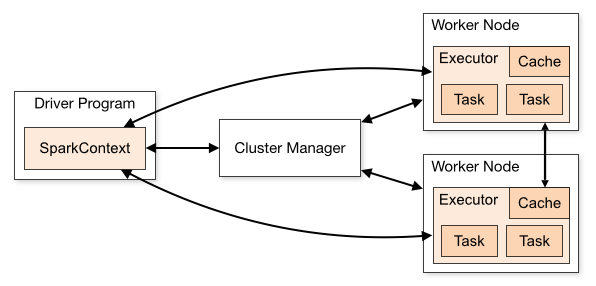
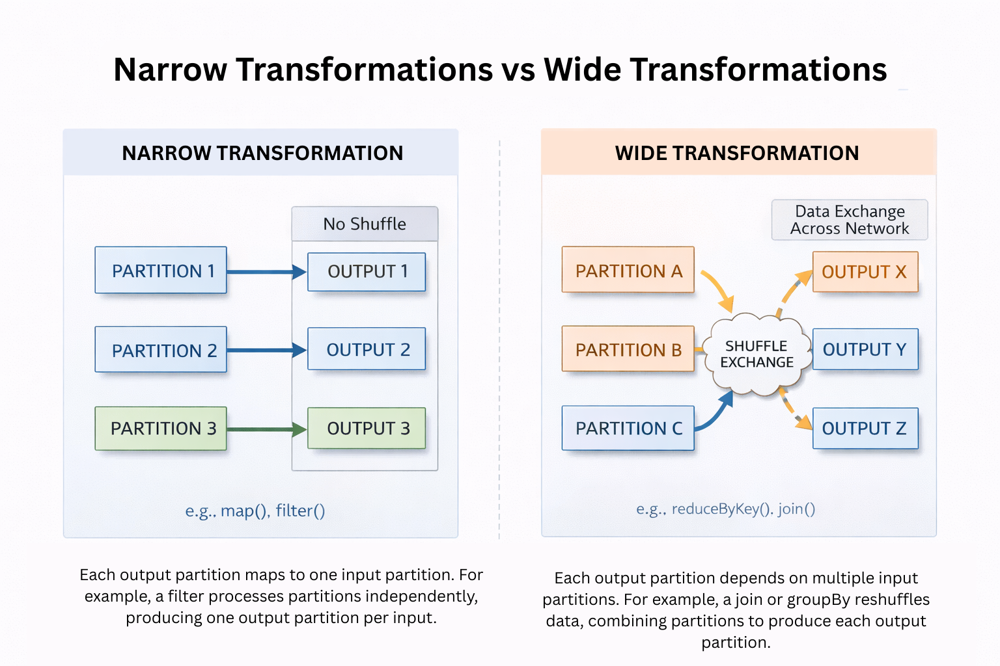
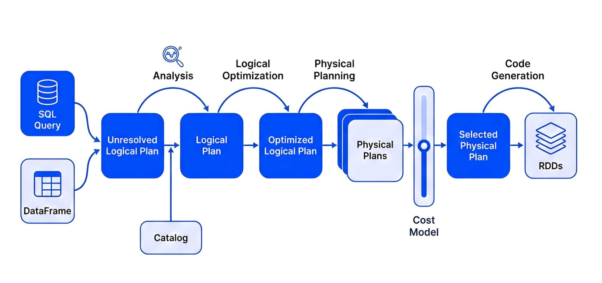
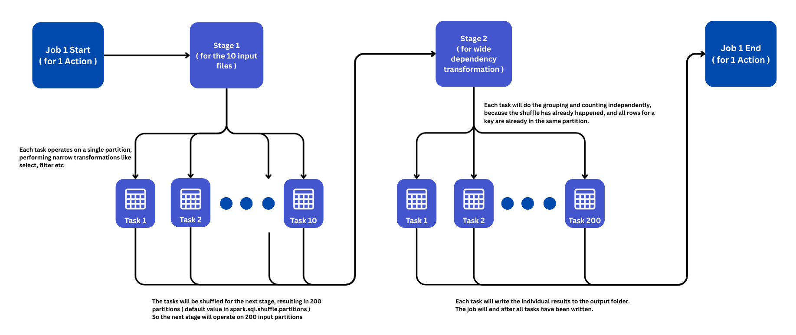
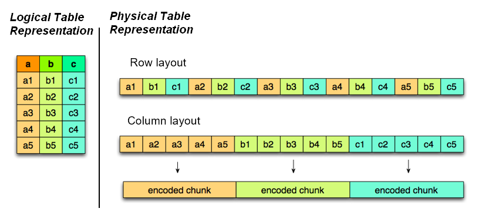
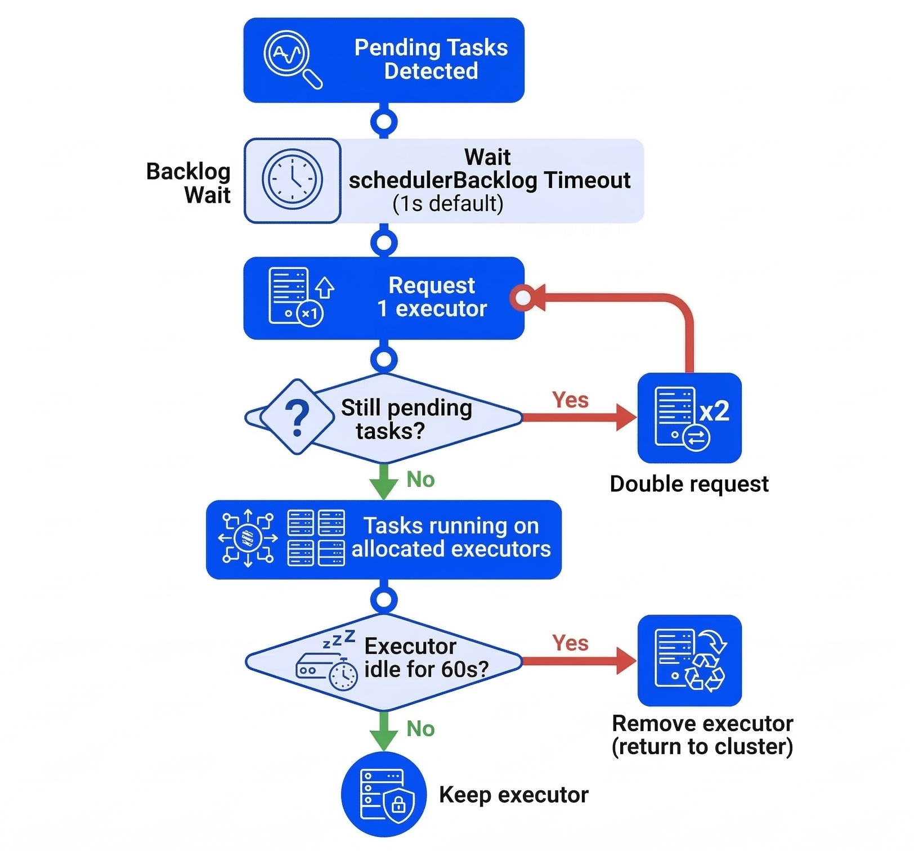
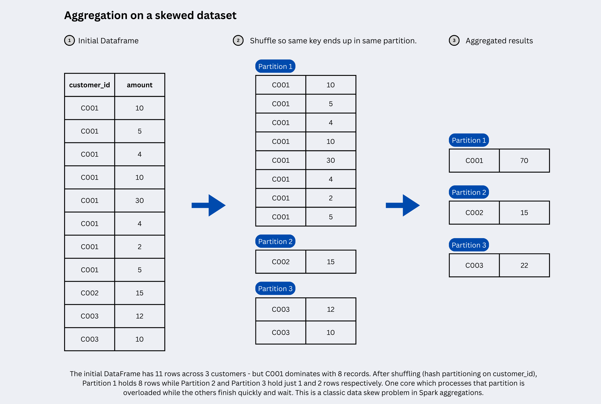
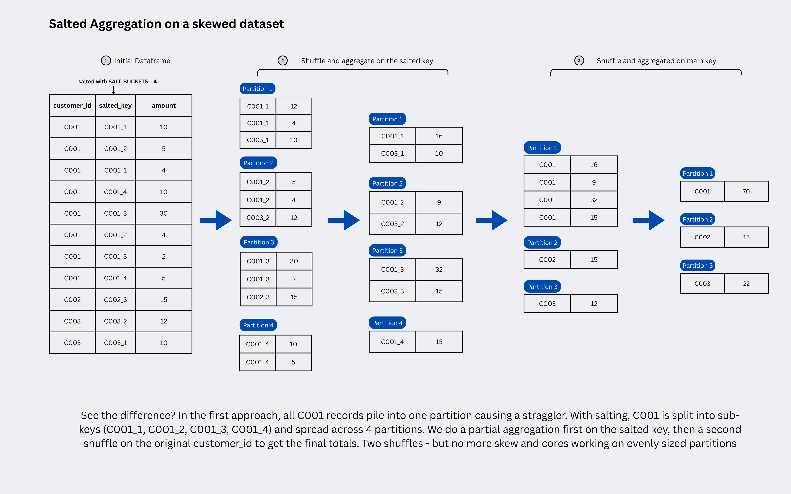

Apache Spark is an open-source, distributed data processing engine designed for fast, scalable processing of large datasets. It provides in-memory computing capabilities that make it significantly faster than traditional disk-based processing frameworks, particularly for iterative algorithms and real-time analytics.

## Spark: Origins and Fundamentals

>--- **What is Apache Spark?**

Apache Spark is a unified analytics engine that provides parallel and distributed processing of big data workloads. It offers a comprehensive ecosystem of libraries for batch processing, SQL queries, streaming data, machine learning, and graph computation, all integrated into a single framework.

>--- **How Does It Work?**

Spark processes data by keeping it in memory (RAM) rather than writing to disk after each operation. It uses a Directed Acyclic Graph (DAG) execution engine that optimizes task scheduling and reduces latency by eliminating unnecessary disk I/O operations. Spark Core provides essential services like task scheduling, memory management, fault recovery, and job execution, while higher-level components handle specific workloads.

>--- **Issues with Traditional Systems**

Traditional data processing systems face several critical limitations when handling big data:

- Scalability bottlenecks: Traditional systems scale vertically (adding more powerful hardware to a single machine) rather than horizontally, quickly hitting hardware limits as data grows from gigabytes to terabytes
- Lack of real-time processing: Designed primarily for batch processing, traditional systems cannot support real-time analytics needed for modern use cases like fraud detection and personalized experiences
- Performance issues: Centralized relational databases slow down significantly as data volume increases, with each operation taking longer due to sequential processing
- Inflexibility with data types: Traditional systems handle only structured data in rigid schemas, missing approximately 80% of available data that exists in unstructured or semi-structured formats
- High costs: Scaling traditional systems requires expensive hardware upgrades and enterprise database licenses, with costs escalating exponentially

>--- **Hadoop MapReduce**

Hadoop MapReduce is a programming model for processing large datasets in a distributed computing environment. It divides tasks into two independent phases: the Map phase (which filters and sorts data) and the Reduce phase (which performs summary operations). While MapReduce introduced horizontal scalability and fault tolerance, it processes data by writing intermediate results to disk after each operation, creating significant I/O overhead.

>--- **MapReduce vs Spark Comparison**

| Aspect | Hadoop MapReduce | Apache Spark |
|--------|------------------|--------------|
| Processing Speed | Slower due to disk-based storage between operations | 100x faster in-memory, 10x faster on disk   |
| Data Storage | Stores intermediate results on local disk   | Caches data in RAM across distributed workers   |
| Execution Model | Rigid sequential map and reduce phases   | DAG-based execution with optimized task scheduling   |
| Fault Tolerance | Replicates data to disk; re-reads from HDFS on failure | Uses lineage tracking; recomputes lost partitions from source data |
| Processing Type | Primarily batch processing   | Batch, real-time streaming, interactive queries   |
| Ease of Use | Complex, requires more code   | User-friendly APIs in multiple languages   |
| Iterative Processing | Inefficient for machine learning algorithms   | Optimized for iterative algorithms   |
| Latency | High I/O overhead creates bottlenecks   | Low latency with in-memory computation  |
| Cost | Lower hardware requirements   | Requires more memory resources   |

## Spark Ecosystem

>--- **The Unified Stack Architecture**

The provided image  illustrates Apache Spark as a layered, unified stack where higher-level libraries rely on the core engine, allowing developers to use different languages and data sources seamlessly.



## Spark Architecture

Apache Spark's performance advantage comes from its unique distributed architecture. Unlike traditional single-node tools, Spark uses a Driver-Executor architecture  where one central coordinator (the Driver) manages many distributed workers (Executors).

>--- **The Driver-Executor Model**

At a high level, every Spark application follows a distributed architecture consisting of two main pieces that communicate with each other:

1.  Driver Program (The Coordinator/Controller)
2.  Worker Nodes (Compute Resources)

They are connected by a Cluster Manager which allocates resources.

| Component | Role | Key Responsibilities |
| :--- | :--- | :--- |
| Driver | Central coordinator | Converts your code to execution plan, schedules tasks, collects results |
| Cluster Manager | Resource manager | Allocates CPU/memory, launches executors, monitors cluster health |
| Executors | Distributed workers | Run tasks in parallel, cache data partitions, report status to driver |


Lets go over these components in detail:

>--- **The Driver (Master Node)**

The Driver is the process where your `main()` method runs. It is the control center of your application.

- Responsibilities:

    Converts your user code into tasks.

    Creates the SparkSession, the entry point to the cluster.
    
    Constructs a DAG (Directed Acyclic Graph) of the job execution.
    
    Schedules tasks on Executors and monitors their progress.

>--- **The Cluster Manager**

The Cluster Manager is an external service that allocates resources (CPU and memory) across the cluster and manages the lifecycle of Executors. It acts as the intermediary between the Driver and the worker nodes, ensuring efficient resource distribution across applications.

Spark is agnostic to the underlying cluster manager. It can run on:

   Standalone: Spark's simple built-in manager.

   YARN: Hadoop's resource manager (common in big data).

   Kubernetes: For containerized deployments.

   Mesos: An older general-purpose cluster manager.

>--- **The Executors (Worker Nodes)**

Executors are distributed agents responsible for two things: Executing code and Storing data.

- Responsibilities:

    Run the tasks assigned by the Driver.
    
    Return results to the Driver.

    Provide in-memory storage for cached RDDs/DataFrames.

    Each application gets its own set of executor processes.

>--- **Driver & Executor Configuration**

Configuring the Driver and Executors correctly is a critical first step in Spark performance tuning. These properties establish the baseline resources (memory and CPU) available for your job to execute efficiently. Setting them correctly is essential to prevent OutOfMemory errors and ensure your cluster is utilized effectively.

>--- **Driver Properties**

The Driver needs enough memory to store the DAG, task metadata, and any results collected back to it (e.g., via `.collect()`).

| Property | Default | Description |
| :--- | :--- | :--- |
| `spark.driver.memory` | 1g | Amount of memory to use for the driver process. If your job collects large results, increase this. |
| `spark.driver.cores` | 1 | Number of cores to use for the driver process (only in cluster mode). For production jobs, set it to 2-4 (default is 1). This is cheap insurance against stability issues.|

>--- **Executor Properties**

Executors do the heavy lifting. Their configuration balances parallelism (cores) against memory capacity.

- What is Parallelism?

In Spark, parallelism defines how many tasks can run at the exact same time across the entire cluster.

It is directly determined by the total number of cores available in your executors.
   1 Core = 1 Task = 1 Partition processed at a time.
   If you have 10 executors, and each has 4 cores, your total parallelism is 40.
   This means Spark can process 40 partitions of data simultaneously.

If you have 100 partitions of data but only 40 cores, Spark will process the first 40, then the next 40, and finally the last 20.

| Property | Default | Description |
| :--- | :--- | :--- |
| `spark.executor.memory` | 1g | Amount of memory to use per executor process. This is split between execution memory (shuffles/joins) and storage memory (cache). |
| `spark.executor.cores` | 1 (YARN), all (Standalone) | The number of cores to use on each executor. Best Practice: Keep this between 3-5 cores for optimal garbage collection (GC) performance. |
| `spark.executor.instances` | 2 | The number of executors to launch for this application (when using static allocation). |


>--- **How a Spark Job Runs (Execution Flow)**



When you submit a Spark job (e.g., `spark-submit`), the following sequence occurs:

1.  Submission: The Driver starts and connects to the Cluster Manager.
2.  Resource Request: The Cluster Manager launches Executors on Worker Nodes.
3.  Job Planning (DAG): The Driver converts your code (Transformations & Actions) into a logical graph (DAG).
4.  Task Creation: The DAG is converted into physical execution units called Tasks.
5.  Scheduling: The Driver sends these tasks to the Executors.
6.  Execution: Executors run the tasks and store data in RAM.
7.  Result: Results are sent back to the Driver or written to disk/storage.
8.  Termination: When `spark.stop()` is called, all executors are terminated and resources released.

>--- **Understanding Jobs, Stages, and Tasks**

Spark breaks down work hierarchically:

   Application: The entire user program built on Spark. Think of this as the "project" – it includes one Driver (manager) and multiple Executors (workers) that stay alive until the application ends.
  
   Job: A parallel computation triggered by an Action (e.g., `.count()`, `.collect()`, `.show()`). Each action creates one job. If your code has 3 actions, Spark runs 3 separate jobs.
  
   Stage: Jobs are divided into stages based on Shuffle boundaries. A shuffle happens when data must be redistributed across the cluster (like during a `groupBy` or `join`). Stages contain tasks that can run in parallel without network shuffles.
  
   Task: The smallest unit of work. One task = one transformation applied to one partition of data. If you have 200 partitions, Spark creates 200 tasks per stage. Tasks run independently on Executors.

The Flow:
```
1 Application
  └─ Multiple Jobs (one per Action)
      └─ Multiple Stages (split by Shuffles)
          └─ Multiple Tasks (one per Partition)
```


The following table summarizes terms we'll see used to refer to cluster concepts:

| Term                | Meaning                                                                                                                                                                                                                                      |
| ------------------- | -------------------------------------------------------------------------------------------------------------------------------------------------------------------------------------------------------------------------------------------- |
| Application     | User program built on Spark. Consists of a driver program and executors on the cluster.                                                                                                                                                      |
| Driver program  | The process that runs the `main()` function of the application and creates the `SparkSession`.                                                                                                                                               |
| Cluster manager | An external service for acquiring resources on the cluster (e.g., Standalone, YARN, Kubernetes).                                                                                                                                             |
| Worker node     | Any node in the cluster that can run application code.                                                                                                                                                                                       |
| Executor        | A process launched for an application on a worker node that runs tasks and stores data in memory or disk. Each application has its own executors.                                                                                            |
| Task            | The smallest unit of work, sent to a single executor.                                                                                                                                                                                        |
| Job             | A parallel computation consisting of multiple tasks, triggered by a Spark action (e.g., `save`, `collect`). This term appears in driver logs.                                                                                                |
| Stage           | A subset of a job consisting of tasks that can be executed together. Stages are separated by shuffle boundaries (similar to map and reduce stages in MapReduce).                                                                             |

## Transformations & Actions

Transformations and actions are the two building blocks of every Spark job: transformations define what should happen to data, and actions trigger execution to produce a result or write output. This split is what enables Spark’s lazy evaluation and efficient optimization via its execution plan (DAG).

>--- **Understanding the Basics**

A transformation creates a new RDD/DataFrame from an existing one (it describes a step in your pipeline - like a select, filter, join etc) and is evaluated lazily. An action asks Spark to materialize a result (return to the driver, write to storage, or otherwise “finish” the computation), which is what triggers a job in Spark’s execution model.

>--- **Transformations: Defining What to Do**

Transformations are “recipe steps” that Spark records in the lineage/DAG rather than executing immediately, allowing Spark to optimize the plan before running it. Common transformation examples include `select`, `filter`, `withColumn`, `groupBy`, `join`, `distinct`, `repartition`, and `union`.

Before we understand the 2 types of transformations, we need to know what partitions are in Spark.

>--- **What are Partitions?**

At its core, Spark achieves parallelism by splitting your data into smaller chunks called partitions.

A partition is a logical division of your dataset that lives on a single machine in the cluster. Think of it as a slice of your total data. When you load a 1GB CSV file, Spark doesn't process it as one giant blob - it splits it into, say, 8 partitions of ~128MB each, distributing them across your executors.

>--- **Why Partitions Matter**

Partitions are the fundamental unit of parallelism in Spark. Remember this equation from earlier:

1 Partition = 1 Task = 1 Core

If your DataFrame has 200 partitions and your cluster has 40 cores (10 executors × 4 cores), Spark processes:

- First wave: 40 partitions in parallel
- Second wave: Next 40 partitions
- ...and so on until all 200 are done
    
This is why the number of partitions directly impacts how fast your job runs.

>--- **The Default Behavior**

When you read data, Spark automatically creates partitions based on:

- File size: Larger files get split into more partitions
- Data source: HDFS block size, number of CSV files in a folder, etc.
- `spark.sql.files.maxPartitionBytes`: Default is 128MB per partition

You can check the partition count with:
```python
df.rdd.getNumPartitions()
```

And manually control it using `repartition()` or `coalesce()` (we'll cover these in depth later).

Now, coming back to Transformations - Two useful sub-types matter for performance:

- Narrow transformations: Each output partition depends on a single input partition (no data movement needed), e.g., `filter`, `map`, `select`. These are fast because each executor works independently on its own partitions.

- Wide transformations: Output partitions require data from multiple input partitions across the cluster (causes shuffle), e.g., `groupBy`, `join`, `distinct`, `repartition`. 

Why the shuffle? Consider a `groupBy("customer_id")` operation on a 100-partition DataFrame. Customer "C123" might have records scattered across partitions 5, 23, 47, and 89 on different executors. To calculate the correct aggregate (like `sum(amount)`), Spark must:

  1. Shuffle: Move all "C123" records from their current partitions across the network to land on the same partition
  2. Aggregate: Once co-located, sum up the amounts




>--- **Performance Implications of Transformations**

- Narrow Transformations: Pipelining (High Efficiency)

    No Data Movement: Since the data required for the computation resides on the same partition, there is no need to transfer data over the network between executors.

    Pipelining: Spark optimizes narrow transformations by collapsing them into a single stage. For example, if you write `df.filter(...).map(...).select(...)`, Spark fuses these three operations into a single task. The engine reads a record, filters it, maps it, and selects it in one pass, without writing intermediate results to memory or disk.
   Speed: These are extremely fast and memory-efficient.

- Wide Transformations: The Shuffle Cost (High Overhead)

    The Shuffle: This is the most expensive operation in Spark. It involves:

       Disk I/O: Writing intermediate data to disk (spilling) to ensure fault tolerance and memory management.
    
       Network I/O: Transferring data across different nodes in the cluster to group related keys together.
    
       Serialization/Deserialization: Significant CPU overhead to serialize data for transport and deserialize it at the destination.

    Stage Boundaries: Wide transformations break the execution plan (DAG) into Stages. Spark cannot proceed to the next stage until the current stage (the shuffle) is complete. This acts as a blocking operation, preventing parallelization across the boundary.

    Data Skew: Wide transformations are prone to data skew. If one key (e.g., a popular `customer_id`) has significantly more data than others, one partition will become massive, causing the specific executor processing it to run out of memory (OOM) or lag behind the others (straggler tasks).


>--- **Actions: The Go Button**

Actions force Spark to execute the DAG and either return something to the driver or write results externally. Typical actions include `count`, `collect`, `take`, `first`, `show`, `write.save(...)`, and (in RDD land) `reduce`.

A practical way to think about it:

- Transformations = “build the plan”
- Actions = “run the plan now” (and Spark breaks it into jobs/stages/tasks during execution)

>--- **Spark behavior in practice**

The transformation steps in your code feel instant because Spark doesn't execute them yet. When you call an action, Spark runs everything needed to produce that result. If you call two actions on the same DataFrame without caching, Spark recomputes all the work twice.

Example (PySpark DataFrame):
```python
df2 = (df
       .filter("country = 'IN'")          # narrow transformation (each input partition is filtered independently -> produces one output partition per input partition)
       .select("user_id", "amount")       # narrow transformation (columns are selected per partition independently)
       .groupBy("user_id").sum("amount")  # wide transformation (shuffle happens -> same user_id across partitions end up in the same partition -> amounts are summed)
      )

df2.show(10)    # action -> triggers a job
df2.count()     # action -> may trigger another job (recompute) unless cached
```

>--- **Transformation vs action**

| Aspect | Transformations | Actions |
|---|---|---|
| What it does | Defines a new dataset from an existing one | Materializes a result (driver/output sink)  |
| Execution | Lazy (builds lineage/DAG) | Triggers execution (job starts)  |
| Typical output | Another DataFrame/RDD | A value, a collection, or written data |

>--- **Narrow vs Wide Transformations**

| Aspect | Narrow | Wide |
|---|---|---|
| Partition dependency | 1-to-1 (each output partition depends on only one input partition) | Many-to-many (output partitions need data from multiple input partitions) |
| Shuffle required | No shuffle | Shuffle required |
| Data movement | Local operation within partition | Data redistributed across network |
| Stage boundary | No new stage created | Creates new stage |
| Examples | `filter`, `select`, `withColumn`, `map` | `groupBy`, `join`, `distinct`, `repartition` |

Now if you specify inferSchema=True, Here above job will be triggered first as well as one more job will be triggered which will scan through entire record to determine the schema, that's why you are able to see 2 jobs in spark UI

Now If you specify schema explicitly by providing StructType() schema object to 'schema' argument of read.csv(), then you can see no jobs will be triggered here. This is because, we have provided the number of columns and type explicitly and catalogue of spark will store that information and now it doesn't need to scan the file to get that information and this will be validated lazily at the time of calling action.

## **SparkSession vs SparkContext**

Both Spark Session and Spark Context serve as the entry point into a Spark cluster, similar to how a `main` method serves as the entry point for code execution in languages like C++ or Java. This means that to run any Spark code, you first need to establish one of these entry points.

> --- **Spark Session**

The Spark Session is the unified entry point introduced in Spark 2.0. It is now the primary way to interact with Spark.

Prior to Spark 2.0 (specifically up to Spark 1.4), if you wanted to work with different Spark functionalities like SQL, Hive, or Streaming, you had to create separate contexts for each (e.g., `SQLContext`, `HiveContext`, `StreamingContext`). The Spark Session encapsulates all these different contexts, providing a single object to access them. This simplifies development as you only need to create a Spark Session to gain access to all necessary functionalities.

If you've been using Databricks notebooks, you might have implicitly been using a Spark Session without realizing it. Databricks typically provides a default `spark` object, which is an instance of `SparkSession`, allowing you to directly write code like `spark.read.format(...)`. This is why the local setup is demonstrated in the source, as the default session is not automatically provided outside environments like Databricks.

You can configure properties like `spark.driver.memory` by using the `.config()` method when building the Spark Session.

> --- **Spark Context**

The Spark Context (`SparkContext`) was the original entry point for Spark applications before Spark 2.0.

In earlier versions of Spark (up to Spark 1.4), `SparkContext` was the primary entry point for general Spark operations. However, for specific functionalities like SQL, you needed additional context objects like `SQLContext`.

While Spark Session has become the dominant entry point, `SparkContext` is still relevant for RDD (Resilient Distributed Dataset) level operations. If you need to perform low-level transformations directly on RDDs (e.g., `flatMap`, `map`), you would typically use the Spark Context. An example provided is writing a word count program using RDDs, where `SparkContext` comes into use.

With the advent of Spark Session, you do not create a `SparkContext` directly as a separate entry point anymore. Instead, you can access the `SparkContext` object through the `SparkSession` instance. This means that the `SparkContext` is now encapsulated within the `SparkSession`.

> --- **Code Example**

Here’s an example demonstrating how to create a Spark Session and then obtain a Spark Context from it, based on the provided transcript:

```python
from pyspark.sql import SparkSession
spark_builder = SparkSession.builder
spark_session_config = spark_builder.master("local").appName("Testing").config("spark.driver.memory", "12g")
spark = spark_session_config.getOrCreate()
print(spark)
sc = spark.sparkContext
print(sc)
```
## Readmodes

```python
flight_df = spark.read.format("csv") \
                .option("header", "false") \
                .option("inferschema","false")\
                .option("mode","FAILFAST")\
                .load("flightdata.csv") 
```

If a CSV file contains a header but you are defining a manual schema, you might need to skip the first row to prevent the header text (which is a string) from causing errors in numeric columns (like "count" being an integer).

!!! Note
    `skipRows` option: This allows you to bypass a specific number of rows at the top of the file.

    If you use `mode("failFast")` and your manual schema expects an Integer but finds a String header, the job will crash. 
    
    Using `mode("permissive")` will instead turn those mismatched values into nulls, allowing you to see the data while you debug.

| Mode           | Description                                                                 |
|----------------|-----------------------------------------------------------------------------|
| failFast   | Terminates the query immediately if any malformed record is encountered. This is useful when data integrity is critical. |
| dropMalformed | Drops all rows containing malformed records. This can be useful when you prefer to skip bad data instead of failing the entire job. |
| permissive (default) | Tries to parse all records. If a record is corrupted or missing fields, Spark sets `null` values for corrupted fields and puts malformed data into a special column named `_corrupt_record`.|

## RDD

While modern Spark development (PySpark/Spark SQL) mostly uses DataFrames, RDDs are the fundamental building blocks running underneath everything. Understanding them explains why Spark behaves the way it does.

>--- **What is an RDD?**

RDD stands for Resilient Distributed Dataset. It is an immutable, distributed collection of elements that can be processed in parallel across the cluster.

Let’s break down the acronym:

   Resilient (Fault-Tolerant): If a node fails while processing a partition of data, Spark can reconstruct that lost partition automatically using the lineage (the history of transformations) without needing to restart the entire job. For example, if a worker crashes while filtering and aggregating server logs, Spark simply re-reads the original log file partition and reapplies the filter and aggregation steps on a different node and the rest of the job continues uninterrupted.
   
   Distributed: The data in an RDD is divided into logical chunks called partitions, which are computed on different nodes of the cluster simultaneously.
   
   Dataset: It is simply a collection of data objects (like a list of strings, integers, or custom objects).

>--- **Why do we still talk about RDDs?**

You might ask: "If DataFrames are faster and easier, why learn RDDs?"

1.  Under the Hood: DataFrames are actually built on top of RDDs. When you run a DataFrame query, Spark compiles it down to RDD code.
2.  Unstructured Data: RDDs are powerful when your data has no schema (e.g., raw text files, media, complex logs) and you need low-level control.
3.  Debugging: Understanding RDD partitions and lineage helps you debug performance issues like data skew and excessive shuffling in DataFrames.


Simply explained:

- Coding with RDDs tell Spark "HOW" to do something: You explicitly define each transformation step with imperative code, giving you full control over the execution logic.
- Coding with DataFrames tell Spark "WHAT" to do: You declare your intent using high-level SQL-like operations, and the Catalyst optimizer figures out the best "how" automatically.

For example, with RDDs you manually specify "filter these tuples, then map this function, then reduce with this logic," whereas with DataFrames you simply say "select these columns where this condition is true" and Spark optimizes the execution plan for you.

>--- **Key Characteristics of RDDs**

- Immutability

Once you create an RDD, you cannot change it. To modify data, you must apply a transformation (like `map` or `filter`) to create a new RDD. This immutability is key to Spark's fault tolerance.

- Fault Tolerance

RDDs track their entire history of transformations in a lineage graph. If a partition is lost due to an executor failure, Spark doesn't need to recompute everything from scratch - it replays only the lost partition's lineage to rebuild it.

This is what makes RDDs resilient by design, not by replication. Unlike databases that copy data to recover from failures, RDDs recover by recomputing from the original source using the recorded lineage.

```python
# Each transformation adds a step to the lineage
raw_rdd = sc.textFile("s3://my-bucket/logs/")        # Step 1: read
filtered_rdd = raw_rdd.filter(lambda x: "ERROR" in x) # Step 2: filter
parsed_rdd = filtered_rdd.map(lambda x: x.split(",")) # Step 3: map

# If a partition of parsed_rdd is lost, Spark replays:
# textFile → filter → map — only for that partition
# No data replication needed. Lineage IS the recovery plan.

parsed_rdd.count()  # Action — triggers execution
```

You can inspect the lineage yourself with:

```python
print(parsed_rdd.toDebugString())
# (2) PythonRDD[3]
#  |  MappedRDD[2]
#  |  FilteredRDD[1]
#  |  s3://my-bucket/logs/ (textFile)
```

The deeper the lineage, the more work Spark needs to redo on failure. For long chains, use `.cache()` or `.checkpoint()` to cut the lineage short and avoid recomputing everything from the source.

- In-Memory Computation

RDDs store data in memory (RAM) across executors. This is what makes Spark 10x-100x faster than MapReduce, which writes to disk after every step.

- Lazy Evaluation

Just like DataFrames, RDDs are lazy. They don't load or process data until an Action (like `count()` or `collect()`) is called.

>--- **Creating RDDs**

There are two main ways to create an RDD in Spark:

- Parallelizing a Collection

Taking a local list in your driver program and distributing it to the cluster.
```python
data = [1, 2, 3, 4, 5]
rdd = spark.sparkContext.parallelize(data)
```

- Loading External Data

Reading from a file system like HDFS, S3, or a local file.
```python
rdd = spark.sparkContext.textFile("path/to/file.txt")
```

>--- **Transformations on RDDs**

RDDs support the same Transformations and Actions we discussed in the previous post.

   Narrow Transformations: `map`, `filter`, `flatMap` (No shuffle required).
   
   Wide Transformations: `reduceByKey`, `groupByKey`, `distinct` (Requires shuffling data across partitions).

>--- **Summary**

| Feature | Description |
| :--- | :--- |
| Fundamental Unit | The basic data unit in Spark. |
| Immutable | Read-only; creates new RDDs on change. |
| Partitions | The unit of parallelism; 1 partition = 1 task. |
| Fault Tolerance | Recomputes lost data using lineage graph. |
| Type | Low-level, no schema enforced (unlike DataFrames). |

## DataFrames & DataSets

DataFrames (and Datasets in Scala/Java) are Spark’s higher-level, schema-aware abstractions that make ETL code simpler and enable powerful query optimizations that plain RDD code can’t easily get. 

They’re the default choice for most modern batch + streaming pipelines because Spark can optimize the whole plan before running it (thanks to lazy evaluation).

>--- **What is a DataFrame?**

A DataFrame is a distributed table-like collection of rows organized into named columns with a known schema (like a table in a warehouse, but computed in parallel).  
In PySpark, when most people say “Spark”, they usually mean building pipelines with `spark.read...`, `select`, `filter`, `join`, `groupBy`, and `write` on DataFrames.

DataFrames are an abstraction layer sitting on top of RDDs. They add a schema (structure) to the data, which allows Spark to understand what is in your data (columns and types) rather than just treating it as a "blob" of objects like RDDs do. So, while you write DataFrames, RDDs are still the engine doing the actual heavy lifting underneath. You just don't have to manage them manually anymore.

>--- **DataFrame vs Dataset**

A Dataset (mainly in Scala/Java) is a typed API built on top of the same underlying engine as DataFrames, giving compile-time type safety for rows/objects while keeping SQL-style optimizations.  
In PySpark, DataFrames are the standard API. There's no separate Dataset interface.


| Concept | Best for | Use Cases | What you get |
|---|---|---|---|
| RDD | Low-level control, unstructured/complex custom logic | Parsing raw log files, custom partitioning logic, text processing where schema is unknown | Manual control, less automatic optimization |
| DataFrame | 95% of DE ETL use cases | ETL pipelines, data aggregations, joins, reading CSV/Parquet/JSON, SQL analytics, filtering and transformations on structured data  | Schema + SQL-like ops + optimizer |
| Dataset (Scala/Java) | Typed pipelines + optimizer | Domain modeling with case classes, type-safe transformations requiring compile-time checks, functional programming with custom objects | Types + DataFrame performance model |

Key Difference: DataFrames handle the vast majority of real-world data engineering workloads - from streaming analytics to machine learning pipelines because they combine ease of use with the Catalyst optimizer's performance benefits. Datasets are primarily used when teams need the additional safety of compile-time type checking in Scala/Java codebases.

>--- **Why DataFrames are fast**

DataFrames let Spark treat your pipeline like a query, so it can reorder and combine operations before execution (instead of running each line immediately).
They also enable optimizations like pushing filters and column selection down to the data source, so Spark reads fewer rows and fewer columns from storage.
This is why writing `df.filter(...).select(...)` feels instant until an action triggers the actual work.

>--- **Common DataFrame operations (DE-focused)**

Transformations (build the plan):
- `select`, `selectExpr` (projection)
- `filter` / `where` (row filtering)
- `withColumn` (derive columns)
- `join` (combine facts/dimensions)
- `groupBy().agg(...)` (aggregations)
- `dropDuplicates`, `distinct` (dedup)

Actions (trigger execution):
- `count`, `show`, `collect` (be careful with `collect`)
- `write.format(...).mode(...).save(...)` (common in pipelines)
- `foreachBatch` (streaming)

>--- **Example: Typical ETL with DataFrames**

```python
from pyspark.sql import functions as F

# Read (lazy)
orders = spark.read.parquet("s3://lake/raw/orders/")
customers = spark.read.parquet("s3://lake/raw/customers/")

# Transform (still lazy)
orders_2025 = (
    orders
      .filter(F.col("order_date") >= F.lit("2025-01-01"))
      .select("order_id", "customer_id", "order_date", "amount", "status")
      .withColumn("is_completed", F.col("status") == F.lit("COMPLETED"))
)

enriched = (
    orders_2025
      .join(customers.select("customer_id", "segment"), on="customer_id", how="left")
)

daily_metrics = (
    enriched
      .groupBy(F.to_date("order_date").alias("day"), "segment")
      .agg(
          F.sum("amount").alias("revenue"),
          F.countDistinct("order_id").alias("orders"),
          F.sum(F.col("is_completed").cast("int")).alias("completed_orders")
      )
)

# Action: triggers the full DAG + optimizations
daily_metrics.write.mode("overwrite").parquet("s3://lake/gold/daily_segment_metrics/")
```

Because Spark can “see” the full chain before running, it can apply optimizations such as predicate pushdown (filter early at the source) and projection pushdown (read only required columns) when the source/format supports it. We will talk more about these optimizations in the next post.

> --- **When to Use RDDs (Advantages)**

Despite the general recommendation to use DataFrames/Datasets, RDDs have specific use cases where they are advantageous:

1. Unstructured Data
2. Full Control and Flexibility
3. Type Safety (Compile-Time Errors)

> --- **Why You Should NOT Use RDDs (Disadvantages)**

1. No Automatic Optimization by Spark
2. Complex and Less Readable Code
3. Potential for Inefficient Operations
4. Developer Burden

> --- **Difference**

| Criteria         | RDD (Resilient Distributed Dataset)                                           | DataFrame                                                                                    | DataSet                                                                                    |
| -------------------- | --------------------------------------------------------------------------------- | ------------------------------------------------------------------------------------------------ | ---------------------------------------------------------------------------------------------- |
| Abstraction      | Low level, provides a basic and simple abstraction.                               | High level, built on top of RDDs. Provides a structured and tabular view on data.                | High level, built on top of DataFrames. Provides a structured and strongly-typed view on data. |
| Type Safety      | Provides compile-time type safety, since it is based on objects.                  | Doesn't provide compile-time type safety, as it deals with semi-structured data.                 | Provides compile-time type safety, as it deals with structured data.                           |
| Optimization     | Optimization needs to be manually done by the developer (like using `mapreduce`). | Makes use of Catalyst Optimizer for optimization of query plans, leading to efficient execution. | Makes use of Catalyst Optimizer for optimization.                                              |
| Processing Speed | Slower, as operations are not optimized.                                          | Faster than RDDs due to optimization by Catalyst Optimizer.                                      | Similar to DataFrame, it's faster due to Catalyst Optimizer.                                   |
| Ease of Use      | Less easy to use due to the need of manual optimization.                          | Easier to use than RDDs due to high-level abstraction and SQL-like syntax.                       | Similar to DataFrame, it provides SQL-like syntax which makes it easier to use.                |
| Interoperability | Easy to convert to and from other types like DataFrame and DataSet.               | Easy to convert to and from other types like RDD and DataSet.                                    | Easy to convert to and from other types like DataFrame and RDD.                                |

## **Modes in Spark**

>--- **Json read**

```python
# Reading Multi-line JSON
df = spark.read \
    .format("json") \
    .option("multiLine", "true") \
    .load("/path/to/multiline_file.json")

df.show()
```

Line-Delimited (Default): Each line in the file represents exactly one JSON record. This is faster because Spark reads and processes the file line-by-line.

Multi-Line: A single JSON record spans multiple lines (often formatted with indents for readability). This is slower because Spark must treat the entire file as a single object and parse it to find where records start and end.

>---  **Handling corrupted records**

When reading data, Spark offers different modes to handle corrupted records, which influence how the DataFrame is populated.

In permissive mode, all records are allowed to enter the DataFrame. If a record is corrupted, Spark sets the malformed values to null and does not throw an error. For the example data with five total records (two corrupted), permissive mode will result in five records in the DataFrame, with nulls where data is bad.

In dropMalformed mode, Spark discards any record it identifies as corrupted.

In failfast mode, Spark immediately throws an error and stops the job as soon as it encounters the first corrupted record. This mode will result in zero records in the DataFrame because the job will fail.

>--- **Print bad records**

In production, where thousands of records might be corrupted, printing them is inefficient

Spark provides an option to store these records in a specified directory for later audit

```
df_stored = spark.read \
    .format("csv") \
    .option("header", "true") \
    .option("badRecordsPath", "/FileStore/tables/bad_records_output") \
    .schema(emp_schema) \
    .load("/path/to/employee.csv")
```

To specifically identify and view the corrupted records, you need to define a manual schema that includes a special column named _corrupt_record. This column will capture the raw content of the corrupted record.

Where to store bad record For scenarios with a large volume of corrupted records (e.g., thousands), printing them is not practical. Spark provides the badRecordsPath option to store all corrupted records in a specified location. These records are saved in JSON format at the designated path.

>--- **Write Modes**

```python
df.write \
  .format("parquet") \
  .mode("overwrite") \
  .partitionBy("date") \
  .save("/data/output/path")
```

The mode() method in the DataFrame Writer API is crucial as it dictates how Spark handles existing data at the target location. There are four primary modes:

- append: If files already exist at the specified location, the new data from the DataFrame will be added to the existing files.

- overwrite: This mode deletes any existing files at the target location before writing the new DataFrame.

- errorIfExists: Spark will check if a file or location already exists at the target path. If it does, the write operation will fail and throw an error. Useful when you want to ensure that you do not accidentally overwrite or append to existing data.

- ignore: If a file or location already exists at the target path, Spark will skip the write operation entirely without throwing an error. The new file will not be written. This mode is suitable if you want to prevent new data from being written if data is already present, perhaps to avoid overwriting changes or to ensure data integrity


>--- **Deployment modes**


> --- **Client Mode**


In Client mode, the Spark Driver runs directly on the edge node (or the machine from which the spark-submit command is executed).

The Executors, however, still run on the worker nodes within the cluster.

- Advantages:
    - Easy Debugging and Real-time Logs: Logs (STD OUT and STD ERR) are generated directly on the client machine (edge node). This makes it very easy for developers to monitor the process, see real-time output, debug issues, and observe errors as they occur. This mode is highly suitable for development and testing of small code snippets.
- Disadvantages:
    - Vulnerability to Edge Node Shutdown: If the edge node is shut down, either accidentally or intentionally, the Spark Driver (running on it) will be terminated. Since the Driver coordinates the entire application, its termination will cause all associated Executors to be killed, leading to the entire Spark job stopping abruptly and incompletely.
    - High Network Latency: Communication between the Driver (on the edge node) and the Executors (on worker nodes in the cluster) involves two-way communication across the network. This can introduce network latency, especially for operations like Broadcaster, where data needs to be first sent to the Driver and then distributed to Executors.
    - Potential for Driver Out of Memory (OOM) Errors: If multiple users submit jobs in Client mode from the same edge node, and their collective Driver memory requirements exceed the edge node's physical memory capacity (which is typically lower than worker nodes), processes may fail to start or encounter Driver OOM errors

When u start a spark shell, application driver creates the spark session in your local machine which request to Resource Manager present in cluster to create Yarn application. YARN Resource Manager start an Application Master (AM container). For client mode Application Master acts as the Executor launcher. Application Master will reach to Resource Manager and request for further containers. 
Resource manager will allocate new containers. These executors will directly communicate with Drivers which is present in the system in which you have submitted the spark application.

> --- **Cluster Mode**


For cluster mode, there’s a small difference compare to client mode in place of driver. Here Application Master will create driver in it and driver will reach to Resource Manager.

In Cluster mode, the Spark Driver (Application Master container) is launched and runs on one of the worker nodes within the Spark cluster. The Executors also run on other worker nodes in the cluster.

- Advantages:
    - Resilience and Disconnect-ability: Once a Spark job is submitted in Cluster mode, the Driver runs independently within the cluster. This means the user can disconnect from or even shut down their edge node machine without affecting the running Spark application. This makes it ideal for long-running jobs.
    - Low Network Latency: Both the Driver and the Executors are running within the same cluster. This proximity significantly reduces network latency between them, leading to more efficient data transfer and communication.
    - Scalability and Resource Utilization: Worker nodes are provisioned with significant memory and processing capabilities. By running the Driver on a worker node, the application can leverage the cluster's robust resources, reducing the likelihood of Driver OOM issues, even with many concurrent jobs.
    - Suitable for Production Workloads: Cluster mode is the recommended deployment mode for production workloads, especially for scheduled jobs that run automatically and do not require constant real-time monitoring on the client side.
- Disadvantages:
    Indirect Log Access: Logs and output are not directly displayed on the client machine. When a job is submitted in Cluster mode, an Application ID is generated. Users must use this Application ID to access the Spark Web UI (User Interface) to track the job's status, progress, and logs. This adds an extra step for monitoring compared to Client mode

> --- **Local Mode**


In local mode, Spark runs on a single machine, using all the cores of the machine. It is the simplest mode of deployment and is mostly used for testing and debugging.

> --- **Comparison**

| Feature              | Client Mode                                      | Cluster Mode                                    |
| -------------------- | ------------------------------------------------ | ----------------------------------------------- |
| Driver Location      | Edge Node (or client machine)                    | Worker Node within the cluster                  |
| Log Generation       | On client machine (STD OUT, STD ERR)             | Application ID generated; view via Spark Web UI |
| Debugging            | Easy, real-time feedback                         | Requires checking Spark Web UI                  |
| Network Latency      | High (Driver <-> Executors across network)       | Low (Driver <-> Executors within cluster)       |
| Edge Node Shutdown   | Application stops (Driver killed)                | Application continues to run                    |
| Driver Out of Memory | Higher chance if many users/low edge node memory | Lower chance (cluster has more resources)       |
| Use Case             | Development, small code snippets, debugging      | Production workloads, long-running jobs         |


## Lazy Evaluation

In the previous post, we covered DataFrames, the structured API that most of us use daily. But to truly master Spark optimization, you need to understand why your simple `df.filter()` runs instantly, while `df.count()` can take hours.

This brings us to Lazy Evaluation - Spark's superpower for optimizing your ETL pipelines.

>--- **What is Lazy Evaluation?**

Lazy evaluation means Spark does not execute any code until you absolutely force it to (by calling an Action). Instead, it records every step you write into a "Logical Plan" to be optimized later.

>--- **An Example: The "Smart" Data Migration**

Imagine you are a Data Engineer tasked with processing and migrating a massive 10TB table from a legacy database to a Data Lake.

The "Non-Optimized" Approach:

1.  You run a query to download the entire 10TB table to your local machine. (Slow I/O)
2.  You drop 50 columns you don't need. (Wasted Compute)
3.  You filter for only "active" users (1% of data). (Wasted Memory)
4.  You upload the result.

Result: You moved 99% junk data and wasted hours.


The "Lazy" (Spark) Approach:

1.  You write a script defining the steps: "Connect to DB" -> "Drop Columns" -> "Filter Active Users".
2.  Spark (The Engine) looks at your plan before running it.
3.  It realizes: "Wait, you only want active users and 3 columns? I can push this query down to the database directly."
4.  It executes a single optimized query: `SELECT col1, col2, col3 FROM table WHERE active = true`.

Result: You only move the 100GB that matters. Fast and efficient.


Let's say you need eggs for breakfast. The "Non-Optimized" approach is like buying everything in the store, driving home with 500 items, unpacking everything, and then picking out the eggs - wasting time, money, and multiple trips. 

The "Lazy" (Smart) approach is checking your list for "eggs," going to the store, grabbing only eggs, and going home to cook - one trip, minimal effort, exactly what you need.

>--- **The DAG: The Execution Blueprint**

When you finally trigger an Action (like `write`, `show`, or `count`), Spark turns your Logical Plan into a DAG (Directed Acyclic Graph) - a physical execution roadmap.

It organizes your pipeline into Stages for efficiency:

1. Pipelining: Combines multiple operations (like `select` and `filter`) into a single pass over the data
2. Shuffle Boundaries: Identifies operations that require moving data across the network (like `groupBy`), which creates new stages

>--- **Optimizations Enabled by Lazy Evaluation**

Because Spark waits to execute, it can apply powerful optimizations (via the Catalyst Optimizer) that save you money and time. Two of the most critical are:

- Predicate Pushdown (Row Optimization)
If you filter `df.filter(col("date") == "2024-01-01")`, Spark pushes this filter to the source (e.g., Parquet or Delta Lake). It reads only the specific files/partitions for that date, skipping petabytes of irrelevant data.

- Projection Pushdown (Column Optimization)
This is often called Column Pruning. If your raw data has 100 columns but you only `select("store_id", "revenue")`, Spark "pushes" this requirement down to the reader. It will purely ignore the other 98 columns, drastically reducing the amount of data transferred from disk/storage to memory.

!!! Note 
    Spark pushes column selection down to the data source, but the effectiveness depends on the file format. Columnar formats (Parquet, ORC, Delta Lake) can read only the requested columns from disk. These formats store data by column rather than by row, allowing Spark to read only the specific columns needed without scanning entire rows. Row-based formats (CSV, JSON) must read entire rows first, then discard unwanted columns in memory.

>--- **Code Example: Visualizing the Logic**

Let’s look at a standard ETL logic using DataFrames.

```python
from pyspark.sql import SparkSession
from pyspark.sql.functions import col, sum

spark = SparkSession.builder.appName("LazyEvalExample").getOrCreate()

# 1. Read Data (Transformation - Lazy)
# Spark just notes the file path. No data is loaded into memory yet.
df = spark.read.parquet("s3://my-bucket/sales_data/")

# 2. Filter (Transformation - Lazy)
# Spark notes: "User wants only 2024 data."
df_filtered = df.filter(col("year") == 2024)

# 3. Select & Renaming (Transformation - Lazy)
# Spark notes: "User only needs 'store_id' and 'amount'."
df_selected = df_filtered.select(
    col("store_id"), 
    col("total_amount").alias("revenue")
)

# 4. GroupBy (Transformation - Lazy)
# Spark notes: "This will require a Shuffle (Wide Transformation)."
df_grouped = df_selected.groupBy("store_id").agg(sum("revenue").alias("total_revenue"))

# --- AT THIS POINT, NOTHING HAS RUN ON THE CLUSTER ---

# 5. Write (Action - Eager)
# TRIGGER! Spark looks at steps 1-4, builds the DAG, optimizes it, and executes.
df_grouped.write.mode("overwrite").parquet("s3://my-bucket/daily_summary/")
```

>--- **What happens in the Background?**

1.  Optimization: Spark sees step 2 (`filter`) and step 3 (`select`).
       Predicate Pushdown: It modifies the read to pull only `year=2024` partitions.
       Projection Pushdown: It instructs the reader to scan only `store_id`, `total_amount`, and `year`. It ignores `customer_name`, `product_desc`, and other heavy columns.
2.  Stage 1: It reads the data, filters it, and selects columns in memory without writing intermediate results (Pipelining).
3.  Shuffle: It redistributes data across nodes so all records for the same `store_id` are on the same executor.
4.  Stage 2: It calculates the sum and writes the final files.

>--- **Summary**

| Concept | DE Translation | Why it matters |
| :--- | :--- | :--- |
| Lazy Evaluation | The "Planning Phase" | Allows Spark to see the full picture and optimize I/O before spending compute. |
| DAG | The "Physical Execution Plan" | Shows exactly how your job is split into parallel tasks. |
| Predicate Pushdown | "Filtering Rows at Source" | The biggest performance gain; avoids reading unnecessary files. |
| Projection Pushdown | "Scanning Only Needed Columns" | Reduces I/O by reading only the columns you explicitly select. |
| Action | The "Commit / Run Button" | Triggers the job. Without this, you're just writing a recipe, not cooking. |


## Catalyst Optimizer


The Catalyst Optimizer is Spark's extensible query optimizer that operates on DataFrames and Datasets.
It takes your high-level transformations, applies rule-based optimizations (like predicate pushdown and constant folding), and generates an optimized physical plan for execution. Unlike RDDs where you control every step, Catalyst automatically rewrites your code for performance.


The diagram below shows the journey of your code. Every time you run a DataFrame transformation, Catalyst guides it through these four phases before a single task is launched on the cluster .



>--- **Phase 1: Analysis (From Unresolved → Resolved Logical Plan)**

When you type `df.select("name")`, Spark doesn't know if "name" exists or if it's a typo.
   
   The Unresolved Logical Plan: Spark reads your code but hasn't checked validity yet.
   
   The Catalog: Catalyst looks up the Table/DataFrame metadata.
   
   Resolution: It confirms: "Does column 'name' exist? Is it a string or int?" If correct, it creates the Resolved Logical Plan.

Ever noticed AnalysisException error like this in your code?  
```
AnalysisException: Column 'nam' does not exist. 
Did you mean one of the following? [id, name]
```

This phase is where Spark catches mistakes like missing columns, type mismatches, or referencing non-existent tables. Since Spark uses lazy evaluation, these errors only surface when you call an action - not when you write the transformation. Common triggers include typos in column names, using columns that were dropped earlier in the pipeline, or schema mismatches after joins.

>--- **Phase 2: Logical Optimization (Rule-Based Transformations)**

Catalyst applies rule based optimizations to simplify and improve your query logic. These transformations are independent of physical execution and they focus purely on restructuring the logical plan for efficiency.

   Predicate Pushdown: Moves `filter()` commands as close to the data source as possible.
   
   Projection Pruning: Removes columns you didn't select early in the chain.
   
   Constant Folding: Converts `col("salary")  (100 + 10)` → `col("salary")  110`.
   
   Boolean Simplification: Simplifies `filter(TRUE and condition)` to `filter(condition)`.

Result: An Optimized Logical Plan.

>--- **Phase 3: Physical Planning (Choosing the Execution Strategy)**

Catalyst now knows what to compute, but needs to decide how to execute it efficiently. The Physical Planner generates multiple execution strategies and selects the best one based on cost estimates.

   "Should I join these tables using a Sort Merge Join or a Broadcast Hash Join?"

   "Should I scan the whole file or use partition pruning?"

The Cost Model: Spark estimates the "cost" (CPU, IO) of each strategy and picks the cheapest one. This is the Selected Physical Plan.

>--- **Phase 4: Code Generation (Tungsten)**

Once the plan is finalized, Spark doesn't interpret it line-by-line like standard Python. Instead, it uses Whole-Stage Code Generation to compile the entire pipeline into optimized Java bytecode that runs directly on the CPU.

This eliminates the overhead of multiple function calls and virtual dispatches—essentially turning your query into a single, fast-executing function.

This is why PySpark performs nearly as fast as Scala: the Python API is just a thin wrapper that generates the same optimized bytecode under the hood.

>--- **Example: Catalyst Optimizer in Action**

Let’s trace a simple query through the phases.

Your Code:
```python
df1 = spark.read.csv("users.csv")
df2 = spark.read.csv("orders.csv")
joined = df1.join(df2, "user_id").filter(df2["amount"] > 100)
```

1.  Analysis: Checks if `users.csv` and `orders.csv` exist and have `user_id`/`amount`.
2.  Logical Optimization:
       Bad Plan: Join all users and orders (Shuffle huge data), THEN filter for amount > 100.
       Optimized Plan (Predicate Pushdown): Filter `orders` for `amount > 100` FIRST, then Join. (Drastically reduces data size).
3.  Physical Planning:
       Strategy A: Shuffle both large tables (SortMergeJoin).
       Strategy B: If `users` is tiny, send it to every node (BroadcastJoin).
       Selection: Spark checks the file size. If `users` < 10MB, it picks Strategy B (Broadcast).
4.  Code Gen: Creates a single Java function to read, filter, hash, and join in one pass.

>--- **How to See the DAG Plans in PySpark**

Spark provides two primary ways to inspect the Catalyst Optimizer's work: the programmatic `explain()` method and the visual Spark UI.

- The `explain()` Method

The quickest way to see the plan is by calling the `.explain()` method on any DataFrame. By default, this prints only the Physical Plan, which is the final strategy Spark has selected for execution.

To see the full journey from the unresolved code to the optimized strategy, you should use the `mode="extended"` parameter.

```python
# Standard Physical Plan (Default)
df.explain()

# The Full Journey (Parsed, Analyzed, Optimized, Physical)
df.explain(mode="extended")

# A Cleaner, Formatted View of the Physical Plan
df.explain(mode="formatted")
```

When you run `mode="extended"`, the output mirrors the four phases we discussed:

   Parsed Logical Plan: Your code as written (Unresolved).

   Analyzed Logical Plan: Metadata resolved against the Catalog.

   Optimized Logical Plan: After rules like Predicate Pushdown are applied.

   Physical Plan: The specific strategy (e.g., `BroadcastHashJoin`) chosen by the Cost Model.

- The Spark UI (SQL Tab)

For complex queries, text output can be hard to read. The Spark UI provides a visual Directed Acyclic Graph (DAG) of the plan.

1.  Open the Spark UI (usually on port 4040 locally or the "Compute" tab in Databricks).
2.  Navigate to the SQL / DataFrame tab.
3.  Click on the description of your latest query (e.g., "collect at <command>").

This view visualizes the Physical Plan as a flowchart. You will see boxes representing operations like `Scan csv`, `Filter`, and `Exchange` (Shuffle). If you see a box labeled WholeStageCodegen, that indicates Tungsten has successfully collapsed multiple operations into a single optimized function.


>--- **Decoding the Plan Output**

Let's look at the plan for a simple aggregation. In this example, we load customer data, group by `city`, and count the users.
You can also try to run this code and test it in our PySpark Online Compiler.

The Code:
```python
df = spark.read.format('csv').option('header', 'true').load('/samples/customers.csv')
df = df.groupBy('city').count()
df.explain(mode='extended')
```

The Output:

```text
== Parsed Logical Plan ==
'Aggregate ['city], ['city, count(1) AS count#2565L]
+- Relation [customer_id#2537,first_name#2538,last_name#2539,email#2540,phone_number#2541,address#2542,city#2543,state#2544,zip_code#2545] csv

== Analyzed Logical Plan ==
city: string, count: bigint
Aggregate [city#2543], [city#2543, count(1) AS count#2565L]
+- Relation [customer_id#2537,first_name#2538,last_name#2539,email#2540,phone_number#2541,address#2542,city#2543,state#2544,zip_code#2545] csv

== Optimized Logical Plan ==
Aggregate [city#2543], [city#2543, count(1) AS count#2565L]
+- Project [city#2543]
   +- Relation [customer_id#2537,first_name#2538,last_name#2539,email#2540,phone_number#2541,address#2542,city#2543,state#2544,zip_code#2545] csv

== Physical Plan ==
AdaptiveSparkPlan isFinalPlan=false
+- HashAggregate(keys=[city#2543], functions=[count(1)], output=[city#2543, count#2565L])
   +- Exchange hashpartitioning(city#2543, 200), ENSURE_REQUIREMENTS, [plan_id=1823]
      +- HashAggregate(keys=[city#2543], functions=[partial_count(1)], output=[city#2543, count#2570L])
         +- FileScan csv [city#2543] Batched: false, DataFilters: [], Format: CSV, Location: InMemoryFileIndex(1 paths)[file:/samples/customers.csv], PartitionFilters: [], PushedFilters: [], ReadSchema: struct<city:string>

```
Here is what that scary wall of text actually means, broken down by phase.

- Parsing & Analyzing:

```text
== Parsed Logical Plan ==
'Aggregate ['city], ['city, count(1) AS count#2565L]
+- Relation [customer_id#2537,first_name#2538,last_name#2539,email#2540,phone_number#2541,address#2542,city#2543,state#2544,zip_code#2545] csv

== Analyzed Logical Plan ==
city: string, count: bigint
Aggregate [city#2543], [city#2543, count(1) AS count#2565L]
+- Relation [customer_id#2537,first_name#2538,last_name#2539,email#2540,phone_number#2541,address#2542,city#2543,state#2544,zip_code#2545] csv
```
   What happened: Spark successfully looked up the schema.
   How do we know: Notice `city: string, count: bigint`. In the "Parsed" step, it didn't know these types yet. Now, it has confirmed that `city` exists in the CSV and is a string.
   Note on IDs: See those numbers like `#2543`? Those are internal unique IDs Spark assigns to every column to track them, even if you rename them later.

- Optimizing:

```text
== Optimized Logical Plan ==
Aggregate [city#2543], [city#2543, count(1) AS count#2565L]
+- Project [city#2543]
   +- Relation [customer_id#2537,first_name#2538,last_name#2539,email#2540,phone_number#2541,address#2542,city#2543,state#2544,zip_code#2545] csv
```
   Catalyst in Action: We never told Spark to select only the `city` column. We just ran a `groupBy`.
   The Optimization Logic: Catalyst realized that to count users by city, it does not need `email`, `phone_number`, or `address`.
   Project [city]: It inserted a `Project` (Select) operation to effectively drop all other columns immediately. This is Column Pruning in action, saving massive amounts of memory.

- Physical: "The Execution Strategy"

The Physical Plan is read from the bottom up.

```text
== Physical Plan ==
AdaptiveSparkPlan isFinalPlan=false
+- HashAggregate(keys=[city#2543], functions=[count(1)], output=[city#2543, count#2565L])
   +- Exchange hashpartitioning(city#2543, 200), ENSURE_REQUIREMENTS, [plan_id=1823]
      +- HashAggregate(keys=[city#2543], functions=[partial_count(1)], output=[city#2543, count#2570L])
         +- FileScan csv [city#2543] Batched: false, DataFilters: [], Format: CSV, Location: InMemoryFileIndex(1 paths)[file:/samples/customers.csv], PartitionFilters: [], PushedFilters: [], ReadSchema: struct<city:string>
```

1.  FileScan csv: Spark reads the file. Notice `ReadSchema: struct<city:string>`. Because of the optimization step above, it physically only pulls the `city` column from the disk.
2.  HashAggregate (partial_count): This is a huge performance booster. Spark counts the cities on the local partition first (e.g., "I found 5 users in Chicago on this node").
3.  Exchange (Shuffle): Now, it must move data so that all "Chicago" records end up on the same node. This is the heavy lifting.
4.  HashAggregate (count): Finally, it sums up the partial counts from all nodes to get the total.

>--- **A Note on `AdaptiveSparkPlan`**

You can see on the very first line of the Physical Plan:

```text
== Physical Plan ==
AdaptiveSparkPlan isFinalPlan=false
```

This indicates that Adaptive Query Execution (AQE) is active.

   `isFinalPlan=false`: This means the plan you see is just the initial strategy. As the job runs, Spark will monitor the actual data size. If the data turns out to be different than estimated (e.g., much smaller after filtering), AQE can pause execution and re-optimize the plan on the fly to be more efficient.

It is a powerful feature that deserves its own spotlight. We will be diving deep into AQE and how it dynamically fixes query performance in the upcoming posts!

>--- **Summary**

| Phase | Input | What Happens? |
| :--- | :--- | :--- |
| Analysis | Code / SQL | Checks column names, types, and table existence. |
| Logical Opt | Resolved Plan | Reorders operations (Pushdown, Pruning) for efficiency. |
| Physical Plan | Optimized Plan | Selects algorithms (Hash Join vs Sort Merge, Broadcast). |
| Code Gen | Physical Plan | Compiles logic into raw Java Bytecode (Tungsten) for speed. |

## Jobs, Stages & Tasks

In the last post, we saw how the Catalyst Optimizer acts as the "brain," converting your code into an optimized plan.

But a plan is just a piece of paper. How does it actually run?

When you hit "Run," Spark breaks that plan down into three physical units of execution. If you want to debug performance or understand the Spark UI, you must master this hierarchy:

Job ⮕ Stage ⮕ Task

Let’s break them down.

>--- **The Job (1 Action → 1 Job)**

A Job is the top-level unit. It represents a complete computation triggered by an Action.

Lazy Evaluation: Remember, transformations (`select`, `filter`, `join`) are lazy. Nothing happens until you call an action.

The Trigger: When you call an action like `.collect()`, `.count()`, or `.write()`, Spark creates a Job.

Based on number of actions: 1 Action = 1 Job. (If you have 5 `write` commands in your script, you will have 5 Jobs).

>--- **The Stage (At least 1 stage. Each wide dependency adds a new stage)**

Spark processes jobs step by step using stages. It divides the Job into Stages. A Stage is a group of tasks that can run without needing data to move across the network.

The boundaries of a stage are defined by Data Shuffling.

- What Is a Shuffle? 

A shuffle is what happens when Spark needs data from multiple partitions to come together and those partitions may live on completely different machines.  It is the process of redistributing rows across executors over the network so that all rows sharing the same key land on the same partition.

!!! Note
    Think of it like this: imagine 10 people each holding a pile of unsorted cards. To group all aces together, every person needs to send their aces to one designated person. This process of exchange of cards across people is the shuffle.

A shuffle is the most costly operation in a Spark job because it involves three heavy steps:

1. Shuffle Write — each executor writes intermediate data to local disk, bucketed by target partition
2. Network transfer — executors pull each other's data over the network
3. Shuffle Read — each executor reads the incoming data and processes it

This means disk I/O + network I/O + serialization all hit at once.  It also creates a hard synchronization point -> Stage 2 cannot begin until every task in Stage 1 has finished writing its shuffle output. This is why each wide dependency adds a new stage.

   Narrow Transformations (No Shuffle): Operations like `filter()`, `map()`, or `drop()` can be computed on a single partition without talking to other nodes. Spark groups these together into a single stage (this is called "Pipelining").
   
   Wide Transformations (Shuffle Required): Operations like `groupBy()`, `distinct()`, or `join()` require data to move across the cluster (e.g., all "Sales" data must move to the same node to be summed).
   The Cut: Whenever Spark encounters a Shuffle, it ends the current stage and starts a new one.

>--- **The Task (N partitions → N tasks in a stage)**

This is the smallest unit of work. A Task is simply a unit of computation applied to a single partition of data.

The Golden Rule: 1 Partition = 1 Task.

If a stage has to process 100 partitions of data, Spark creates 100 tasks for that stage.
   These tasks are assigned to the CPU cores on your Executors.

>--- **The "How Many?" Guide**

The most common interview question (and production headache) is: "How does Spark decide the number of tasks?"

It depends on whether you are reading data or shuffling data.

- Scenario A: The First Stage (Reading Data)

When a job starts, the number of tasks is decided by your Input Data.

   File Sources: Spark creates one partition (one task) for every "split" of the file. By default, this is roughly every 128MB of data.

       Example: Reading a 1GB CSV file? approx. 8 Tasks (1024MB / 128MB).

       Example: Reading 10 tiny CSV files? 10 Tasks (1 file = 1 partition usually).

- Scenario B: The Next Stages (After a Shuffle)

Once a shuffle happens (e.g., after a `groupBy`), the previous partitions are destroyed, and new ones are created.

   The Default: By default, Spark sets the number of post-shuffle partitions to 200.
       Set using the property: `spark.sql.shuffle.partitions`

   The Consequence: Even if you only have 5MB of data, if you do a `groupBy`, Spark will generate 200 Tasks for the next stage! (This is a common performance pitfall called "Over-partitioning").


>--- **Putting It All Together: How a Query Runs**

Let’s trace a simple PySpark script to see how the hierarchy forms. Let's assume we are reading sales data, containing 10 CSV files of 100MB each.

```python
# 1. Read Data (10 files, 100MB total)
df = spark.read.csv("/data/sales/") 

# 2. Filter (Narrow)
filtered_df = df.filter("amount > 100")

# 3. Group By (Wide/Shuffle)
aggregated_df = filtered_df.groupBy("store_id").count()

# 4. Write Action
aggregated_df.write.parquet("/output/counts")
```

- Step 1: Identify Jobs
 
   There is only one Action: `.write()`.
   Total: 1 Job.

- Step 2: Identify Stages
 
   Spark looks at the plan. It sees `read` and `filter` (Narrow) followed by `groupBy` (Wide).
   It draws a line at the `groupBy`.
   Stage 1: Read + Filter + Map-side GroupBy (Pre-shuffle).
   Stage 2: Reduce-side GroupBy + Write (Post-shuffle).
   Total: 2 Stages.

- Step 3: Identify Tasks
 
   Stage 1 Tasks: We are reading 10 files.
       Result: 10 Tasks (1 per file).
   Stage 2 Tasks: We did a shuffle. Spark checks `spark.sql.shuffle.partitions`.
       Result: 200 Tasks (Default).

Here's what the flow would look like for this example - 



Total Execution: 1 Job, consisting of 2 Stages, launching 210 Tasks in total.

>--- **Interview Question**

A `1TB` CSV file is read into Spark and aggregated by `country` to compute `total revenue`. How many jobs, stages, and tasks will Spark create?

Assuming standard Spark defaults (128 MB block size, 200 shuffle partitions) and that you trigger an action (like `write` or `collect`) with a pre-defined schema, the execution results in 1 Job, 2 Stages, and approximately 8,392 Tasks. Let's try to understand how:

-  Jobs
 
   Count: 1 Job (assuming an action is called).
   Why: Spark is lazy. Reading and transforming data does not trigger execution until an action (e.g., `count()`, `write()`, `show()`) is called.
   Exception (The "InferSchema" Trap): If you use `spark.read.option("inferSchema", "true").csv(...)`, Spark triggers 1 extra job immediately to scan the file and determine data types, resulting in 2 Total Jobs. To avoid this on a 1TB file, always define the schema explicitly.

- Stages
 
   Count: 2 Stages.
   Why: The `groupBy("country")` transformation introduces a Shuffle (wide dependency), which add another stage in the DAG.
       Stage 1 (Map Side): Scans the CSV, performs the `groupBy` (partial aggregation/hash map), and prepares data for shuffle.
       Stage 2 (Reduce Side): Reads the shuffled data, merges the partial sums for each country, and computes the final `sum(revenue)`.

- Tasks

The number of tasks differs between the two stages:

 Stage 1: The Read Stage (~8,192 Tasks)

   Logic: The number of tasks equals the number of input partitions.

   Calculation: Spark splits files based on `spark.sql.files.maxPartitionBytes` (default 128 MB). So 1,048,576 MB / 128 MB = 8,192  tasks

 Stage 2: The Aggregation Stage (200 Tasks)

   Logic: This is controlled by the `spark.sql.shuffle.partitions` configuration.

   Default: 200 Tasks.

   Optimization (AQE): If you are using Spark 3.x with Adaptive Query Execution (AQE) enabled, Spark may dynamically coalesce these partitions. Since the result (countries) is likely small (fewer than ~200 countries), AQE might reduce this to 1 task.

So, we will have 1 Job, 2 Stages and 8,392 Partitions

>--- **Summary**

| Concept | What is it? | Determined By... |
| :--- | :--- | :--- |
| Job | The full calculation. | Actions (`count`, `write`, `collect`). |
| Stage | A phase of execution. | Shuffles (Wide transformations split stages). |
| Task | Work on one data slice. | Partitions (1 Partition = 1 Task). |

>--- **Performance Tip**

If your cluster is slow, check the Stages tab in the Spark UI.

1.  Too many tasks? (e.g., 200 tasks for tiny data) → Lower `spark.sql.shuffle.partitions`.
2.  Too few tasks? (e.g., 1 task for 10GB data) → You need to `repartition()` or check your file inputs.

## **Join Strategies**

A join combines rows from two tables based on a matching condition (e.g. `employee.dept_id = department.id`).  Think of it as a lookup - for each row on the left, find the related row(s) on the right and stitch them together.

>--- **Join Types**

These define what rows you want back:

| Join Type | What You Get |
|---|---|
| Inner | Only rows with a match in both tables  |
| Left Outer | All rows from left; NULLs where no right match  |
| Right Outer | All rows from right; NULLs where no left match  |
| Full Outer | All rows from both; NULLs on the unmatched side  |
| Cross | Every combination of left × right (Cartesian product)  |
| Left Semi | Only left rows that have a match on the right (no right columns returned)  |
| Left Anti | Only left rows that have no match on the right - useful for finding records in one table which are not present in the other  |

Spark offers multiple join strategies to handle different data scenarios. Understanding when and why Spark picks each strategy is critical for optimizing join performance - the wrong choice can turn a 5-minute query into a 2-hour nightmare.

>--- **Why Join Strategy Matters**

A join between two DataFrames can execute in vastly different ways depending on data sizes, available memory, and join keys. Spark's optimizer automatically selects a strategy, but you can override it using join hints when you know your data better than the optimizer does.

Spark utilizes five primary strategies to perform joins:

1. Shuffle Sort Merge Join (SSMJ)
2. Shuffle Hash Join (SHJ)
3. Broadcast Hash Join (BHJ)
4. Cartesian Join
5. Broadcast Nested Loop Join (BNLJ)

>--- **Broadcast Hash Join (BHJ)**

How It Works: Spark takes the smaller table, broadcasts (copies) it to every executor in the cluster, then builds an in-memory hash table on each executor. The larger table stays partitioned, and each executor performs a local hash lookup to find matches.

When Spark Uses It:

- One side is smaller than `spark.sql.autoBroadcastJoinThreshold` (default 10MB)
- You explicitly hint it with `BROADCAST`

Configuration:
```python
# Automatically broadcast tables < 10MB
spark.conf.set("spark.sql.autoBroadcastJoinThreshold", "10MB")

# Use hint to force broadcast
small_df.join(large_df.hint("BROADCAST"), "user_id")
# Or use programmatic API
from pyspark.sql.functions import broadcast
large_df.join(broadcast(small_df), "user_id")
```

Advantages:

- No shuffle required - the larger table stays in place
- Extremely fast - local hash lookups are O(1)
- Single-stage execution (no stage boundary)

Disadvantages:

- Memory risk - if the broadcast table is too large, executors run out of memory and the job fails
- Driver bottleneck - the driver collects and distributes the small table

Best For: Joining a large fact table with small dimension tables (e.g., transactions × customers where customers < 10MB).

Aliases: `BROADCASTJOIN`, `MAPJOIN`

> --- **Potential Risks and Failure Points**

Despite its efficiency, Broadcast Join can fail in the following scenarios:

Since the small table must first be collected by the Driver, if the table is too large for the Driver's memory, the application will crash. If the Executor's memory is already near capacity, adding a broadcasted table (even a 100MB one) can trigger an OOM during the join operation. Attempting to broadcast a very large file (e.g., 1GB) will saturate the network because that file must be sent to every single executor.

>--- **Shuffle Hash Join (SHJ)**

How It Works: Both tables are shuffled based on the join key, so rows with the same key land on the same partition. Spark then builds an in-memory hash table from the smaller side of each partition and probes it with rows from the larger side.

When Spark Uses It:

- You explicitly hint it with `SHUFFLE_HASH`
- One side is much smaller than the other (but too large to broadcast)
- `spark.sql.join.preferSortMergeJoin` is set to `false`
- OR with AQE: all post-shuffle partitions are small enough (< `spark.sql.adaptive.maxShuffledHashJoinLocalMapThreshold`)

Configuration:
```python
# Hint for shuffle hash join
df1.join(df2.hint("SHUFFLE_HASH"), "user_id")

# Prefer shuffle hash over sort-merge globally
spark.conf.set("spark.sql.join.preferSortMergeJoin", "false")

# With AQE, convert to shuffle hash if partitions are small
spark.conf.set("spark.sql.adaptive.maxShuffledHashJoinLocalMapThreshold", "64MB")
```

Advantages:

- No sorting required - faster than sort-merge join when partitions fit in memory
- Hash lookups are faster than merge scans

Disadvantages:

- Requires shuffle - network I/O and disk spill overhead
- Memory pressure - needs to build hash table per partition; if partitions are too large, it causes OOM
- Vulnerable to data skew - uneven key distribution creates huge partitions that don't fit in memory

Best For: Medium-sized tables where one side is notably smaller and partitions fit comfortably in memory.

>--- **Sort-Merge Join (SMJ)**

How It Works: Both tables are shuffled by join key and then sorted within each partition. Spark then performs a merge scan (like merging two sorted arrays) to find matching rows.

When Spark Uses It:

- Default strategy for large-to-large table joins when broadcast isn't possible
- Join keys are sortable
- `spark.sql.join.preferSortMergeJoin` is `true` (default)

Configuration:
```python
# Hint for sort-merge join
df1.join(df2.hint("MERGE"), "user_id")
# Aliases: SHUFFLE_MERGE, MERGEJOIN

# Prefer sort-merge join (default behavior)
spark.conf.set("spark.sql.join.preferSortMergeJoin", "true")
```

Advantages:

- Memory efficient - doesn't need to build hash tables; sorts and scans sequentially
- Handles large datasets - works even when partitions don't fit in memory (spills to disk gracefully)
- Skew-friendly with AQE - AQE can split skewed partitions during sort-merge joins

Disadvantages:

- Sorting overhead - expensive CPU operation, especially on large partitions
- Requires shuffle - both sides must be redistributed across the network
- Slower than shuffle hash join when partitions fit in memory

Best For: Large table-to-large table joins, especially when neither side is small enough to broadcast or hash.

>--- **Shuffle-and-Replicate Nested Loop Join (Cartesian Join)**

How It Works: For non-equi joins (joins without equality conditions like `df1.col > df2.col`) or cross joins, Spark uses nested loops. Each row from one side is compared to every row from the other side.

>In this join algorithm, shuffle doesn't refer to a true shuffle because records with the same keys aren't sent to the same partition. Instead, the entire partition from both datasets are copied over the network. When the partitions from the datasets are available, a Nested Loop join is performed. If there are `X` number of records in the first dataset and `Y` number of records in the second dataset in each partition, each record in the second dataset is joined with every record in the first dataset. This continues in a loop `X × Y` times in every partition.

When Spark Uses It:

- Non-equi join conditions (`!=`, `>`, `<`, etc.)
- Cross joins (no join condition)
- Fallback when no other strategy applies

Configuration:
```python
# Hint for nested loop join
df1.join(df2.hint("SHUFFLE_REPLICATE_NL"), df1.id > df2.id)
```

Advantages:

- Only option for non-equi joins

Disadvantages:

- Extremely expensive - O(N × M) complexity
- High risk of OOM - can produce massive result sets

Best For: Avoid unless absolutely necessary. If you need a cross join, ensure both sides are small.

>--- **Join Strategy Priority**

When you specify multiple hints, Spark follows this priority order:

1. BROADCAST (highest priority)
2. MERGE
3. SHUFFLE_HASH
4. SHUFFLE_REPLICATE_NL (lowest priority)

Example:
```python
# BROADCAST hint takes precedence over MERGE
df1.join(df2.hint("BROADCAST").hint("MERGE"), "user_id")  # Uses broadcast join
```

If both sides have the same hint (e.g., both have `BROADCAST`), Spark picks the smaller side based on statistics.


>--- **Join Strategy Comparison**

| Strategy | Shuffle Required | Memory Usage | Best For | Risk |
|---|---|---|---|---|
| Broadcast Hash | No | High (broadcast to all executors) | Small × Large tables | OOM if broadcast table too large |
| Shuffle Hash | Yes | Medium (hash table per partition) | Medium tables, one side smaller | OOM if partitions too large, data skew |
| Sort-Merge | Yes | Low (sequential scan) | Large × Large tables | Sorting overhead |
| Nested Loop | Yes | Very High | Non-equi joins only | Cartesian explosion |


>--- **Practical Decision Tree**

```
Is one table < 10MB?
├─ YES → Broadcast Hash Join
└─ NO → Are both tables large (> 1GB)?
    ├─ YES → Sort-Merge Join (default, memory-safe)
    └─ NO → Is one side much smaller AND partitions fit in memory?
        ├─ YES → Shuffle Hash Join (hint it if needed)
        └─ NO → Sort-Merge Join
```


>--- **Real-World Example**

```python
# Scenario: 10GB transactions table joining 50MB users table
transactions = spark.read.parquet("transactions")  # 10GB
users = spark.read.parquet("users")  # 50MB

# Bad: Uses sort-merge join (shuffle both sides, sort both sides)
result = transactions.join(users, "user_id")

# Good: Broadcast the smaller table (no shuffle, no sort)
from pyspark.sql.functions import broadcast
result = transactions.join(broadcast(users), "user_id")

# Scenario: 5GB sales × 8GB products (both large)
sales = spark.read.parquet("sales")  # 5GB
products = spark.read.parquet("products")  # 8GB

# Default sort-merge join is correct here
result = sales.join(products, "product_id")

# If partitions are small after shuffle, force shuffle hash for speed
result = sales.join(products.hint("SHUFFLE_HASH"), "product_id")
```


>--- **Configuration Summary**

| Configuration | Default | Impact |
|---|---|---|
| `spark.sql.autoBroadcastJoinThreshold` | `10MB` | Tables smaller than this are broadcast  |
| `spark.sql.join.preferSortMergeJoin` | `true` | Prefer sort-merge over shuffle hash  |
| `spark.sql.adaptive.maxShuffledHashJoinLocalMapThreshold` | `0` (disabled) | Convert SMJ → SHJ if partitions < threshold  |


>--- **Tips for Optimization**

1. Profile your joins: Check the Spark UI SQL tab to see which strategy was chosen and why
2. Use statistics: Run `ANALYZE TABLE` to help Spark make better decisions
3. Test hints: If the default strategy is slow, try hinting a different strategy and compare execution times
4. Watch for data skew: If one key has 10x more rows, sort-merge join with AQE is your best bet
5. Increase broadcast threshold cautiously: Raising `autoBroadcastJoinThreshold` can speed up joins, but risk OOM errors


>--- **Summary**

Spark's join strategy selection is usually smart, but not perfect. When joining small dimension tables with large fact tables, always consider broadcast hints. For large-to-large joins, trust the default sort-merge join unless you have evidence that shuffle hash would be faster. And remember: AQE can dynamically convert sort-merge to broadcast joins at runtime if it detects a small table after filtering.

Key takeaway: The right join strategy can make your query 10x faster - profile, measure, and hint strategically.

## Common File Formats

Not all file formats are created equal. The one you choose determines how much data Spark reads from disk, how tightly it compresses, and how fast your queries run. A bad choice here can quietly cost you 10x in query time and storage.


>--- **The Core Idea: How Data is Laid Out on Disk**

Every file format answers one fundamental question differently: do you store data row by row, or column by column?

- Row format = one full record written together. To read column 5, you must scan all columns 1–100 for every row.

- Columnar format = all values for column 5 stored together. To read column 5, Spark skips all other columns entirely.

This layout difference is the root cause of every performance gap between formats.

Row format saves rows line by line (like a `.csv`), while columnar format saves each column as its own separate block. When your query only touches 3 of 100 columns, columnar format does 97% less I/O (skips 97 columns entirely. Yes, its a simplification. In reality the saving depends on the actual byte size of each column).

Imagine you have a table with 6 rows and 4 columns — `user_id`, `country`, `amount`, `timestamp`.

Row format stores it like this on disk:

```
[u001, India, 500, 2024-01-01] → [u002, India, 230, 2024-01-02] → [u003, India, 890, 2024-01-03]
[u004, Germany, 120, 2024-01-04] → [u005, India, 670, 2024-01-05] → [u006, United States, 340, 2024-01-06]
```

Every row is written together. To get just the `amount` column, Spark must read all 4 columns across all 6 rows — including `user_id`, `country`, and `timestamp` that you don't need.

Columnar format stores it like this:

```
user_id  → [u001, u002, u003, u004, u005, u006]
country  → [India, India, India, Germany, India, US]
amount   → [500, 230, 890, 120, 670, 340]
timestamp→ [2024-01-01, 2024-01-02, 2024-01-03, 2024-01-04, 2024-01-05, 2024-01-06]
```

Each column lives in its own block. A query on `amount` only reads that one block — the other 3 columns are never touched.

- Run-Length Encoding (RLE). Because all values for a column are stored together, repeated values compress extremely well. The `country` column above has `India` appearing 3 times. Therefore, instead of storing it 3 times, columnar formats encode it as `India × 3`. The more repetition in your data (status fields, country codes, boolean flags), the more aggressively it compresses. This is why columnar formats achieve 80–95% size reduction over raw CSV. This is something row formats simply can't match, since similar values are scattered across different rows rather than grouped together.

Here's a neat representation. [Source](https://www.datacadamia.com/_media/data/type/relation/structure/columnar_physical_table_representation.png?fetcher=raw&tseed=1725012531)




>--- **Why It Matters in Spark**

Spark's execution model is heavily I/O-bound. Reading unnecessary data from disk wastes both time and money, especially on cloud storage (S3, GCS, ADLS) where you pay per byte scanned.

Columnar formats unlock two critical Spark optimizations:

- Predicate pushdown — Spark pushes filter conditions down to the file reader, which uses embedded statistics (min/max per column chunk) to skip entire row groups without reading them into memory
- Projection pushdown — Spark reads only the columns your query references, skipping all others at the I/O layer — before data even enters the JVM

Neither of these is possible with row-based formats. With Avro or CSV, Spark must deserialize the entire row to extract a single field.


>--- **CSV and JSON — The Plaintext Formats**

- CSV/JSON = human-readable, schema-less text formats. No compression, no statistics, no column skipping.

```python
# Reading CSV — Spark must read every byte, infer types, parse strings
df = spark.read.csv("data.csv", header=True, inferSchema=True)

# Writing JSON — verbose, every field name repeated for every row
df.write.json("output/")
```

The problem: CSV stores every number as a string. A column of integers takes 5–10x more space than a binary integer. There are no embedded statistics, so Spark can't skip a single row during a filter and it reads everything.

When to use them anyway:

- Data exchange with external systems that can't speak binary formats
- Small files meant for human inspection
- Ingestion landing zones where downstream parsing flexibility matters


>--- **Avro — The Row Format Done Right**

- Avro = binary row-based format with embedded schema, designed for fast writes and schema evolution.

```python
# Reading Avro in Spark
df = spark.read.format("avro").load("events/")

# Writing Avro
df.write.format("avro").save("output/events/")
```

Avro stores data row by row in a compact binary encoding.  The schema (defined in JSON) is embedded in the file header — this makes Avro self-describing and enables schema evolution: you can add or remove fields without breaking downstream readers.

Where Avro shines — streaming ingestion:

Avro files are appendable. You can write row-by-row as events arrive — perfect for Kafka → Spark Streaming pipelines where data lands continuously.  Parquet and ORC buffer rows in memory before flushing, which introduces latency and write overhead in streaming contexts.

The tradeoff: Because Avro is row-based, analytical queries that touch only a few columns must still deserialize full rows. On a 100-column table, that's 97 columns of wasted work per row read.


>--- **Parquet — Built for Analytics**

- Parquet = columnar binary format with embedded statistics, nested type support, and excellent compression. The default format for Spark.

```python
# Parquet is Spark's default — just .parquet()
df.write.parquet("output/transactions/")
df = spark.read.parquet("output/transactions/")

# With compression (snappy is default, zstd for better ratio)
df.write.option("compression", "snappy").parquet("output/")
```

Parquet organizes data into row groups (default 128MB each). Within each row group, data is stored column by column. Each column chunk stores min/max statistics — so Spark can skip entire row groups during a filter without reading any data from them.

How Parquet's predicate pushdown works:

```python
# Spark pushes this filter to the Parquet reader
df = spark.read.parquet("sales/") \
              .filter("amount >= 10000")

# Parquet checks: "Does this row group's amount column have max < 10000?"
# If yes → entire row group (128MB) is skipped at I/O layer
# Result: Only a fraction of the file is read into memory
```

Parquet also supports nested structures (arrays, maps, structs) in columnar form using the Dremel encoding — no flattening required.

Compression benchmark (same 1TB CSV dataset):

- CSV: 1 TB
- Avro: ~240 GB (~76% smaller)
- Parquet: ~104 GB (~89.6% smaller)
- ORC: ~56 GB (~94.4% smaller)


>--- **ORC (Optimized Row Columnar Format)**

ORC (Optimized Row Columnar) = columnar format with stripe-level indexes, bloom filters, and superior compression. Hive's native format.

```python
# Reading and writing ORC in Spark
df = spark.read.orc("warehouse/")
df.write.orc("output/")
```

ORC organizes data into stripes (default 64MB). Each stripe contains an index with min/max statistics, and optionally bloom filters — hash-based structures that let Spark answer "does this stripe contain the value `user_id = 'abc123'`?" without reading the stripe.

Differences between Parquet & ORC:

| | Parquet | ORC |
|---|---|---|
| Layout unit | Row groups (128MB default) | Stripes (64MB default) |
| Statistics | Min/max per column chunk | Min/max + bloom filters per stripe |
| Compression | Snappy/ZSTD/Gzip | ZLIB/Snappy/LZO (ZLIB by default — better ratio) |
| Nested types | Native (Dremel encoding) | Supported but less flexible |
| Ecosystem | Spark, BigQuery, Snowflake, Athena | Hive, Presto, Trino, Spark |
| Default in | Spark, Delta Lake | Hive, Apache Hudi |

>--- **Why is Parquet more commonly used than ORC?**

ORC technically wins on compression ratio and has more advanced bloom filter support — but Parquet won the ecosystem war. Spark chose Parquet as its default format, and so did Delta Lake, Apache Iceberg, Google BigQuery, Snowflake, and AWS Athena. This means Parquet works natively across your entire modern data stack without any configuration. ORC remains the right choice if your stack is Hive or Trino-heavy, but for most teams building on Spark and cloud-native tools today, Parquet is simply where the tooling, community support, and integrations are strongest.

>--- **Predicate Pushdown in Practice**

Here's what actually happens under the hood when Spark reads a Parquet/ORC file with a filter:

```python
# Table: 500GB Parquet, 4000 row groups of 125MB each
transactions = spark.read.parquet("transactions/")
result = transactions.filter("region = 'IN' AND amount > 50000") \
                     .select("user_id", "amount", "timestamp")

# What Spark does:
# 1. PROJECTION PUSHDOWN → only reads 3 columns (user_id, amount, timestamp)
#    Skips the other 97 columns entirely at I/O layer
# 2. PREDICATE PUSHDOWN → checks min/max stats for each row group:
#    - Row group min_amount=100, max_amount=30000 → max < 50000 → SKIP
#    - Row group min_amount=40000, max_amount=200000 → may contain matches → READ
# Result: Spark reads maybe 5% of the 500GB file
```

With row-based formats (CSV/Avro), step 1 and step 2 are both impossible. Spark needs to read 100% of the data into memory and then drop columns and filter rows.


>--- **Schema Evolution**

Real pipelines change over time: new columns get added, old ones get dropped, types get updated. Schema evolution is a format's ability to handle these changes without breaking existing files or readers. Not all formats handle this equally well.

Here is how each format deals with schema changes:

Avro — schema evolution is a first-class feature.  Adding a field with a default value, renaming via aliases, or removing optional fields all work without rewriting data.

Parquet — supports adding and removing columns. Adding a new column with nulls for old rows works seamlessly. Renaming or changing a column type requires rewriting the file.

ORC — similar to Parquet, supports adding columns but is less flexible for type changes.

CSV/JSON — no schema enforcement. Schema drift is silent and causes runtime failures downstream.

>--- **How Formats Interact with AQE and Partitioning**

- Partition pruning skips entire folders. Predicate pushdown skips row groups inside the remaining files. Used together, they're multiplicative.
- AQE's broadcast join conversion benefits from Parquet/ORC because accurate row group statistics give AQE better runtime size estimates to decide whether to broadcast.
- Bucketed tables written as Parquet benefit from both column skipping and bucket co-location — the combination eliminates shuffle and minimizes I/O per executor.


>--- **Format Selection at a Glance**

| | CSV/JSON | Avro | Parquet | ORC |
|---|---|---|---|---|
| Storage type | Row (text) | Row (binary) | Columnar | Columnar |
| Compression | None | Moderate | High | Highest |
| Read speed (analytics) | Slowest | Slow | Fast | Fast |
| Write speed | Fast | Fastest | Moderate | Moderate |
| Predicate pushdown | No | No | Yes | Yes (+ bloom filters) |
| Schema evolution | No | Yes — best | Yes — partial | Yes — partial |
| Streaming writes | Yes | Yes — best | No | No |
| Nested types | No | Yes | Yes — native | Yes |
| Best ecosystem | Universal | Kafka/Flink | Spark/Delta/BigQuery | Hive/Trino/Presto |


>--- **When to Use What**

Use CSV/JSON when:

- Sharing data with external systems or non-technical consumers
- Small, one-off exports for debugging or inspection
- Ingestion landing zones (convert to Parquet/ORC downstream)

Use Avro when:

- Writing streaming data to Kafka topics or Spark Streaming sinks
- Building event-driven pipelines where schema evolution is critical
- Ingesting data at high throughput where write latency matters

Use Parquet when:

- Running analytical queries on large tables in Spark, Delta Lake, BigQuery, or Athena
- Working with nested data structures (arrays, maps, structs)
- Building any modern Lakehouse (Delta, Iceberg, Hudi all default to Parquet)

Use ORC when:

- Your stack is Hive, Presto, or Trino-heavy
- Maximum compression ratio is a priority (e.g., archival data lakes on HDFS)
- You need bloom filter-level skipping for high-cardinality point lookups


>--- **Summary**

- Row formats (CSV, JSON, Avro) write fast but read slow for analytics.
- Columnar formats (Parquet, ORC) enable predicate pushdown and projection pushdown. This helps Spark to skip row groups and unused columns at the I/O layer.
- Parquet is the default for Spark and the Lakehouse ecosystem.
- ORC wins on compression ratio and has bloom filter support and is ideal for Hive/Trino stacks.
- Avro is your best friend for Kafka and streaming pipelines. It has appendable, fast writes, schema evolution built in.
- Combine columnar formats + partitioning for multiplicative I/O savings: partition pruning skips folders, predicate pushdown skips row groups within those folders.

## Partitioning & Bucketing

Partitioning and Bucketing are two of Spark's most effective storage optimizations. Both cut down unnecessary data reads. Both speed up queries. But they work in completely different ways and mixing them up can hurt more than help.

Let's break them down.

>--- **What is Partitioning?**

Partitioning = physically splitting data into separate folders on disk based on column values, so Spark can skip entire directories during reads.

When you write a DataFrame using `.partitionBy()`, Spark creates a directory per unique value in the partition column.

```python
df.write \
  .partitionBy("country", "year") \
  .parquet("s3://my-bucket/sales/")
```

This produces a folder structure like:

```
sales/
├── country=IN/
│   ├── year=2023/
│   └── year=2024/
├── country=US/
│   ├── year=2023/
│   └── year=2024/
```

When a query filters on `country = 'IN'`, Spark reads only the `country=IN/` directory — completely skipping the rest. This is called partition pruning.


>--- **How Partitioning Works Internally**

Spark uses the `.partitionBy()` method of the `DataFrameWriter` class. Each partition folder can hold multiple files and this applies to any format Spark supports, not just Parquet or ORC.

Whether you're writing CSV, JSON, Avro, Delta, or Parquet, the folder structure stays the same:

```
/output/
  country=IN/
    part-00000.csv   ← or .json, .parquet, .orc, .avro ...
  country=US/
    part-00000.csv
```

Parquet and ORC are the most commonly paired formats with `partitionBy()` because they're columnar and benefit the most from partition pruning at read time. The partitioning mechanism itself is purely a filesystem-level concept, completely independent of the file format inside the folders.

The number of files written inside each partition folder equals the number of in-memory partitions (tasks) that contain data for that partition value at the time of writing.

So if your DataFrame has 200 in-memory partitions and 5 of them contain rows where `country = 'IN'`, you get 5 files inside the `country=IN/` folder - one file per task that wrote to it.

The Problem it Solves:

You have 10TB of sales data and your analysts always filter by `region`. Without partitioning, every query scans the full 10TB. With partitioning by `region`, a query for `region = 'APAC'` reads only ~2TB which is an 80% I/O reduction.

>--- **The Small File Problem**

Watch out: partitioning on a high-cardinality column (like `user_id` or `timestamp`) creates thousands of tiny folders — each with tiny files. This destroys performance.

Rule of thumb: Partition on columns with low-to-medium cardinality — `date`, `country`, `region`, `status`.

> What is cardinality? Cardinality is simply the number of distinct values in a column. A `country` column with 50 unique values is low cardinality. A `user_id` column with 10 million unique values is high cardinality. For partitioning, low cardinality is good because it creates a manageable number of folders. High cardinality creates thousands of tiny folders, which kills performance.

If a partition column has 10,000 unique values, you end up with 10,000 folders. Reading metadata for that many directories kills the NameNode (HDFS) or S3 LIST operations. Stick to columns where the number of distinct values is in the tens to low hundreds.

>--- **What is Bucketing?**

Bucketing = distributing rows into a fixed number of hash-based files (buckets) based on a column, so Spark knows which rows are co-located — eliminating shuffle during joins and aggregations.

```python
df.write \
  .bucketBy(8, "user_id") \
  .sortBy("user_id") \
  .saveAsTable("orders_bucketed")
```

Spark applies `hash(user_id) % 8` to each row, placing it in one of 8 bucket files.  When two tables are bucketed on the same column with the same number of buckets, a join between them requires zero shuffle — Spark knows that matching `user_id` rows are already in the same bucket files on both sides.

Important constraint: Bucketing only works with Hive/Spark managed tables (`.saveAsTable()`), not with raw file writes.

>--- **How Bucketing Eliminates Shuffle**

The Problem Without Bucketing:

```python
orders_df.join(users_df, "user_id")
# Spark must shuffle BOTH tables by user_id → expensive network I/O
```

With Bucketing (both tables bucketed by `user_id` into same N buckets):

```python
# orders and users both bucketed by user_id into 8 buckets
orders_df.join(users_df, "user_id")
# Spark reads bucket 1 of orders → joins with bucket 1 of users
# No shuffle. No network. Just local reads.
```

Each executor reads its corresponding bucket files from both tables and joins them locally.  This can improve join performance by 10x or more on large datasets.

Here's an example showing how the hashing works:

| user_id | hash(user_id) - for example | hash % 8 | Bucket File |
|---|---|---|---|
| U101 | 388 | 388 % 8 = 4 | bucket-4 |
| U202 | 521 | 521 % 8 = 1 | bucket-1 |
| U303 | 712 | 712 % 8 = 0 | bucket-0 |
| U404 | 835 | 835 % 8 = 3 | bucket-3 |
| U505 | 960 | 960 % 8 = 0 | bucket-0 |

When you join `orders` and `users` on `user_id`, Spark knows that U303 and U505 from both tables will always land in bucket-0 — so it only needs to join bucket-0 with bucket-0, bucket-1 with bucket-1, and so on. No shuffle needed.


>--- **Combining Partitioning + Bucketing**

The real power comes from using both together:

```python
df.write \
  .partitionBy("country") \          # coarse-grained: folder per country
  .bucketBy(16, "user_id") \         # fine-grained: hash rows within each country
  .sortBy("user_id") \
  .saveAsTable("events_optimized")
```

- Partitioning handles range-based filters — skip entire `country=IN/` folders
- Bucketing handles join efficiency — rows with the same `user_id` are in the same bucket file across all tables

This pattern is widely used in Lakehouse architectures for large fact tables.

>--- **Partitioning vs Bucketing**

| | Partitioning | Bucketing |
|---|---|---|
| API | `.partitionBy("col")` | `.bucketBy(N, "col")` |
| Storage | Separate folder per value | Fixed N files via hash |
| Column type | Low-cardinality (date, region) | High-cardinality (user_id, order_id) |
| Best for | Filter / range queries | Joins & aggregations |
| Shuffle elimination | Partial (partition pruning) | Full (co-located data) |
| Flexibility | Dynamic (any number of values) | Fixed N buckets upfront |
| Requires table? | No (works with file writes) | Yes (Hive/Spark managed table) |
| Pitfall | Too many small files if high-cardinality | Wrong N buckets → uneven distribution |


>--- **Choosing the Right N for Buckets**

The Problem: If you choose too few buckets, each bucket file is huge which defeats the purpose. Too many, and you're back to the small file problem.

Rule of thumb:

- Target 128MB–256MB per bucket file
- Formula: `N = total_data_size / target_bucket_size`
- For a 100GB table targeting 200MB per bucket: `N = 100GB / 200MB = 500 buckets`

Both joined tables must use the exact same N for shuffle elimination to kick in. If table A has 16 buckets and table B has 32, Spark will still shuffle.

>--- **When to Use What**

Use Partitioning when:

- Queries frequently filter on the column (`WHERE date = '2024-01-01'`)
- The column has low cardinality (< ~500 distinct values)
- You're optimizing read performance and I/O costs

Use Bucketing when:

- You repeatedly join large tables on the same key
- You run frequent group-by aggregations on the same column
- The join key has high cardinality (user IDs, order IDs)
- You want to eliminate sort-merge join shuffle entirely

Use Both when:

- You have a large fact table joined frequently by `user_id` AND filtered by `date`
- Classic pattern: `partitionBy("date").bucketBy(N, "user_id")`

>--- **Practical Example: E-commerce Orders**

```python
# Write orders table — partitioned by date, bucketed by user_id
orders_df.write \
    .mode("overwrite") \
    .partitionBy("order_date") \
    .bucketBy(32, "user_id") \
    .sortBy("user_id") \
    .saveAsTable("orders")

# Write users table — bucketed by the same column + same N
users_df.write \
    .mode("overwrite") \
    .bucketBy(32, "user_id") \
    .sortBy("user_id") \
    .saveAsTable("users")

# This join now:
# 1. Prunes all partitions except order_date = '2024-01-15' (partition pruning)
# 2. Joins orders + users with ZERO shuffle (bucket co-location)
result = spark.table("orders") \
    .filter("order_date = '2024-01-15'") \
    .join(spark.table("users"), "user_id")
```


>--- **How It Interacts with AQE**

- If two tables are properly bucketed (same column, same N), AQE's sort-merge → broadcast join conversion is skipped, since Spark already knows no shuffle is needed.
- If bucketing is mismatched (different N), AQE still kicks in and tries to optimize the resulting sort-merge join dynamically.
- Partition pruning from `.partitionBy()` reduces the data AQE has to work with — less data = better AQE statistics = smarter decisions.

Think of partitioning and bucketing as proactive optimization (you set it up upfront), while AQE is reactive optimization (Spark adjusts at runtime). The best pipelines use both.


>--- **Summary**

- Partition on low-cardinality columns for fast filtering. Avoid high-cardinality partition columns because they cause small file problems.
- Bucket on high-cardinality join keys to eliminate shuffle between large tables. Both tables must use the same column and same N.
- Combine both for large fact tables: `partitionBy("date").bucketBy(N, "user_id")`.
- Bucketing requires Spark/Hive managed tables — it doesn't work with raw `.parquet()` writes.

## Repartition & Coalesce

`repartition()` and `coalesce()` are Spark's two tools for controlling the number of in-memory partitions in a DataFrame. Both reshape how your data is distributed across executors. But they work very differently and are helpful in different use cases.

Let's break them down.

>--- **What is a Partition?**

A partition = a chunk of data that lives on one executor and is processed by one task.

When Spark loads a DataFrame, it splits it into partitions automatically. Each partition is processed by a single task in parallel. The number of partitions directly controls parallelism:

- Too few partitions → some executors sit idle, tasks take too long
- Too many partitions → scheduling overhead, too many tiny tasks, driver bottleneck

>--- **How to Identify If Spark Partitions Are Too Many or Too Few**

In Spark (including Databricks), the number of partitions should be based on dataset size, partition size, and cluster parallelism. A common production guideline is to keep partition sizes between 128 MB and 256 MB. This range balances efficient parallel processing and manageable memory usage.

This is how you check the current partition count of any DataFrame:

```python
df = spark.read.parquet("s3://my-bucket/events/")
print(df.rdd.getNumPartitions())  # e.g., 200
```

>--- **What is `repartition()`?**

`repartition(n)` = triggers a full shuffle to redistribute data evenly across exactly `n` partitions.

```python
df_repartitioned = df.repartition(100)
```

Spark hashes every row, sends it across the network to its target partition, and rebuilds the DataFrame from scratch with `n` evenly sized partitions. You can also repartition by a column, which co-locates rows with the same column value into the same partition — useful before joins or aggregations on that column.

```python
# Repartition by column — rows with same user_id go to same partition
df_repartitioned = df.repartition(50, "user_id")
```

What happens internally:

1. Spark computes `hash(row) % n` (or `hash(col_value) % n` if a column is specified)
2. Every row is shuffled across the network to its target partition
3. The result: `n` balanced partitions, each holding roughly equal data

This is a wide transformation so it always triggers a shuffle stage in the DAG.

>--- **What is `coalesce()`?**

`coalesce(n)` = reduces partitions to `n` by merging existing partitions without a full shuffle.

```python
df_coalesced = df.coalesce(10)
```

Instead of shuffling all data, Spark simply combines adjacent partitions on the same executor. No data moves across the network. This makes it extremely cheap — but it only works in one direction: reducing partitions, not increasing them.

```python
# After a filter that reduces data significantly
filtered_df = df.filter("status = 'active'")   # now 200 small partitions
result = filtered_df.coalesce(20)               # merge into 20 larger ones
```

What happens internally:

Spark computes a minimal merge that combines nearby partitions. Some partitions are absorbed into neighboring ones without moving data across executors. Because partitions aren't re-hashed, the result can be slightly uneven. For most use cases that's acceptable.

!!! Tip
    You cannot use `coalesce()` to increase the number of partitions. Calling `df.coalesce(500)` on a 200-partition DataFrame is a no-op. It stays at 200.

>--- **The Shuffle Difference, Visualized**

Before: 8 partitions spread across 4 executors

```
Executor 1: [P1] [P2]
Executor 2: [P3] [P4]
Executor 3: [P5] [P6]
Executor 4: [P7] [P8]
```

After `coalesce(4)` — partitions merged locally, no network movement:

```
Executor 1: [P1 + P2]
Executor 2: [P3 + P4]
Executor 3: [P5 + P6]
Executor 4: [P7 + P8]
```

After `repartition(4)` — full shuffle, all data rehashed and redistributed:

```
Executor 1: [new P1]  ← rows from old P1, P3, P5, P7
Executor 2: [new P2]  ← rows from old P2, P4, P6, P8
Executor 3: [new P3]  ← rows from old P1, P3, P5, P7
Executor 4: [new P4]  ← rows from old P2, P4, P6, P8
```

>--- **`repartition()` vs `coalesce()`**

| | `repartition(n)` | `coalesce(n)` |
|---|---|---|
| Shuffle | Full shuffle (wide transformation) | Minimal / no shuffle |
| Direction | Increase or decrease partitions | Decrease only |
| Data distribution | Perfectly even | Can be slightly uneven |
| Performance cost | High (network I/O) | Low (local merge) |
| Column-based routing | Yes, using `.repartition(n, "col")` | No |
| Use after filter? | Overkill: use `coalesce` | Yes, ideal |
| Use before join? | Yes: ensures even distribution | Not recommended |

>--- **The Problem Each One Solves**

`coalesce()` solves the small file problem after filtering:

You start with 500 partitions. After a heavy filter, 480 of them are nearly empty. Writing these produces 500 tiny files — metadata overhead kills your next read.

```python
# 500 partitions → most are tiny after filter
df_filtered = large_df.filter("event_type = 'purchase'")

# Merge into 20 reasonable partitions before writing
df_filtered.coalesce(20).write.parquet("s3://output/purchases/")
```

`repartition()` solves skewed or under-parallelized DataFrames:

After a narrow transformation or reading a small number of files, you end up with too few partitions which means not enough parallelism to use your cluster.

```python
# Read 4 files → 4 partitions, but cluster has 200 cores
df = spark.read.parquet("s3://input/")
print(df.rdd.getNumPartitions())  # 4 — terrible parallelism

# Force even distribution across 200 partitions
df.repartition(200).write.parquet("s3://output/")
```

>--- **How Data Skew Interacts**

`coalesce()` can worsen skew because it merges adjacent partitions without rebalancing. If P1 has 10M rows and P2 has 50K rows, merging them into one partition still leaves 10M rows in one task.

`repartition()` eliminates skew because hashing redistributes rows evenly regardless of their original location.

```python
from pyspark.sql.functions import spark_partition_id, count, col

df.groupBy(spark_partition_id().alias("partition")) \
  .count() \
  .orderBy(col("count").desc()) \
  .show(10)

# +---------+------+
# |partition| count|
# +---------+------+
# |        3| 85000|
# |        1| 82000|
# |        7|  1200|   <-- skewed (nearly empty)
# |        5|   900|
# +---------+------+
```

If you see one partition with 10x the rows of others, use `repartition()` — not `coalesce()`.

>--- **When to Use What**

Use `coalesce()` when:

- You want to reduce partitions after a filter or narrow transformation
- You're writing output and want fewer files without paying shuffle cost
- Your data is already reasonably balanced across partitions
- You're at the end of a pipeline — no more wide transformations after

Use `repartition()` when:

- You need to increase partitions (only option)
- Your data is skewed and needs rebalancing
- You're about to run a join or group-by and want co-located, even distribution
- You want to route rows by column using `.repartition(n, "col")`

Common mistake: Using `repartition()` right before writing output "just to be safe." If your data is already balanced, you're paying full shuffle cost for no benefit. Use `coalesce()` instead.

>--- **Practical Example: End-to-End Pipeline**

```python
# Step 1: Read — many small files → too many partitions
raw_df = spark.read.parquet("s3://raw/events/")
print(raw_df.rdd.getNumPartitions())  # 800 — too many small files

# Step 2: Heavy filter — now most partitions are tiny
filtered_df = raw_df.filter("event_date = '2024-01-15'")

# Step 3: repartition by join key — guarantees even + co-located for the join
prepped_df = filtered_df.repartition(50, "user_id")

# Step 4: Join — benefits from column-based repartition above
result = prepped_df.join(users_df, "user_id")

# Step 5: coalesce before write — reduce files without another shuffle
result.coalesce(20).write.parquet("s3://output/processed/")
```


>--- **How It Interacts with AQE**

Spark's Adaptive Query Execution (AQE) can automatically coalesce shuffle partitions at runtime using `spark.sql.adaptive.coalescePartitions.enabled = true`. This means AQE does its own version of `coalesce()` after each shuffle stage by merging small post-shuffle partitions automatically.

But AQE only acts on shuffle boundaries. If you have too many partitions from a file read (pre-shuffle), AQE won't help, you need explicit `repartition()` or `coalesce()`.

Think of AQE as a reactive safety net for shuffle output. Explicit `repartition()` and `coalesce()` are your proactive controls for partition count before and after transformations.

>--- **Summary**

- `coalesce(n)` merges partitions locally — cheap, no shuffle, only reduces. Use it before writes or after filters.
- `repartition(n)` reshuffles everything — expensive, but perfectly balanced, and the only way to increase partitions or route by column.
- Never use `repartition()` when `coalesce()` is sufficient — you're paying shuffle tax for nothing.
- AQE complements both — it handles post-shuffle coalescing reactively, but explicit control is still needed for pre-shuffle partition management.

## Memory Management in Spark


When the Spark application is launched, the Spark cluster will start two processes — Driver and Executor.

The driver is a master process responsible for creating the Spark context, submission of Spark jobs, and translation of the whole Spark pipeline into computational units — tasks. It also coordinates task scheduling and orchestration on each Executor.

Driver memory management is not much different from the typical JVM process.

The executor is responsible for performing specific computational tasks on the worker nodes and returning the results to the driver, as well as providing storage for RDDs. And its internal memory management is very interesting.

>--- **Executor memory**


A Spark executor container has three major components of memory:

>--- **On-Heap Memory**

This occupies the largest block and is where most of Spark's operations run .The On-Heap memory is managed by the JVM (Java Virtual Machine). Even though Spark is written in Scala and you might write code in Python using PySpark (which uses a wrapper around Java APIs), the underlying execution still happens on the JVM.

The On-Heap memory is further divided into four sections:

- Execution Memory: 
    It is mainly used to store temporary data in the shuffle, join, sort, aggregation, etc. Most likely, if your pipeline runs too long, the problem lies in the lack of space here.

    !!! Note

        Execution Memory = usableMemory * spark.memory.fraction * (1 - spark.memory.storageFraction).
    
        As Storage Memory, Execution Memory is also equal to 30% of all system memory by default (1 * 0.6 * (1 - 0.5) = 0.3).

- Storage Memory: 
    This is where caching (for RDDs or DataFrames) occurs, and it's also used for storing broadcast variables.
    Storage Memory is used for caching and broadcasting data. 
    
    !!! Note
    
        Storage Memory = usableMemory * spark.memory.fraction * spark.memory.storageFraction
    
        Storage Memory is 30% of all system memory by default (1 * 0.6 * 0.5 = 0.3).

- User Memory:
    Used for storing user objects such as variables, collections (lists, sets, dictionaries) defined in your program, or User Defined Functions (UDFs).
    It is mainly used to store data needed for RDD conversion operations, such as lineage. You can store your own data structures there that will be used inside transformations. It's up to you what would be stored in this memory and how. Spark makes completely no accounting on what you do there and whether you respect this boundary or not.

    !!! Note

        User Memory = usableMemory * (1 - spark.memory.fraction)

        It is 1 * (1 - 0.6) = 0.4 or 40% of available memory by default.

- Reserved Memory: 
    This is the memory Spark needs for running itself and storing internal objects
    The most boring part of the memory. Spark reserves this memory to store internal objects. It guarantees to reserve sufficient memory for the system even for small JVM heaps.
    
    !!! Note
        
        Reserved Memory is hardcoded and equal to 300 MB (value RESERVED_SYSTEM_MEMORY_BYTES in source code). In the test environment (when spark.testing set) we can modify it with spark.testing.reservedMemory.
        
        usableMemory = spark.executor.memory - RESERVED_SYSTEM_MEMORY_BYTES

- Unified memory:
    
    Unified memory refers to the Execution memory and Storage memory combined.
    
    - Why it's "Unified": It's due to Spark's dynamic memory management strategy.This means if execution memory needs more space, it can use some of the storage memory, and vice-versa. There is a priority given to execution memory because critical operations like joins, shuffles, sorting, and group by happen there. The division between execution and storage is represented as a movable "slider".

    Evolution of Unified Memory (Pre-Spark 1.6 vs. Post-Spark 1.6):
    
    - Before Spark 1.6: The space allocated to execution and storage memory was fixed.
        If execution needed more memory but its fixed allocation was full, it could not use available space in storage memory, leading to wasted memory.
    - After Spark 1.6 (>= Spark 1.6): The "slider" became movable, allowing dynamic allocation based on needs.

- Rules for Slider Movement (Dynamic Allocation):

    Execution needs more memory, and Storage has vacant space: If storage is not using all its allocated space, execution can simply use that vacant portion of memory.

    Execution needs more memory, and Storage is occupied: If storage is using its blocks, it will evict some of its blocks (least recently used or LRU algorithm) to make room for execution memory.

    Storage needs more memory: In this case, because execution has priority, none of the execution blocks will be evicted. Storage must evict its own blocks (based on LRU) to free up space for new cached data

>--- **Off-Heap Memory**

Off-Heap memory is often the least talked about and least used, but it can be very useful in certain situations.

It is disabled by default (spark.memory.offHeap.enabled is set to zero).

You can enable it by setting spark.memory.offHeap.enabled to true and specify its size using spark.memory.offHeap.size. A good starting point for its size is 10% to 20% of your executor memory.

Similar to unified memory, off-heap memory also has two parts: execution and storage.
It becomes useful when the on-heap memory is full.

When on-heap memory is full, a garbage collection (GC) cycle occurs, which pauses the program's operation to clean up unwanted objects. These GC pauses can negatively impact program performance.

Off-Heap memory is managed by the Operating System, not the JVM. Therefore, it is not subject to the JVM's GC cycles.

Since it's not subject to GC, the Spark developer is responsible for both the allocation and deallocation of memory in the off-heap space. This adds complexity and requires caution to avoid memory leaks.

Off-heap memory is slower than on-heap memory. However, if Spark had to choose between spilling data to disk or using off-heap memory, using off-heap memory would be a better choice because writing to disk is several orders of magnitude slower

>--- **Overhead Memory**

Used for internal system-level operations

!!! Example
            
    Calculation: The overhead memory is defined as the maximum of 384 MB or 10% of the spark.executor.memory.
    If spark.executor.memory is 10 GB, 10% of it is 1 GB.
    max(384 MB, 1 GB) = **1 GB**. So, the overhead memory would be 1 GB.

It's important to note that the spark.executor.memory parameter only allocates for on-heap memory. When Spark requests memory from a cluster manager (like YARN), it adds the executor memory and the overhead memory. If off-heap memory is enabled, it will also add that amount to the request.

!!! Example 
    
    If spark.executor.memory is 10 GB, and overhead is 1 GB (and off-heap is disabled), Spark will request 10 GB + 1 GB = **11 GB** from the cluster manager for that container


> --- **Why Out of Memory Occurs Even When Spillage is Possible**

Despite the ability to spill data to disk from the Execution Memory Pool, an Out of Memory Exception can still occur, especially during operations like joins or aggregations:

- The Problem of Data Skew: If data for a single key (e.g., ID=1) becomes excessively large (e.g., 3GB), exceeding the available Execution Memory Pool (e.g., 2.9GB), it cannot be processed.

- Impossibility of Partial Spillage: During operations like joins, all data related to a specific key must be present on the same executor for the operation to complete correctly. If a 3GB chunk of data for a single ID has to be processed, and only 2.9GB is available, it's impossible to spill just a portion of that key's data. Spilling half of the 3GB data would mean the join would not yield the correct result for that key. Therefore, if a single partition or a single key's data exceeds the physical memory capacity of the executor's Execution Memory Pool (even with potential spill), an Out of Memory Exception is inevitable.

> --- **Solutions to Out of Memory Exception**

- Repartitioning: Redistributing data across more partitions.
- Salting: A technique to add a "salt" to skewed keys to distribute them more evenly during shuffles.
- Sorting: Pre-sorting data can sometimes help with certain types of joins (e.g., Sort-Merge Join) to reduce memory pressure.

>--- **Driver memory**

The Spark driver has its own dedicated memory. You can configure the driver's memory when starting a PySpark session.

Requesting Driver Memory: To request a specific amount of driver memory, you can use the pyspark command with the --driver-memory flag: pyspark --driver-memory 1g

This command requests 1 GB of driver memory from your local setup. After starting the session, you can verify the Spark driver memory configuration by navigating to localhost:4040/jobs in your web browser.

> ---  **Types of Driver Memory**

Within the Spark driver, there are two main types of memory that work together

- JVM Heap Memory (spark.driver.memory):This is the primary memory allocated for the driver's Java Virtual Machine (JVM) processes. All JVM-related operations, such as scheduling tasks and handling responses from executors, primarily use this memory.This is what you configure using --driver-memory or spark.driver.memory.

- Memory Overload (spark.driver.memoryOverhead): This memory is dedicated to non-JVM processes.
    It handles objects created by your application that are not part of the JVM heap.
    It also accounts for the memory requirements of the application master container itself, which hosts the driver.

    !!! Note
    
        By default, spark.driver.memoryOverhead is calculated as 10% of spark.driver.memory.
        However, there's a minimum threshold: if 10% of spark.driver.memory is less than 384 MB, then spark.driver.memoryOverhead will default to 384 MB. The system picks whichever value is higher.
        
        - Example 1 (1GB driver memory): 10% of 1GB is 100 MB. Since 100 MB is less than 384 MB, the memoryOverhead will be 384 MB.
        - Example 2 (4GB driver memory): 10% of 4GB is 400 MB. Since 400 MB is greater than 384 MB, the memoryOverhead will be 400 MB.
        - Example 3 (20GB driver memory): 10% of 20GB is 2GB. In this case, the memoryOverhead would be 2GB memory**

> --- **Common Reasons for Driver Out of Memory**

Besides the collect() method, several other common scenarios can lead to driver OOM:

- Using collect() Method on Large Datasets: As demonstrated, attempting to pull all data to the driver's memory will cause an OOM if the data size exceeds the driver's capacity.

- Broadcasting Large DataFrames/Tables:
    Broadcasting is a technique used in Spark to optimize joins by sending a smaller DataFrame or table to all executors so that the larger DataFrame can be joined locally without shuffling data.
     When you broadcast data (e.g., df2 and df3 in the example), the driver first merges and holds this data in its memory.
     Then, the driver sends this combined data to all executors.
     If you broadcast multiple large DataFrames (e.g., five 50 MB DataFrames, totaling 250 MB) and the driver doesn't have enough memory to hold them before distributing them, it will lead to a driver OOM error. This is why broadcasting is recommended only for small tables/DataFrames.
- Excessive Object Creation and Heavy Non-JVM Processing:
     If your Spark application creates many objects or performs heavy processing that falls under non-JVM operations, it consumes the memoryOverhead.
     If the memoryOverhead is insufficient, it can lead to OOM errors often indicated as being "due to memory overhead".
- Incorrect Memory Configuration:
    Manually setting spark.driver.memory or spark.driver.memoryOverhead to values that are too low for the workload can lead to OOM.
    
    !!! Example
        
        If you have a 20 GB driver but incorrectly set spark.driver.memoryOverhead to 1 GB when it should ideally be 2 GB (10% of 20GB), you might encounter an OOM error related to memoryOverhead

> --- **Handling and Solving Driver Out of Memory**

Based on the reasons for OOM, the solutions are often direct:

- Avoid collect() on Large Data:
    For large datasets, never use df.collect() unless you are absolutely certain the data size is small enough to fit within the driver's memory.
    Instead, use df.show() for quick inspection.
    If you need to process all data, consider writing it to a file system (like HDFS or S3) or processing it in a distributed manner across executors.
- Manage Broadcasted Data Carefully:
    Only broadcast DataFrames or tables that are genuinely small.
    Before broadcasting, ensure the driver's memory (specifically the JVM heap) is large enough to hold the combined size of all dataframes you plan to broadcast.
- Increase Driver Memory and Memory Overhead:
    If your application performs extensive non-JVM operations or creates many objects, you might need to increase spark.driver.memory and/or spark.driver.memoryOverhead.
    If you observe "due to memory overhead" errors, explicitly increasing spark.driver.memoryOverhead beyond its default 10% (while respecting system limits) might resolve the issue

Every Spark executor is a JVM process launched on a worker node. Its total memory is carved into several distinct regions, each with a specific purpose. Misconfiguring even one of these regions is the root cause of most OutOfMemory errors, slow shuffles, and containers being killed by the cluster manager.

This guide breaks down each memory region, provides the exact formulas Spark uses internally, and maps every block to its `spark.` configuration property so you can go from theory to tuning immediately.


>--- The Executor Memory Layout

The total memory requested from the cluster for a single executor is:

```
Total Container Memory = spark.executor.memory + Memory Overhead
```

This is a critical distinction: `spark.executor.memory` controls only the on-heap JVM portion. The cluster manager (YARN, Kubernetes) allocates a larger container that also includes the overhead.

Here is the full breakdown, with each block tied to its configuration property:


| Memory Region | Configuration Property | Default | Description |
| :--- | :--- | :--- | :--- |
| On-Heap Memory | `spark.executor.memory` | `1g` | Total JVM heap allocated to the executor. |
| - Unified Memory | `spark.memory.fraction` | `0.6` | Fraction of (heap - reserved) for execution + storage. |
| - Execution Memory | (within unified) | 50% of unified | Shuffles, joins, sorts, aggregations. |
| - Storage Memory | `spark.memory.storageFraction` | `0.5` | Cached DataFrames/RDDs, broadcast variables. |
| - User Memory | (remainder) | ~40% of heap | User data structures, internal metadata, UDF objects. |
| - Reserved Memory | (hardcoded) | `300 MB` | Internal Spark bookkeeping. Not configurable. |
| Memory Overhead | `spark.executor.memoryOverhead` | `max(384MB, 10% of spark.executor.memory)` | Off-heap memory for JVM internals, Python workers, native libs. |
| Off-Heap Memory | `spark.memory.offHeap.size` | `0` (disabled) | Optional Tungsten-managed memory outside the JVM heap. Must enable with `spark.memory.offHeap.enabled=true`. |


>--- On-Heap Memory (The JVM Heap)

Set via `spark.executor.memory`, this is the main memory pool and is divided into three logical areas.

>--- Reserved Memory (300 MB)

A fixed, non-configurable 300 MB chunk that Spark reserves for its own internal objects and safety margin. If `spark.executor.memory` is set below 1.5x of this (i.e., below ~450 MB), Spark will throw an error and refuse to start.

>--- Unified Memory

This is where Spark does its real work. The exact formula is:

```
Unified Memory = (spark.executor.memory - 300 MB) × spark.memory.fraction
```

Not simply "60% of `spark.executor.memory`" as often stated. The reserved memory is subtracted first.

Worked example with `spark.executor.memory = 10g`:

```
Unified Memory = (10240 MB - 300 MB) × 0.6 = 9940 MB × 0.6 = 5964 MB
```

Unified Memory is dynamically shared between two sub-pools:

 Execution Memory
Used for intermediate data during shuffles, joins, sorts, and aggregations. This memory holds buffers, hash tables, and sort arrays that active tasks need.

 Storage Memory
Used for caching DataFrames/RDDs (`df.cache()`, `df.persist()`) and holding broadcast variables.

The initial split between them is controlled by `spark.memory.storageFraction` (default `0.5`), but this boundary is dynamic — both pools can borrow from each other when idle capacity exists. The rules governing this dynamic boundary are important to understand:

The Dynamic Boundary Rules:

| Scenario | What Happens |
| :--- | :--- |
| Storage is idle, Execution needs more | Execution borrows from Storage freely. |
| Execution is idle, Storage needs more | Storage borrows from Execution freely. |
| Execution needs its space back that Storage borrowed | Execution can forcefully evict cached blocks from Storage to reclaim memory. Storage blocks are evicted using LRU (Least Recently Used). |
| Storage needs its space back that Execution borrowed | Storage cannot evict Execution memory. It must wait until tasks finish and Execution releases the memory naturally. |

The key takeaway: Execution memory always wins. This asymmetry exists because evicting execution data mid-task would mean restarting expensive computations, while evicting cached data only means re-reading it from disk later.

>--- User Memory

Whatever remains after Unified Memory and Reserved Memory:

```
User Memory = (spark.executor.memory - 300 MB) × (1 - spark.memory.fraction)
```

With defaults, this works out to roughly 40% of (heap - reserved). This space holds your own data structures, UDF objects, internal Spark metadata, and any objects created by custom transformations. This region is not managed by Spark's memory manager — you are responsible for staying within its bounds.


>--- Memory Overhead

Set via `spark.executor.memoryOverhead`, this memory lives outside the JVM heap and is added on top of `spark.executor.memory` when requesting a container from the cluster manager.

```
Default Overhead = max(384 MB, spark.executor.memory × 0.10)
```

This region covers:
- JVM internals: Thread stacks, class metadata, native method allocations, string interning.
- PySpark Python workers: Each PySpark task spawns a separate Python process that lives entirely outside the JVM (more on this below).
- Off-heap libraries: Native libraries (snappy, lz4 compression) and NIO direct buffers.

If the total memory used by the executor (heap + overhead) exceeds what the cluster manager allocated for the container, the container is killed externally — you will not see a Java exception but rather a cryptic exit code from the cluster manager (see the troubleshooting section).


>--- Off-Heap Memory (Optional)

Spark can optionally allocate a pool of memory outside the JVM heap for Tungsten-optimized operations. Enable it with:

```
spark.memory.offHeap.enabled = true
spark.memory.offHeap.size = <bytes>
```

Off-heap memory is not subject to JVM garbage collection, which eliminates GC pauses on large heaps. Spark's Tungsten engine manages this memory directly using `sun.misc.Unsafe`, giving it C-like memory performance.

When enabled, this memory is used in addition to on-heap unified memory for execution and storage operations. It is counted as part of the memory overhead from the cluster manager's perspective.


>--- Spill-to-Disk: What Really Happens When Memory Runs Out

A common misconception is that when Execution Memory runs out, the task immediately fails with an OOM error. In reality, Spark has a spill-to-disk mechanism that acts as a safety net.

When Execution Memory is full during operations like shuffles, sorts, or aggregations:

1. Spark serializes the in-memory data structures to local disk (the shuffle spill files).
2. The task continues processing by reading spilled data back from disk when needed.
3. Performance degrades (disk I/O is orders of magnitude slower than memory) but the task does not fail.

An OOM error only occurs when even the spill mechanism cannot keep up — for example, when a single data structure (like a giant hash map for a skewed join key) must fit entirely in memory and exceeds the available space.

You can observe spill behavior in the Spark UI under the Stages tab:
- Shuffle Spill (Memory): The size of deserialized data in memory before spilling.
- Shuffle Spill (Disk): The size of serialized data written to disk.

If you see significant spill-to-disk, it is a strong signal that you need more Execution Memory (increase `spark.executor.memory` or reduce `spark.memory.storageFraction`).


>--- PySpark-Specific Memory Architecture

When using PySpark, the memory picture gets more complex because PySpark introduces a two-process model.

>--- How PySpark Executes Code

Spark tasks on the JVM side communicate with separate Python worker processes via sockets. Each executor spawns one or more Python processes depending on the workload:

- DataFrame API operations (e.g., `df.filter()`, `df.groupBy()`) are fully optimized by Catalyst and executed on the JVM. Python is only used to build the logical plan — no Python worker is needed at runtime.
- Python UDFs (`@udf`, `@pandas_udf`) and RDD operations (`rdd.map()`, `rdd.filter()`) require actual Python execution. Each task spawns or reuses a Python worker process that receives data from the JVM, processes it in Python, and sends results back.

These Python workers live entirely outside the JVM heap and consume memory from the Memory Overhead region. This is why PySpark applications with UDFs often need a much larger `spark.executor.memoryOverhead` than pure Scala/Java applications.

>--- Relevant PySpark Memory Properties

| Property | Default | Description |
| :--- | :--- | :--- |
| `spark.executor.memoryOverhead` | `max(384MB, 10%)` | Increase this for UDF-heavy PySpark workloads. A common starting point is 20-30% of `spark.executor.memory`. |
| `spark.executor.pyspark.memory` | `0` (unlimited within overhead) | Caps the Python worker memory per executor. When set, it is added to the overhead for container sizing. |
| `spark.python.worker.memory` | `512m` | Threshold per Python worker before it spills data to disk. Not a hard cap — it controls when the worker starts writing to disk. |
| `spark.python.worker.reuse` | `true` | Reuses Python workers across tasks to reduce process spawn overhead. |


>--- Cluster Manager Interactions: YARN & Kubernetes

Understanding how the cluster manager enforces memory limits is critical for diagnosing container kills.

>--- How Container Memory is Calculated

The total memory that YARN or Kubernetes allocates per executor container:

```
Container Memory = spark.executor.memory
                 + spark.executor.memoryOverhead
                 + spark.executor.pyspark.memory  (if set)
                 + spark.memory.offHeap.size       (if enabled)
```

The cluster manager treats this as a hard ceiling. If the executor's actual physical memory usage exceeds this at any moment, the container is killed.

>--- Decoding Exit Codes

| Exit Code | Meaning | Typical Cause |
| :--- | :--- | :--- |
| 137 | Container killed by SIGKILL | Cluster manager (YARN/K8s) detected memory usage above the container limit. The process is killed immediately — no chance for a stack trace. |
| 143 | Container killed by SIGTERM | Graceful termination requested by the cluster manager, often due to preemption or memory pressure on the node. |

When you see these exit codes (especially 137), the fix is almost always to increase `spark.executor.memoryOverhead` rather than `spark.executor.memory`. The JVM heap itself might be fine, but off-heap allocations, Python workers, or native libraries pushed the container past its limit.

>--- YARN-Specific Behavior

YARN checks physical memory usage of each container periodically. If `yarn.nodemanager.pmem-check-enabled` is `true` (default), YARN kills any container that exceeds its allocated memory. You can also encounter this if `yarn.nodemanager.vmem-check-enabled` is `true` and the virtual memory ratio is exceeded.

>--- Kubernetes-Specific Behavior

On Kubernetes, each executor pod gets a memory limit set on the container spec. The kernel's OOM killer (`oom_score_adj`) terminates the process when memory is exceeded. Unlike YARN, there is no periodic check — the OS kernel handles enforcement directly.


>--- Garbage Collection (GC) Tuning

Since on-heap memory is managed by the JVM, garbage collection directly impacts performance. Long GC pauses can cause tasks to time out, executors to lose heartbeats with the driver, and overall throughput to drop.

>--- Why GC Matters for Executor Memory

- User Memory is most affected by GC because it holds user-defined objects with unpredictable lifetimes.
- Storage Memory holding cached data can create a large number of long-lived objects that make GC work harder.
- Frequent GC pauses during shuffle operations can significantly slow down Execution Memory processing.

>--- Recommended GC Settings

For most Spark workloads, the G1 Garbage Collector performs well because it targets short pause times and handles large heaps efficiently.

```
spark.executor.extraJavaOptions=-XX:+UseG1GC -XX:InitiatingHeapOccupancyPercent=35
```

| GC Option | Purpose |
| :--- | :--- |
| `-XX:+UseG1GC` | Enables the G1 collector, designed for heaps > 4 GB with low-latency requirements. |
| `-XX:InitiatingHeapOccupancyPercent=35` | Starts GC cycles earlier (at 35% heap usage) to avoid emergency full-GC pauses. |
| `-XX:ConcGCThreads=4` | Number of threads for concurrent GC work. Tune if you have many cores per executor. |

You can monitor GC behavior by enabling GC logging:

```
spark.executor.extraJavaOptions=-XX:+UseG1GC -Xlog:gc:file=/tmp/gc.log
```

Then review the logs for long pause times. If individual GC pauses exceed 1-2 seconds, consider reducing `spark.executor.memory` and increasing executor count, or shifting more work to off-heap memory.


>--- Configuration Examples

>--- spark-submit

```bash
spark-submit \
  --master yarn \
  --deploy-mode cluster \
  --driver-memory 4g \
  --executor-memory 8g \
  --executor-cores 4 \
  --num-executors 10 \
  --conf spark.executor.memoryOverhead=2g \
  --conf spark.memory.fraction=0.6 \
  --conf spark.memory.storageFraction=0.5 \
  --conf spark.executor.extraJavaOptions="-XX:+UseG1GC -XX:InitiatingHeapOccupancyPercent=35" \
  --conf spark.memory.offHeap.enabled=true \
  --conf spark.memory.offHeap.size=2g \
  my_spark_job.py
```

>--- PySpark SparkSession.builder

```python
from pyspark.sql import SparkSession

spark = (
    SparkSession.builder
    .appName("MemoryTunedJob")
    .config("spark.executor.memory", "8g")
    .config("spark.executor.cores", "4")
    .config("spark.executor.instances", "10")
    .config("spark.executor.memoryOverhead", "2g")
    .config("spark.memory.fraction", "0.6")
    .config("spark.memory.storageFraction", "0.5")
    .config("spark.executor.extraJavaOptions", "-XX:+UseG1GC -XX:InitiatingHeapOccupancyPercent=35")
    .config("spark.memory.offHeap.enabled", "true")
    .config("spark.memory.offHeap.size", "2g")
    .getOrCreate()
)
```

>--- Airflow SparkSubmitOperator (Airflow 3+)

```python
from airflow.providers.apache.spark.operators.spark_submit import SparkSubmitOperator

spark_job = SparkSubmitOperator(
    task_id="memory_tuned_spark_job",
    application="/path/to/my_spark_job.py",
    conn_id="spark_default",
    executor_memory="8g",
    executor_cores=4,
    num_executors=10,
    driver_memory="4g",
    conf={
        "spark.executor.memoryOverhead": "2g",
        "spark.memory.fraction": "0.6",
        "spark.memory.storageFraction": "0.5",
        "spark.executor.extraJavaOptions": "-XX:+UseG1GC -XX:InitiatingHeapOccupancyPercent=35",
        "spark.memory.offHeap.enabled": "true",
        "spark.memory.offHeap.size": "2g",
    },
)
```


>--- Common Memory Errors & Fixes

| Error / Symptom | Root Cause | Fix |
| :--- | :--- | :--- |
| `java.lang.OutOfMemoryError: Java heap space` | On-heap memory exhausted. Often caused by skewed data, large broadcasts, or too many cached datasets. | Increase `spark.executor.memory`. Reduce `spark.memory.storageFraction` if caching is not needed. Check for data skew. |
| `java.lang.OutOfMemoryError: GC overhead limit exceeded` | JVM spending >98% of time in garbage collection. Too many objects in User Memory or Storage. | Enable G1GC. Reduce number of cached objects. Increase executor memory or reduce executor cores (fewer concurrent tasks = less memory pressure). |
| `Container killed by YARN for exceeding memory limits` / Exit code 137 | Physical memory of the container exceeded the allocated limit. Off-heap usage or Python workers grew beyond the overhead. | Increase `spark.executor.memoryOverhead`. For PySpark UDF workloads, set overhead to 20-30% of `spark.executor.memory`. |
| Exit code 143 | Container terminated (SIGTERM) by the cluster manager due to preemption or node-level memory pressure. | Increase overhead. On YARN, check if node labels or queues are constraining resources. |
| Excessive Shuffle Spill (Disk) in Spark UI | Execution Memory too small for the shuffle/sort/aggregation. Data is being serialized to disk. | Increase `spark.executor.memory` or lower `spark.memory.storageFraction` (e.g., `0.2`) to give more room to Execution. |
| `ExecutorLostFailure: Container killed on request. Exit code 137` repeated across executors | Cluster-wide memory pressure. Executors are being consistently OOM-killed. | Reduce `spark.executor.cores` (fewer concurrent tasks per executor), increase overhead, or increase the number of executors with smaller individual memory to spread the load. |
| Slow performance but no errors | Likely heavy GC pauses or excessive spill. | Check Spark UI's Executor tab for GC time. Enable GC logging. Consider off-heap memory or G1GC tuning. |


>--- Quick-Reference Cheat Sheet

Memory formula at a glance:

```
Container = spark.executor.memory + Overhead [+ pyspark.memory] [+ offHeap.size]

On-Heap (spark.executor.memory):
├── Reserved Memory          = 300 MB (fixed)
├── Unified Memory           = (heap - 300 MB) × spark.memory.fraction
│   ├── Storage Memory       = Unified × spark.memory.storageFraction
│   └── Execution Memory     = Unified × (1 - spark.memory.storageFraction)
└── User Memory              = (heap - 300 MB) × (1 - spark.memory.fraction)

Overhead = max(384 MB, spark.executor.memory × 0.10)
```

Tuning quick reference:

| Workload Type | Recommended Tuning |
| :--- | :--- |
| Shuffle-heavy (joins, groupBys) | Lower `spark.memory.storageFraction` to `0.2` to maximize Execution Memory. |
| Cache-heavy (repeated reads, iterative ML) | Raise `spark.memory.storageFraction` to `0.7` to maximize Storage Memory. |
| PySpark with UDFs | Increase `spark.executor.memoryOverhead` to 20-30% of executor memory. Set `spark.executor.pyspark.memory` if needed. |
| Large heaps (>10 GB) | Enable G1GC. Consider enabling off-heap memory to reduce GC pressure. |
| Frequent container kills (exit 137) | Increase `spark.executor.memoryOverhead`. Check for memory-hungry Python processes or native libraries. |

## Dynamic Partition Pruning

Dynamic Partition Pruning (DPP) is a query-time optimization where Spark automatically prunes irrelevant partitions of a large fact table using filter results from a joined dimension table. Its works without you writing any extra code.

Pruning simply means cutting away the unnecessary parts so you only work with what's relevant. The word comes from gardening: when you prune a tree, you cut off dead or extra branches so the tree grows better and stronger.

In computing and data, the same idea applies: skip or remove anything that won't contribute to the result, so the system runs faster and does less work.

This is what separates DPP from static partition pruning. With static pruning, Spark skips partitions at parse time because the filter value is hardcoded in the query:

```python
# Assume orders_df is partitioned by product_id
# Static Pruning: Spark knows at parse time to read only the partitions where product_id in (p1, p2, p3)
orders_df.filter("product_id in ('p1','p2','p3')")
```

With DPP, the pruning condition isn't known until runtime because it's derived from another table's filtered result:

```python
# Assume orders_df is partitioned by product_id
# Dynamic Pruning: the partition filter comes from joining the dimension table
orders_df.join(products_df.filter("category = 'electronics'"), "product_id")

# In plain SQL, this is equivalent to:
# SELECT 
# FROM orders
# INNER JOIN products
#     ON orders.product_id = products.product_id
# WHERE products.category = 'electronics'

```

Spark can't know which `product_id` partitions to skip until it evaluates `products_df.filter(...)` at runtime. DPP solves exactly this.

>--- **What Problem Does DPP Solve?**

DPP was introduced in Spark 3.0 and is designed specifically for star schema patterns: one large fact table joined with smaller dimension tables.

Without DPP:

```
fact_orders (partitioned by product_id) ← full scan, 10TB
     JOIN
products (filtered: category = 'Electronics') ← small, 10MB
```

Spark reads the whole `fact_orders` table even though only the partitions containing Electronics products are needed.

With DPP, Spark automatically:

1. Scans and filters the small `products` table first (gets all `product_id` for category = 'Electronics')
2. Broadcasts the result as a hash table
3. Reuses that same broadcast as a `PartitionFilter` on `fact_orders` : scanning only the matching partitions

>--- **How DPP Works Internally**

DPP is implemented through two rules inside the Spark SQL engine:

- `PartitionPruning` — a logical plan optimizer rule that detects when a join filter can be pushed down to prune the other side's partitions
- `PlanDynamicPruningFilters` — a physical planner rule that wires the broadcast result into the partition scan

The key insight: Spark reuses the BroadcastExchange that was already computed for the join (Refer Broadcast Joins in Join Strategies post). It doesn't scan the dimension table twice. The same broadcast hash table that eliminates shuffle also acts as the partition filter.

You can confirm DPP is firing using `EXPLAIN`:

```python
spark.table("fact_orders") \
    .join(spark.table("products").filter("category =  'Electronics'"), "product_id") \
    .explain()
```

Look for `dynamicpruningexpression(...)` inside `PartitionFilters` in the physical plan output — that's the DPP subquery at work.

```
FileScan parquet [product_id]
  PartitionFilters: [isnotnull(product_id),
    dynamicpruningexpression(product_id IN dynamicpruning#210)]
```

>--- **The 3 Conditions for DPP to Fire**

DPP is not always triggered. All three conditions must be true for it to work:

1. The fact table must be partitioned on the join key (`.partitionBy("col")`)
2. The dimension table must be small enough to broadcast: it either fits under `spark.sql.autoBroadcastJoinThreshold` (default 10MB), or you hint it explicitly with `broadcast()`
3. `spark.sql.optimizer.dynamicPartitionPruning.enabled = true` (default: `true` in Spark 3.0+)

If the dimension table is too large to broadcast, DPP won't fire because there's nothing to reuse.

- Practical Example

```python
# Write fact table partitioned by product_id
orders_df.write \
    .partitionBy("product_id") \
    .mode("overwrite") \
    .saveAsTable("orders")

# DPP fires here — no extra code needed
# orders is partitioned by product_id
result = spark.table("orders") \
    .join(
        spark.table("products").filter("category = 'electronics'"),
        "product_id"
    ) \
    .groupBy("category") \
    .count()

result.show()
result.explain()

# Step 1:  Scan products → apply filter category = 'electronics'
#          → Result: product_id IN {1, 2, 5, 7}

# Step 2:  Broadcast the result (tiny hash table, ~bytes)
#          → {1→Laptop, 2→Phone, 5→Headphones, 7→Tablet}

# Step 3:  Inject as PartitionFilter on orders scan
#          → Read ONLY partitions: product_id=1, 2, 5, 7
#          → Skip partitions:      product_id=3, 4, 6, 8
```

Even though you never wrote `filter("product_id in (1, 2, 5, 7)")` on the fact table, Spark injects it automatically.

>--- **DPP vs Static Pruning**

| | Static Pruning | Dynamic Partition Pruning |
|---|---|---|
| When filter is known | Parse time | Runtime |
| Triggered by | Hardcoded filter value | Join with dimension table |
| Requires partitioned table | Yes | Yes (fact table) |
| Requires broadcast | No | Yes (dimension table) |
| Shuffle eliminated | No | Partial (I/O pruning) |
| Setup needed | `partitionBy()` | `partitionBy()` + small dim table |
| Works automatically | Yes | Yes (Spark 3.0+) |

>--- **How DPP Interacts with AQE**

DPP and AQE are complementary but operate at different stages:

- DPP fires before the fact table scan — it reduces how much data enters the pipeline
- AQE fires during execution — it optimizes how Spark processes that data (coalescing partitions, handling skew, converting join strategies)

DPP feeds AQE better inputs. Less data scanned means AQE's runtime statistics are more accurate, leading to smarter decisions downstream.

>--- **When DPP Doesn't Work**

- Fact table is not partitioned on the join key — DPP has nothing to prune
- Dimension table is too large to broadcast — increase `spark.sql.autoBroadcastJoinThreshold` or use `broadcast()` hint explicitly
- Join type is not supported — DPP works with inner joins and certain outer joins; full outer joins don't qualify
- Partition column type mismatch — if fact table uses `IntegerType` and dimension uses `LongType`, the cast may prevent DPP from matching

Use `EXPLAIN` output and check for `dynamicpruningexpression` in `PartitionFilters` to verify DPP is actually being applied. If it's absent, check the above conditions one by one.

>--- **Summary**

- DPP automatically prunes fact table partitions using a joined dimension table's filtered values.
- It fires when: fact table is partitioned on the join key + dimension table is broadcastable + Spark 3.0+
- Internally it reuses the BroadcastExchange built for the join: the same hash table does double duty as both join executor and partition filter
- Use `EXPLAIN` and look for `dynamicpruningexpression` in `PartitionFilters` to confirm it's active
- Pair with AQE for a complete optimization stack: DPP reduces input data, AQE optimizes the execution on what remains

## Dynamic Resource Allocation

By default, a Spark application locks in its resources at startup: you specify a fixed number of executors, and they stick around for the entire lifetime of the job, whether they are busy or idle. Dynamic Resource Allocation (DRA) changes this by letting Spark add and remove executors at runtime based on actual workload demand.

Think of it like auto-scaling in a Spark cluster. Instead of provisioning a fixed number of executors upfront, the system allocates additional executors when workload increases and releases them when demand drops.

>--- **The Problem with Static Allocation**

Consider a typical ETL pipeline that processes data in three stages:

1. Read & Parse (light work): Needs 5 executors
2. Join & Aggregate (heavy shuffle): Needs 50 executors
3. Write output (light work): Needs 5 executors

With static allocation (`spark.executor.instances = 50`), you hold all 50 executors for the entire duration — including the read and write phases where 45 of them sit completely idle. On a shared cluster, those idle executors block other teams from running their jobs.

With dynamic allocation enabled, Spark scales up to 50 executors during the heavy shuffle phase and scales back down to 5 during the lighter phases, freeing resources for other applications on the cluster.

>--- **How Dynamic Resource Allocation Works Internally**

DRA operates through a continuous feedback loop between the Spark driver and the cluster manager, governed by two core mechanisms: request policies (when to add executors) and removal policies (when to remove them).

>--- **The Request Policy (Scaling Up)**

Spark tracks pending tasks — tasks that are ready to run but have no available executor slot. When pending tasks exist, Spark starts requesting new executors.

The request mechanism uses exponential ramp-up to avoid overwhelming the cluster manager:

1. A task has been pending for `spark.dynamicAllocation.schedulerBacklogTimeout` (default 1 second).
2. Spark requests 1 executor in the first round.
3. If tasks are still pending after `spark.dynamicAllocation.sustainedSchedulerBacklogTimeout` (default 1 second), Spark doubles its request — 2 executors, then 4, 8, 16, and so on.
4. This exponential growth continues until either all pending tasks have slots or `spark.dynamicAllocation.maxExecutors` is reached.

The exponential strategy is deliberate: it starts cautiously (in case the backlog is momentary) but ramps up aggressively if the demand is real. A job that suddenly needs 100 executors will reach that count in about 7 rounds (1 → 2 → 4 → 8 → 16 → 32 → 64 → 100) rather than waiting 100 seconds with linear scaling.

>--- **The Removal Policy (Scaling Down)**

An executor becomes a candidate for removal when it has been idle for `spark.dynamicAllocation.executorIdleTimeout` (default 60 seconds). "Idle" means the executor has no running tasks and no shuffle data that other stages need.

There is a special case for executors holding cached data: they use a separate, longer timeout controlled by `spark.dynamicAllocation.cachedExecutorIdleTimeout` (default infinity). This prevents Spark from evicting executors that store cached DataFrames or RDDs, which would force expensive recomputation.

>--- **The Full Lifecycle**



>--- **External Shuffle Service**

When Spark removes an executor, any shuffle data stored on that executor would normally be lost. Without mitigation, downstream stages that need that shuffle data would fail, forcing expensive recomputation of entire stages.

This is where the External Shuffle Service comes in. It is a long-running process on each worker node (independent of executors) that serves shuffle files. When enabled, executors write shuffle output to local disk and the external shuffle service handles serving that data to other executors. This decouples shuffle data from executor lifetimes.

Without External Shuffle Service: Removing an executor = losing its shuffle files = Shuffle files written by that executor must be recomputed unnecessarily.
With External Shuffle Service: Removing an executor is safe because shuffle files are served by the independent shuffle service process.

Starting from Spark 3.0, there is an alternative: shuffle tracking (`spark.dynamicAllocation.shuffleTracking.enabled`). Instead of relying on an external service, Spark tracks which executors hold active shuffle data and simply refuses to remove them until the data is no longer needed. This avoids the operational overhead of deploying and maintaining the external shuffle service, though it may keep some executors around longer than strictly necessary.

| Approach | Configuration | Trade-off |
| :--- | :--- | :--- |
| External Shuffle Service | `spark.shuffle.service.enabled = true` | Requires deploying a separate service on every worker node. Executors can be removed freely. |
| Shuffle Tracking (Spark 3.0+) | `spark.dynamicAllocation.shuffleTracking.enabled = true` | No extra infrastructure needed. Executors with active shuffle data are retained until the data expires. |

>--- **Enabling Dynamic Resource Allocation**

- Basic Setup

```python
from pyspark.sql import SparkSession

spark = (
    SparkSession.builder
    .appName("DynamicAllocationExample")
    .config("spark.dynamicAllocation.enabled", "true")
    .config("spark.dynamicAllocation.minExecutors", "2")
    .config("spark.dynamicAllocation.maxExecutors", "100")
    .config("spark.dynamicAllocation.initialExecutors", "5")
    .config("spark.dynamicAllocation.shuffleTracking.enabled", "true")
    .getOrCreate()
)
```

- spark-submit

```bash
spark-submit \
  --master yarn \
  --deploy-mode cluster \
  --conf spark.dynamicAllocation.enabled=true \
  --conf spark.dynamicAllocation.minExecutors=2 \
  --conf spark.dynamicAllocation.maxExecutors=100 \
  --conf spark.dynamicAllocation.initialExecutors=5 \
  --conf spark.shuffle.service.enabled=true \
  my_spark_job.py
```


>--- **Configuration Reference**

- Core Properties

| Property | Default | Description |
| :--- | :--- | :--- |
| `spark.dynamicAllocation.enabled` | `false` | Master switch for dynamic resource allocation. |
| `spark.dynamicAllocation.minExecutors` | `0` | Lower bound on executor count. Spark will never scale below this. |
| `spark.dynamicAllocation.maxExecutors` | `infinity` | Upper bound on executor count. Set this to prevent a single job from consuming the entire cluster. |
| `spark.dynamicAllocation.initialExecutors` | `spark.dynamicAllocation.minExecutors` | Number of executors to start with. Defaults to `minExecutors` if not set. |

- Scaling Up Properties

| Property | Default | Description |
| :--- | :--- | :--- |
| `spark.dynamicAllocation.schedulerBacklogTimeout` | `1s` | How long tasks must be pending before the first executor request. |
| `spark.dynamicAllocation.sustainedSchedulerBacklogTimeout` | `1s` | Interval between subsequent executor requests (with exponential doubling). |

- Scaling Down Properties

| Property | Default | Description |
| :--- | :--- | :--- |
| `spark.dynamicAllocation.executorIdleTimeout` | `60s` | How long an idle executor waits before being removed. |
| `spark.dynamicAllocation.cachedExecutorIdleTimeout` | `infinity` | Idle timeout for executors holding cached data. Set this to a finite value if you want cached executors to eventually be reclaimed. |

- Shuffle Properties

| Property | Default | Description |
| :--- | :--- | :--- |
| `spark.shuffle.service.enabled` | `false` | Enables the external shuffle service. Required for DRA unless shuffle tracking is used. |
| `spark.dynamicAllocation.shuffleTracking.enabled` | `false` | Enables shuffle file tracking as an alternative to the external shuffle service (Spark 3.0+). |
| `spark.dynamicAllocation.shuffleTracking.timeout` | `infinity` | Maximum time shuffle data is retained on an idle executor before it becomes removable even if its shuffle files are still referenced. |


>--- **Benefits of Dynamic Resource Allocation**

- Cluster Utilization
On shared clusters, static allocation leads to resource hoarding. A job configured with 50 executors holds them for its entire lifetime even during idle phases. With DRA, those executors are returned to the cluster pool within 60 seconds of becoming idle, making them available to other applications.

- Cost Efficiency on Cloud
On cloud platforms (EMR, Dataproc, Databricks), you pay per resource-hour. A 3-hour job that needs 100 executors for only 30 minutes of heavy processing wastes 2.5 hours × 100 executors worth of compute costs. DRA combined with cluster auto-scaling can reduce cloud costs by 40-70% for bursty workloads.

- Handling Variable Workloads
Jobs that process different data volumes across runs (e.g., daily batch jobs where Monday's volume is 5x Saturday's) benefit without requiring manual tuning per run. DRA adjusts the executor count to match each run's actual data volume.

- Multi-Tenant Fairness
On YARN or Kubernetes clusters shared by multiple teams, DRA prevents one application from monopolizing resources during its idle phases, improving overall cluster throughput and reducing queue wait times for other jobs.

- Simplifying Configuration
Without DRA, teams spend significant effort tuning `spark.executor.instances` for each job. Too few executors and the job is slow; too many and you waste resources (and money). DRA replaces this guesswork with a simple min/max range.

>--- **Practical Examples**

- Example: ETL Pipeline with Variable Stages

A pipeline that reads from S3, performs a heavy join, and writes to a data warehouse. Each stage has vastly different resource needs.

```python
spark = (
    SparkSession.builder
    .appName("ETL_Pipeline")
    .config("spark.dynamicAllocation.enabled", "true")
    .config("spark.dynamicAllocation.minExecutors", "2")
    .config("spark.dynamicAllocation.maxExecutors", "50")
    .config("spark.dynamicAllocation.initialExecutors", "5")
    .config("spark.dynamicAllocation.shuffleTracking.enabled", "true")
    .getOrCreate()
)

# Stage 1: Read (light) — Spark uses ~5 executors
orders = spark.read.parquet("s3://data/orders/")       # 100 GB
customers = spark.read.parquet("s3://data/customers/")  # 500 MB

# Stage 2: Join + Aggregate (heavy) — Spark scales up to ~40 executors
result = (
    orders
    .join(customers, "customer_id")
    .groupBy("region", "product_category")
    .agg(
        sum("amount").alias("total_revenue"),
        countDistinct("order_id").alias("order_count")
    )
)

# Stage 3: Write (light) — Spark scales back down to ~5 executors
result.write.mode("overwrite").parquet("s3://data/revenue_summary/")
```

What happens at runtime:

- Application starts with 5 executors (initial).
- Reading parquet files keeps ~5 executors busy. No scale-up needed.
- The join triggers a shuffle with hundreds of pending tasks. DRA detects the backlog and exponentially scales to ~40 executors within seconds.
- After the join completes and writing begins, most executors go idle. After 60 seconds of idle time, DRA scales back down.


>--- **When NOT to Use Dynamic Resource Allocation**

| Scenario | Why DRA Hurts |
| :--- | :--- |
| Short-lived jobs (< 2 minutes) | Executor startup overhead (JVM launch, dependency shipping) can be 10-30 seconds per executor. For a job that finishes in 90 seconds, the scaling latency costs more than it saves. |
| Perfectly predictable workloads | If every run processes the same data volume with the same query, a well-tuned static allocation avoids the overhead of the DRA scheduling loop. |
| Latency-sensitive applications | The scale-up delay (detecting backlog → requesting executors → launching JVMs) adds seconds of latency. For sub-second batch jobs, static allocation guarantees resources are pre-allocated. |
| Single-tenant dedicated clusters | If no other application shares the cluster, releasing executors has no benefit — the resources sit idle on the cluster anyway. |


>--- **Common Pitfalls**

- Setting `spark.executor.instances` alongside DRA

Setting `spark.executor.instances` effectively tells Spark "I want exactly this many executors." On some cluster managers, this silently disables DRA. Always omit `spark.executor.instances` when DRA is enabled, or ensure `spark.dynamicAllocation.enabled=true` is set explicitly to override it.

- Forgetting shuffle data protection

Without the external shuffle service or shuffle tracking, removed executors take their shuffle files with them. This causes `FetchFailedException` errors and stage retries, making the job slower than static allocation. Always enable one of the two shuffle protection mechanisms.

- Setting `maxExecutors` too high

On a shared cluster with a YARN fair-scheduler queue, a single DRA enabled job can grab all available resources during its peak, starving other applications. Set `maxExecutors` to a reasonable ceiling that reflects your fair share of the cluster.

- Too-aggressive idle timeout

Setting `executorIdleTimeout` below 30 seconds causes executor thrashing — executors are removed and re-requested repeatedly, paying JVM startup costs each time. The default of 60 seconds is a good balance for most batch workloads. For streaming, use 120-180 seconds.

- Ignoring `cachedExecutorIdleTimeout` with `.cache()`

If your job caches large DataFrames and `cachedExecutorIdleTimeout` is set to its default of infinity, those executors will never be released even if the cached data is never accessed again. Set a finite timeout if cache reuse is uncertain.

>--- **Summary**

| Aspect | Static Allocation | Dynamic Resource Allocation |
| :--- | :--- | :--- |
| Executor count | Fixed at submit time | Adjusts at runtime based on demand |
| Scale-up | N/A | Exponential ramp-up on pending tasks |
| Scale-down | N/A | Idle executors removed after timeout |
| Cluster utilization | Resources held for full job duration | Resources released when idle |
| Configuration effort | Must tune `executor.instances` per job | Set min/max range and let Spark decide |
| Shuffle data safety | Not a concern (executors persist) | Requires external shuffle service or shuffle tracking |
| Best for | Predictable, short, single-tenant workloads | Variable, long-running, multi-tenant workloads |

## AQE

Adaptive Query Execution lets Spark re-optimize your query while it's running based on what it actually sees in your data, not just pre-execution guesses. Enabled by default since Spark 3.2.0, AQE adjusts query plans on the fly using real runtime statistics.

AQE provides three main capabilities to improve performance:

1.  Dynamically Coalescing Shuffle Partitions.
2.  Dynamically Switching Join Strategies.
3.  Dynamically Optimizing Skew Joins.

>--- **Why AQE Matters**

Traditional query optimizers make all decisions before execution starts, relying on statistics that can be outdated, missing, or just plain wrong. AQE changes this behaviour: it observes what's actually happening during execution and adjusts the plan dynamically.

Think of it like GPS navigation that reroutes you based on live traffic, rather than sticking to a route planned hours ago.

AQE delivers five major features that address the most common Spark performance bottlenecks:

>--- **Coalescing Post-Shuffle Partitions**

Coalesce = reduce the number of partitions by merging neighboring ones in-place, with zero data movement across the network.

The Problem: You have `spark.sql.shuffle.partitions = 200` configured globally. You run a `groupBy("country")` aggregation on your dataset with 50 unique countries. After the shuffle completes, you end up with 200 partitions where only 50 contain data - the remaining 150 are completely empty. Even worse, each of those 50 partitions holding data is only ~2MB in size. Now 200 tasks are scheduled, but 150 do nothing and the other 50 finish in milliseconds, wasting scheduler resources.

How AQE solves this: After the shuffle completes, AQE examines the actual partition sizes and merges small contiguous partitions together to hit a target size (default 64MB via `spark.sql.adaptive.advisoryPartitionSizeInBytes`). In this case, AQE would coalesce those 50 small partitions (2MB each = 100MB total) into ~2 optimally-sized partitions of ~50MB each.

Configuration:
```python
spark.conf.set("spark.sql.adaptive.coalescePartitions.enabled", "true")  # default
spark.conf.set("spark.sql.adaptive.advisoryPartitionSizeInBytes", "64MB")  # target size
spark.conf.set("spark.sql.adaptive.coalescePartitions.minPartitionSize", "1MB")  # minimum size
spark.conf.set("spark.sql.adaptive.coalescePartitions.parallelismFirst", "true")  # prioritize parallelism
```

!!! Note
    When `parallelismFirst` is true (default), Spark prioritizes maximizing parallelism over hitting the target size, only respecting the minimum 1MB threshold. Set this to false on busy clusters to improve resource utilization.

The result: Instead of 200 small partitions, you get 5-10 partitions of reasonable size. Fewer tasks = less scheduling overhead = faster execution.


>--- **Splitting Skewed Shuffle Partitions (in RebalancePartitions)**

The Problem: Beyond joins, data skew can occur during `REBALANCE` operations where some partitions end up much larger than others.

- What is REBALANCE? 

The `REBALANCE` hint is used to rebalance query result output partitions so that every partition is a reasonable size (not too small, not too big). It's particularly useful when writing query results to storage to avoid too many small files or too few large files. Example: `SELECT /+ REBALANCE(country) /  FROM sales`. This hint only works when AQE is enabled.

AQE's Solution: When rebalancing partitions, AQE detects skewed partitions and splits them into smaller chunks according to the advisory partition size. Small partitions below a threshold (20% of advisory size by default) get merged.

Configuration:
```python
spark.conf.set("spark.sql.adaptive.optimizeSkewsInRebalancePartitions.enabled", "true")  # default
spark.conf.set("spark.sql.adaptive.rebalancePartitionsSmallPartitionFactor", "0.2")  # merge if < 20% of advisory size
```

When It Helps: Queries using `REBALANCE` hints or operations that trigger partition rebalancing.


>--- **Converting Sort-Merge Join to Broadcast Join**

The Problem: Your query optimizer estimated table B is 1024MB (so it chose sort-merge join), but at runtime it's actually only 8MB. A broadcast join would've been 10x faster.

AQE's Solution: After the shuffle reads complete, AQE re-examines the actual data sizes. If either join side is small enough (under `spark.sql.adaptive.autoBroadcastJoinThreshold`), AQE converts the sort-merge join to a broadcast hash join mid-execution.

Configuration:
```python
# Uses same threshold as spark.sql.autoBroadcastJoinThreshold unless overridden
spark.conf.set("spark.sql.adaptive.autoBroadcastJoinThreshold", "10MB")  # or set explicitly
spark.conf.set("spark.sql.adaptive.localShuffleReader.enabled", "true")  # enables local shuffle reads
```

Performance Win: With `localShuffleReader` enabled, Spark avoids sorting both join sides and reads shuffle files locally to save network traffic.


>--- **Converting Sort-Merge Join to Shuffled Hash Join**

The Problem: Sort-merge join includes expensive sorting operations on both sides. If all post-shuffle partitions are small enough to fit in memory, a hash join would be faster.

AQE's Solution: When all partitions after shuffle are smaller than a configured threshold, AQE converts sort-merge join to shuffled hash join, eliminating the sort overhead.

Configuration:
```python
# 0 by default (disabled) - set to non-zero to enable
spark.conf.set("spark.sql.adaptive.maxShuffledHashJoinLocalMapThreshold", "64MB")
# If this is >= advisoryPartitionSizeInBytes AND all partitions < this value,
# Spark prefers shuffled hash join over sort-merge join
```

When It Helps: Queries with joins where post-shuffle partitions are uniformly small and can fit in executor memory.


>--- **Optimizing Skew Join (Splitting Skewed Join Partitions)**

The Problem: In a `groupBy("user_id")` or join operation, one celebrity user has 10 million records while everyone else has 100. That one massive partition causes a single executor to grind for hours while others sit idle (the dreaded straggler task).

AQE's Solution: AQE detects skewed partitions during sort-merge joins by identifying partitions that are 5x larger than the median size AND above 256MB. It then splits these skewed partitions into smaller sub-partitions (and replicates the other side if needed) that can be processed in parallel.

Configuration:
```python
spark.conf.set("spark.sql.adaptive.skewJoin.enabled", "true")  # default
spark.conf.set("spark.sql.adaptive.skewJoin.skewedPartitionFactor", "5.0")  # must be 5x median
spark.conf.set("spark.sql.adaptive.skewJoin.skewedPartitionThresholdInBytes", "256MB")  # must be > 256MB
spark.conf.set("spark.sql.adaptive.forceOptimizeSkewedJoin", "false")  # force optimization even with extra shuffle
```

Example: If partition 47 contains 2GB of data (for user_id = 'celebrity123') and the median partition size is 200MB, AQE splits it into 8 sub-partitions of ~250MB each, distributing the load across multiple executors.

Advanced: Set `forceOptimizeSkewedJoin = true` to enable skew optimization even when it introduces extra shuffle.


>--- **How AQE Works Under the Hood**

1. Query Plan Created: Spark builds the initial execution plan using catalog statistics or educated guesses
2. Stage Execution: Spark starts executing stages and collects runtime statistics (actual row counts, data sizes, partition distributions)
3. Re-Optimization: At stage boundaries (after shuffles), AQE triggers re-planning using the fresh runtime stats
4. Plan Adjustment: The remainder of the query runs with an optimized plan based on reality, not estimates

You can see AQE in action in the Spark UI under the SQL tab - look for `Statistics(..., isRuntime=true)` in the plan details.


>--- **Scenarios where AQE is beneficial**

1. Wide transformations with unpredictable outputs: Filters that drastically reduce data size, joins with unknown cardinality
2. Data skew scenarios: Aggregations or joins on non-uniform keys (city, product_id, user_id)
3. Missing/stale statistics: When `ANALYZE TABLE` hasn't been run or tables are frequently updated
4. Queries with multiple stages: More stage boundaries = more opportunities for AQE to re-optimize
5. Dynamic workloads: Ad-hoc queries where you can't pre-tune partition counts


>--- **Scenarios where AQE is NOT beneficial**

1. Narrow transformations only: If your query is just `select().filter()`, there's nothing to re-optimize
2. Single-stage queries: No shuffle = no runtime statistics to leverage
3. Perfectly tuned queries: If you've already set optimal partition counts and join strategies
4. Tiny datasets: AQE overhead might outweigh benefits for extremely small data


>--- **Practical Example**

```python
# Scenario: Join a large table (10GB) with a small table (estimated 50MB, actually 8MB)
large_df = spark.read.parquet("transactions")  # 10GB
small_df = spark.read.parquet("users").filter("country = 'IN'")  # Initially 50MB, filtered to 8MB

result = large_df.join(small_df, "user_id")

# Without AQE:
# - Optimizer chooses sort-merge join (50MB > 10MB broadcast threshold)
# - Both sides shuffled and sorted
# - Expensive network I/O

# With AQE (enabled by default):
# 1. Sort-merge join starts executing
# 2. After shuffle, AQE sees small_df is actually only 8MB
# 3. Converts to broadcast join mid-execution
# 4. Saves sorting overhead and network traffic via local shuffle reader
# Result: 3-5x faster execution
```


>--- **Summary**

AQE turns Spark into a dynamic optimizer that adjusts your query based on what it actually sees in your data at runtime. You no longer need to:

- Perfectly tune `spark.sql.shuffle.partitions` for every query - AQE coalesces dynamically
- Manually handle data skew - AQE splits skewed partitions automatically
- Second-guess join strategies - AQE converts to optimal joins at runtime

For most workloads, just keep AQE enabled (it's on by default) and let Spark do the heavy lifting. For advanced scenarios with extreme data skew or specialized requirements, tweak the threshold configs to match your data patterns or provide custom cost evaluators.

## Data Skew & Salting

Data skew is one of the most frustrating performance problems in Spark. Your job is 95% complete, 199 tasks finished in seconds, and one task is still running... grinding for 45 minutes. Let's understand why it happens.

>--- **What is Data Skew?**

We say that the data is skewed when data is unevenly distributed across partitions, causing some partitions to hold far more records than others. Since each partition is processed by a single CPU core, a skewed partition means one core is overloaded with massive amounts of data while all other cores finish quickly and sit idle wasting cluster resources and bottlenecking your entire job.

When you perform a wide dependency transformation like a `groupBy`, `join`, or aggregation on a key column, Spark shuffles rows with the same key to the same partition. If your data is uneven, for example - 60% of your orders belong to a single `customer_id`, then that one partition becomes a skewed partition: it bottlenecks your entire job.

How to detect skew:

- Spark UI → Stages tab → look at task duration distribution
- A task taking 10x–100x longer than the median is a red flag
- Look for a massive difference in input size per task in the shuffle read column

```python
# Quick skew check to inspect key distribution before joining or grouping
df.groupBy("customer_id").count().orderBy("count", ascending=False).show(20)
```

If the top keys carry a disproportionate share of rows, you have skew.


>--- **The Five Ways to Handle Data Skew**

1. Salting techniques to manually distribute hot keys across partitions
2. AQE Skew Join feature to let Spark handle it automatically (Spark 3.x)
3. Broadcast Join strategy to eliminate the shuffle entirely
4. Split and Union to process outlier keys separately
5. Pre-Aggregation to reduce data volume before the join

>--- **Salting**

Salting artificially distributes skewed keys across multiple partitions by appending a random integer (the "salt") to the key. This breaks one massive partition into N smaller, balanced ones.

Salting = add a random suffix to the hot key on the large side, and in case of joins - explode the small side to match all possible suffixes.

Since salting changes the key, so the implementation differs slightly between aggregations and joins.


- Salting for GroupBy / Aggregation

The idea is simple: salt the key to spread the hot partition across multiple smaller partitions, run a partial aggregation on each, then strip the salt and do a final aggregation to combine the partial results.

For example, say `customer_id = 'C001'` has 10 million rows and you want the total `amount` for each customer. With `SALT_BUCKETS = 5`, those 10 million rows get split into 5 groups: `'C001_0'` through `'C001_4'`, each holding ~2 million rows. 

Spark computes a partial sum on each group in parallel — say `120`, `95`, `110`, `130`, `145`. In the second phase, the salt is stripped and these five partial sums are combined into a single final sum of `600` for `'C001'`. The math is identical, just the work is distributed.

The Problem:

```python
# Causes skew if customer_id is highly unbalanced
df.groupBy("customer_id").agg(F.sum("amount").alias("total"))
```



This is how we apply salting and prevent unevenly distributed partitions in aggregations:

Step 1: Add salt, pre-aggregate:

```python
from pyspark.sql import functions as F

SALT_BUCKETS = 10  # tune based on skew severity

salted_df = df.withColumn(
    "salted_key",
    F.concat(F.col("customer_id"), F.lit("_"), (F.rand()  SALT_BUCKETS).cast("int"))
)

pre_agg = salted_df.groupBy("salted_key", "customer_id").agg(
    F.sum("amount").alias("partial_sum")
)
```

Step 2: Strip salt, final aggregation:

```python
final_agg = pre_agg.groupBy("customer_id").agg(
    F.sum("partial_sum").alias("total")
)
```
Let's see how the aggregation happens behind the scenes now:




- Salting for Joins

In a regular join, Spark matches rows from both sides using the same key: say `customer_id = 'C001'`. When you salt the large side, `'C001'` becomes `'C001_0'`, `'C001_3'`, `'C001_7'` and so on, depending on the random salt assigned to each row. Now the small side still has `'C001'`, it has no idea what `'C001_3'` is, so you cannot proceed with the join.

To fix this, you explode the small side: you create `SALT_BUCKETS` copies of every row, each with a different salt suffix appended. So `'C001'` becomes `'C001_0'`, `'C001_1'`, all the way to `'C001_9'`. Now for every salted key on the large side, there is guaranteed to be a matching row on the small side, and the join works correctly.

The Problem:

```python
# orders has 60% rows for customer_id = 'C001' — classic skew
orders.join(customers, "customer_id")
```

Step 1: Salt the large (skewed) side:

```python
SALT_BUCKETS = 10

salted_orders = orders.withColumn(
    "salt", (F.rand()  SALT_BUCKETS).cast("int")
).withColumn(
    "salted_key", F.concat(F.col("customer_id"), F.lit("_"), F.col("salt"))
)
```

Step 2: Explode the small side to match all salt values:

```python
from pyspark.sql.functions import array, explode, lit

# create a salt_array list like [ 1, 2, 3, ..... , SALT_BUCKETS ]
salt_array = array([lit(i) for i in range(SALT_BUCKETS)])

exploded_customers = customers.withColumn(
    "salt_val", explode(salt_array)
).withColumn(
    "salted_key", F.concat(F.col("customer_id"), F.lit("_"), F.col("salt_val"))
)
```

Step 3: Join on the salted key:

```python
result = salted_orders.join(exploded_customers, "salted_key").drop("salt", "salt_val", "salted_key")
```

!!! Note
    This multiplies the small side by `SALT_BUCKETS`. If the small side is large, this can backfire. Salting works best when one side is small-to-medium and the other is large and skewed.

Choosing `SALT_BUCKETS`:

| Skew Severity | Recommended Salt Buckets |
|---|---|
| Mild (1 key = 5–10% of data) | 5 |
| Moderate (1 key = 10–30%) | 10–20 |
| Severe (1 key = 30–60%) | 20–50 |
| Extreme (>60%) | 50–100 |

More buckets = better parallelism, but also more memory overhead on the exploded side. Find the balance.


>--- **AQE Skew Join (Spark 3.0+)**

If you're on Spark 3.x, the easiest fix is enabling Adaptive Query Execution's skew join optimization. It automatically detects and splits skewed partitions at runtime without any code changes needed.

```python
spark.conf.set("spark.sql.adaptive.enabled", "true")
spark.conf.set("spark.sql.adaptive.skewJoin.enabled", "true")
spark.conf.set("spark.sql.adaptive.skewJoin.skewedPartitionFactor", "5.0")
spark.conf.set("spark.sql.adaptive.skewJoin.skewedPartitionThresholdInBytes", "256MB")
```

AQE flags a partition as skewed when it is 5x larger than the median AND above 256MB. It then splits it into sub-partitions and replicates the other join side as needed.

!!! Tip
    Use AQE as your first line of defense. Resort to manual salting when AQE thresholds don't catch mild-but-impactful skew, or when you need finer control.


>--- **Broadcast Join**

If one side of the join is small enough to fit in executor memory, broadcast it. This eliminates the shuffle entirely. No shuffle means no skew.

```python
from pyspark.sql.functions import broadcast

result = orders.join(broadcast(customers), "customer_id")
```

```python
# Increase threshold if needed
spark.conf.set("spark.sql.autoBroadcastJoinThreshold", "10MB")  # default
```

When to use: One side is under ~100–200MB after filtering. This is the fastest fix when applicable because Spark never has to shuffle the large side at all.


>--- **Split and Union**

For a small number of extreme outlier keys, process them separately with higher parallelism, then union the results back.

```python
HOT_KEYS = ["C001", "C002"]  # identified from your skew analysis

hot_df    = orders.filter(F.col("customer_id").isin(HOT_KEYS))
normal_df = orders.filter(~F.col("customer_id").isin(HOT_KEYS))

normal_result = normal_df.groupBy("customer_id").agg(F.sum("amount"))

# For the outliers, use one of the salting methods explained in the above section
hot_df =  ....

# Finally union both the dataframesHere's a more detailed version:
final = hot_result.union(normal_result)
```

So this method is basically treating outliers differently without changing the logic for the rest of the pipeline.


>--- **Pre-Aggregation (Map-Side Reduction)**

If you're joining on an aggregated result, reduce the data volume before the join rather than joining raw rows.

```python
# Aggregate first: fewer rows means less skew impact on the join
agg_orders = orders.groupBy("customer_id").agg(F.sum("amount").alias("total_amount"))
result = agg_orders.join(customers, "customer_id")
```

This won't always be applicable, but when it is, it's one of the cheapest fixes available.


>--- **Quick Decision Guide**

| Scenario | Best Approach |
|---|---|
| Spark 3.x, skew in sort-merge joins | AQE skew join |
| Small dimension table, large fact table | Broadcast join |
| Hot keys in groupBy / aggregation | Salting (two-phase aggregation) |
| Hot keys in large-to-large join | Salting with explode |
| A few extreme outlier keys | Split and Union |
| Can aggregate before joining | Pre-aggregation |


## **Cache**

Caching is an optimization technique in Spark that allows you to store intermediate results in memory. This prevents Spark from re-calculating the same data repeatedly when it is used multiple times in subsequent transformations.

When data is cached, it is stored within the Storage Memory Pool of a Spark Executor. An executor's memory is divided into three parts: User Memory, Spark Memory, and Reserved Memory. Spark Memory, in turn, contains two pools: Storage Memory Pool and Execution Memory Pool. Cached data specifically resides in the Storage Memory Pool. If the Storage Memory Pool fills up, Spark might evict (remove) data that is not frequently used (using an LRU - Least Recently Used - fashion) or spill it to disk.

If a DataFrame (DF) is used multiple times, Spark will re-calculate it from the beginning each time it's referenced, because DataFrames are immutable and executors' memories are short-lived

By calling .cache() on df, its intermediate result is stored in the Storage Memory Pool. Now, whenever df is needed again, Spark directly retrieves it from memory instead of re-calculating it. This significantly reduces computation time and improves efficiency

You should avoid caching data when the DataFrame is very small or when its re-calculation time is negligible. Caching consumes memory, and if the benefits of caching don't outweigh the memory consumption, it's better to avoid it.

>--- **Limitations of Caching**

If the cached data's partitions are larger than the available Storage Memory Pool, the excess partitions will not be stored in memory and will either be re-calculated on the fly or spilled to disk if using a storage level that supports it. Spark does not store partial partitions; a partition is stored entirely or not at all.

If a cached partition is lost (e.g., due to an executor crash), Spark will re-calculate it using the DAG lineage

How to Uncache Data - To remove data from the cache, you can use the .unpersist() method.

When you call df.cache(), it internally calls df.persist() with a default storage level of MEMORY_AND_DISK.

persist() offers more flexibility because it allows you to specify the desired storage level as an argument

## **Persist**

Storage levels define where data is stored (memory, disk, or both) and how it is stored (serialized or deserialized, and with replication). These levels provide fine-grained control over how cached data is managed, balancing performance, fault tolerance, and memory usage.

To use StorageLevel with persist(), you need to import it: from pyspark import StorageLevel

Here are the different storage levels explained:

>--- **MEMORY_ONLY**

Stores data only in RAM (deserialized form). If memory is insufficient, partitions will be re-calculated when needed. Fastest processing because data is in memory and readily accessible. High memory utilization, potentially limiting other operations.

For small to medium-sized datasets that fit entirely in memory and where re-calculation overhead is high.

>--- **MEMORY_AND_DISK**

Default for cache(). Attempts to store data in RAM first (deserialized form).

If RAM is full, excess partitions are spilled to disk (serialized form). Provides a good balance of speed and resilience; data is less likely to be re-calculated.

Disk access is slower than memory. Data read from disk (serialized) requires CPU to deserialize it, leading to higher CPU utilization.

For larger datasets that might not fully fit in memory but where performance is still critical.

>--- **MEMORY_ONLY_SER**

Stores data in RAM only, but in a serialized form.

Serialization saves memory space, allowing more data to be stored in the same amount of RAM (e.g., 5GB uncompressed might become 8GB serialized).

Data needs to be deserialized by the CPU when accessed, leading to higher CPU utilization and slightly slower access compared to MEMORY_ONLY.

This serialization specifically works for Java and Scala objects, and not for Python objects (though Python has its own pickling mechanisms, the _SER storage levels in Spark are typically for JVM objects).

When memory is a major constraint and you can tolerate increased CPU usage for deserialization.

>--- **MEMORY_AND_DISK_SER**

Stores data first in RAM (serialized), then spills to disk (serialized) if memory is full.

Combines memory saving of serialization with resilience of disk storage.

High CPU usage due to deserialization for both memory and disk reads.

For very large datasets where memory constraints are severe and some CPU overhead for deserialization is acceptable.

>--- **DISK_ONLY**

Stores data only on disk (serialized form).

Slowest storage level due to reliance on disk I/O.

Good for extremely large datasets that don't fit in memory, or for fault tolerance where data needs to be durable across executor restarts.

Significantly slower than memory-based storage levels.

When performance is less critical than fault tolerance or when datasets are too large for memory.

>--- **Replicated Storage Levels (e.g., MEMORY_ONLY_2, DISK_ONLY_2)**

These levels store two copies (2x replicated) of each partition across different nodes.

For example, MEMORY_ONLY_2 stores two copies in RAM on different executors.

Provides fault tolerance. If one executor or worker node goes down, the data can still be accessed from its replica, avoiding re-calculation from the DAG.

Doubles memory/disk consumption compared to non-replicated versions.

For highly critical data that is complex to calculate and must be readily available even if a node fails. Generally, cache() (which is MEMORY_AND_DISK) is preferred unless specific fault tolerance is required

>--- **Choosing the Right Storage Level**

| Storage Level        | Space Used | CPU Time | In Memory | On Disk | Serialized |
|---------------------|-----------|----------|-----------|---------|------------|
| MEMORY_ONLY         | High      | Low      | Yes       | No      | No         |
| MEMORY_ONLY_SER     | Low       | High     | Yes       | No      | Yes        |
| MEMORY_AND_DISK     | High      | Medium   | Partial   | Partial | No         |
| MEMORY_AND_DISK_SER | Low       | High     | Partial   | Partial | Yes        |
| DISK_ONLY           | Low       | High     | No        | Yes     | Yes        |

## **Spark Best Practices (Quick Revision)**

>---  **Handle Data Skew**

- Use salting
- Split skewed keys
- Increase partitions
- Prefer broadcast join for small tables

>--- **Avoid Unnecessary Shuffle**

- Use reduceByKey / aggregateByKey instead of groupByKey
- Use broadcast joins when possible

>--- **Memory Optimization**

- Avoid large collect()
- Cache only required data (persist wisely)
- Unpersist unused data

>--- **Partitioning**

- Use repartition (increase)
- Use coalesce (decrease)

>--- **Failure Handling**

- Driver failure → job fails
- Executor failure → tasks retry (default 4 times)

>--- **OOM Prevention**

- Don’t collect large data to driver
- Avoid large broadcasts
- Tune executor & driver memory

>--- **Resource Tuning**

- Tune:
  - `spark.executor.memory`
  - `spark.driver.memory`
  - `spark.sql.shuffle.partitions`
- Use dynamic allocation

>--- **Resource Allocation (General Formula)**

- Reserve: 1 core + 1GB per node (OS + daemons)
- Executors:
   Prefer 2–5 cores/executor
   Avoid too many cores (GC issues)
- Memory:
   ~90% of node memory
- Parallelism:
   2–3 tasks per core
- Driver:
   5–10% cluster memory


>--- **OutOfMemoryError (Java Heap Space)**

- Increase:
   `spark.executor.memory`
   `spark.driver.memory`
- Use:
   `MEMORY_AND_DISK`
- Optimize:
   Remove unnecessary columns (`select`)
- Check:
   Data skew → repartition
- Use:
   Kryo serialization

>--- **GC Overhead / High Garbage Collection**

- Increase executor memory
- Tune:
   `spark.memory.fraction`
- Use:
  Serialized caching (`MEMORY_ONLY_SER`)
  Reduce data in memory
  Increase partitions

>--- **Slow Spark Job (General Debug)**

- Check Spark UI:
  CPU / Memory / GC
- Identify:
  Data skew
  Shuffle-heavy stages
- Optimize:
  Increase partitions
  Cache reused data
- Use Kryo serialization

>--- **Too Many Small Tasks (Scheduling Delay)**

- Use:
  `coalesce()` (reduce partitions)
- Tune:
  `spark.default.parallelism`
- Increase partition size

>--- **Slow Write to DB**

- Reduce partitions:
  `coalesce()`
- Use:
  Batch writes / bulk inserts
- Limit concurrent writes
- Fix skew


>--- **Stage Taking Too Long**
 
- Reduce data early (`filter`)
- Fix skew
- Optimize shuffle
- Cache intermediate results

>--- **Key Configs to Remember**

| Config                         | Purpose            |
| ------------------------------ | ------------------ |
| `spark.executor.memory`        | Executor memory    |
| `spark.executor.cores`         | Cores per executor |
| `spark.driver.memory`          | Driver memory      |
| `spark.sql.shuffle.partitions` | Shuffle partitions |
| `spark.default.parallelism`    | Default partitions |
| `spark.memory.fraction`        | Memory split       |
| `spark.serializer`             | Serialization      |


>--- **Deciding the configuration**

The configuration of Spark executors, cores, and memory for processing large datasets like 100GB.

The primary takeaway is that there is no right or wrong "formula" to determine Spark configurations. Any solution depends on a trial-and-error approach combined with a deep understanding of your data and requirements.

>--- **Preliminary Requirement Gathering**

Before deciding on configurations, you must clarify the following with the interviewer or stakeholders:

- Data Type: Is the data semi-structured (JSON, XML), tabular (CSV), or optimized (Parquet)?.
- Transformations: Are there complex joins, wide dependencies, or just simple "select and dump" operations?.
- Data Sources: Is the data coming from a single source or multiple sources (e.g., 90GB from a file system and 10GB from a database)?.
- Service Level Agreement (SLA): How much time is allotted for the job to complete (e.g., 30 minutes vs. 2 hours)?.
- Cluster Configuration: What are the actual physical limits of the machines in the cluster?.

>--- **Understanding the Cluster Environment**

In the example provided, a real-world cluster used for these calculations consisted of:

16 Machines: 2 Master nodes (one for standby) and 14 Worker nodes.

Per Machine Specs: 128 GB RAM and 48-core CPUs.

Total Available Resources: Approximately 1.8 TB RAM and 672 cores across the 14 workers.

Multi-tenancy: These resources are shared among hundreds of projects and teams; one project cannot consume the entire cluster.

>--- **Configuration Strategy for 100GB+ Data**

>--- **Step 1: The "Starting Point" Mindset**

Large Data (>50GB): Start by allocating half the RAM of the total data volume. For 110GB of data, a starting point would be around 60GB of total RAM.

Small Data: For very small datasets (e.g., 1GB), you might actually need to multiply the RAM (e.g., 4-5GB) to account for overhead and execution.

>--- **Step 2: Executor and Core Allocation**

Cores per Executor: It is recommended to use 3 to 5 cores per executor. Using too many cores (e.g., 10+) can lead to excessive garbage collection (GC) and slow down the job.

RAM per Executor: A "decent" number to start with is 15GB per executor.
  
!!! Example
    
    Setup for ~110GB Data:
    
    Total RAM Needed: 60GB.
    
    Executors: 4.
    
    RAM per Executor: 15GB (4 executors  15GB = 60GB).
    
    Cores per Executor: 5.

>--- **Step 3: Driver Memory**
  
General Rule: Driver memory doesn't require as much complex calculation as executors because it primarily coordinates the tasks.
  
Initial Recommendation: For a 100GB dataset, start with 8GB to 10GB of driver memory. 

Warning: Never use `df.collect()` or `df.show()` on the full 100GB dataset, as this will pull all data to the driver and cause an Out of Memory (OOM) error.

>--- **Optimization via Spark UI**

After the first run, use the Spark UI to tune the performance:

Check for Data Skew: See if specific tasks are taking significantly longer than others.

Monitor Iterations: If the job is slow, check how many "iterations" or hydrations it takes to process the data with the current memory.

Adjusting for SLA: If the job takes 45 minutes but the SLA is 30 minutes, increase the number of executors or the RAM to reduce iterations.


## IQ**

!!!- info "Explain Broadcast and Accumulator variables in Spark."
    Broadcast variables are read-only variables that are cached on each worker node rather than sending a copy of the variable with tasks. They can be used to give nodes access to a large input dataset efficiently. Accumulators are variables that can be added through an associative and commutative operation and are used for counters or sums. Spark natively supports accumulators of numerical types, and programmers can add support for new types.

!!!- info "How does garbage collection impact Spark performance?"
    Garbage collection (GC) could significantly impact Spark's performance. Long GC pauses could make Spark tasks slow, lead to timeouts, and cause failures. GC tuning, including configuring the right GC algorithm and tuning GC parameters, is often required to optimize Spark performance.

!!!- info "How does 'reduceByKey' work in Spark?"
    `reduceByKey` is a transformation in Spark that transforms a pair of `(K, V)` RDD into another pair of `(K, V)` RDD where values for each key are aggregated using a reduce function. It works by first applying the reduce function locally to each partition, and then across partitions, allowing it to scale efficiently.

!!!- info "How does the 'groupByKey' transformation work in Spark? How is it different from 'reduceByKey'?"
    `groupByKey` is a transformation in Spark that groups all the values of a PairRDD by key. Unlike `reduceByKey`, it does not perform any aggregation, which can make it less efficient due to unnecessary shuffling of data.

!!!- info "Explain 'Speculative Execution' in Spark."
    Speculative execution in Spark is a feature where Spark runs multiple copies of the same task concurrently on different worker nodes. This handles situations where a task is running slower than expected (for example, due to hardware issues). If one copy finishes first, Spark keeps that result and kills the slower copies.

!!!- info "How is 'reduce' operation different from 'fold' operation in Spark?"
    Both operations aggregate data. `reduce` takes a binary function that combines two values and returns one value. `fold` also takes a binary function but additionally requires an initial zero value, which is used as the initial value on each partition.

!!!- info "How does Spark handle data spill during execution?"
    Data spilling occurs when data exceeds available memory and Spark writes data to disk. You can control spilling with configuration parameters such as `spark.shuffle.spill` and `spark.shuffle.memoryFraction`. Spilling can degrade Spark performance due to additional I/O.

!!!- info "What are the implications of setting 'spark.task.maxFailures' to a high value?"
    `spark.task.maxFailures` is the limit on the number of individual task failures before the Spark job is aborted. Setting this to a high value means Spark will tolerate many task failures before giving up the job. However, this can lead to longer run times when tasks consistently fail.

!!!- info "How does 'spark.storage.memoryFraction' impact a Spark job?"
    `spark.storage.memoryFraction` represents the fraction of heap space used for caching RDDs. Reducing it leaves more memory for other functions. If a Spark job relies heavily on caching, reducing it too much can hurt performance.

!!!- info "What is the 'spark.memory.fraction' configuration parameter?"
    `spark.memory.fraction` defines the size of the JVM heap region Spark uses for execution and storage. The remaining heap is used for user data structures. This helps optimize the trade-off between caching and execution.

!!!- info "How does Spark decide how much memory to allocate to RDD storage and task execution?"
    Spark uses a unified memory model where execution and storage share the region defined by `spark.memory.fraction`. `spark.memory.storageFraction` sets the amount of storage memory that is immune to eviction as a fraction of that region.

!!!- info "What is the role of 'spark.memory.storageFraction'?"
    `spark.memory.storageFraction` defines the fraction of the region set by `spark.memory.fraction` that is reserved for cached data that cannot be evicted. The rest is available for task execution and evictable cached data under memory pressure.

!!!- info "What is the significance of 'spark.executor.memoryOverhead'?"
    `spark.executor.memoryOverhead` configures the extra off-heap memory allocated to each executor. This is in addition to `spark.executor.memory`, and covers VM overheads, interned strings, and other native overheads.

!!!- info "How does the 'spark.shuffle.service.enabled' configuration parameter impact Spark job performance?"
    When `spark.shuffle.service.enabled` is set to `true`, it allows dynamic sharing of RDD and shuffle data across jobs. This is useful for iterative algorithms and can improve performance. It also enables dynamic resource allocation so Spark can release idle executors.

!!!- info "Can you describe a situation where you would choose 'RDD' over 'DataFrame' or 'Dataset', and why?"
    RDDs offer a lower level of abstraction and more control than DataFrames and Datasets. They are useful when you need fine-grained control over transformations and actions, or when working with unstructured data such as text streams.

!!!- info "How does 'spark.driver.extraJavaOptions' influence Spark application performance?"
    `spark.driver.extraJavaOptions` allows extra Java options for the driver, including JVM and GC settings. Proper tuning can improve Spark application performance, but it requires a good understanding of JVM behavior and garbage collection.

!!!- info "What is the role of 'spark.shuffle.file.buffer' in Spark performance?"
    `spark.shuffle.file.buffer` sets the size of the in-memory buffer for each shuffle output stream. Larger buffers can reduce disk seeks and system calls when creating intermediate shuffle files, which affects Spark job performance.

!!!- info "What is the difference between 'spark.dynamicAllocation.enabled' and 'spark.dynamicAllocation.shuffleTracking.enabled'?"
    `spark.dynamicAllocation.enabled` enables dynamic allocation of executors based on workload. `spark.dynamicAllocation.shuffleTracking.enabled` tracks shuffle data when dynamic allocation is enabled. When shuffle tracking is enabled, Spark can keep running even if an executor with shuffle data is lost.

!!!- info "What is the impact of 'spark.network.timeout' on a Spark job?"
    `spark.network.timeout` sets the default network timeout in milliseconds. It helps prevent transient network issues from causing indefinite hangs. If an operation does not complete within the timeout, Spark raises an error so it can be handled.

!!!- info "What is a lineage graph (DAG) in Spark?"
    A lineage graph is a Directed Acyclic Graph (DAG) that represents how RDDs are derived from each other through transformations. It helps Spark recompute lost data for fault tolerance instead of storing replicas.
!!!- info "What is Write-Ahead Log (WAL) in Spark?"
    WAL is used in Spark Streaming to ensure fault tolerance by logging data to durable storage (for example, HDFS or S3) before processing. In case of failure, data can be replayed.

!!!- info "What are the main data representations in Spark?"
    The main representations are RDD (low-level distributed collection), DataFrame (structured, schema-based), and Dataset (type-safe API in Scala/Java).

!!!- info "How does 'sortByKey()' work in Spark?"
    `sortByKey()` sorts a key-value RDD by key in ascending or descending order. It causes a shuffle.

!!!- info "What do these Spark transformations do: distinct, union, intersection, subtract?"
    `distinct()` removes duplicates, `union()` combines datasets (duplicates allowed), `intersection()` keeps common elements, and `subtract()` removes elements present in another RDD.

!!!- info "What is 'foreach()' in Spark?"
    `foreach()` is an action that applies a function to each element. It runs on worker nodes, so it is not ideal for driver-side debugging output.

!!!- info "What is the difference between 'groupByKey' and 'reduceByKey'?"
    `groupByKey()` groups all values by key and usually causes high shuffle. `reduceByKey()` performs local aggregation before shuffle and is generally more efficient. In most cases, prefer `reduceByKey()`.

!!!- info "What is the difference between 'mapPartitions()' and 'mapPartitionsWithIndex()'?"
    `mapPartitions()` works on each whole partition. `mapPartitionsWithIndex()` does the same but also provides the partition index.

!!!- info "What is 'fold()' in Spark?"
    `fold()` aggregates elements using a zero value and a binary function. It is similar to `reduce()` but includes an initial value.

!!!- info "What does 'values()' return in Spark?"
    `values()` returns only the values from a key-value RDD.

!!!- info "What does 'keys()' return in Spark?"
    `keys()` returns only the keys from a key-value RDD.

!!!- info "What is the difference between 'textFile' and 'wholeTextFiles'?"
    `textFile` reads input line by line. `wholeTextFiles` reads each entire file as one record.

!!!- info "What does 'cogroup()' do in Spark?"
    `cogroup()` groups multiple RDDs by key and returns a structure like `(key, (list1, list2))`.

!!!- info "What does 'pipe()' do in Spark?"
    `pipe()` passes RDD data to an external script or command and returns the output.

!!!- info "What does 'fullOuterJoin()' do in Spark?"
    `fullOuterJoin()` returns all keys from both RDDs with matching values where available.

!!!- info "What is the difference between 'leftOuterJoin()' and 'rightOuterJoin()'?"
    `leftOuterJoin()` returns all keys from the left RDD, while `rightOuterJoin()` returns all keys from the right RDD.

!!!- info "What does 'join()' do in Spark?"
    `join()` performs an inner join and returns only matching keys from both RDDs.

!!!- info "What is the difference between 'top()' and 'takeOrdered()'?"
    `top()` returns largest elements in descending order, while `takeOrdered()` returns smallest elements in ascending order.

!!!- info "What does 'countByValue()' do in Spark?"
    `countByValue()` counts the frequency of each distinct element.

!!!- info "What does 'first()' do in Spark?"
    `first()` returns the first element of an RDD.

!!!- info "What does 'lookup()' do in Spark?"
    `lookup(key)` returns all values associated with a given key in a pair RDD.

!!!- info "What does 'countByKey()' do in Spark?"
    `countByKey()` counts how many values exist for each key in a pair RDD.

!!!- info "What does 'saveAsTextFile()' do in Spark?"
    `saveAsTextFile()` writes RDD contents to distributed storage such as HDFS or S3.

!!!- info "How does 'reduceByKey()' work in Spark?"
    `reduceByKey()` aggregates values per key efficiently by combining values locally before shuffle.

!!!- info "How does 'reduce()' work in Spark?"
    `reduce()` aggregates the entire RDD into a single value using a binary function.

!!!- info "What are key differences among groupByKey, reduceByKey, aggregateByKey, sortBy, and sortByKey?"
    `groupByKey()` has high shuffle and no pre-aggregation, `reduceByKey()` performs pre-aggregation, `aggregateByKey()` allows custom aggregation logic, `sortBy()` sorts using a custom function, and `sortByKey()` sorts by key.

!!!- info "What is a good interview tip for groupByKey vs reduceByKey?"
    I prefer `reduceByKey` over `groupByKey` because it reduces data before shuffle, which usually improves performance."

!!!- info "How does 'reduceByKey' work in Spark?"
	reduceByKey is a transformation in Spark that transforms a pair of (K, V) RDD into a pair of (K, V) RDD where values for each key are aggregated using a reduce function. It works by first applying the reduce function locally to each partition, and then across partitions, allowing it to scale efficiently

!!!- info "How does the 'groupByKey' transformation work in Spark? How is it different from 'reduceByKey'?"
	groupByKey is a transformation in Spark that groups all the values of a PairRDD by the key. Unlike reduceByKey, it doesn't perform any aggregation, which can make it less efficient due to unnecessary shuffling of data.

!!!- info "Explain 'Speculative Execution' in Spark."
	Speculative execution in Spark is a feature where Spark runs multiple copies of the same task concurrently on different worker nodes. This is to handle situations where a task is running slower than expected (due to hardware issues or other problems). If one of the tasks finishes before the others, the result is returned, and the other tasks are killed, potentially saving time.

!!!- info "How is 'reduce' operation different from 'fold' operation in Spark?"
	Both operations are actions used to aggregate data. The reduce operation takes a binary function as input that takes two parameters and returns a single value. The fold operation also takes a binary function, but in addition, takes an initial zero value to be used for the initial call on each partition.

!!!- info "How does Spark handle data spill during execution?"
	Data spilling occurs when data exceeds the size of the memory and Spark writes data to disk. You can control spilling using Spark's configuration parameters, like spark.shuffle.spill and spark.shuffle.memoryFraction. Data spilling can degrade the performance of your Spark application due to additional I/O operations.

!!!- info "What are the implications of setting 'spark.task.maxFailures' to a high value?"
	'spark.task.maxFailures' is the limit on the number of individual task failures before the Spark job is aborted. Setting this to a high value means Spark will tolerate many task failures before giving up the job.
	However, this could lead to longer run times for jobs if tasks consistently fail.

!!!- info "How does 'spark.storage.memoryFraction' impact a Spark job?"
 	'spark.storage.memoryFraction' represents the fraction of heap space used for caching RDDs. Reducing this value can leave more memory for other functionalities. However, if your Spark job relies heavily on caching, reducing it too much could negatively impact performance.

!!!- info "What is 'spark.memory.fraction' configuration parameter?"
	'spark.memory.fraction' expresses the size of the region within the Java heap space (JVM) that Spark uses for execution and storage. The rest of the space is used for user data structures. This parameter helps in optimizing the trade-off between caching and execution.

!!!- info "How does Spark decide how much memory to allocate to RDD storage and task execution?"
	Spark uses a unified memory management model where both execution and storage share the region defined by 'spark.memory.fraction'. 'spark.memory.storageFraction' sets the amount of storage memory immune to eviction, expressed as a fraction of the size of the region set by 'spark.memory.fraction'.

!!!- info "What is the role of 'spark.memory.storageFraction'?"
	'spark.memory.storageFraction' expresses the fraction of the size of the region set by 'spark.memory.fraction' that is reserved for cached data that can't be evicted. The rest of the region is left for Spark tasks and can be used to store additional cached data that can be evicted under memory pressure.

!!!- info "What is the significance of 'spark.executor.memoryOverhead'?"
	'spark.executor.memoryOverhead' configures the amount of extra off-heap memory allocated to each executor. This is in addition to 'spark.executor.memory', and accounts for things like VM overheads, interned strings, and other native overheads.

!!!- info "How does the 'spark.shuffle.service.enabled' configuration parameter impact Spark job performance?"
	When 'spark.shuffle.service.enabled' is set to true, it allows for the dynamic sharing of RDDs and shuffle data across multiple Spark jobs. This is particularly useful for iterative algorithms and can improve job performance. It also enables Dynamic Resource Allocation, allowing Spark to release idle executors.

!!!- info "Can you describe a situation where you would choose 'RDD' over 'DataFrame' or 'Dataset', and why?"
	RDDs offer a lower level of abstraction and more control compared to DataFrames and Datasets. So, you might choose RDDs when you need fine-grained control over your transformations and actions, or when you're dealing with unstructured data like text streams. RDDs also allow you to manipulate data with functional programming constructs rather than domain-specific expressions.

!!!- info "How does 'spark.driver.extraJavaOptions' configuration parameter influence Spark application performance?"
	'spark.driver.extraJavaOptions' allows passing extra Java options to the driver. This includes JVM options and GC settings. Properly tuning these options can improve Spark application performance, but it requires a deep understanding of Java and garbage collection.

!!!- info "What is the role of 'spark.shuffle.file.buffer' in Spark's performance?"
	'spark.shuffle.file.buffer' sets the size of the in-memory buffer for each shuffle file output stream. These buffers reduce the number of disk seeks and system calls made in creating intermediate shuffle files, thereby influencing the performance of Spark jobs.

!!!- info "What is the difference between 'spark.dynamicAllocation.enabled' and'spark.dynamicAllocation.shuffleTracking.enabled'?"
	'spark.dynamicAllocation.enabled' enables the dynamic allocation of executors, a feature which adds or removes executors dynamically based on the workload. On the other hand,
	'spark.dynamicAllocation.shuffleTracking.enabled' is used to track the shuffle data of the lost executor when dynamic allocation is enabled, and when it's set to true, the Spark application keeps running even if an executor with shuffle data is lost.

!!!- info "What is the impact of 'spark.network.timeout' configuration parameter on a Spark job?"
	'spark.network.timeout' sets the default network timeout in milliseconds. It plays a role in preventing network issues from causing job failures. If a network operation doesn't complete within the set timeout, an error is raised, allowing for appropriate handling.

	